# R 版 60：决策树拟合 📊

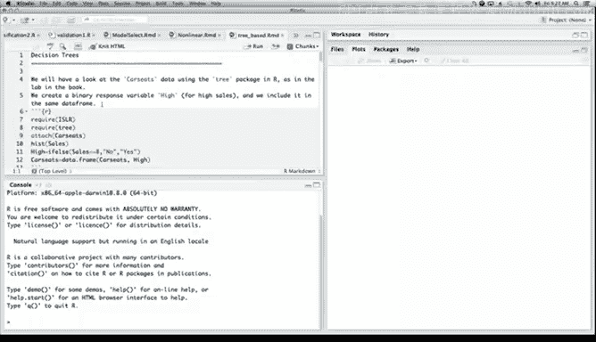

在本节课中，我们将学习如何使用R语言拟合决策树模型。我们将使用`ISLR2`包中的`Carseats`数据集，演示如何将连续响应变量转换为二元变量，拟合决策树，评估模型性能，并通过交叉验证对树进行剪枝以优化模型。

---

## 数据准备与变量转换

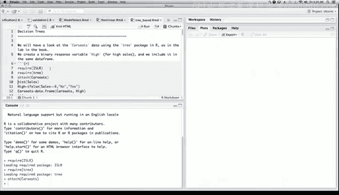

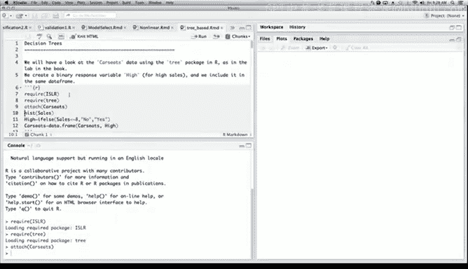

首先，我们加载必要的R包并查看数据。`Carseats`数据集中的`Sales`变量是连续的。为了演示二元分类树，我们需要创建一个新的二元响应变量。

以下是加载数据并创建新变量的代码：

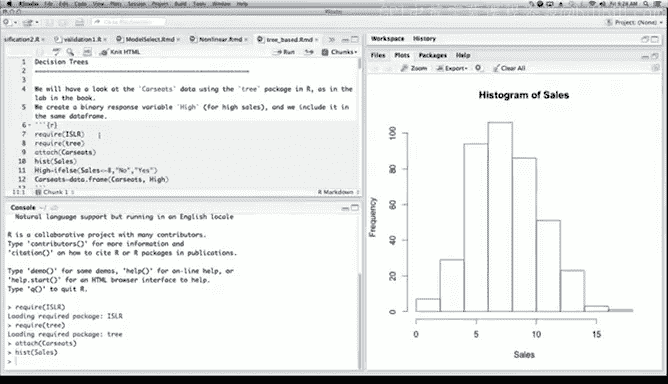


```r
library(ISLR2)
library(tree)
data(Carseats)
hist(Carseats$Sales)
```

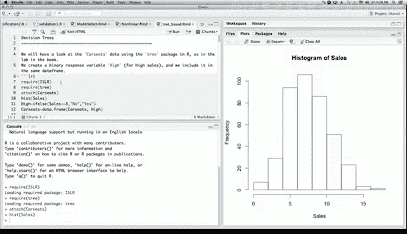

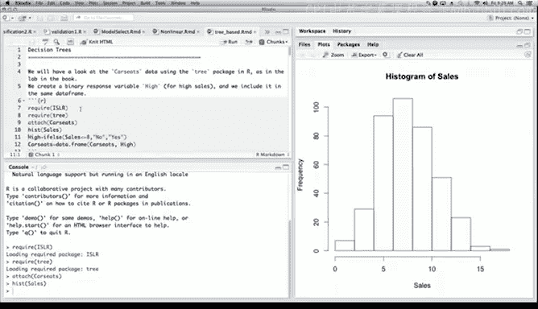

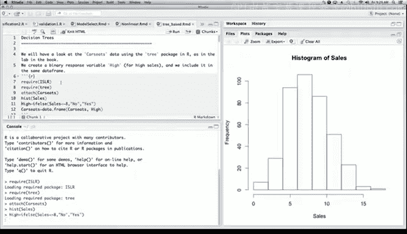

我们创建一个名为`High`的二元变量。如果`Sales`小于8，则`High`为“No”，否则为“Yes”。

```r
High <- ifelse(Carseats$Sales <= 8, "No", "Yes")
Carseats$High <- as.factor(High)
```

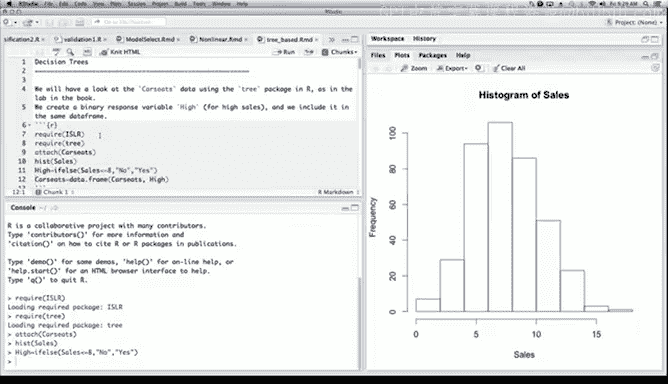

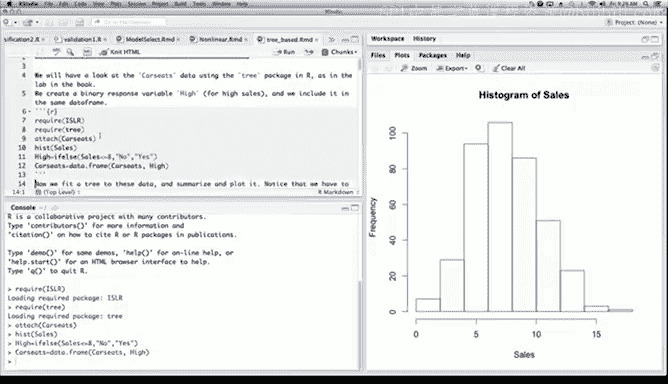

现在，数据框中包含了一个新的因子变量`High`，它将作为我们分类树的响应变量。

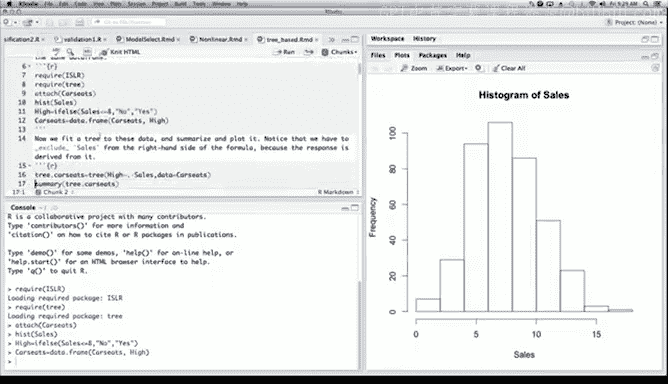

---

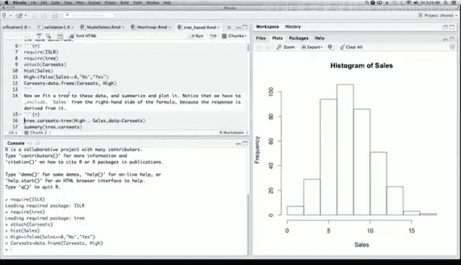


## 拟合决策树模型

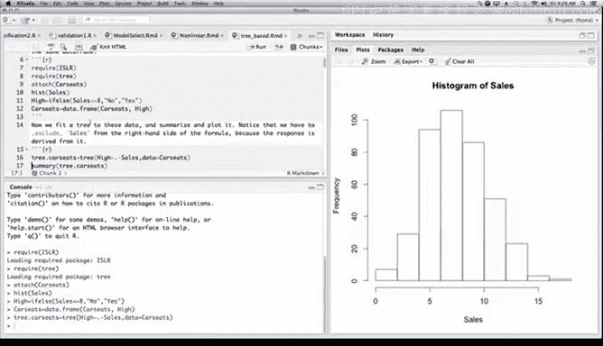

接下来，我们使用`tree`包拟合一个决策树模型。由于响应变量`High`是由`Sales`衍生而来的，在模型公式中需要排除`Sales`变量。


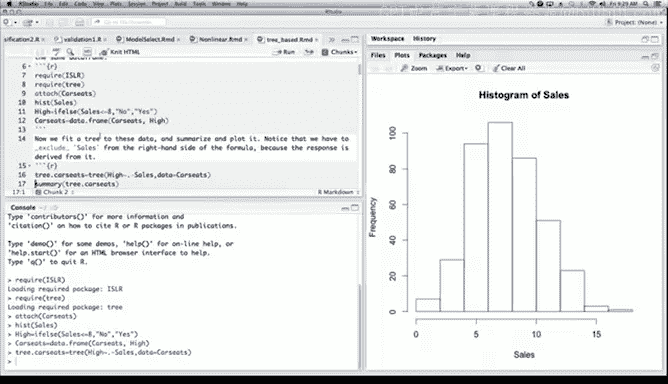

以下是拟合模型的代码：

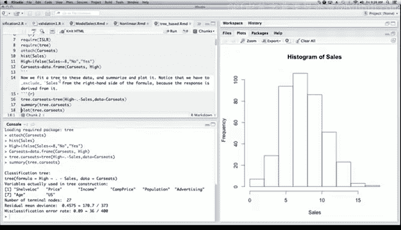

```r
tree.carseats <- tree(High ~ . - Sales, data = Carseats)
summary(tree.carseats)
```

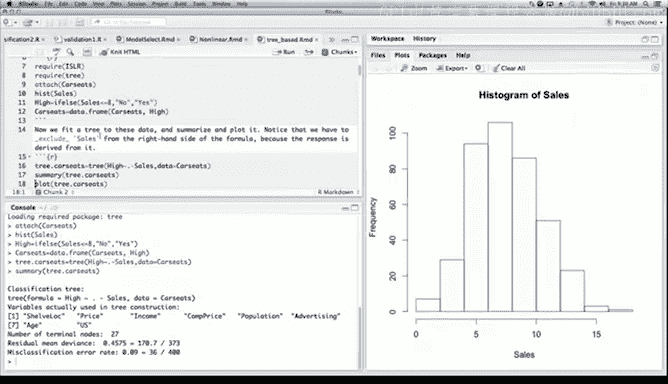

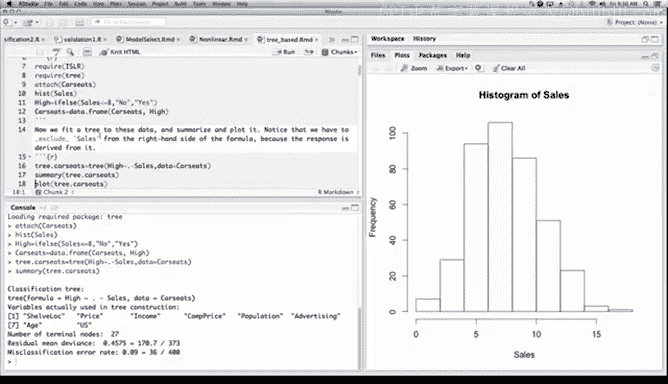

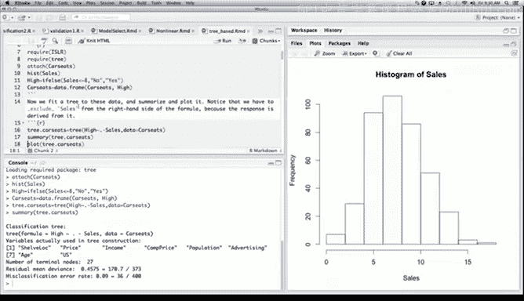

`summary`函数会输出模型摘要，包括使用的变量、终端节点数量以及残差平均偏差（对于二元响应，这是二项偏差）。

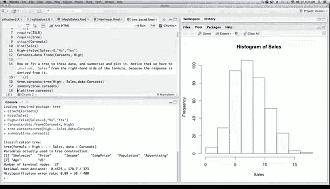

我们可以绘制这棵树来可视化模型结构：

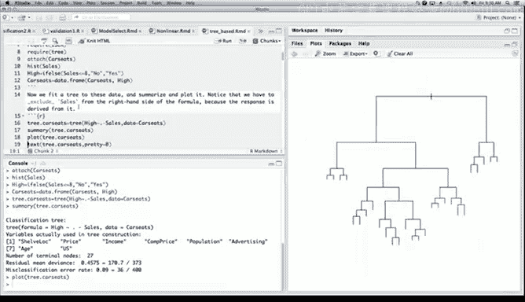

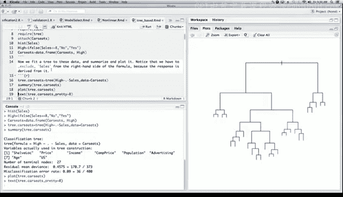

```r
plot(tree.carseats)
text(tree.carseats, pretty = 0)
```

绘制的树显示了所有的分裂点和终端节点。每个终端节点根据其内部样本的多数类别（“Yes”或“No”）进行标记。然而，这棵树可能过于复杂（“枝叶繁茂”），难以解释。

为了查看更详细的分裂信息，我们可以直接打印树对象：

```r
tree.carseats
```

这将列出每个节点的详细信息，包括节点编号、观测值数量以及节点内的类别比例。

---

## 划分训练集与测试集

为了更严谨地评估模型，我们将数据划分为训练集和测试集。我们使用70%的数据（250个观测值）进行训练，30%的数据（150个观测值）进行测试。

以下是划分数据集的代码：

```r
set.seed(101)
train <- sample(1:nrow(Carseats), 250)
tree.carseats <- tree(High ~ . - Sales, data = Carseats, subset = train)
```

现在，我们在训练集上重新拟合了决策树模型。

---

## 模型预测与评估

我们使用拟合好的树模型对测试集进行预测，并计算分类错误率。

以下是预测和评估的代码：

```r
tree.pred <- predict(tree.carseats, Carseats[-train, ], type = "class")
with(Carseats[-train, ], table(tree.pred, High))
```

混淆矩阵的对角线显示了正确分类的观测值数量。我们可以计算测试集上的准确率：

```r
correct <- sum(diag(table(tree.pred, Carseats[-train, ]$High)))
total <- nrow(Carseats[-train, ])
accuracy <- correct / total
error_rate <- 1 - accuracy
```

在这个例子中，未经剪枝的“枝叶繁茂”的树在测试集上的错误率约为23%。这提示我们模型可能存在过拟合（高方差）。

---

## 交叉验证与树剪枝

为了降低方差并获得更易于解释的模型，我们使用交叉验证来寻找最优的树复杂度（即终端节点数量），并对树进行剪枝。

我们使用`cv.tree`函数进行10折交叉验证，并以误分类误差作为剪枝标准：

```r
cv.carseats <- cv.tree(tree.carseats, FUN = prune.misclass)
cv.carseats
```

`cv.tree`的结果显示了随着树规模（`size`）减小，交叉验证误差（`dev`）的变化情况。我们可以绘制这个关系图：

```r
plot(cv.carseats$size, cv.carseats$dev, type = "b")
```

从图中可以找到一个使交叉验证误差接近最小的树规模。假设我们选择树规模为13。

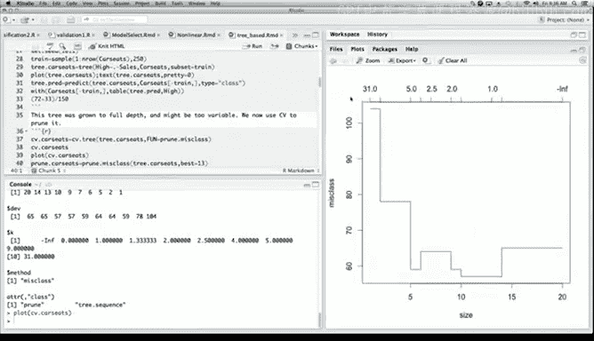

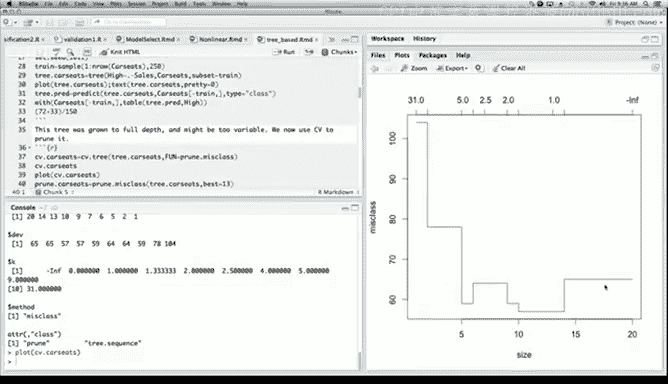

现在，我们根据这个最优规模对原始训练树进行剪枝：

```r
pruned.carseats <- prune.misclass(tree.carseats, best = 13)
plot(pruned.carseats)
text(pruned.carseats, pretty = 0)
```

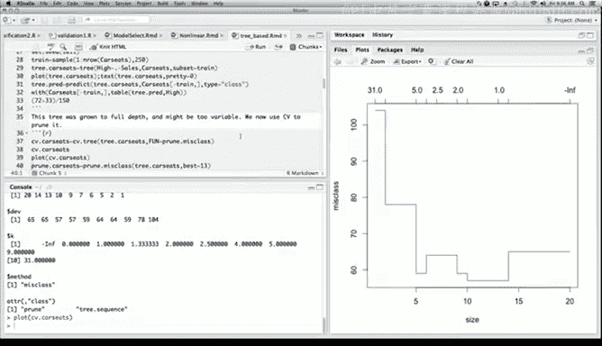

剪枝后的树更浅、更简单，更容易解释。我们再次在测试集上评估剪枝后模型的性能：

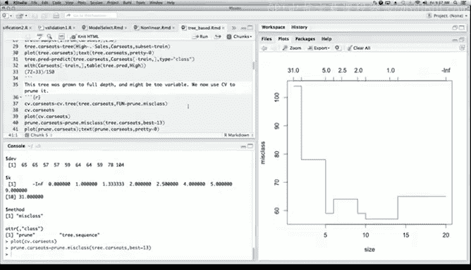

```r
tree.pred2 <- predict(pruned.carseats, Carseats[-train, ], type = "class")
with(Carseats[-train, ], table(tree.pred2, High))
```

在这个例子中，剪枝可能没有显著提升测试集准确率，但它得到了一个更简洁的模型，其预测性能相当，而可解释性更强。

---

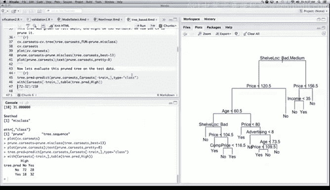

## 总结

本节课中我们一起学习了决策树模型的完整流程：
1.  **数据准备**：将连续响应变量转换为二元分类变量。
2.  **模型拟合**：使用`tree()`函数拟合决策树。
3.  **模型评估**：划分训练集和测试集，计算预测错误率。
4.  **模型优化**：通过交叉验证确定最优树规模，并使用`prune.misclass()`函数进行剪枝，以在偏差和方差之间取得平衡，提高模型可解释性。

决策树，特别是剪枝后的浅层树，非常易于解释和向他人描述。然而，单棵决策树的预测性能有时有限。在接下来的课程中，我们将学习随机森林和提升法，这些集成方法通常能获得比单棵决策树更好的预测性能。