# R 版 61：随机森林与提升法 🌲🚀

在本节课中，我们将学习如何将决策树应用于两种强大的集成学习方法：随机森林和提升法。我们将使用R语言，通过波士顿房价数据集进行实践，并比较这两种方法的性能。

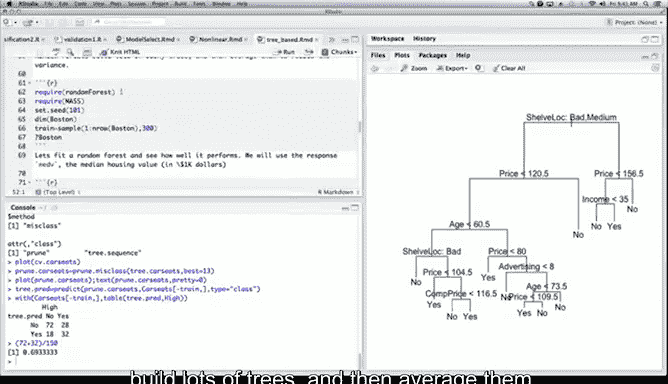

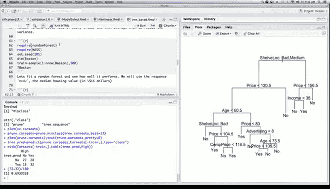

---

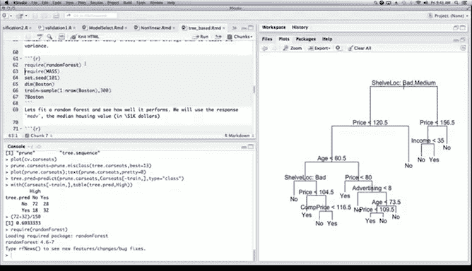

## 概述

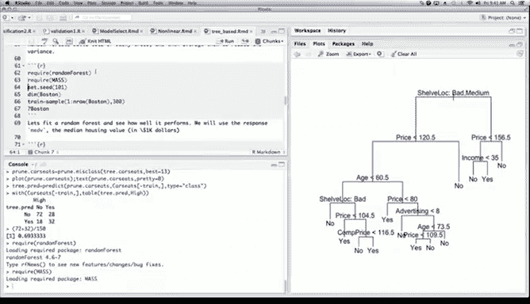

上一节我们介绍了决策树及其应用。本节中，我们将探讨如何通过集成多棵决策树来构建更强大的预测模型：随机森林和梯度提升法。这两种方法都能显著提升单一决策树的预测性能。

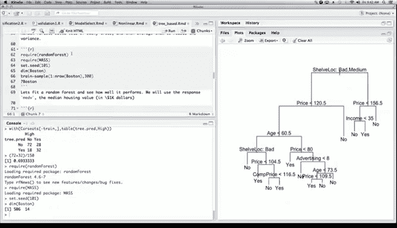

---

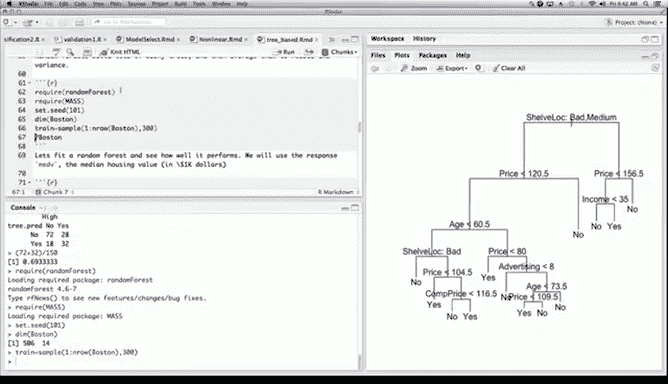

## 随机森林实践 🌲

随机森林通过构建大量决策树并对其结果进行平均，来降低模型的方差。其核心思想是：通过引入随机性（例如，在每次分裂时随机选择部分特征）来使每棵树尽可能不同，从而提升整体模型的泛化能力。

以下是使用R语言`randomForest`包实现随机森林的步骤。

### 加载数据与包

首先，我们需要加载必要的R包和数据。

```r
# 加载随机森林包和数据包
library(randomForest)
library(MASS)

# 设置随机种子以确保结果可重现
set.seed(1)

# 加载波士顿房价数据集
data(Boston)
```

波士顿房价数据集包含506个观测值，每个观测代表波士顿的一个郊区，共有13个特征变量（如犯罪率、房间数等）和一个响应变量（房屋中位数价值`medv`）。

### 划分训练集与测试集

我们将数据分为训练集（300个样本）和测试集（剩余样本）。

```r
# 创建训练集索引
train <- sample(1:nrow(Boston), 300)

# 训练集包含300个观测
# 测试集包含剩余的观测
```

### 拟合随机森林模型

现在，我们使用训练数据拟合一个随机森林模型。默认情况下，`randomForest`函数会生成500棵树。

```r
# 拟合随机森林模型，响应变量为medv，使用所有其他变量作为预测变量
rf.boston <- randomForest(medv ~ ., data = Boston, subset = train)
rf.boston
```

输出结果会显示模型摘要，包括树的数量、袋外误差均方（OOB MSE）以及解释的方差百分比。

### 调整参数Mtry

随机森林的一个关键参数是`mtry`，它代表在每次分裂节点时随机选择的特征数量。`mtry`的值会影响模型的性能。

我们将尝试`mtry`从1到13的所有可能值，并记录对应的袋外误差和测试误差。

```r
# 初始化向量以存储误差
oob.err <- numeric(13)
test.err <- numeric(13)

# 循环尝试不同的mtry值
for(mtry in 1:13) {
  # 拟合随机森林，设置树的数量为400
  fit <- randomForest(medv ~ ., data = Boston, subset = train, mtry = mtry, ntree = 400)
  
  # 获取袋外误差
  oob.err[mtry] <- fit$mse[400]
  
  # 在测试集上进行预测并计算测试误差
  pred <- predict(fit, Boston[-train, ])
  test.err[mtry] <- mean((Boston[-train, "medv"] - pred)^2)
  
  # 打印当前mtry值以跟踪进度
  cat(mtry, " ")
}
```

### 可视化误差结果

完成循环后，我们可以绘制袋外误差和测试误差随`mtry`变化的曲线图。

```r
# 将两种误差合并为一个矩阵
matplot(1:mtry, cbind(test.err, oob.err), pch = 19, col = c("red", "blue"),
        type = "b", ylab = "Mean Squared Error", xlab = "mtry")

# 添加图例
legend("topright", legend = c("Test Error", "OOB Error"), col = c("red", "blue"), pch = 19)
```

从图中通常可以看出，当`mtry`取中间值（例如4或5）时，误差达到最低。与单一决策树相比，随机森林能将误差降低约一半。

---

## 梯度提升法实践 🚀


提升法（特别是梯度提升）通过顺序地添加浅层树（即分裂次数较少的树）来改进模型，主要侧重于减少模型的偏差。每棵新树都试图修正前一棵树的残差。


以下是使用R语言`gbm`包实现梯度提升的步骤。


### 加载包并拟合模型

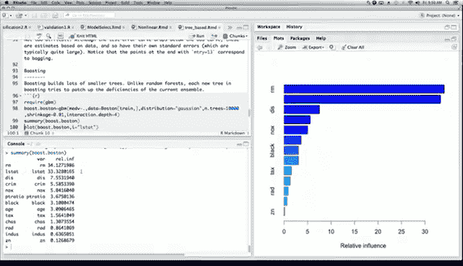

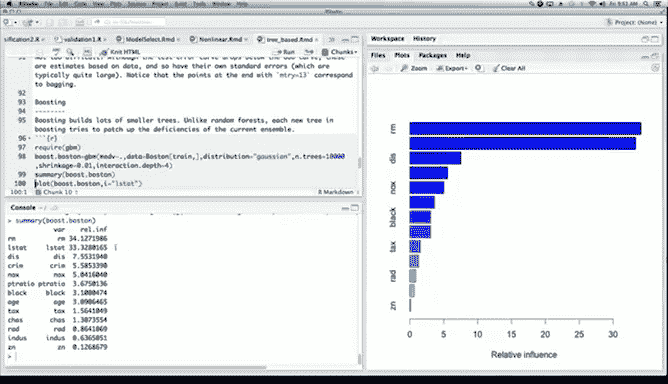

我们使用相同的波士顿数据集，并拟合一个梯度提升模型。


```r
# 加载梯度提升包
library(gbm)

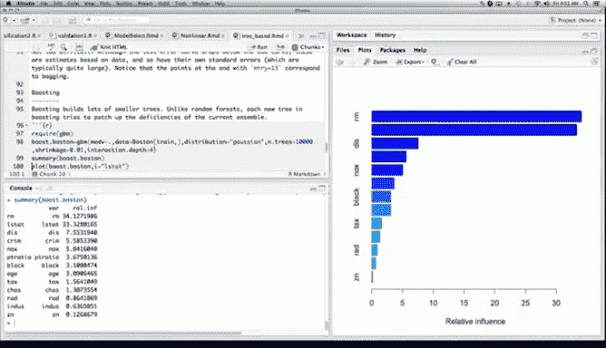


# 拟合梯度提升模型
# distribution = "gaussian" 表示使用平方误差损失
# n.trees = 10000 表示生成10000棵树
# interaction.depth = 4 表示每棵树最多进行4次分裂（即树深度为4）
# shrinkage = 0.01 表示学习率（收缩参数）
boost.boston <- gbm(medv ~ ., data = Boston[train, ], distribution = "gaussian",
                    n.trees = 10000, interaction.depth = 4, shrinkage = 0.01)
```


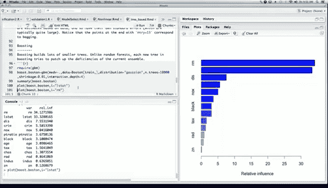

### 变量重要性

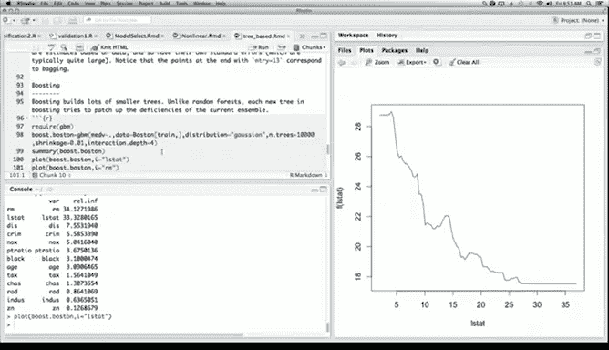

梯度提升模型可以提供变量重要性排序，帮助我们理解哪些特征对预测影响最大。

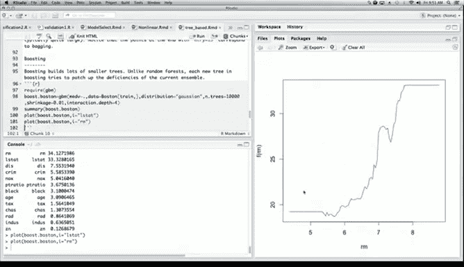

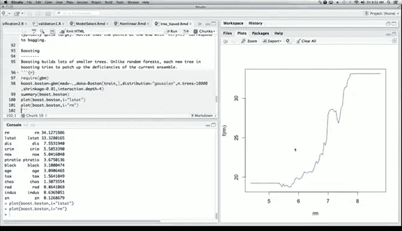

```r
# 生成变量重要性摘要图
summary(boost.boston)
```

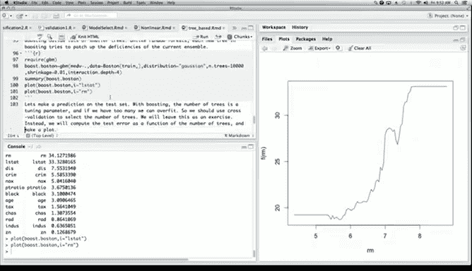

输出结果通常显示，`rm`（平均房间数）和`lstat`（低收入人口比例）是两个最重要的预测变量。

### 部分依赖图

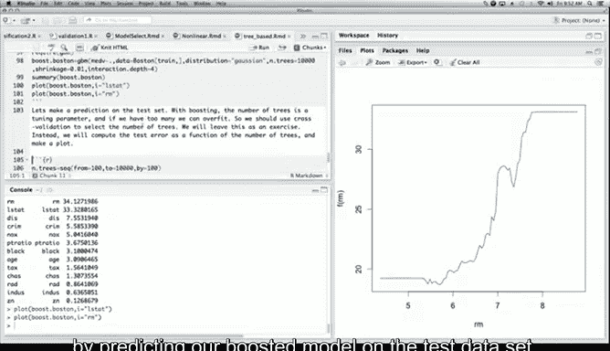

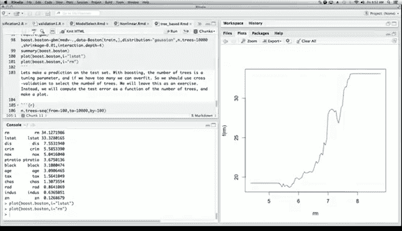

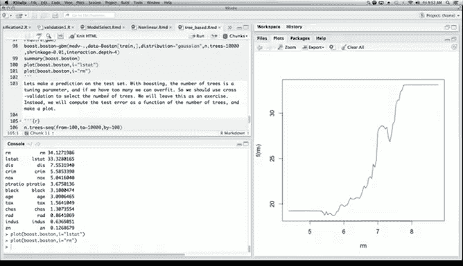

部分依赖图可以展示单个预测变量与响应变量之间的边际关系。

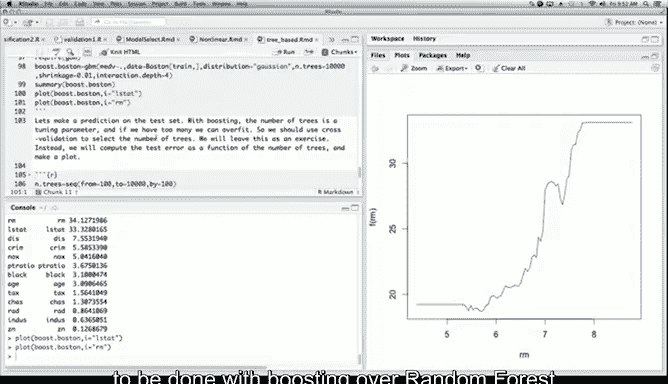

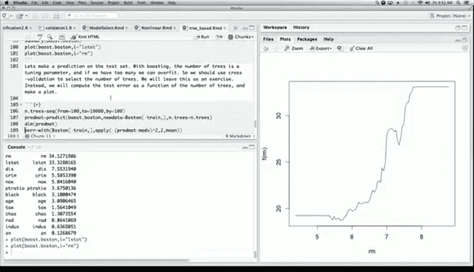

```r
# 绘制两个最重要变量的部分依赖图
par(mfrow = c(1, 2))
plot(boost.boston, i = "rm")
plot(boost.boston, i = "lstat")
```

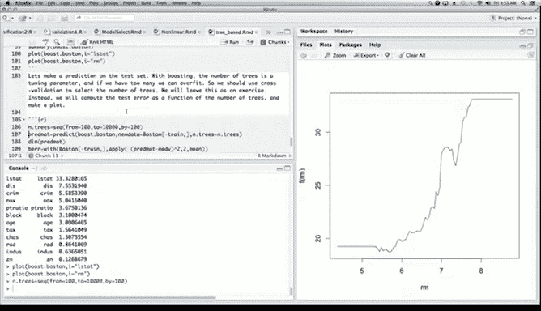

从图中可以看出，`rm`与房价呈正相关，而`lstat`与房价呈负相关，这与直觉一致。

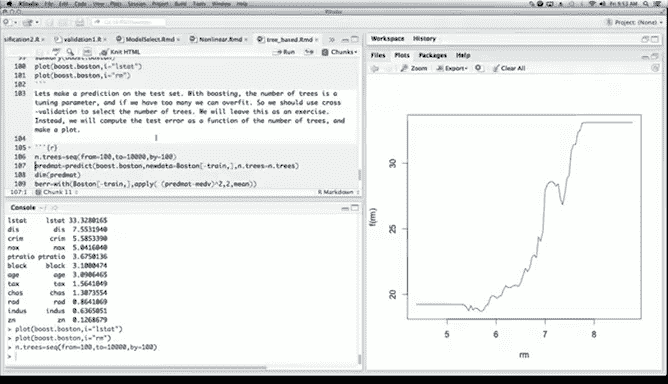

### 评估测试误差

我们可以在测试集上评估提升模型的性能，并观察误差随树数量增加的变化。

```r
# 创建一个树数量的序列
n.trees <- seq(from = 100, to = 10000, by = 100)

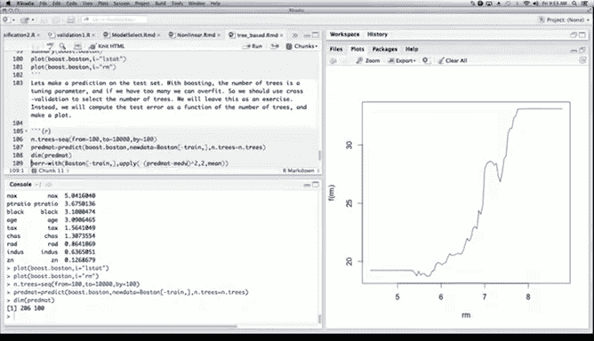

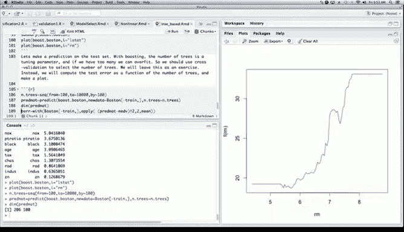

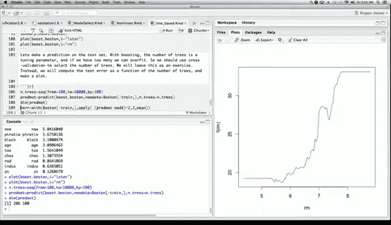

# 在测试集上进行预测
predmat <- predict(boost.boston, newdata = Boston[-train, ], n.trees = n.trees)

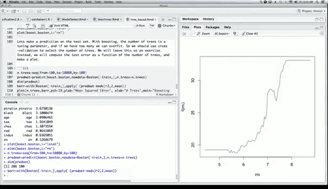

# 计算测试误差（均方误差）
berr <- apply((predmat - Boston[-train, "medv"])^2, 2, mean)

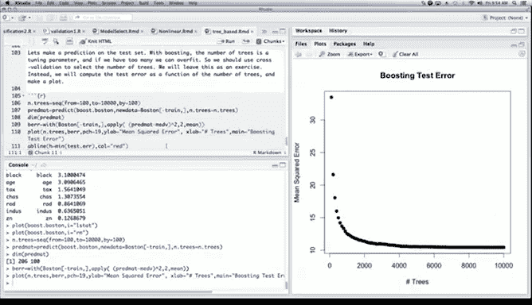

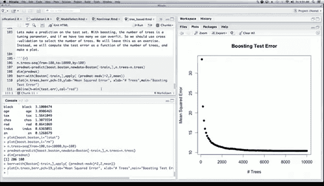

# 绘制测试误差随树数量变化的曲线
plot(n.trees, berr, pch = 19, ylab = "Mean Squared Error", xlab = "# Trees",
     main = "Boosting Test Error")
```

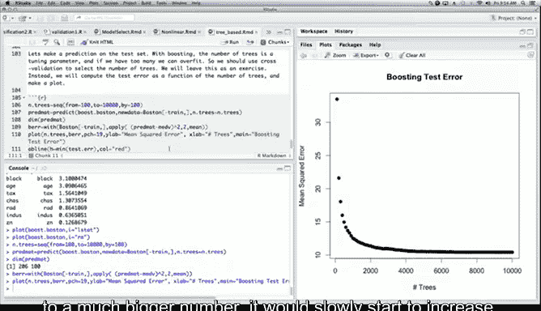

通常，测试误差会随着树的数量增加而下降并逐渐趋于平稳，这表明提升法不容易过拟合。

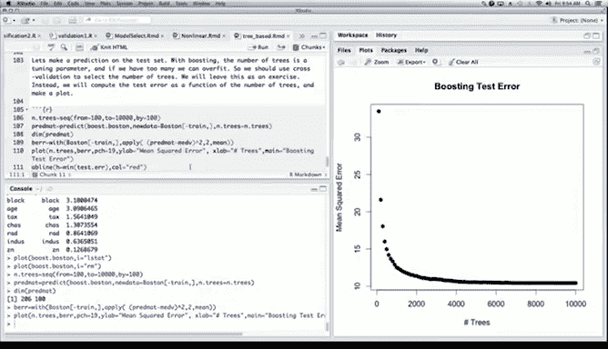

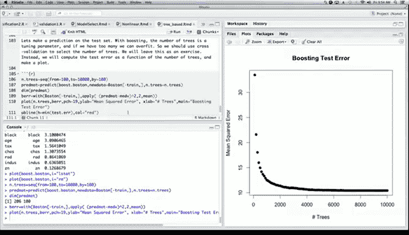

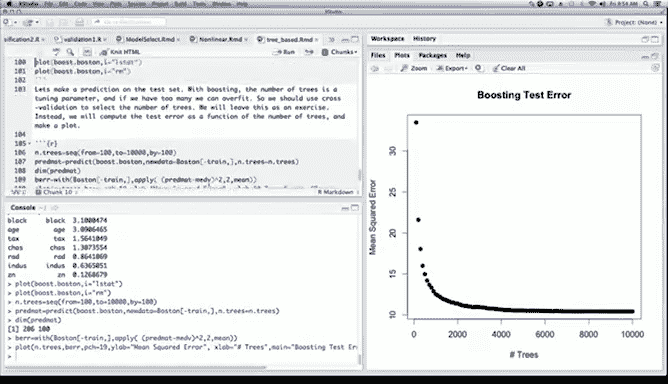

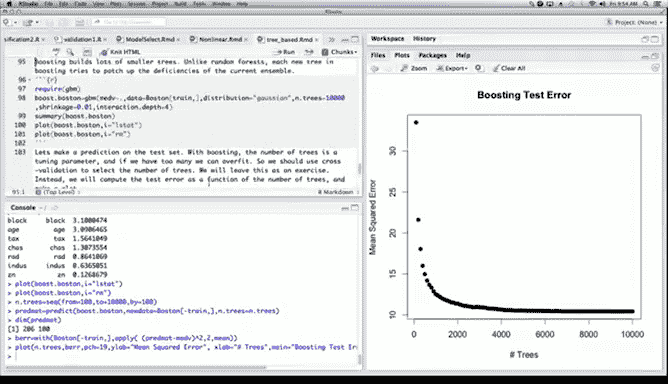

---

## 方法对比与总结

在本节课中，我们一起学习了随机森林和梯度提升法这两种基于决策树的强大集成学习方法。

*   **随机森林**通过构建大量不相关的、茂盛的树并取平均来工作，主要**降低方差**。它易于使用，通常只有一个关键参数`mtry`需要调整，且增加树的数量不会导致过拟合。
*   **梯度提升法**通过顺序添加浅层树来工作，每棵树都针对前一棵树的残差进行拟合，主要**减少偏差**。它通常包含更多需要调整的参数（如树的数量、深度和学习率），但经过仔细调优后，其性能往往能超越随机森林。

在我们的波士顿房价数据集示例中，两种方法都显著优于单一决策树。梯度提升法在经过参数调整后，获得了比随机森林更低的测试误差。

这两种方法都是现代预测建模中极其有效的工具，选择哪一种取决于具体问题、对模型可解释性的要求以及进行参数调优所需投入的精力。