# R 版 62：支持向量机与最优分离超平面 🧠

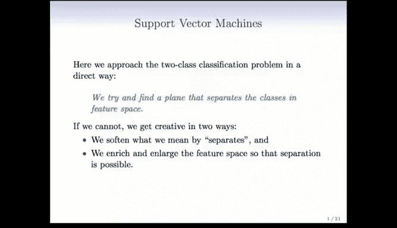

在本节课中，我们将学习支持向量机，这是一种直接解决分类问题的方法。其核心思想是，在特征空间中寻找一个能够分隔不同类别的超平面。支持向量机因其强大的性能和独特的名称而广受欢迎。我们将从超平面的基本概念开始，逐步深入到最优分离超平面的寻找方法。

---

## 什么是超平面？📐

上一节我们介绍了支持向量机的目标。本节中，我们来看看其核心工具——超平面。

在拥有 `P` 个特征的空间中，一个超平面是一个维度为 `P-1` 的平坦子空间。更具体地说，超平面的方程是一个线性方程，其形式如下：

**公式：**
`f(X) = β₀ + β₁X₁ + β₂X₂ + ... + βₚXₚ = 0`

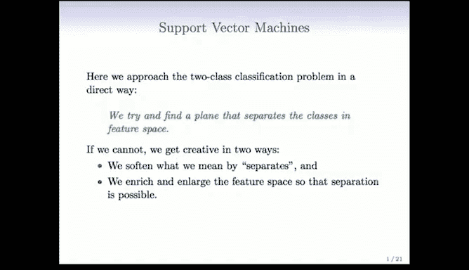

其中：
*   `β₀` 是截距。如果 `β₀ = 0`，则超平面经过原点。
*   向量 `β = (β₁, β₂, ..., βₚ)` 被称为**法向量**，它指向垂直于超平面表面的方向。

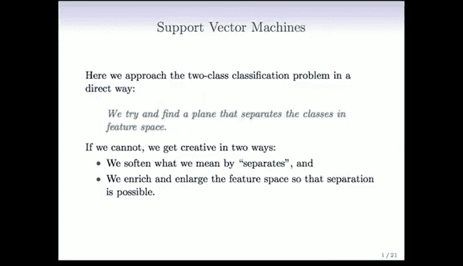

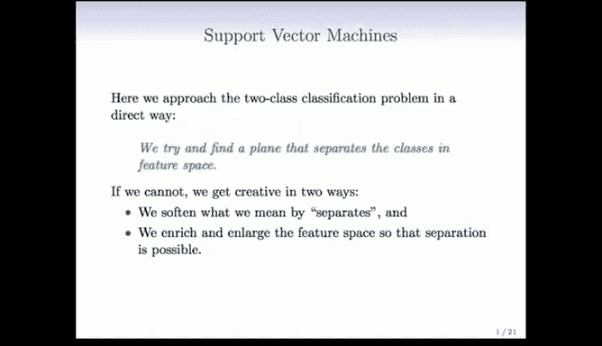

在二维空间中，超平面就是一条直线。法向量 `β` 是垂直于这条直线的向量。

---

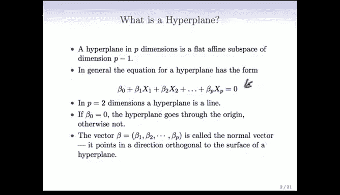

### 超平面的几何意义

为了理解超平面的作用，我们可以观察一个二维示例。对于空间中的任意一点，我们可以将其正交投影到法向量上。投影点到原点的距离（带符号）等于函数 `f(X)` 在该点的值。

当法向量 `β` 是单位向量（即其各分量平方和为1）时，`f(X)` 的值有一个特殊的几何解释：它等于点 `X` 到超平面的**有符号欧几里得距离**。

以下是关键点：
*   所有位于超平面上的点，其 `f(X) = 0`。
*   位于超平面一侧的点，其 `f(X) > 0`（正距离）。
*   位于超平面另一侧的点，其 `f(X) < 0`（负距离）。

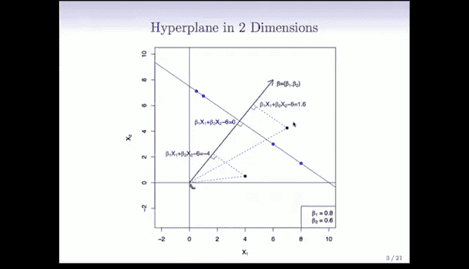

---

## 分离超平面 🧩

理解了超平面后，我们现在可以定义什么是分离超平面。

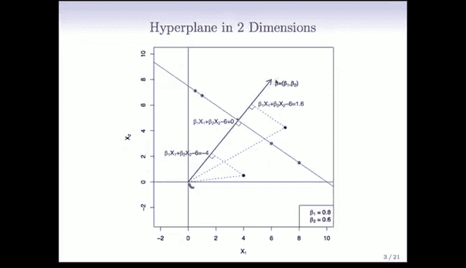

观察下图，我们有两类点（蓝色和紫色），以及三条不同的直线。每一条直线都成功地将蓝色点和紫色点分隔在了两侧。

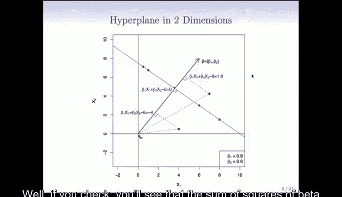

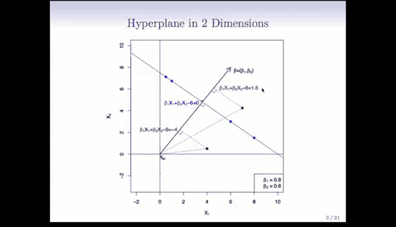

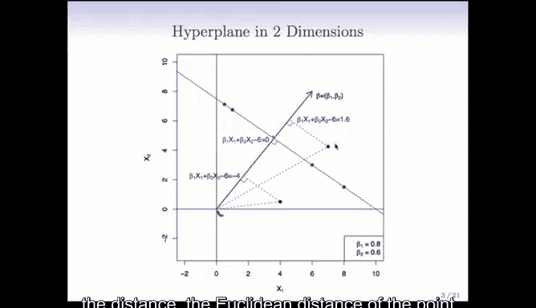

在分类任务中，任何一条这样的直线都可以作为一个分类器。我们可以将类别编码为 `+1`（例如蓝色）和 `-1`（例如紫色）。对于一个分离超平面，我们希望所有样本点都满足以下条件：

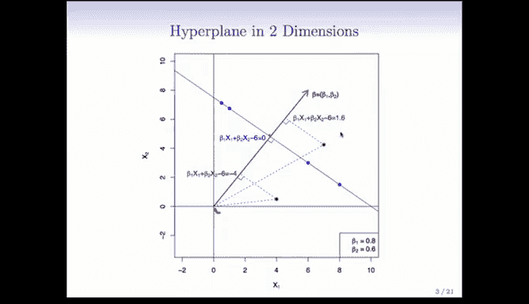

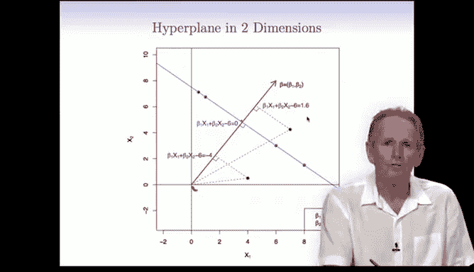

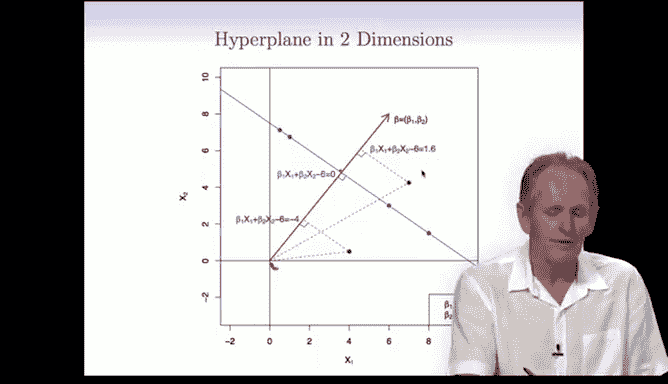

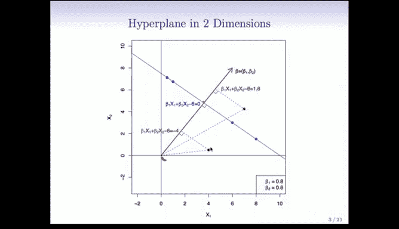

**公式：**
`y_i * f(x_i) > 0`，对于所有训练样本 `i`

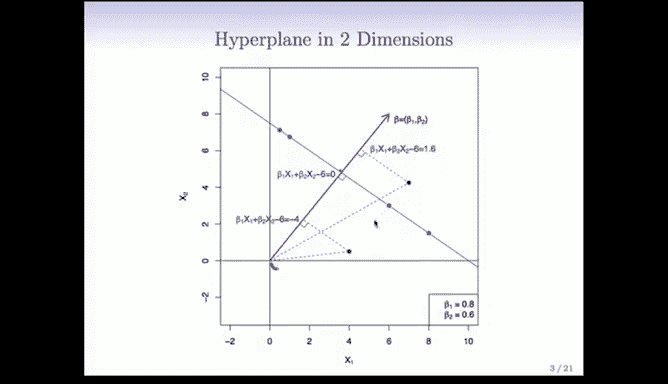

这意味着每个样本点 `(x_i, y_i)` 都位于超平面的“正确”一侧（`y_i` 的符号与 `f(x_i)` 的符号相同）。满足这个条件的超平面称为**分离超平面**。

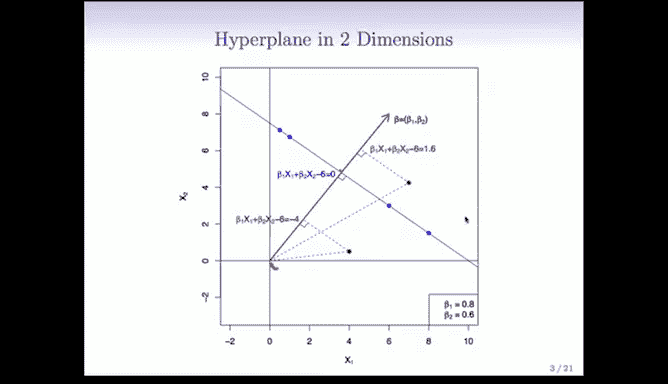

---

## 最大间隔分类器 ⚔️

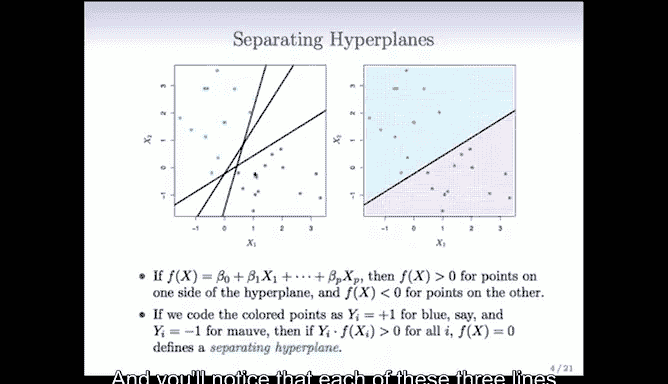

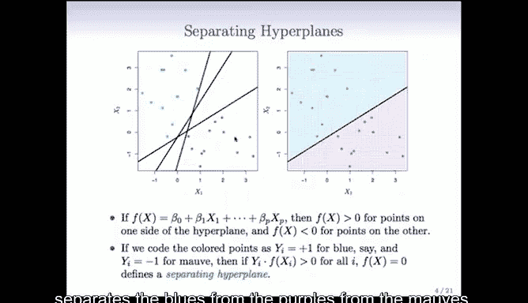

既然存在许多可能的分离超平面，我们该如何选择最好的一个呢？这就引出了**最大间隔分类器**的概念。

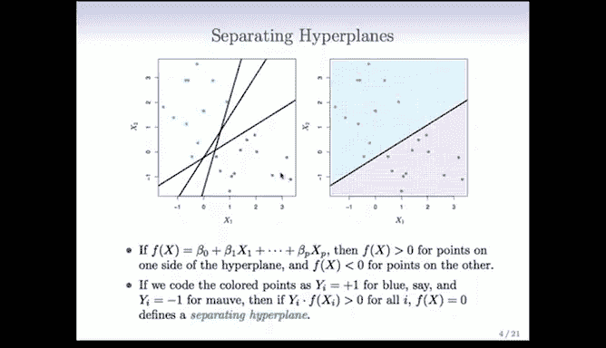

其核心思想是：在所有能分离数据的超平面中，选择那个能创造**最大间隔**（即两类数据点之间最宽“空白地带”）的超平面。

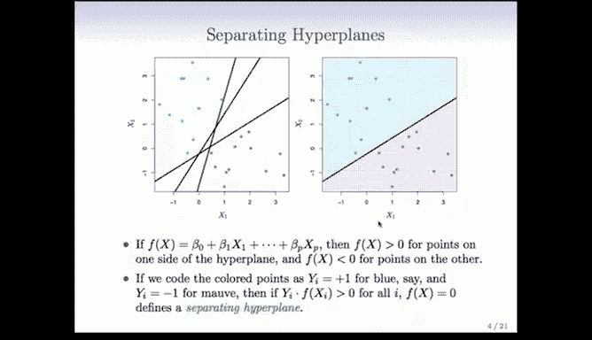

上图中加粗的直线就是最优超平面。它到最近的蓝色点和最近的紫色点的距离是相等的，并且这个距离是所有可能超平面中最大的。

选择最大间隔的直觉是：在训练数据上创造一个大的“安全区”，可以期望模型在未来的测试数据上也有更好的泛化能力，尽管从统计角度看，这似乎过度依赖于最靠近边界的少数点（支持向量），但实践表明这种方法通常效果很好。

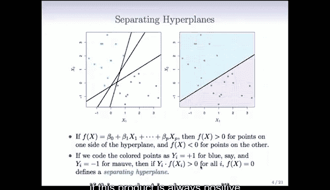

---

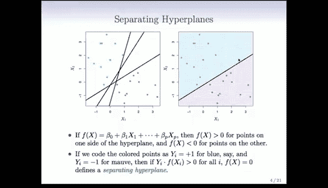

### 如何找到最大间隔超平面？

我们可以将寻找最大间隔超平面的问题形式化为一个优化问题。

首先，我们约束法向量 `β` 为单位长度（`∑βⱼ² = 1`），这保证了 `f(x_i)` 的值等于点到超平面的有符号距离。

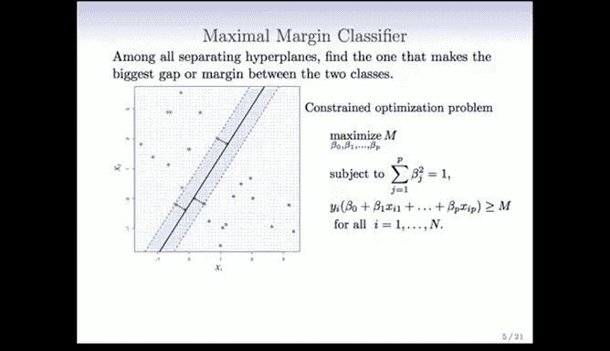

我们的目标是找到一个超平面（即找到参数 `β₀, β₁, ..., βₚ`），使得所有训练样本点到该超平面的最小距离 `M` 尽可能大。

**优化问题表述如下：**
最大化间隔 `M`
约束条件为：
1.  `∑βⱼ² = 1`
2.  `y_i * (β₀ + β₁x_i1 + ... + βₚx_ip) ≥ M`，对于所有 `i = 1, ..., n`

这个问题的求解需要凸优化技术，超出了本课程的详细范围。但在实践中，我们可以直接使用现成的软件包（例如 R 语言中的 `e1071` 包的 `svm` 函数）来高效地解决这个问题。

---

## 总结与展望 🚀

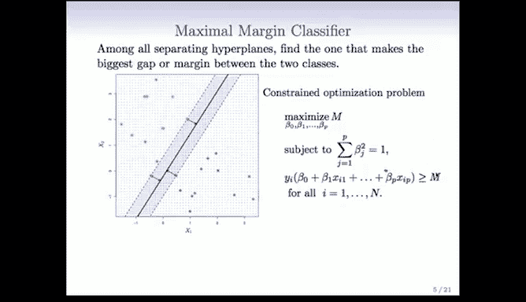

本节课我们一起学习了支持向量机的基础——最优分离超平面。

我们首先定义了超平面及其几何意义。接着，我们引入了分离超平面的概念，即能够完美区分两类数据的超平面。最后，我们探讨了如何从众多分离超平面中选择最优的一个，即**最大间隔分类器**，它通过最大化两类数据边界之间的间隔来提升模型的鲁棒性。

然而，最大间隔分类器要求数据必须**线性可分**。在实际应用中，数据往往存在噪声或本身就是线性不可分的。在接下来的章节中，我们将探讨当无法找到完美分离超平面时，支持向量机如何通过“软化”间隔概念以及将数据映射到更高维空间（核技巧）来巧妙地解决这些问题。