# R 版 63：支持向量分类器 📘

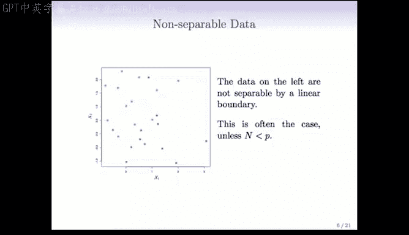

在本节课中，我们将学习如何扩展最大间隔分类器，以处理数据无法被完美线性分离的情况。我们将引入支持向量分类器的概念，它通过允许“软间隔”来应对数据重叠和噪声问题。

---

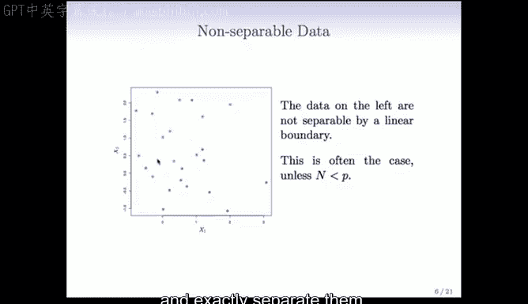

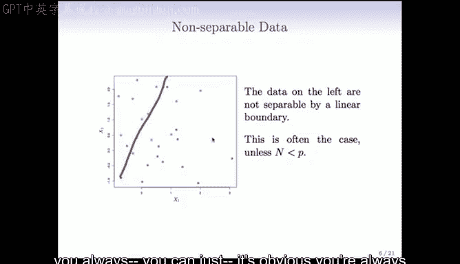

## 从最大间隔到软间隔 🔄

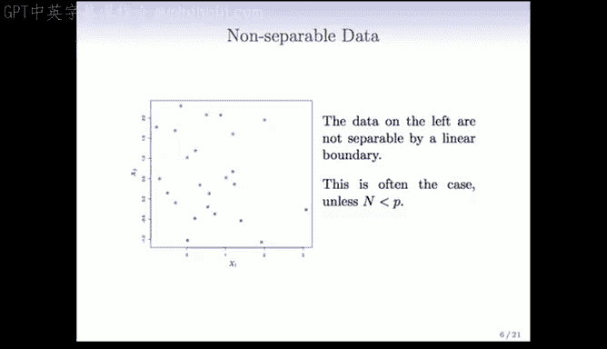

上一节我们介绍了最大间隔分类器，它要求数据必须能被一个超平面完美分离。然而，在实际应用中，数据往往无法完美分离，或者存在噪声点。

本节中我们来看看当数据无法分离时，如何构建一个更稳健的分类器。

### 数据不可分的情况

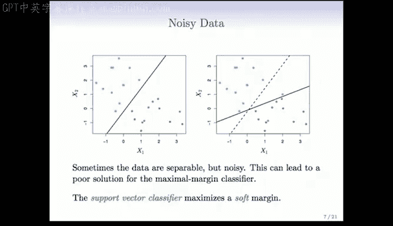

考虑以下情况：数据点无法被任何超平面完美分开。这在样本量远大于特征维度时尤为常见。此外，单个异常点也可能迫使最大间隔分类器做出剧烈调整，导致模型不够稳健。

### 支持向量分类器的核心思想

支持向量分类器通过引入“软间隔”来解决上述问题。它允许一些数据点位于间隔的错误一侧，以此换取更宽的间隔和更好的模型稳健性。

以下是支持向量分类器的优化目标公式：

**目标**：最大化间隔 `M`。

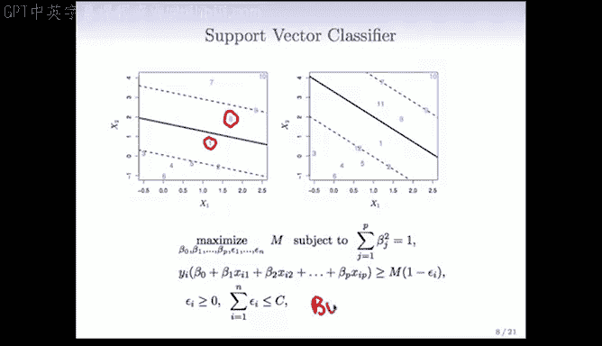

**约束条件**：
1.  `β` 的平方和为 1（即 `β` 是单位向量）。
2.  对于每个样本点 `i`，其到决策边界的距离满足：`y_i (β_0 + β_1 x_{i1} + ... + β_p x_{ip}) ≥ M (1 - ε_i)`。
3.  每个松弛变量 `ε_i ≥ 0`。
4.  所有松弛变量的总和不超过一个预设的预算常数 `C`，即 `Σ ε_i ≤ C`。

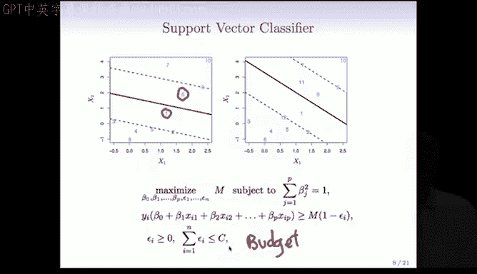

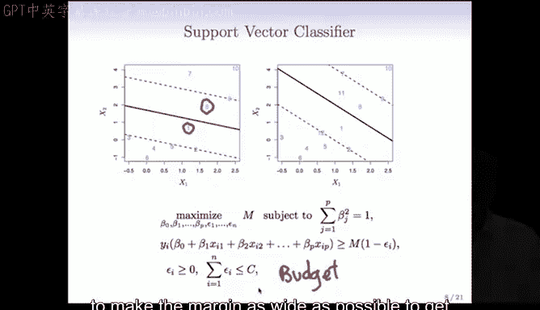

其中：
*   `M` 是间隔的宽度。
*   `ε_i` 是第 `i` 个样本点的“松弛量”，表示它被允许偏离其正确间隔边界的程度。
*   `C` 是一个非负的调节参数，控制模型对误分类的容忍度。

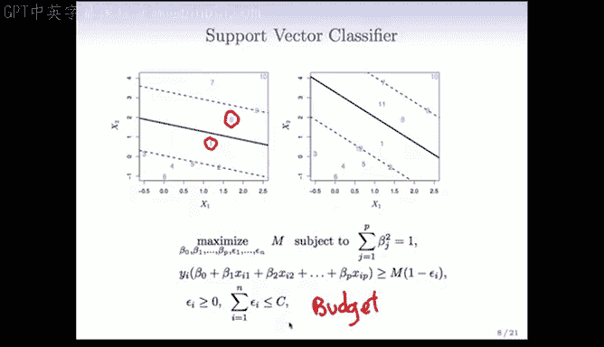

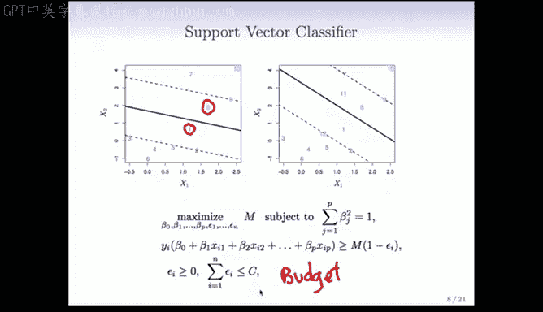

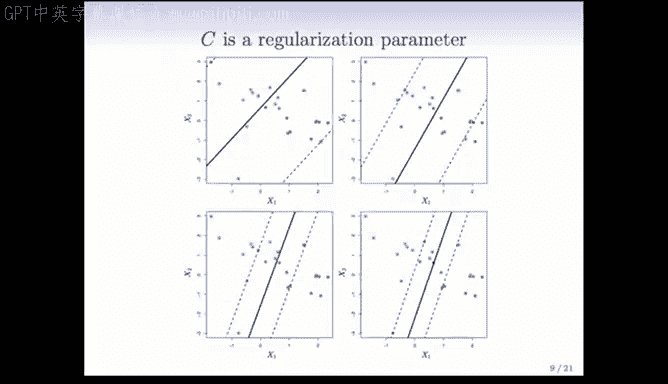

### 调节参数 `C` 的作用

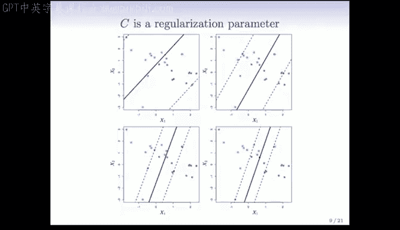

参数 `C` 控制着间隔的“柔软”程度：
*   **`C` 值较大**：对误分类的容忍度低，间隔较窄，模型更接近最大间隔分类器。
*   **`C` 值较小**：对误分类的容忍度高，间隔较宽，模型允许更多点位于间隔内或错误一侧，从而可能更稳健。

在实际使用前，**对特征进行标准化处理非常重要**，因为支持向量机算法默认所有特征具有同等重要性，量纲不同会影响间隔的计算。

### 软间隔的局限性

尽管软间隔提供了灵活性，但在某些复杂的数据分布下（例如，某一类别的点被另一类别完全包围），仅靠线性软间隔仍然无法获得良好的分类效果。

---

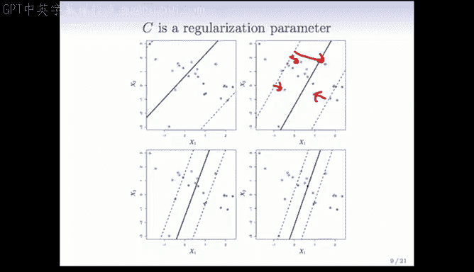

## 总结 📝

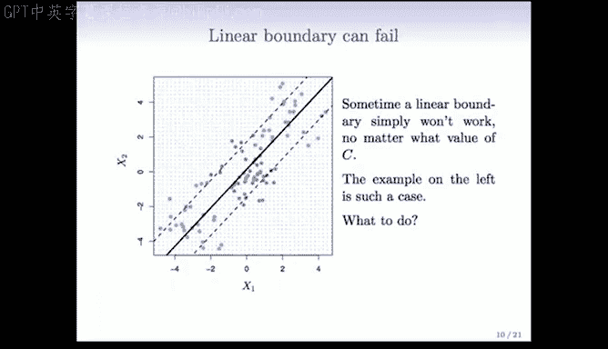

本节课中我们一起学习了支持向量分类器。我们了解到，当数据线性不可分或存在噪声时，可以通过引入松弛变量 `ε_i` 和预算参数 `C` 来构建一个“软间隔”。这个软间隔允许一些样本点被误分类，从而得到一个更宽、更稳健的决策边界，并避免了模型对单个异常点的过度敏感。参数 `C` 作为调节参数，控制着模型复杂度与容忍度之间的平衡。下一节，我们将探讨如何通过“核技巧”来进一步处理非线性可分的复杂数据。