# R 版 64：特征扩展与支持向量机 🧠

在本节课中，我们将学习如何通过特征扩展来解决线性支持向量机无法完美分类的问题，并引入核函数这一强大工具，以在更高维甚至无限维空间中构建非线性决策边界。

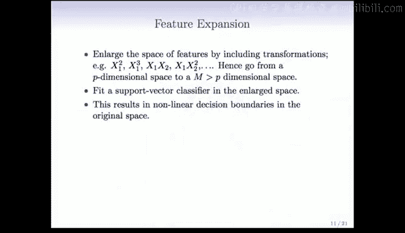

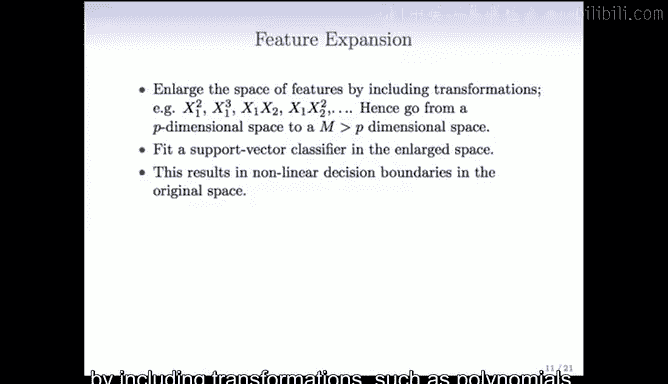

---

## 软间隔的局限性

上一节我们介绍了软间隔支持向量机，它允许一些观测值位于间隔内或错误的一侧。然而，在某些情况下，即使使用软间隔，数据在原始特征空间中也**无法被线性超平面有效分离**。

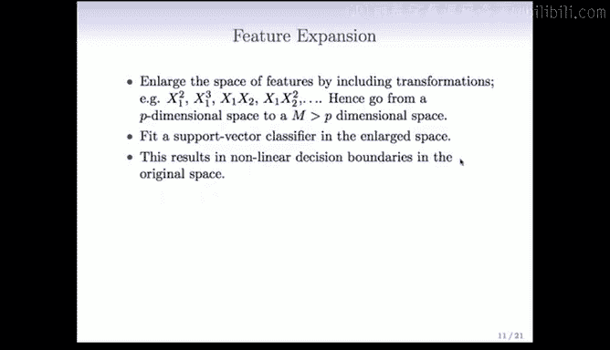

因此，我们需要寻找方法来克服这个问题。一个自然而然的思路是使用**特征扩展**。

---

## 特征扩展：多项式展开

一种简单且标准的方法是，通过包含多项式等变换来**扩展特征空间**。

例如，我们从一个仅包含 `x1` 和 `x2` 的二维空间开始。我们可以添加 `x1^2`、`x2^2`、`x1^3`、`x1*x2` 等变换项，进行多项式扩展。

这样，我们就可以从一个 `p` 维空间（本例中为2维）转换到一个**更高维的空间**。添加的变换变量越多，在这个高维空间中就越有可能实现数据的线性分离。

> **注意**：这里用 `M` 表示扩展后的维度，它与之前表示“间隔”的 `M` 不同。为避免混淆，后续将使用其他字母。

其核心思想是：**在扩展后的高维空间中拟合一个线性支持向量机**。当我们将这个高维的线性决策边界投影回原始特征空间时，它在原始空间中就表现为一个**非线性的决策边界**。

例如，假设我们使用二次多项式基：`x1, x2, x1^2, x2^2, x1*x2`。在扩展后的五维空间中，决策边界的形式是线性的：

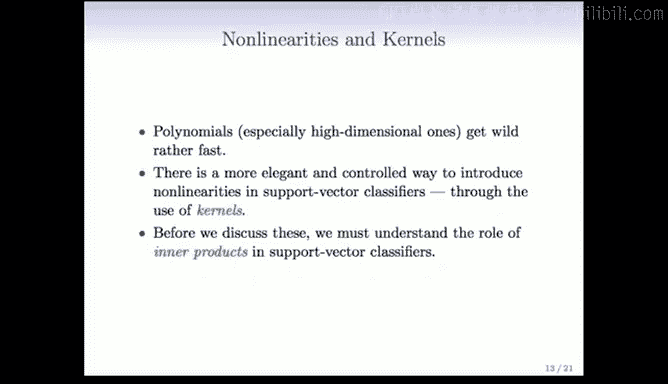

`β0 + β1*x1 + β2*x2 + β3*x1^2 + β4*x2^2 + β5*x1*x2 = 0`

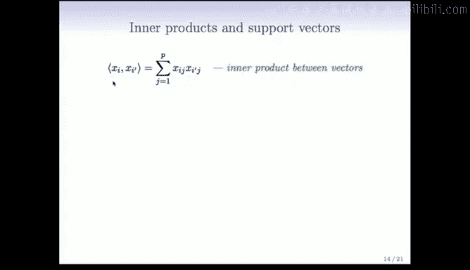

但在原始变量 `(x1, x2)` 的二维空间中，这个边界就是非线性的，因为它包含了平方项和交叉项。

下图展示了使用二次和三次多项式扩展后，对同一数据集进行分类的效果。决策边界（实线）和间隔边界（虚线）在原始空间中都是非线性的，并且成功地将两个类别分离开来。

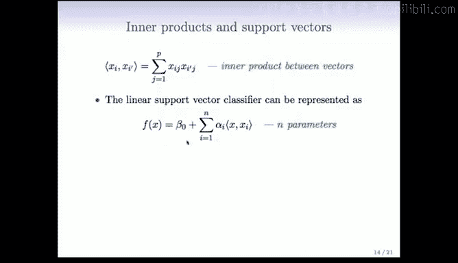

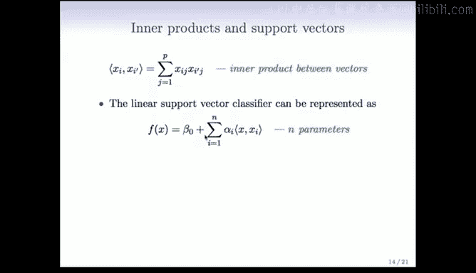

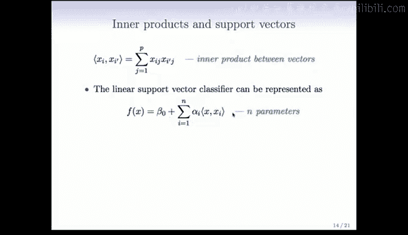

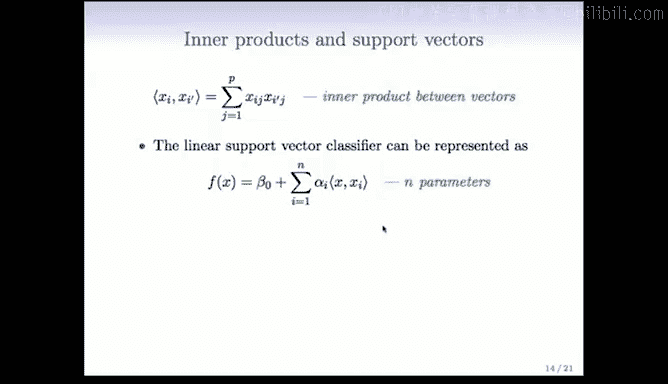

然而，多项式并非最佳选择，尤其是在高维情况下，它们会变得非常复杂且难以控制。即使在回归中，我们通常也不喜欢使用超过三次的多项式。如果原始维度 `p` 很大，一个完整的三次多项式空间将非常庞大。

---

## 内积的作用

在深入更优雅的核方法之前，我们需要理解**内积**在线性支持向量分类器中的角色。

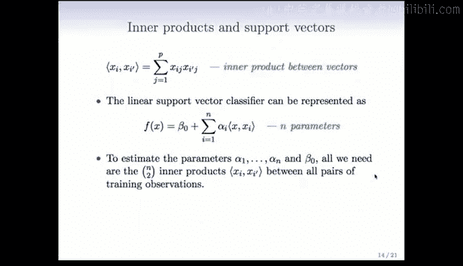

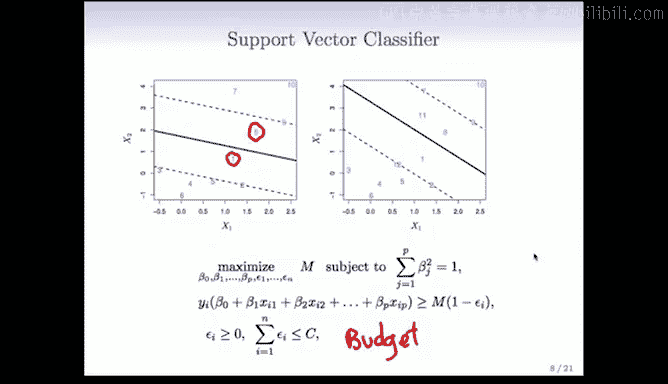

两个 `p` 维向量 `xi` 和 `xi'` 的内积定义为它们各分量乘积之和：

`<xi, xi'> = Σ (j=1 to p) xij * xij'`

使用这种表示法，线性支持向量分类器的解可以写成以下形式：

`f(x) = β0 + Σ (i=1 to n) αi * yi * <xi, x>`

这里，`x` 是一个新的预测点。这个公式表明，分类器的决策函数可以表示为**训练样本 `xi` 与新点 `x` 的内积的线性组合**。

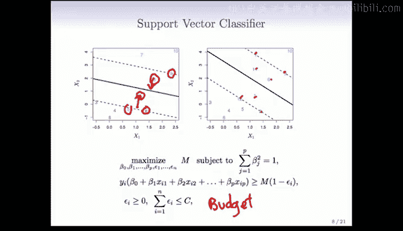

值得注意的是，为了估计参数（现在有 `n` 个 `αi` 参数，可能比 `p` 还大），我们只需要所有训练观测点两两之间的内积，构成一个 `n x n` 的内积矩阵。有了这个矩阵，我们就可以拟合支持向量分类器。

在这种表示下，许多 `αi` 的估计值 `\hat{αi}` 会等于0。那些 `\hat{αi} ≠ 0` 对应的数据点被称为**支持向量**。它们是定义决策边界和间隔的关键点。

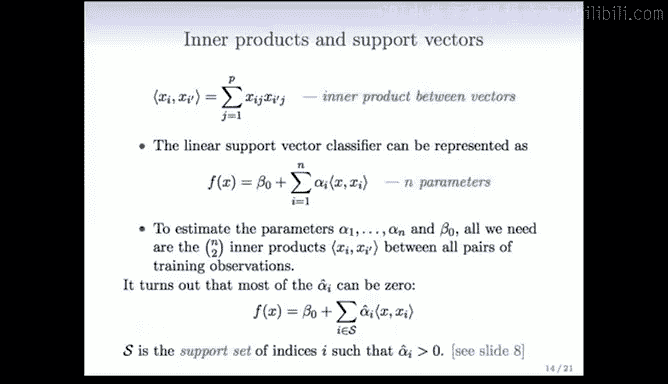

例如，在下图的左子图中，两个圆圈点和位于间隔边界上的点（可能共5个）是支持向量。右子图中则有7个支持点。

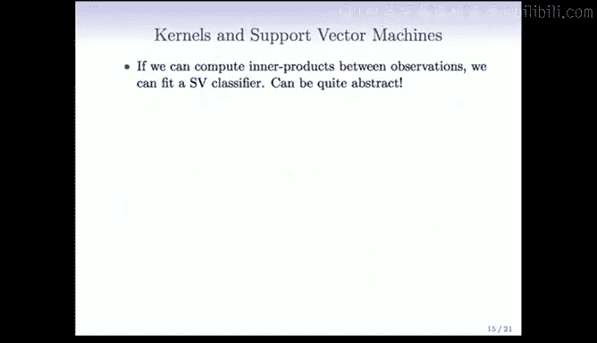

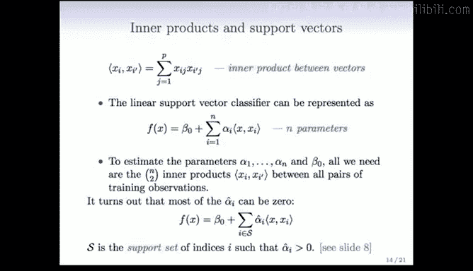

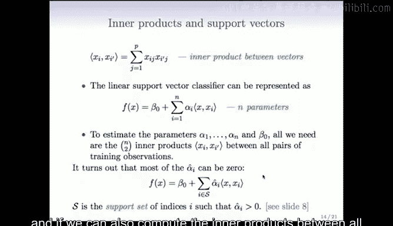

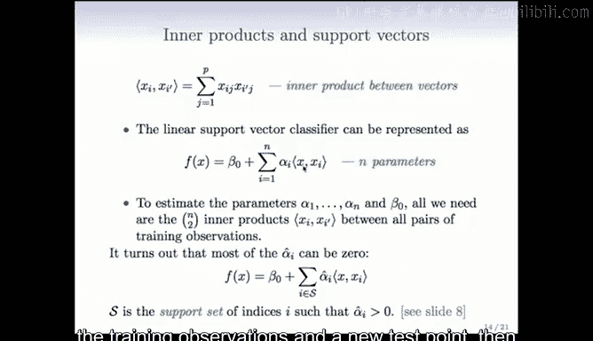

这是一种**稀疏性**，但与Lasso在特征系数上的稀疏不同，这是在**数据空间**上的稀疏——只有一部分数据点（支持向量）对最终模型有贡献。

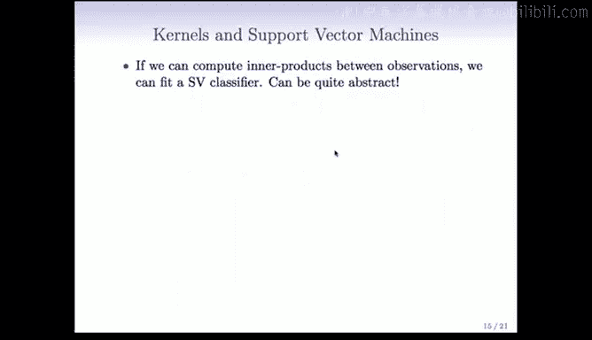

---

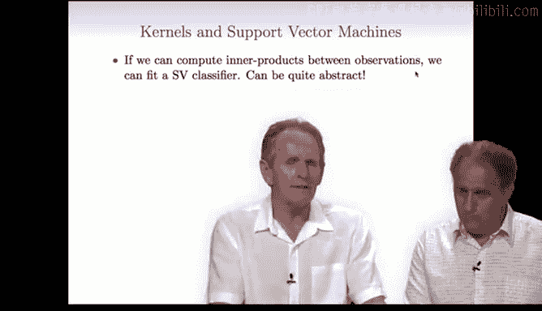

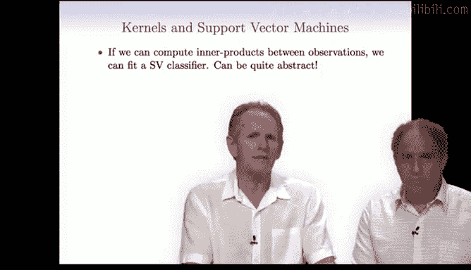

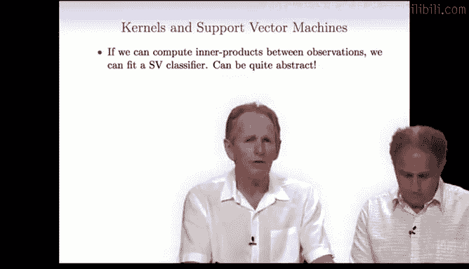

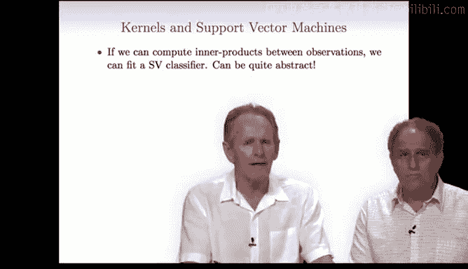

## 核函数：优雅的非线性化

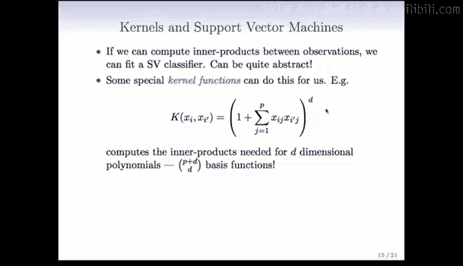

基于内积的表示，我们引入**核函数**，这是引入非线性的一种更优雅、更可控的方式。

核函数 `K(xi, xi')` 是一个双变量函数，它可以被理解为在某个（可能是未知的）高维特征空间中计算两个向量的内积。关键在于，我们**无需显式地计算或访问这个高维空间**。

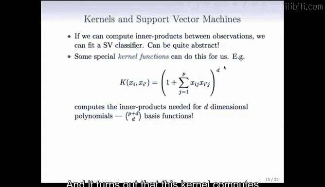

以下是具体步骤：

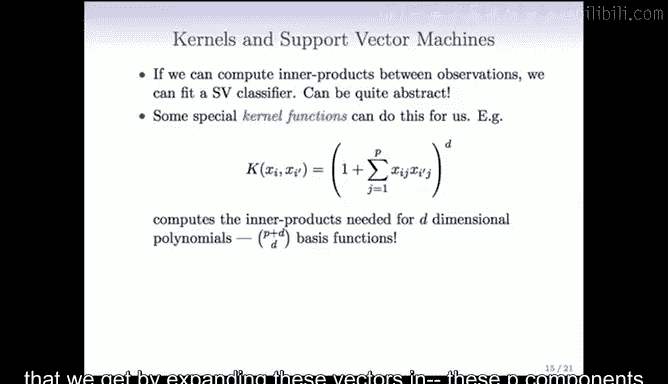

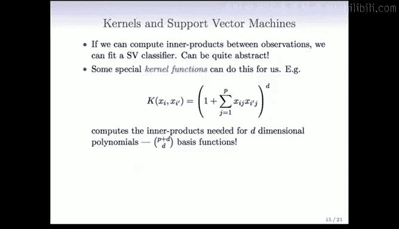

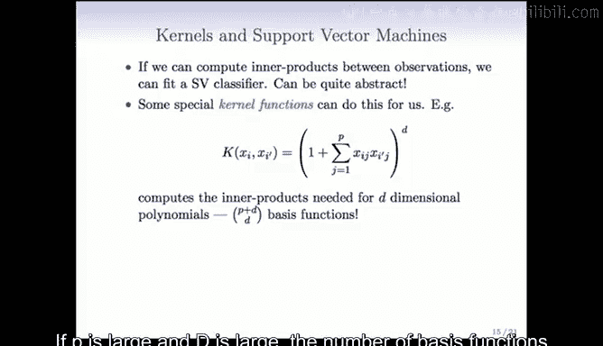

1.  如果我们能计算所有训练观测点对之间的“内积”（通过核函数），即 `K(xi, xi')` 矩阵。
2.  并且能计算所有训练观测点与一个新测试点 `x` 的“内积”，即 `K(xi, x)`。
3.  那么，我们就可以**直接拟合支持向量机并评估分类函数**。

一个具体的例子是**多项式核**：

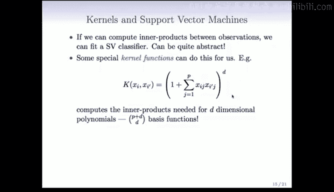

`K(xi, xi') = (1 + <xi, xi'>)^d`

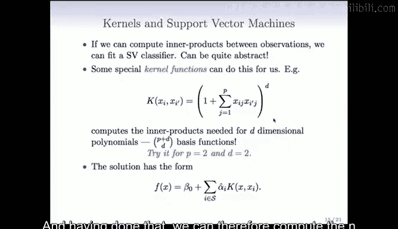

这个核函数实际上计算的是在 `d` 次多项式展开空间中的内积。原始空间 `p` 维，展开后的维度是 `C(p+d, d)`，可能非常巨大，但核函数巧妙地绕过了显式计算。

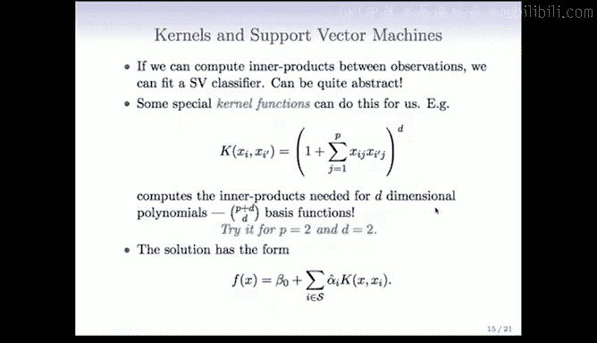

另一个极其流行的核是**径向基核（RBF核）**：

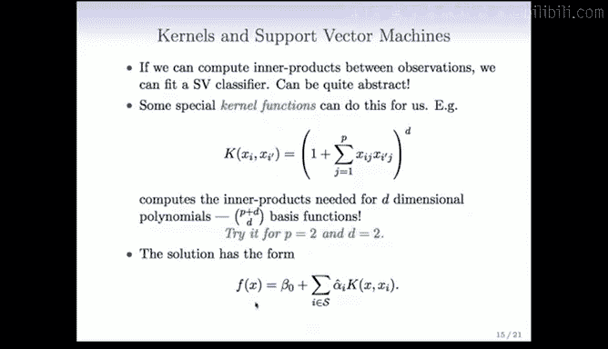

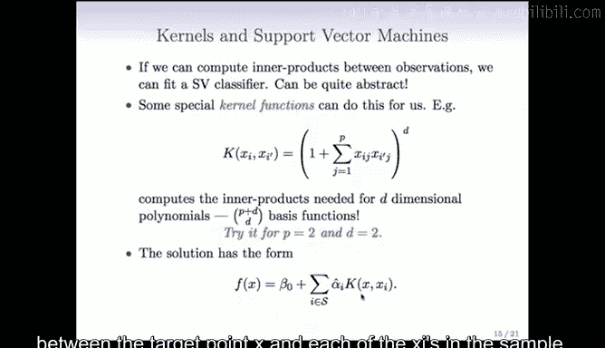

`K(xi, xi') = exp(-γ * Σ (j=1 to p) (xij - xij')^2)`

这个核函数对应于一个**无限维的特征空间**。参数 `γ` 是一个调节参数，可以理解为高斯函数中标准差的倒数。`γ` 越大，决策边界越曲折复杂；`γ` 越小，决策边界越平滑。

下图展示了使用径向基核对之前的数据进行分类的效果，它同样能很好地分离两个类别。

你可能会问：我们如何能在无限维空间中拟合模型而不严重过拟合？答案是，尽管特征空间是无限维的，但核函数和优化过程会**将大部分维度“压缩”到几乎为零的权重**，尤其是那些对应非常曲折变化的维度，从而有效地控制了模型的复杂度。

---

## 总结

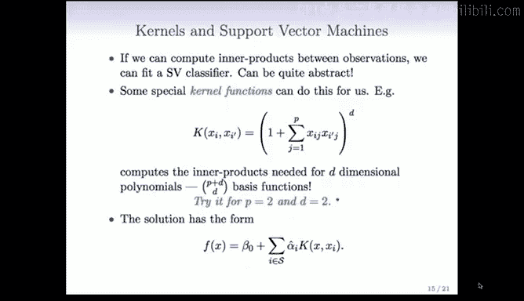

本节课中，我们一起学习了：

1.  **特征扩展**：通过多项式变换将数据映射到高维空间，以寻求线性可分性，从而在原始空间中获得非线性决策边界。
2.  **内积表示**：线性支持向量机的解可以重写为依赖于训练数据与新点内积的形式，并引入了“支持向量”的概念。
3.  **核方法**：通过核函数（如多项式核、径向基核）隐式地在高维甚至无限维空间中进行内积计算，从而高效地构建非线性支持向量机，这是处理非线性分类问题的强大工具。

径向基核因其灵活性和良好性能成为最常用的核函数之一。在下一节中，我们将通过具体示例来应用这些技术。