# R 版 65：支持向量机示例及与逻辑回归的比较 📊

在本节课中，我们将通过一个心脏病数据的实际例子，来观察支持向量机（SVM）如何工作，并将其性能与逻辑回归等其他分类方法进行比较。我们还将探讨SVM在多分类问题中的应用，并深入理解其与逻辑回归在理论上的联系。

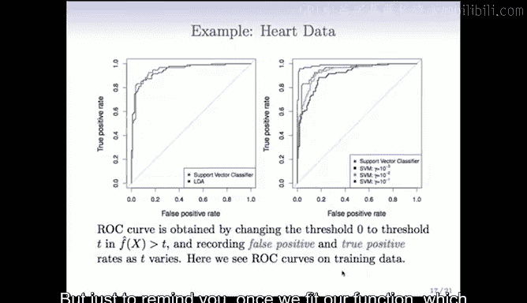

---

## 示例：心脏病数据分类 🫀

上一节我们介绍了支持向量机的一般原理，本节中我们来看看它在一个简单示例上的应用。

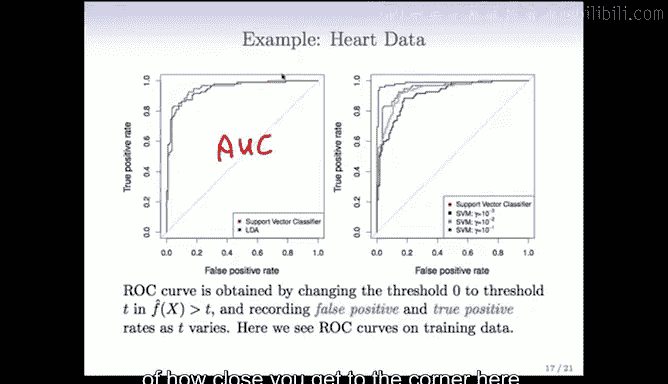

我们使用一个包含约10个变量的心脏病数据集，目标是将样本分类为“患病”或“未患病”。我们将使用支持向量机进行分类。

在结果展示中，我们使用ROC曲线来评估模型性能。ROC曲线描绘了随着分类阈值变化，真阳性率与假阳性率之间的关系。一个理想的分类器，其ROC曲线应尽可能靠近左上角。

衡量ROC曲线性能的常用指标是曲线下面积（AUC）。AUC值介于0.5到1之间，值越大表示分类器性能越好。

以下是ROC曲线的核心概念：
*   **ROC曲线**：描绘了不同阈值下，真阳性率（TPR）与假阳性率（FPR）的关系。
*   **AUC（曲线下面积）**：`AUC ∈ [0.5, 1]`，用于量化ROC曲线接近左上角的程度。AUC=1表示完美分类器。

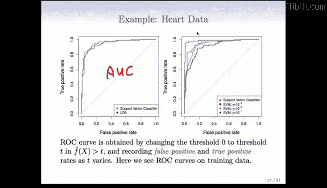

### 训练数据上的表现

在训练数据上，我们比较了线性支持向量分类器（红色曲线）与线性判别分析（LDA，蓝色曲线）。两者表现相近，SVM在某些区域略有优势。

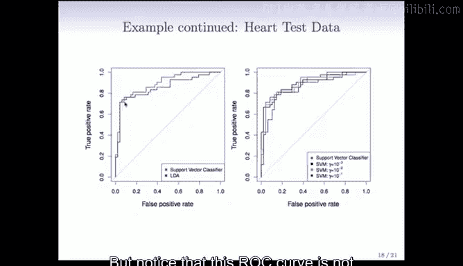

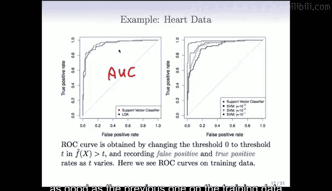

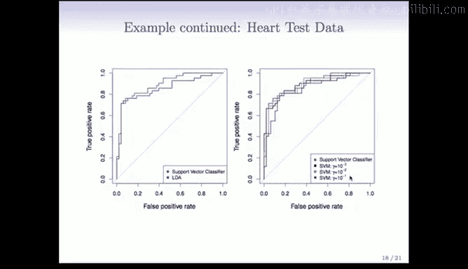

接着，我们比较了线性SVM与使用不同gamma值的径向基核SVM。
*   当gamma=10⁻¹时（复杂度较高），模型在训练集上表现最好。
*   当gamma减小至10⁻²、10⁻³时（复杂度降低），模型表现逐渐变差。
*   线性分类器的表现介于中间。

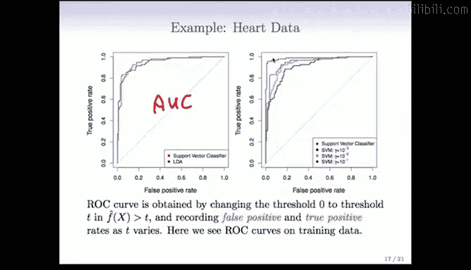

这说明了gamma是SVM的一个重要调优参数。但需要注意的是，在训练集上的比较并不公平，因为更复杂的模型（gamma大）天然倾向于在训练集上获得更好表现，可能过拟合。

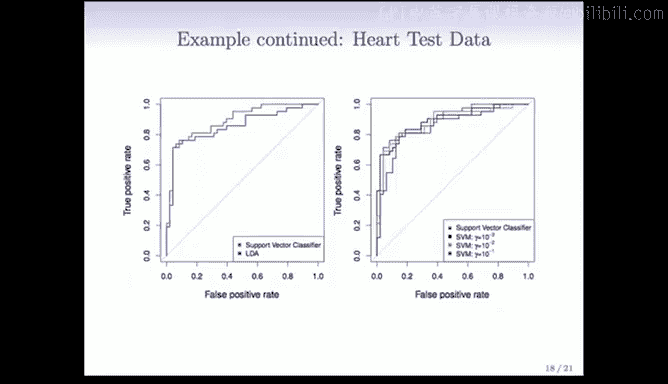

### 测试数据上的表现

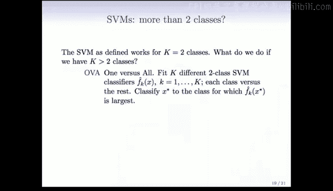

为了公平评估，我们预留了80个观测值作为测试集，在训练集上拟合模型后，在测试集上绘制ROC曲线。

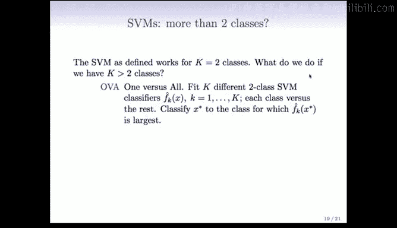

*   线性SVM与LDA的比较中，SVM表现略好。
*   测试集上的ROC曲线普遍不如训练集上的曲线，这反映了过拟合现象。
*   在比较不同gamma值的径向基SVM时，情况发生了反转：在训练集上表现最好的gamma=10⁻¹模型，在测试集上表现最差。而线性SVM和正则化程度最高的模型（gamma=10⁻³）表现最佳。

这个例子清晰地表明，我们需要使用交叉验证或验证集等标准工具来选择SVM的调优参数（对于线性SVM是成本参数C，对于核SVM还包括核参数如gamma）。

---

## 多类别分类策略 🔢

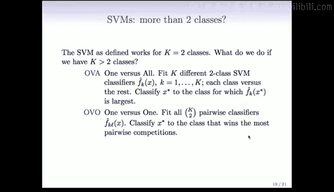

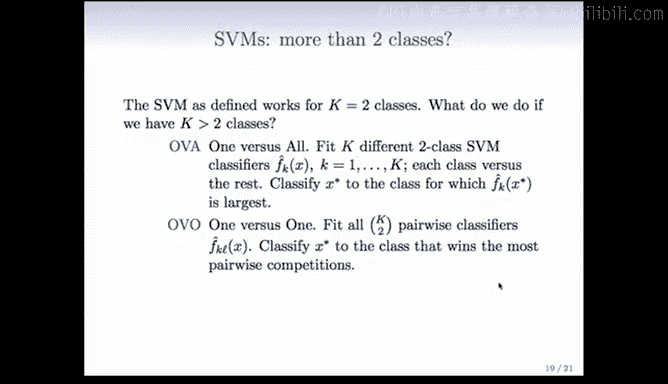

到目前为止，我们讨论的都是二分类问题。当类别数K大于2时，支持向量机的处理方式变得有些特殊。主要有两种通用策略：

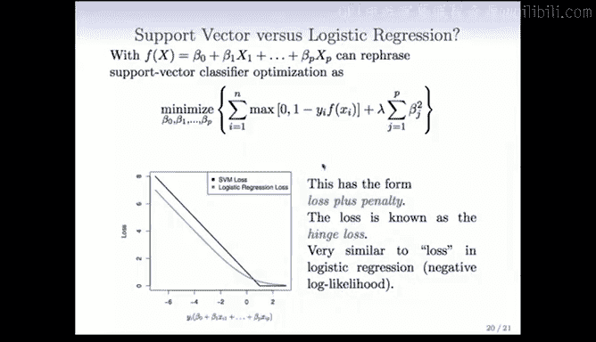

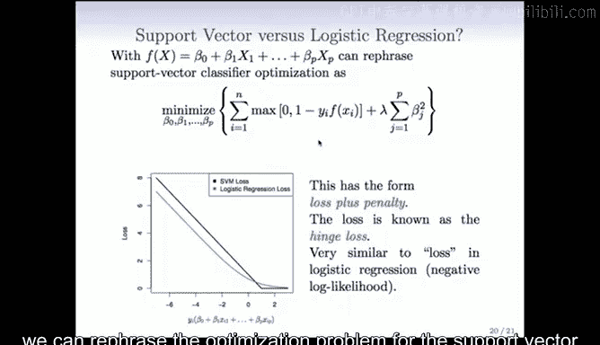

以下是两种主要的多分类扩展方法：
1.  **一对多（OVA）**：训练K个独立的二分类SVM。第k个分类器将第k类作为正类（+1），其余所有类别合并为负类（-1）。预测新样本时，计算所有K个分类器的判别函数值，并将其归入函数值最大的那个类别。
2.  **一对一（OVO）**：训练所有可能的类别两两组合的分类器，共需训练 `K choose 2` 个。预测新样本时，使用所有这些分类器进行投票，将其归入获胜次数最多的类别。

当类别数量很大时，通常采用OVA方法，否则OVO更受青睐。虽然这些方法看似临时，但其背后也有一定的理论依据。

---

## 与逻辑回归的比较 ⚖️

在本节末尾，我们将支持向量机与逻辑回归进行比较。逻辑回归通过建模类别的概率来解决分类问题，而支持向量机直接优化决策边界。两者看似不同，实则存在深刻联系。

线性支持向量机的优化问题可以重新表述为以下形式：
`最小化：Σ Loss(y_i, f(x_i)) + λ Σ β_j²`
其中，`f(x) = β_0 + Σ β_j x_j`。

这里的损失函数称为**合页损失（Hinge Loss）**。其函数图像在`y*f(x)=1`处有一个“折角”。如果样本被正确分类且远离边界（`y*f(x) ≥ 1`），则损失为0；如果样本被错误分类或靠近边界（`y*f(x) < 1`），则损失线性增加。

逻辑回归（带有岭惩罚项）的优化问题形式类似，但其损失函数是负对数似然（如图中绿色曲线所示）。它与合页损失形状相似，但在`y*f(x)=1`处是平滑的拐点，而非尖锐的折角。这意味着逻辑回归可以看作具有一种“软”间隔，并且对靠近边界的点更为关注。

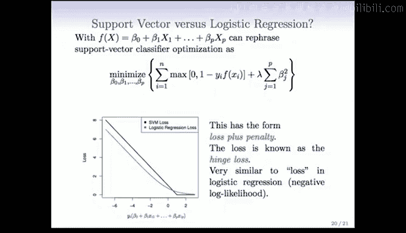

正是合页损失中的这个“折角”，赋予了支持向量机“支持向量”的特性（即只有少数样本直接影响最终模型）。而逻辑回归的平滑损失函数则不具备这一特性。

### 如何选择：SVM 还是逻辑回归？

*   **当类别近乎可分时**：支持向量机和线性判别分析（LDA）往往表现优于逻辑回归。逻辑回归在类别完全可分时甚至会失效（除非使用正则化）。
*   **当类别重叠较多时**：带有岭惩罚或Lasso惩罚的逻辑回归可能表现更好。两者的结果通常相似，但逻辑回归能直接提供概率估计，这在许多实际应用中（如医疗诊断）至关重要。
*   **对于非线性边界**：可以使用核支持向量机，这非常流行。虽然逻辑回归和LDA也可以使用相同的核函数，但计算成本通常更高，因此在这种场景下SVM更常被使用。

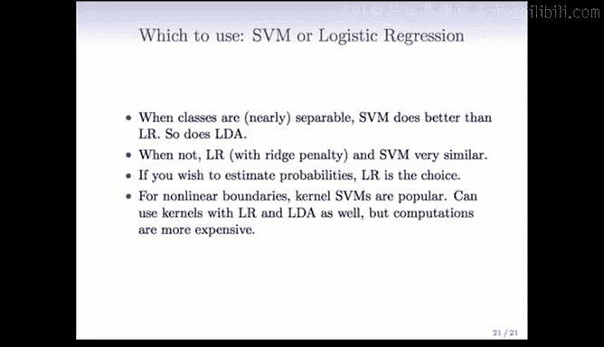

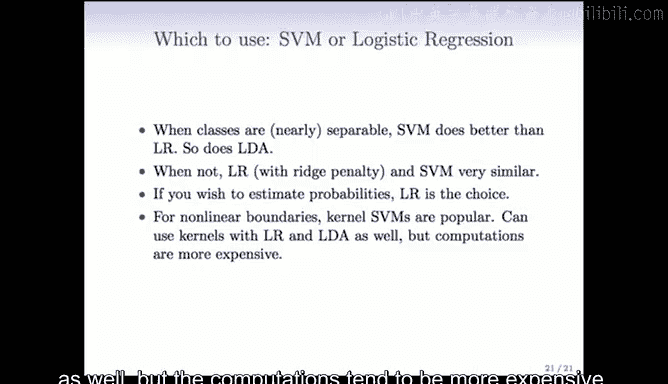

### 支持向量机的局限性

最后需要指出支持向量机的一些局限性：
1.  **特征选择**：与Lasso等L1惩罚方法不同，SVM（特别是使用核时）会使用所有特征，不便于进行特征选择。这对于高维问题的可解释性是一个缺点。
2.  **概率输出**：SVM不直接提供易于解释的类别概率。虽然社区发展了一些后处理方法（如在SVM后拟合逻辑回归来估计概率），但逻辑回归在此方面更为直接。

---

## 总结 📝

本节课中，我们一起学习了：
1.  通过心脏病数据示例，直观了解了支持向量机在二分类问题上的应用及ROC曲线、AUC等评估方法。
2.  认识到模型复杂度参数（如SVM的C和gamma）需要通过在测试集或验证集上的表现来谨慎选择，以避免过拟合。
3.  掌握了支持向量机处理多分类问题的两种策略：一对多（OVA）和一对一（OVO）。
4.  深入理解了支持向量机与逻辑回归在优化目标上的联系与区别，即前者使用合页损失，后者使用对数似然损失。
5.  学会了根据问题的具体情况（如类别可分性、是否需要概率估计、边界是否线性）来在支持向量机和逻辑回归等分类器之间做出选择。
6.  了解了支持向量机在特征选择和概率输出方面的局限性。