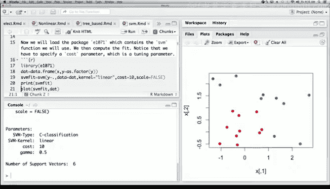
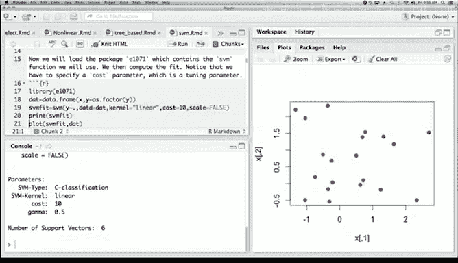
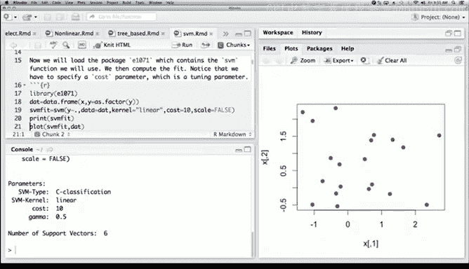

# R 版 66：支持向量分类器 📊


在本节课中，我们将学习支持向量机（SVM），并重点演示如何在R语言环境中使用支持向量分类器。我们将通过生成模拟数据、拟合模型、可视化决策边界和提取模型系数等步骤，完整展示支持向量分类器的应用过程。课程将使用简单的二维示例，以便初学者直观理解核心概念。

---

## 数据生成与可视化


首先，我们生成一个包含20个观测值的数据集，这些观测点分布在两个类别中，每个类别有10个点。数据生成过程如下：


```r
set.seed(1)
x <- matrix(rnorm(20 * 2), ncol = 2)
y <- c(rep(-1, 10), rep(1, 10))
x[y == 1, ] <- x[y == 1, ] + 1
```


上述代码中，我们首先创建了一个20行2列的矩阵`x`，其元素服从标准正态分布。接着，我们创建了响应变量`y`，其中前10个观测值为-1，后10个观测值为+1。为了使两个类别更易区分，我们将`y`为+1的观测点在两个坐标轴方向上的均值都移动了1个单位。


数据生成后，我们将其可视化，以便观察两个类别的分布情况：


```r
plot(x, col = (3 - y), pch = 19)
```

这里，我们使用`col`参数根据`y`的值（-1或+1）为点着色，并使用`pch = 19`来绘制实心圆点，使其在图中更清晰可见。

---

## 拟合线性支持向量分类器

上一节我们生成了数据并进行了初步观察，本节中我们来看看如何使用`e1071`包中的`svm`函数来拟合一个线性支持向量分类器。

首先，我们需要加载`e1071`包，并将数据整理为数据框格式，同时将响应变量`y`转换为因子类型：

```r
library(e1071)
dat <- data.frame(x = x, y = as.factor(y))
```



接下来，我们调用`svm`函数进行模型拟合。在调用时，我们指定使用线性核（`kernel = "linear"`），并将成本参数`cost`设置为10。同时，我们要求模型不对变量进行标准化（`scale = FALSE`）：





```r
svmfit <- svm(y ~ ., data = dat, kernel = "linear", cost = 10, scale = FALSE)
```

拟合完成后，我们可以打印模型对象来查看简要信息，其中会显示支持向量的数量等信息。

---

## 可视化决策边界

虽然`svm`函数自带绘图功能，但其生成的图形在美观性和控制性上有所不足。因此，我们将手动创建一个更精细的可视化方案，来清晰展示决策边界。

以下是创建可视化图形的步骤：

首先，我们创建一个函数`make.grid`，用于在数据范围内生成一个均匀的网格点矩阵，这些点将用于预测并绘制决策区域：

```r
make.grid <- function(x, n = 75) {
  grange <- apply(x, 2, range)
  x1 <- seq(from = grange[1,1], to = grange[2,1], length = n)
  x2 <- seq(from = grange[1,2], to = grange[2,2], length = n)
  expand.grid(X1 = x1, X2 = x2)
}
```

接着，我们使用该函数生成网格点，并利用拟合好的SVM模型对这些网格点进行类别预测：

```r
xgrid <- make.grid(x)
ygrid <- predict(svmfit, xgrid)
```

然后，我们绘制网格点的预测结果，并用颜色区分不同类别，从而形成决策区域的视图。在此基础上，我们将原始数据点叠加到图中，并用不同的符号突出显示支持向量：

```r
plot(xgrid, col = c("red","blue")[as.numeric(ygrid)], pch = 20, cex = .2)
points(x, col = y + 3, pch = 19)
points(x[svmfit$index, ], pch = 5, cex = 2)
```

在图中，支持向量是那些靠近决策边界或在边界错误一侧的点，它们对确定最终的分类器起到了关键作用。

---

## 提取决策边界系数

上一节我们通过可视化直观地看到了决策边界，本节中我们来看看如何从拟合的SVM模型中提取出描述该线性决策边界的数学系数。

`svm`函数本身不直接提供系数，但我们可以根据模型对象中的信息进行计算。计算过程基于支持向量和对应的系数，公式如下：

**决策边界方程**：  
`β₀ + β₁X₁ + β₂X₂ = 0`

以下是提取系数`β`（包括截距`β₀`和斜率`β₁`、`β₂`）的R代码：

```r
beta <- drop(t(svmfit$coefs) %*% x[svmfit$index, ])
beta0 <- svmfit$rho
```

提取系数后，我们可以利用直线方程，将其转换为斜率和截距的形式，并使用`abline`函数将决策边界以及边界间隔（Margin）绘制在之前的图形上：

```r
plot(xgrid, col = c("red","blue")[as.numeric(ygrid)], pch = 20, cex = .2)
points(x, col = y + 3, pch = 19)
points(x[svmfit$index, ], pch = 5, cex = 2)

# 绘制决策边界
abline(beta0 / beta[2], -beta[1] / beta[2])
# 绘制上间隔边界
abline((beta0 - 1) / beta[2], -beta[1] / beta[2], lty = 2)
# 绘制下间隔边界
abline((beta0 + 1) / beta[2], -beta[1] / beta[2], lty = 2)
```

最终图形清晰地展示了线性决策边界、间隔以及支持向量的位置。

---

## 总结 📝

本节课中我们一起学习了支持向量分类器的基本应用流程。我们从生成模拟二维数据开始，使用`e1071`包的`svm`函数拟合了一个线性支持向量分类器。为了更清晰地理解模型结果，我们重点演示了如何通过创建预测网格和自定义绘图来可视化决策区域和边界。最后，我们还学习了如何从SVM模型对象中提取决策边界的系数，并将其绘制在图上。这个过程涵盖了支持向量机从建模到结果解释的关键步骤，为理解更复杂的SVM模型奠定了基础。