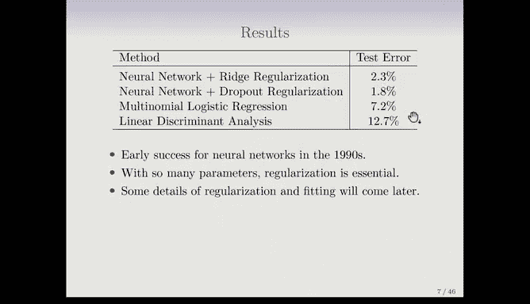

# R 版 68：神经网络入门 🧠

在本节课中，我们将学习神经网络的基本概念。神经网络是深度学习的基础，它是一种强大的机器学习模型，能够学习数据中的复杂模式。

---

欢迎回到课程。

在这一系列课程中，我们将讨论深度学习。这是《统计学习导论》第二版的新章节之一。深度学习是神经网络的新名称，它在20世纪80年代开始流行，并取得了许多成功，引发了热潮，也诞生了许多重要的会议。

后来，支持向量机、随机森林和提升法等技术出现，神经网络的发展一度放缓。大约在2010年，神经网络以“深度学习”的新名称重新兴起，并在2020年代变得非常主流和成功。其成功部分归功于计算能力的巨大提升、更大的训练数据集以及软件（如TensorFlow和PyTorch）的发展。

---

## 一个简单的神经网络

上一节我们介绍了深度学习的背景，本节中我们来看看一个最简单的神经网络结构，有时也称为前馈神经网络。

神经网络通常用网络图来表示。下图展示了一个这样的网络图。

在图中，橙色部分是**输入层**，在这个例子中有4个输入变量。中间是**隐藏层**，包含5个单元。最后是**输出层**。

隐藏层中的单元可以看作是输入的变换。这些单元被称为**激活**（A）。输入数据（X）和输出（Y）是观测到的，但激活值（A）是在模型训练过程中计算出来的。

图中的箭头表示，每个隐藏单元接收的是输入的**线性组合**。每个隐藏单元的激活值 `A_k` 是输入线性组合的非线性函数，记作 `h_k(x)`。每个隐藏单元的线性组合权重是不同的。

这些变换是在训练网络时“学习”得到的。

---

## 激活函数

上一节我们提到了激活是输入的非线性变换，本节我们来详细看看实现这种变换的**激活函数**。

激活函数是非线性的，这一点至关重要。如果激活函数是线性的，那么整个网络就退化成了一个大的线性模型。

以下是两种流行的激活函数：
*   **Sigmoid函数**：早期神经网络中常用。它是一个平滑的S形函数，将输入值映射到(0,1)区间。其公式类似于逻辑回归中使用的函数。
*   **修正线性单元（ReLU）**：目前更流行。它的规则是：如果输入 `z` 小于等于0，则输出0；如果 `z` 大于0，则输出 `z` 本身。公式为：`f(z) = max(0, z)`。

由于每个变换中都包含截距项，ReLU函数的“零点”位置是可以移动的。

---

## 一个实际案例：MNIST手写数字识别

理解了基本概念后，我们来看一个经典的神经网络应用实例：MNIST手写数字识别。这个问题是神经网络的“试金石”。

数据集包含手写数字的扫描图像，每张图像被标准化为28x28像素的灰度图。这意味着每个图像有784个像素值作为输入特征，每个像素值在0到255之间，代表灰度强度。同时，每张图像都有一个对应的类别标签（数字0到9），因此这是一个10分类问题。

在本例中，我们将构建一个**两层前馈神经网络**。其结构如下：
*   第一隐藏层：256个单元
*   第二隐藏层：128个单元
*   输出层：10个单元（对应10个数字）

这个网络的总参数（权重）数量高达235,146个。而训练样本只有60,000个，参数数量远多于样本数，这听起来极易导致**过拟合**。我们稍后会讨论如何避免这个问题。

这个网络被称为“深度”网络，因为它包含两个隐藏层。在20世纪80年代，神经网络通常只有一个隐藏层。有数学理论证明，只要单个隐藏层足够宽，就能近似任何平滑函数。这导致当时许多人认为只需要一层隐藏层。但后来的实践表明，使用多个隐藏层的深度网络能获得更好的性能。

---

## 输出层与损失函数

上一节我们构建了网络结构，本节我们关注网络的最后一环：输出层和如何训练模型。

从最后一个隐藏层到输出层，我们会计算出一组值 `Z_m`。对于这个10分类问题，输出层使用 **Softmax函数** 作为激活函数。这与多类逻辑回归使用的函数相同。

Softmax函数将这10个实数 `Z_m` 转换为一组介于0和1之间、且总和为1的值 `A_m`。每个 `A_m` 可以被解释为样本属于第 `m` 个类别的**估计概率**。

为了训练模型，我们需要定义一个损失函数。这里我们使用**负多项对数似然**，在深度学习领域也常被称为**交叉熵损失**。

其公式如下：
`L = - Σ_i Σ_m y_{i,m} * log(A_{i,m})`

其中，`y_{i,m}` 是**独热编码**的真实标签（在统计学中常称为虚拟变量）。对于第 `i` 个样本，如果其真实类别是 `m`，则 `y_{i,m}=1`，否则为0。因为只有一个 `y_{i,m}` 为1，所以这个损失函数本质上是在最大化被正确分类的样本的预测概率的对数值。

---

## 性能与总结

最后，我们来看看神经网络在这个手写数字识别任务上的表现。

使用不同的正则化技术（如权重衰减和Dropout，后者我们稍后会介绍），神经网络可以将错误率降至2.3%甚至1.8%。相比之下：
*   多项逻辑回归的错误率为7.2%
*   线性判别分析的错误率为12.7%

这显示了神经网络在处理此类复杂模式识别问题上的显著优势。需要指出的是，MNIST是一个被广泛研究的数据集，目前最好的模型错误率可低于0.5%，而人类的错误率大约在0.2%左右。

---

本节课中我们一起学习了神经网络的基本构成：输入层、隐藏层、输出层以及激活函数（如ReLU和Softmax）。我们通过MNIST手写数字识别的例子，了解了神经网络如何应用于实际的多分类问题，并看到了其相对于传统方法的性能提升。同时，我们也认识到深度网络参数众多，需要合适的正则化技术来防止过拟合。

