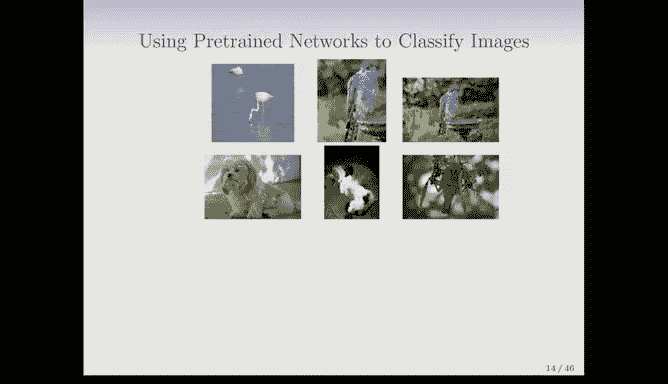

# R 版 69：卷积神经网络 🧠

在本节课中，我们将要学习卷积神经网络（CNNs）。这是一种现今广泛用于图像分类，特别是自然图像分类的技术。我们将了解其核心工作原理、关键组件（卷积层和池化层）以及一个实际应用案例。

---

## 概述

卷积神经网络是深度学习中用于处理图像等网格化数据的强大工具。它的核心思想是通过**卷积**操作自动学习图像中的局部特征，并通过**池化**操作逐步抽象这些特征，最终完成分类任务。

---

## 卷积神经网络的应用场景

上一节我们介绍了神经网络的基本概念，本节中我们来看看其在图像领域的专门应用——卷积神经网络。

卷积神经网络如今被普遍用于分类自然图像或任何类型的图像。这里展示了一系列自然图像的示例。你在这里看到了100张不同的图像。这是一个被称为CIFAR-100的数据集，“100”代表100个不同的图像类别。你可以看到其中有鱼、动物、蝴蝶、汽车等，它们都是自然图像，并被分为100个类别，这是一个非常多的类别数。每张图像都是一个32x32的彩色图像。

这与我们之前处理的数据有所不同。神经网络在2010年左右重新兴起时，其巨大的成功故事就是图像分类，它们取得了惊人的成果，这得益于更大的训练集和更强的计算能力。对于CIFAR-100，有50,000张训练图像和10,000张测试图像。

每张图像都是一个三维数组或特征图。这意味着它有红、绿、蓝三个通道，这就是第三维。红、绿、蓝通道本身也是图像，它们看起来会像这些图，但代表了三种不同的颜色，每个通道都是32x32的大小。

---

## CNN的工作原理：直观理解

这个小示意图给出了CNN工作原理的直观感受。

它展示了一只老虎的卡通图像。CNN以一种分层的方式构建对图像的理解。首先，它试图识别图像中的小形状、色块、边缘等，通常是微小的局部特征。你可以在这个卡通图中看到，它识别出了一只耳朵、部分嘴巴，可能还有一点红色（那是舌头）。这些都是图像中非常小的局部部分。

然后，随着网络层数的加深，这些局部特征被用作构建块，来组合成图像中更复杂的方面。它们拼接在一起形成更复杂的形状，最终组装成目标图像。这种分层构建是通过所谓的**卷积层**和**池化层**实现的，这也是“卷积神经网络”名称的由来。

---

## 核心组件一：卷积层

接下来，我们将详细讲解这两种层：卷积滤波器和池化层。

我们使用小矩阵来展示卷积是如何工作的。假设你的输入图像是这个，我们用字母代表像素。卷积滤波器本身是一个小图像，而且很小。我们展示了一个2x2的卷积滤波器，它只是四个数字排列成的2x2数组。

以下是卷积操作的具体步骤：
1.  我们取这个2x2数组。
2.  将它移动到图像的左上角部分，使其覆盖这四个数字。
3.  然后将对应元素相乘并求和。
4.  你可以看到这里发生了什么：a乘以α，b乘以β，依此类推，然后求和。
5.  接着，我们将这个滤波器向右滑动一列，使其有重叠，然后重复操作。
6.  你可以看到，这就是这个小2x2块与滤波器之间的**点积**运算。
7.  然后，我们向下移动一行，再次重复，现在使用这里的四个像素，如此继续。

这个操作被称为**卷积**。你有一个滤波器和一个大图像，然后进行这种卷积操作：在图像上滑动这个小滤波器并进行这些点积运算。

其工作原理是：如果滤波器所覆盖的小子图像与滤波器本身相似，那么这个点积运算会得到一个较大的数值。换句话说，它在那个位置检测到了与自身相似的东西。否则，数值会很小。

如果这个滤波器是有效的，它将生成一个新的图像，这个图像会突出显示原始图像中**出现**（或接近出现）这个小滤波器图案的部分。另一个优点是，我们并不提供这些小滤波器，它们是在学习网络时被**学习**出来的，而且我们会有很多个滤波器。

---

## 卷积操作示例

这里有一个图示。目标是老虎的图像。我们有两个滤波器。假设这些滤波器是学习得到的。这是两个小滤波器。你可以看到，一个是有两条黑色条纹和一条白色条纹的垂直条纹，另一个是水平条纹。

我们对图像进行卷积，它们将在图像中寻找垂直和水平条纹。虽然不百分之百清晰，但你可以看到，当我们使用垂直条纹滤波器时，这张老虎图像倾向于突出垂直条纹。当我们使用水平条纹滤波器时，它倾向于突出水平条纹。虽然不完美，但它大致完成了任务。

卷积的结果是一个新的**特征图**。这里的原始图像由红、绿、蓝通道组成，我们这里只展示了一个滤波器，但它也有红、绿、蓝通道。当你进行卷积时，它会产生一个新的图像，也就是我们所说的特征图。

由于图像有三种颜色，这些滤波器实际上也有三个通道。你会有一个用于红色的滤波器、一个用于绿色的滤波器和一个用于蓝色的滤波器。然后你分别在红、绿、蓝通道上进行点积运算，再将结果相加。因此，从一个彩色图像，你得到一个新的特征图。

这就是卷积。同样，滤波器的权重是在网络中学习得到的。

---

## 核心组件二：池化层

现在让我也介绍一下池化。假设我们通过卷积获得了一个特征图。

池化（这里指的是**最大池化**）所做的是：它取非重叠的块（在这个例子中是2x2块，这也是我们实际使用的），并用该块中的**最大值**替换每个块。

以下是具体过程：
1.  第一个2x2块包含数字1, 2, 3和0，其中的最大值是3，所以我们放入一个3。
2.  下一个块是5, 3, 1, 2，最大值是5，我们放入一个5。
3.  依此类推，你得到一个缩减后的图像，包含数字3, 5, 2和4。

这种操作**锐化**了特征识别。如果我们将卷积视为突出显示我们看到特征的区域，那么通过这种池化，我们锐化了结果，并且通过选择特征最大值出现的位置，我们允许该特征的位置有**一定的平移不变性**。它还将维度减少了四倍（在这个例子中，每个维度减少两倍）。

---

## CNN的典型架构

这是一个CNN的架构图。

你会看到有许多卷积-池化层对。这是第一个卷积层。你可以看到这里有许多特征图。输入图像是32x32，我们得到的这些特征图也是32x32。为什么有这么多呢？因为对于我们拥有的**每个滤波器**，我们都会得到一个新的特征图。在这个例子中，我们有一、二、三、四、五、六个（特征图）。

现在，我们将这些新的特征图视为这个层次结构中的新通道。输入时有三个颜色通道，我们现在创建了八个通道。

然后我们进行一个最大池化层。滤波器通常很小，例如3x3。每个滤波器在卷积层中创建一个新通道，在这个例子中我们看到有八个。随着池化减小尺寸，滤波器（通道）的数量通常会**增加**。所以我们这里有八个，池化后我们仍然有八个，但它们的尺寸在每个方向上都减半了。

现在，我们有滤波器应用于这些特征图。但请记住，我们在这里看到了八个通道，所以滤波器也必须有八个通道（回想一下，对于输入，滤波器有三个通道）。我们这里有八个通道，每个滤波器有八个通道，一个对应这里的每个特征图。

由于尺寸变小，我们使用**更多的滤波器**，因此输出的特征图数量增加了。这里发生的情况是：我们从左侧开始，那里的特征非常局部、非常精细；然后随着你进行池化和卷积，特征变得越来越**粗糙**，没错，随着向上移动，它们不再那么局部。是的，因为最大池化允许特征在一定程度上移动并被定位。即使两张老虎图像以某种方式标准化了，它们也肯定可能出现在不同的位置，因此这种操作允许了那种位置不变性，这几乎就像通过相机镜头观察：开始时非常近，然后逐渐拉远。

这个过程持续进行。我们继续前进，有一个最大池化层，然后有另一个卷积层。每次最大池化都会降低维度，图像变得越来越小，我们实际上一直进行到图像变得非常小，比如2x2。然后，我们将所有这些图像中的单个像素“展平”成一个一维向量，并通过一个全连接层连接到输出层，那里有100个类别（对应CIFAR-100）。这就是它的工作原理。

---

## 网络的深度与参数

正如我们所说，网络层数可以非常多。有一个在ImageNet（一个包含1000个类别的图像数据库）上训练的网络，它有50层。你在这里看到的大约有八层，而这个网络有50层，我们稍后将进行演示。

提醒一下，这些网络中的参数或权重：如果我们回到我们的小滤波器示意图，你可以看到这里的四个数字是需要学习的权重。对于一个彩色图像，我们将有三个通道，所以对于一个滤波器来说，就是4乘以3等于12个权重。如果你有很多滤波器，权重会累加。然后当你到达这些层时，我们有八个通道。所以现在每个滤波器有八个通道，因此每个滤波器中的权重数量是八乘以（比如我们说3x3的CNN滤波器）。所以它们会累加，参数就来自这里，它们在训练过程中被学习。

---

## 实践：使用预训练网络进行分类

ImageNet是一个大型图像训练数据库，如今甚至有更大的数据库。大型神经网络在这些图像数据库上训练，并由谷歌和Facebook等公司使用分布式软件进行训练。好的一点是，它们使这些**预训练网络**可供使用。

这里有一组从相册中拍摄的自然图像照片。我们将使用预训练的ResNet网络尝试对这些图像进行分类。在实验课中，我们会讲解如何操作，但在这里我们只展示结果。

这个过程将为每个类别（在这个案例中是1000个类别）产生概率，但我们将展示概率最高的前三个类别。

以下是分类结果示例：
*   **第一张图（火烈鸟）**：它给出0.83的概率是火烈鸟，而它确实是火烈鸟。
*   **第二张图（库珀鹰）**：这只鸟是库珀鹰，在北加州很常见。网络称它为鸢（一种猛禽），给出60%的概率。第二个猜测是大灰猫头鹰，第三个猜测是知更鸟（概率非常小），这差得很远。
*   **第三张图（拉出镜头的库珀鹰）**：我们拉出库珀鹰的图片，你可以看到它坐在一个喷泉上。网络被迷惑了。所以现在它将这张图片分类为喷泉，而忽略了鹰。
*   **第四张图（拉萨阿普索犬）**：这是一只可爱的小狗的照片。它实际上是一只拉萨阿普索犬，一种西藏的看门狗。它被分类为西藏梗（看起来有些相似），概率为56%。第二个猜测是拉萨阿普索犬（正确），第三个是骑士查理王猎犬。
*   **第五张图（蜷缩的猫）**：这是一只蜷缩着躺着的猫，这完全迷惑了网络。它认为这是一只古英国牧羊犬。在列表靠后的位置是波斯猫，概率稍高的是西施犬。
*   **第六张图（织巢鸟）**：这是一只在其巢中的织巢鸟，它被分类为黑额织巢鸟（一种在树上活动并在树上筑巢的鸟）。第二和第三个猜测也是鸟类。

---

## 关于预训练网络的进一步说明

关于使用预训练网络完成其他任务：当你在大规模自然图像上训练一个神经网络时，网络的许多**早期层**只是学习自然图像中的通用特征。大量的训练用于学习这些特征。

你可能遇到一个问题，比如你有一些肺部医学图像或乳腺X光片等。这些预训练的特征可能有助于分类或诊断医学图像。你可以做的是，从一个图像网络中提取这些预训练层，然后使用手头问题的一些训练数据来学习**剩余的层**。例如，对于乳腺X光片，你可能只有几百个训练观测值，但预训练可能来自十万张图像，所以预训练的数据量要大得多。

---

## 总结

本节课中我们一起学习了卷积神经网络的核心概念。我们了解到CNN通过**卷积层**自动提取图像的局部特征，并通过**池化层**进行降维和增加特征平移不变性。这种分层结构使得CNN能够有效地处理图像数据。我们还看到了预训练CNN模型在实际图像分类中的应用，以及如何利用预训练模型迁移学习到其他相关领域。