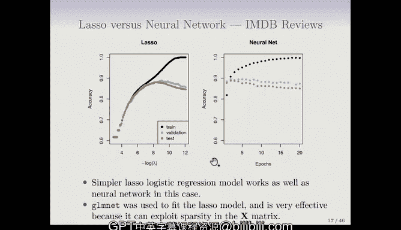

# R 版 70：📄 文档分类

在本节课中，我们将学习一个新的问题：文档分类。我们将以IMDB电影评论数据库为例，探讨如何将文本评论自动分类为正面或负面情感。我们将重点介绍“词袋模型”这一特征化方法，并比较Lasso逻辑回归与神经网络在此任务上的表现。

---

## 文档分类问题简介

上一节我们讨论了分类问题的基本框架，本节中我们来看看一个具体的应用：文档分类。

文档分类的目标是根据文档内容自动为其分配一个类别标签。我们使用的例子是IMDB电影评论数据库。这是一个包含50,000条评论的语料库，每条评论都已被人工标注为“正面”或“负面”情感。其中一半评论为正面，另一半为负面。

这个任务听起来简单，但由于语言的微妙性（例如讽刺），对计算机而言颇具挑战性。例如，一条评论写道：“这绝对是90年代最糟糕的电影之一。”这条评论的情感非常明确，是负面的。

核心问题在于：如何将一篇长度不一、内容开放的文本文档，转化为机器学习模型可以处理的特征？

---

## 特征化：词袋模型

为了解决特征表示问题，我们引入“词袋模型”。该模型的核心思想是忽略词语的顺序和语法，只关注文档中是否出现了词典中的特定词语。

以下是构建特征的步骤：
1.  首先，从一个词典中确定最常出现的10,000个英文单词。这个数量（10,000）是一个我们可以调整的参数。
2.  接着，为每个文档创建一个长度为10,000的二进制向量。
3.  对于文档中的每个单词，如果该单词出现在我们选定的10,000词词典中，就在向量对应的位置上标记为1。如果一个单词出现多次，我们仍然只标记为1（这是二进制表示）。
4.  如果我们有 `n` 个文档，最终会得到一个 `n` 行 `p` 列的稀疏特征矩阵 `X`，其中 `p=10,000`。由于每条评论通常只包含几百个单词，因此这个向量中大部分位置的值都是0。

**公式表示**：
对于一个文档 `d` 和词典 `V`（大小为 `p`），其特征向量 `x_d` 可以表示为：
`x_d = [I(w_1 in d), I(w_2 in d), ..., I(w_p in d)]`
其中 `I(.)` 是指示函数，当括号内条件为真时值为1，否则为0。

词袋模型也被称为“一元语法”模型。我们还可以使用“二元语法”（即连续的词对，如“非常棒”）来捕捉更多信息，但这会极大地增加特征数量（约为10,000的平方），因此本节课我们仅使用一元模型。

---

## 模型比较：Lasso逻辑回归 vs. 神经网络

在特征准备好之后，我们将在下一张幻灯片中比较Lasso逻辑回归模型和一个两层神经网络（不含卷积层）的性能。

以下是两种模型的结果分析：

### Lasso逻辑回归结果

我们使用R语言中的`glmnet`程序拟合Lasso模型。结果以正则化参数λ（实际绘制的是 `-log(λ)`）为横轴，展示了三条曲线：
*   **训练准确率**
*   **验证准确率**（我们划分出一小部分数据子集来决定何时停止Lasso正则化路径）
*   **测试准确率**

可以看到，验证准确率和测试准确率的曲线几乎重合。模型可以达到接近90%的分类准确率。验证集指导我们在Lasso路径上选择何时停止，而测试集上的表现与之相似。

### 神经网络结果

对于神经网络，我们以训练“轮数”为横轴展示结果。在训练神经网络时，我们使用梯度下降法这种较慢的训练方法。“轮数”是指完整遍历整个训练集的次数。这里模型遍历了训练集20次，这本身可以看作一种正则化。

同样，我们绘制了训练、验证和测试准确率曲线。随着训练轮数增加，训练准确率持续上升（类似于Lasso中λ减小的效果），而验证准确率在达到一个峰值后开始下降，这表明模型开始过拟合。

### 性能对比与讨论

神经网络的表现是否比Lasso好很多？实际上，两者的性能非常接近，图中显示可能只有微小的差异。神经网络参数更多，能够捕捉非线性和词语间的交互作用（通过线性组合再组合的方式），而线性模型则不能显式捕捉交互作用。但两者都很快出现了过拟合的趋势。

在教材章节中，我们得出的结论是两者的性能基本相同。值得注意的是，`glmnet`（Lasso）在此任务上非常高效，速度远快于神经网络，这是因为它能够有效利用特征矩阵 `X` 的稀疏性（大部分元素为0）。

---

## 总结

本节课中，我们一起学习了文档分类任务。我们介绍了如何使用**词袋模型**将文本数据转换为数值特征向量。通过IMDB电影评论情感分类的例子，我们比较了**Lasso逻辑回归**和**神经网络**两种方法。实验表明，在这个特定任务上，两种模型达到了相近的准确率，但Lasso凭借其处理稀疏数据的能力，在计算效率上更具优势。这说明了针对不同问题选择合适的模型和特征化方法的重要性。