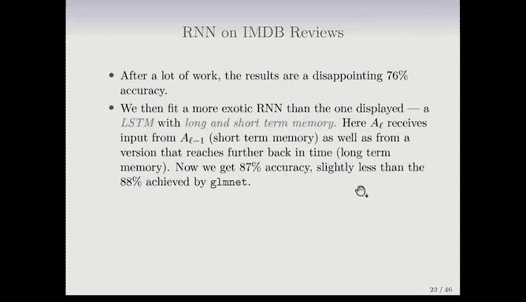

# R 版 71：循环神经网络 (RNN) 🧠

在本节课中，我们将学习循环神经网络。这是一种专门用于处理序列数据的神经网络架构，例如文本、时间序列或语音。我们将了解其基本工作原理、核心公式，并通过一个情感分析的例子来理解其应用。

---

## 从卷积神经网络到循环神经网络

上一节我们介绍了用于图像建模的卷积神经网络。本节中，我们来看看用于序列数据建模的循环神经网络。

序列数据是指按顺序出现的数据，其顺序本身具有意义。以下是一些例子：
*   **文档**：是单词的序列，单词的相对位置具有含义。
*   **时间序列**：例如天气数据或金融指数。
*   **音频**：录制的语音或音乐是音符或音素的序列。
*   **手写文本**：例如医生的笔记。

循环神经网络的缩写是RNN。它们建立的模型会考虑数据的顺序特性，并在此过程中构建对“过去”的记忆。

---

## RNN的基本结构与概念

首先明确符号。每个观测的特征是一个向量序列，序列长度为L。因此有 **x₁, x₂, ..., xₗ**，其中每个x都是一个数值向量。目标变量Y通常是一个单一变量（例如整篇文档的情感倾向），但在更复杂的任务（如机器翻译）中，Y本身也可以是一个序列。

以下是RNN的一个简单架构图。它首先以循环形式展示，强调了其“循环”特性，然后展开为序列形式以便理解。

在输入序列 **x₁, x₂, ..., xₗ** 旁边，有一个隐藏层激活序列 **a₁, a₂, ..., aₗ**。每个a也是一个向量。关键点在于，序列中每个位置的隐藏状态a，不仅接收当前时刻的输入x，还接收前一个时刻的隐藏状态a。例如：
*   **a₂** 接收来自 **x₂** 和 **a₁** 的输入。
*   **a₃** 接收来自 **x₃** 和 **a₂** 的输入。

这样，隐藏状态 **a** 就累积了序列的历史信息，形成了“记忆”。另一个重要特点是，在序列的每一步，使用的权重矩阵 **W** 和 **U** 是**相同**的，这正是“循环”一词的由来。

网络也可能在每一步产生一个输出 **o**，但我们通常只关心序列末尾的最终输出 **oₗ**，因为它汇总了全部信息。

需要学习的参数是权重矩阵 **W**（输入到隐藏层）、**U**（隐藏层到隐藏层）和 **β**（隐藏层到输出层）。

---

## RNN的数学表达

假设序列中每个输入向量有P个分量，每个隐藏状态向量有K个分量。那么，第L步隐藏状态向量 **aₗ** 的第k个分量的计算公式如下：

**aₗᵏ = g( bᵏ + Σⱼ wⱼᵏ xₗʲ + Σₕ uₕᵏ aₗ₋₁ʰ )**

其中：
*   **g(·)** 是一个非线性激活函数（如ReLU）。
*   **bᵏ** 是偏置项。
*   **wⱼᵏ** 是输入权重矩阵 **W** 的元素。
*   **uₕᵏ** 是循环权重矩阵 **U** 的元素。

输出层通常是一个线性模型或Softmax变换。如果我们只关心序列末端的预测，损失函数（如均方误差）定义为：

**L(β, W, U) = Σᵢ (yᵢ - oₗᵢ)²**

由于 **aₗ** 递归地依赖于之前所有的 **a**，在通过反向传播估计参数时，必须考虑序列中的所有步骤，这个过程称为**随时间反向传播**。

---

## 应用于文本数据：词嵌入

我们将RNN应用于IMDB影评情感分析任务。与之前的词袋模型不同，现在我们将文档视为单词序列。为了统一处理，我们将所有文档填充或截断为相同长度（例如500个单词）。

接下来需要将每个单词表示为向量。一种简单的方法是使用**独热编码**，生成一个长度为10000（词典大小）的稀疏二值向量。但这会导致输入维度极高且稀疏。

更有效的方法是使用**词嵌入**。词嵌入是一个预训练的低维实数向量表示（例如维度为100-300），它能捕捉单词的语义信息。例如，“国王”和“王后”的向量差可能与“男人”和“女人”的向量差相似。常用的词嵌入模型有Word2Vec和GloVe。

下图展示了从独热编码（上方稀疏矩阵）到词嵌入（下方稠密、有颜色的矩阵）的转换。词嵌入提供了更紧凑、信息更丰富的特征表示。

---

## 更强大的变体：长短期记忆网络

当我们使用带词嵌入的简单RNN进行训练后，结果可能并不理想（例如仅达到76%的准确率，而之前的方法接近89%）。这是因为简单RNN难以学习长距离依赖关系。

因此，我们引入一种更复杂的RNN变体：**长短期记忆网络**。LSTM通过引入“门”机制（输入门、遗忘门、输出门）和一个额外的“细胞状态”，来有选择地保留长期记忆和短期记忆。这使得它能够更有效地处理长序列。

虽然LSTM训练时间更长，但在IMDB任务上能达到约87%的准确率，性能显著提升。需要指出的是，在该数据集上报告的最佳结果可达95%左右，这通常需要更复杂的网络架构。

---

## 总结与提醒

本节课中我们一起学习了循环神经网络。我们了解了RNN如何通过循环连接处理序列数据并构建记忆，学习了其数学表达，并认识了词嵌入这一将文本转化为稠密向量的关键技术。最后，我们介绍了LSTM这一能有效捕捉长期依赖的RNN变体。

需要牢记的是，深度网络虽然取得了许多惊人成功，但在许多问题上，其表现可能并不比更简单的方法更好，甚至更差。因此，在实践中，不要只尝试复杂深奥的方法，也应尝试更简单的方法，因为它们通常同样有效且更易于理解和解释。