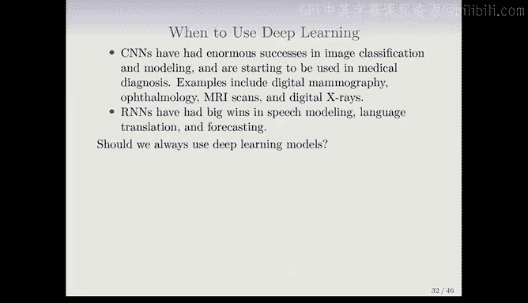
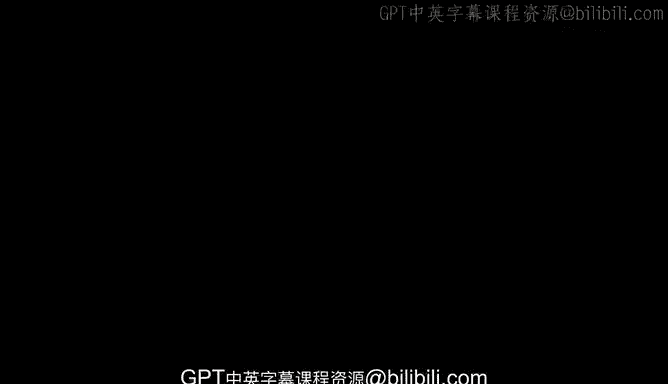

# R 版 72：时间序列预测 📈

在本节课中，我们将学习如何使用循环神经网络（RNN）进行时间序列预测。我们将通过一个具体的金融时间序列预测案例，来理解RNN的构建方式，并将其与传统的自回归模型进行比较。

---

## 时间序列预测问题

上一节我们介绍了RNN的基本结构，本节中我们来看看如何将其应用于时间序列预测。

我们这里展示的是三个金融时间序列，时间跨度为1960年至1990年。这些是日度时间序列，指每周五个交易日的数据。

*   顶部图表显示的是**交易量的对数**。
*   中间图表显示的是**道琼斯指数收益率**。
*   底部图表显示的是当日的**波动率度量**。

图中的红线表示，我们将使用数据的前一部分来训练模型，然后在数据中颜色稍浅的部分（测试集）评估模型。这在处理时间序列时很重要，因为数据存在自相关性，不能随机划分训练集和测试集，而需要按时间顺序划分。

数据共有6051个交易日（从1962年到1986年）。以下是各变量的定义：
*   **交易量的对数**：是一个构造变量，表示当日交易量占流通股数的比例相对于过去100天移动平均换手率的对数值。
*   **道琼斯收益率**：即道琼斯工业指数在连续交易日之间的对数差值。
*   **波动率的对数**：基于每日价格变动的绝对值计算得出。

我们的目标是，根据截至今日观测到的交易量对数、道琼斯收益率和波动率对数值，来预测**明日的交易量对数**。预测交易量相对可行，而预测股价或收益率则要困难得多。

---

## 自相关性与预测可行性

为了评估预测的可行性，我们观察了交易量对数的**自相关函数**。

自相关函数的计算方式如下：设变量V为交易量对数。我们考察数据中所有间隔L个交易日的配对（V_t 和 V_{t-L}），并计算这些配对数值之间的相关性，这被称为**滞后L阶的自相关**。

从图中可以看出，交易量对数具有显著的自相关性。例如，今日值与昨日值（滞后1阶）之间的相关性约为0.7，两日之间的相关性也下降不多。这种自相关性意味着序列并非完全随机，而是存在一定的趋势和模式。这些显著的自相关性使我们有信心认为，过去的值有助于预测未来。

这个预测问题的一个特点是：响应变量V_T（我们想要预测的）本身也将作为特征的一部分。我们可以使用该序列早期的值来预测未来的值。

---

## 为RNN构建数据

我们只有一个数据序列，如何为RNN构建训练数据呢？

以下是构建步骤：
1.  **确定滞后阶数L**：我们决定使用5个滞后阶数（L=5）。
2.  **提取输入序列**：我们将从原始数据中提取许多短的“迷你序列”作为输入。每个输入序列X的形式是 [X_1, X_2, ..., X_L]，其中每个X_i是一个包含三个数字的向量：在时间点 t-i 的交易量对数（V）、道琼斯收益率（R）和波动率对数（Z）。
3.  **构建输入-输出对**：
    *   **输入X**：一个长度为5的序列，包含从滞后5阶到滞后1阶的三个变量值。例如，对于预测时间点T，输入序列是：[[V_{T-5}, R_{T-5}, Z_{T-5}], [V_{T-4}, R_{T-4}, Z_{T-4}], ..., [V_{T-1}, R_{T-1}, Z_{T-1}]]。
    *   **输出Y**：时间点T的交易量对数 V_T。

我们总共有6051个交易日。当L=5时，我们可以创建6046个这样的（X, Y）配对（序列开头部分因无法向前追溯足够天数而被截断）。我们使用前4281个配对作为训练数据，后1770个作为测试数据。

---

## RNN模型与结果

我们拟合了一个RNN模型，每个时间步（即每个RNN单元）包含12个隐藏单元。

在测试期间，模型对交易量对数的预测结果（橙色线）与真实观测值（黑线）的对比如图所示。预测结果看起来相当不错，虽然未能完全捕捉到最高峰和最低谷，但基本跟随了序列的趋势。

在测试数据上，该RNN模型的R平方为**0.42**。

作为对比，我们使用了一个简单的“稻草人”模型：直接用**昨天的交易量对数**来预测今天。由于存在自相关性，这个模型应该不差，其R平方为**0.18**。可见，使用RNN可以取得显著更好的预测效果。

---

## 自回归模型

既然我们已经深入这个例子，接下来介绍另一种使用非常相似结构进行预测的方法——**自回归模型**。这是一种使用线性模型的方法。

数据构建结构与RNN类似：我们创建一个数据集，其中响应变量是交易量对数V_t，特征变量是其自身的滞后值（V_{t-1}, V_{t-2}, ..., V_{t-L}）。当然，我们也可以将道琼斯收益率和波动率对数的滞后值加入特征矩阵。

然后，我们在这个数据矩阵上运行一个**普通的线性回归**来预测响应变量。这被称为**L阶自回归模型**或AR(L)。如果我们使用5个滞后阶数，并且包含三个变量，那么模型将有 `3 * 5 + 1 = 16` 个参数（包含截距项）。

---

## 模型比较

以下是不同模型在测试集上的表现比较：

*   **AR(5) 线性模型**：R平方 = **0.41**，参数数量 = 16。
*   **RNN 模型**：R平方 = **0.42**，参数数量 = 205。
*   **前馈神经网络**：如果我们使用与AR模型相同的数据结构，但用一个前馈神经网络来拟合，得到的性能与RNN相同。

RNN参数更多，但由于其拟合和正则化的方式，并没有导致严重的过拟合。这是神经网络的常见特点。

此外，如果我们在所有模型中加入一个非常具有信息量的变量——**星期几**（周一、周二……周五），所有模型的性能都会提升，R平方可以达到**0.46**。

---

## RNN的扩展与总结

我们介绍的是最简单的RNN，实际上存在许多更复杂的变体：

*   **使用CNN处理序列**：可以将序列视为一维图像，使用卷积神经网络进行拟合。例如，经过嵌入表示的词序列可以看作图像，CNN通过沿序列滑动卷积滤波器进行操作。
*   **多层隐藏层**：可以拥有多个隐藏层，每层都是一个序列，并馈入下一层。
*   **序列到序列学习**：输入和输出都是序列，并共享隐藏单元。这被用于语言翻译等任务，例如将英文句子序列翻译成德文句子序列。

这是一个丰富的领域，存在多种多样的循环神经网络结构。

---

## 何时使用深度学习？

我们已经讨论了多种神经网络：用于图像的CNN、用于序列的RNN、用于通用数据的前馈网络。那么，何时应该使用深度学习呢？

*   **CNN**在图像分类和建模方面取得了巨大成功，并开始应用于医学诊断（如数字乳腺摄影、眼科、MRI扫描）。
*   **RNN**在语音建模、语言翻译和预测方面取得了重大成果。

然而，深度学习的大成功通常发生在**信噪比很高**的情况下。例如，在图像识别和语言翻译中，人类几乎可以完美分类，这意味着输入信息足以确定目标，信号很强，噪声很小。同时，拥有大型数据集时，过拟合问题也不那么严重。

对于噪声较多的数据，**更简单的模型通常效果更好**。例如：
*   在纽约证券交易所数据（噪声较多）上，简单的AR(5)模型与RNN表现相当。
*   在IMDB影评数据上，用Glimnet拟合的线性模型与神经网络表现相当，甚至优于我们演示的RNN。

因此，我们赞同**奥卡姆剃刀原则**：如果简单模型和复杂模型效果一样好，我们更倾向于选择更简单、更可解释的模型。

另外值得注意的是，神经网络的成功案例中，输入数据通常具有某种**时空结构**（如图像的空间结构、时间序列或文本的时间顺序）。神经网络的设计者非常有创造力，能够根据新的数据结构调整网络架构。神经网络就像一个工具箱，你可以根据对问题的了解来定制网络结构，这是一种非常丰富的建模方式。

---

## 总结

本节课中，我们一起学习了：
1.  如何将RNN应用于时间序列预测问题，包括从单变量序列构建适用于RNN的输入输出对。
2.  通过金融数据案例，展示了RNN在预测交易量对数上的应用及效果。
3.  介绍了传统的自回归模型，并将其与RNN进行了比较。
4.  讨论了RNN的多种扩展形式，如序列到序列学习。
5.  最后，探讨了深度学习的适用场景，指出其在信噪比高、数据量大的任务中表现突出，但在噪声较多的数据上，简单模型可能同样有效甚至更优。我们应遵循奥卡姆剃刀原则，根据实际问题选择合适模型。