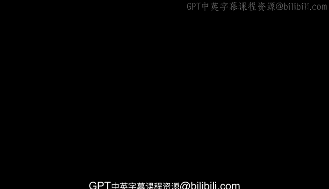
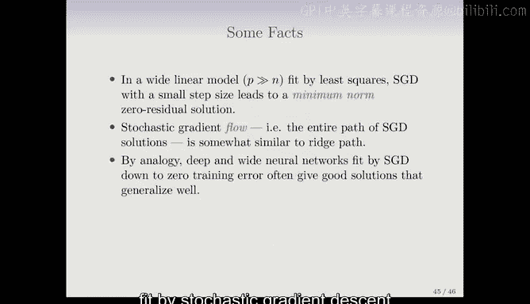

# R 版 74：插值与双重下降 📈📉

在本节课中，我们将探讨一个近年来非常热门的话题——**双重下降**现象。我们将通过一个简单的模拟实验来理解这一现象，并解释它如何挑战了传统的偏差-方差权衡观念。

---

## 概述

在传统的统计学习中，我们通常认为模型复杂度（例如参数数量）增加时，测试误差会先下降后上升，形成一个U形曲线，这被称为偏差-方差权衡。然而，在现代机器学习，尤其是深度学习中，研究者发现即使参数数量远超样本量，模型在训练误差达到零后，测试误差有时会再次下降，形成“双重下降”曲线。本节课将通过一个自然样条模拟实验来直观展示这一现象。

---

## 双重下降现象的背景

上一节我们回顾了传统偏差-方差权衡的概念。本节中，我们来看看神经网络实践中观察到的反直觉现象。

在神经网络中，以下现象已被广泛观察：
*   使用过多的隐藏单元通常比使用过少的效果更好。
*   更多的隐藏层似乎也更好。
*   使用随机梯度下降法训练至训练误差为零，通常也能得到不错的测试误差。
*   这些网络的参数量通常非常庞大。

所有这些现象似乎表明，神经网络不容易过拟合，并且可以在模型中放入任意多的参数。那么，传统的过拟合和偏差-方差权衡理论发生了什么变化？这引发了一系列的研究和讨论。

---

## 一个简单的模拟实验

为了理解双重下降，我们进行一个模拟实验。实验设置如下：

1.  **数据生成**：从正弦曲线 `y = sin(x)` 生成数据。特征 `x` 在区间 `[-5, 5]` 上均匀分布。误差项服从标准差为 `0.3` 的高斯分布。
2.  **数据集**：训练集大小为 `n = 20`。测试集非常大，以精确评估测试误差。
3.  **模型**：使用**自然样条**拟合数据。自然样条通过一组 `D` 个基函数的线性组合来拟合函数，其预测形式为：
    `f(x) = β₁B₁(x) + β₂B₂(x) + ... + β_D B_D(x)`
    其中 `B_j(x)` 是基函数，`β_j` 是待估参数。
4.  **实验设计**：我们将逐渐增加自由度 `D`（即基函数的数量），观察训练误差和测试误差的变化。

当 `D = 20` 时，参数数量等于训练样本量，模型可以完美拟合训练数据（训练误差为零）。当 `D > 20` 时，存在无数个能使训练误差为零的解。此时，我们选择其中**范数最小**的解，即参数平方和 `∑β_j²` 最小的那个解。

---

## 模拟结果与分析

以下是改变自由度 `D` 时，训练误差（橙色）和测试误差（蓝色）的变化曲线。

观察结果：
*   **训练误差**：随着 `D` 增加而下降，在 `D=20` 时达到零并保持不变。
*   **测试误差（双重下降曲线）**：
    1.  **第一次下降**：`D` 较小时，测试误差因偏差减小而下降。
    2.  **上升**：`D` 接近 `n` 时，测试误差因方差增大而急剧上升，呈现经典的过拟合。
    3.  **第二次下降**：当 `D` 超过 `n` 并继续增大时，测试误差**再次下降**，达到一个新的最小值，然后趋于平缓。这就是“双重下降”现象。

**原因解释**：当 `D > n` 时，虽然存在无数个零训练误差的解，但我们选择了参数范数最小的解。拥有更多的参数（更大的 `D`）为我们提供了更多寻找“平滑”解的机会。最小范数约束使得参数值整体变小，即使函数更复杂，其波动也可能更小，从而降低了测试误差。

下图展示了不同 `D` 下的拟合曲线：
*   `D=8`：一个不错的近似。
*   `D=20`：曲线穿过所有训练点，但在数据点之间剧烈震荡。
*   `D=42`（第二次下降后的最小点）：曲线仍然穿过所有训练点，但整体形状更平滑、更接近真实的正弦波。
*   `D=80`：与 `D=42` 的曲线相似。

---

## 与随机梯度下降及神经网络的联系

上述模拟实验的原理与深度学习中的观察密切相关。

*   **宽线性模型**：在一个参数数量 `p` 远大于样本量 `n` 的线性模型中，使用**小步长的随机梯度下降**持续优化至零训练误差，最终会收敛到**最小范数解**。
*   **类比神经网络**：在深度且宽的神经网络中，使用随机梯度下降缓慢训练至零训练误差，通常会得到一个**隐式正则化**的良好解，其测试性能也较好。
*   **随机梯度流**：随机梯度下降的整个优化路径，与**岭回归路径**（随着正则化参数变化而产生的一系列解）非常相似。这意味着缓慢的梯度下降过程本身起到了正则化的作用。

因此，在高信噪比的任务中（如图像识别），即使训练至零误差，深度网络对过拟合也不那么敏感，因为零误差解中主要捕捉的是信号本身。

---

## 相关软件介绍

最后，我们简要介绍用于神经网络和深度学习的强大软件工具。

以下是主流的深度学习框架：
*   **TensorFlow**：由 Google 开发。
*   **PyTorch**：由 Facebook 开发。

两者都是 Python 包。在本书第10章的实验中，我们演示了如何通过 R 语言的 `keras` 包（它接口了这些 Python 框架）来使用 TensorFlow。此外，R 也有 `torch` 包来实现 PyTorch 的功能。本书第二版的所有实验代码（R Markdown 和 Jupyter Notebook 格式）都可以在线资源中找到。

---

## 总结

本节课我们一起学习了**双重下降**这一现代机器学习中的重要现象。通过一个自然样条的模拟实验，我们直观地看到，当模型自由度超过样本量并继续增加时，测试误差会出现第二次下降。这挑战了传统的偏差-方差权衡观念，并与使用随机梯度下降训练宽神经网络时观察到的良好泛化性能相联系。其核心在于，在过参数化情况下，优化算法（如小步长随机梯度下降）会倾向于选择一种隐式正则化的解，从而获得更好的泛化能力。