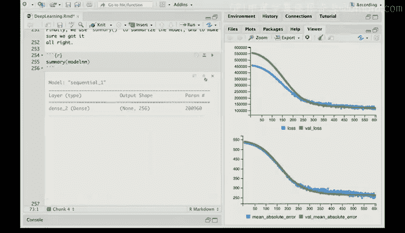

# R 版 75：R语言中的神经网络与MNIST数据 🧠

在本课程中，我们将学习如何在R语言中使用`keras`包实现神经网络模型，并应用在Hitters数据和MNIST手写数字数据集上。我们将从简单的单层网络开始，逐步过渡到更复杂的多层网络，并比较不同模型的性能。

---

## 准备工作与环境配置

我们将通过R中的`keras`包来实现深度学习，它是Google开发的TensorFlow系统的一个前端接口。`keras`和TensorFlow本身是用Python实现的，因此`keras`包实际上是与Python代码交互的桥梁。

这与我们之前接触的内容有较大不同。为了能够运行本课程中的代码，你需要在计算机上安装Python环境。虽然这有一定的学习曲线，但它是可以管理的。书籍官网上提供了在所有流行操作系统上安装`keras`、TensorFlow和Python的详细说明。

我们使用的`keras`系统遵循François Chollet和J.J. Allaire的著作《Deep Learning with R》。因此，获取这本书的副本也可能对学习有所帮助。

我们假设你已经成功在机器上安装并运行了`keras`，以便能够跟随本实验。

另外，在本实验中你会看到大量文本。对于新版书籍，我们以多种格式提供了所有实验的代码，其中之一是R Markdown格式，也就是你在这里看到的。它几乎完全复现了书中的实验内容，这也是学习R Markdown的好机会。R Markdown是编写R代码、记录操作和思路的绝佳方式。

我们正在RStudio环境中运行此R Markdown文档。RStudio本身支持R Markdown，并提供了非常友好的界面来运行它。

好的，让我们开始吧。你会看到很多文本。实际上，如果你“编织”（knit）这个文件，它会运行并生成一个HTML文档。当你查看它时，它看起来会非常像实验本身，可能只有微小的差异。

我们向下滚动，首先要做的是在Hitters数据上实现我们在章节中看到的单层网络。

---

## 单层神经网络应用于Hitters数据

我们加载`ISLR2`库。对于本书的第二版，我们有一个新的库，它基本包含了旧库的内容以及第二版中可能需要的额外数据集和函数，这个库叫做`ISLR2`，你可以从CRAN获取。

最初的几行代码是读入Hitters数据。Hitters数据包含缺失值，因此我们使用`na.omit()`函数移除所有包含缺失值的行。

然后，我们设置随机种子，并选择一个测试集，它将是数据集的三分之一。为了运行整个代码块，我只需按下这里的箭头键。它完成了，没有输出，只是执行了操作。

接下来，我们拟合一个线性模型，这当然很熟悉。我们使用`lm()`函数。响应变量是`Salary`。这是关于棒球击球手的薪水数据。波浪号加小数点（`~ .`）再次表示使用除薪水外的所有其他变量作为特征。

我们使用`Hitters[-test_id, ]`，意味着我们将使用训练数据，即从数据中剔除测试集部分。然后，我们在测试数据上进行预测，并计算测试误差。

我首先运行它。在这个界面中，输出会直接显示在Markdown的屏幕上，这非常方便。这就是测试数据上的平均绝对预测误差。

现在，我们使用了另一个之前不常用的表达式，那就是`with()`函数，它非常方便。`with()`的第一个参数是一个数据框，随后的表达式可以通过命名数据框来使用其中的任何变量并进行计算。

这就是我们在这里所做的。使用`Hitters[test_id, ]`作为数据，我们能够直接引用`lm`和`Salary`来计算平均绝对误差。这很好。

接下来，我们将使用`glmnet`，因为我们想对Hitters数据拟合一个Lasso模型。`glmnet`不了解公式，它没有在`glmnet`中实现。因此，我们需要创建X矩阵和Y矩阵。

我们使用`model.matrix()`函数，这是一个方便的函数。它可以接受一个公式。在这种情况下，我们告诉它`Salary`是响应变量，因为我们想排除它。点号（`.`）再次表示所有变量，而`-1`表示我们不想要截距项，否则`model.matrix()`通常会包含一个截距项。我们告诉它数据，然后将其称为`X`。`Y`是薪水数据。

我们实际上在`model.matrix()`外面包裹了`scale()`函数，`scale()`会将列标准化为单位方差和零均值。我想我们通常需要截距项，为什么现在要排除它呢？问得好，Rob。我们确实希望在模型中有截距项。但是`glmnet`当你给它一个`X`时，它期望的只是变量，并且会自动加入一个截距项。所以，如果我们保留了截距项，模型中就会有两个常数项。我想你也会收缩截距项，而这通常不是你想要的。完全正确。

我已经点击运行了那个代码块。

接下来，我们加载`glmnet`库。我们在训练数据上使用`cv.glmnet()`，即`X[-test_id, ], Y[-test_id]`。我们告诉`cv.glmnet`我们想使用平均绝对误差，否则默认情况下它会使用均方误差。

然后，我们从该模型进行预测，并告诉它在`lambda.min`处进行预测，这是交叉验证曲线上的最小值。我们计算平均绝对误差。

我们运行该代码，会有一些消息说它加载了`glmnet`包并实现了它。我们这里没有绘制交叉验证曲线，但我们可以。我可以直接跳转到我的代码中，说`plot(cv_fit)`，然后运行那一行。我们得到了交叉验证拟合的图。但我们没有把它包含在包中。

现在，我们准备拟合神经网络。我们加载`keras`库。

现在，我们编写一些代码来构建模型的结构。模型被称为`mod_nn`。它是一个存储模型细节的结构。

`keras_model_sequential()`只是一些代码，表示它将是一个前馈神经网络。

然后，我们稍后会详细讲解管道操作符（`%>%`）。我们通过管道将其传递给`layer_dense()`的调用，这告诉你在隐藏层将有50个单元，使用ReLU激活函数。输入形状将是`X`的列数，换句话说，它将从具有`X`列数的输入层到具有50个单元的隐藏层。

然后，我们想通过管道将其传递到`layer_dropout()`，其中我们设置了0.4的丢弃率。

然后传递到`layer_dense()`，这是用于输出单元的。

让我们运行它。你会看到它等待了一会儿，因为后台正在运行Python。会打印出很多东西，可能看起来有点吓人，但里面没有什么真正的问题。它只是说Python已经实现，并且这个模型规范已经传输给正在运行的Python程序。

让我们谈谈管道操作符。这是我们之前没有遇到过的，它非常有用，特别是在指定神经网络模型时，因为它使代码更具可读性，因为我们可以基本上为网络中的每一层（包括丢弃层等）使用单独的行。

那么它是如何工作的呢？我们用一个简单的例子来说明。之前，我们使用了`scale()`命令，我们创建了模型矩阵，然后在外面包裹了`scale()`，它会获取`model.matrix()`的输出并应用`scale()`函数。在没有参数的情况下，`scale`默认将各列标准化为零均值和恒定方差。

但是这些复合表达式可能有点难以阅读，特别是如果它们嵌套了几层。所以这里我们做同样的事情，但使用管道操作符。我们调用`model.matrix()`。我们想把它赋值给`X`，但我们做的是将`model.matrix()`的输出通过管道传递到没有参数的`scale()`函数中。

这样做的作用是，`model.matrix()`的输出成为`scale()`的第一个参数（管道使其成为第一个参数）。然后，`scale()`中列出的任何其他参数将成为后续参数。这与执行`scale()`具有相同的效果。不需要再次运行它，因为我们已经做过`scale()`了。

好的，回到神经网络。我们已经设置了`mod_nn`，它有一些细节，有一个丢弃层等等。现在，我们将向`mod_nn`添加更多细节，以控制拟合算法。

我们将遵循`keras`书中给出的示例。我们将使用平方误差损失。同样，我们通过管道将`mod_nn`传递给`compile(loss = "mse")`。我们告诉它优化器，它是默认优化器，并告诉它我们感兴趣的指标是平均绝对误差。

在前一行中，管道操作符将`mod_nn`作为第一个参数传递给`compile`。所以`compile`函数实际上并没有改变R对象`mod_nn`，但它确实将这些规范传达给了正在创建的`keras`/Python模型实例。

所以这里发生的事情有点意思。看起来我们是在R中创建并要拟合这个`mod_nn`，但实际上我们正在将这些信息传输给Python实例，告诉它如何拟合模型。这是一种非常特殊的过程。

现在，我们要拟合模型。它将使用随机梯度下降。我们将指定周期数（epochs）和批次大小（batch size）。

批次大小将是32，这意味着每次我们进行梯度更新时，我们随机选择32个训练观测值来计算梯度，即批次梯度。然后我们沿着梯度方向移动一步。那个批次大小已经指定了吗？不，Rob，那个即将到来。所以这算是它的前奏。也许我们应该看看它。

好的，这就是我们要说的地方。你可以看到，在实际实验中，我们注释掉了1500个周期，因为那会花一点时间，所以我们注释掉它并改为600。实际上，我现在就要让它运行起来，因为它需要一点时间。然后我会告诉你关于周期的事情。

所以，是的，批次大小为32。有176个训练数据观测值，所以如果你除以32，每个周期大约有5个梯度步骤，因为记住，一个周期相当于你遍历整个训练数据集一次所需的梯度步骤数。

在右边这里，我们实际上看到了神经网络拟合的进度图。这是RStudio特有的功能。在顶部，我们有默认的损失，即平方误差损失。绿色曲线是验证集（在这种情况下实际上是测试数据），蓝色是训练集。在下面，我们有平均绝对误差，情况相同。蓝色是训练，绿色是验证。它们几乎重叠在一起。

注意，训练损失有点跳跃。这是因为梯度下降是跳跃的，因为用于计算梯度的观测值有一些随机性。它看起来根本没有过拟合，对吧？是的，所以实际上我们可以再运行久一点。

这是一个有趣的观点，Rob。似乎这些神经网络通常过拟合得很慢。部分原因，我猜是学习率。有一个学习率，我忘了学习率是多少，是的，我们实际上没有指定它。我不相信它是默认值，但它是一个小的学习率。这就是你每次沿着梯度下降的距离。我们也使用了丢弃法，它起到了正则化的作用，是的。

还有一个窗口，显示了每个梯度步骤的更多细节。如果你愿意，你可以仔细查看。但有了图，现在就很好了。所以我们就把它移开。这是一个你可以用来打开那些内容的小项目。

如果你不在RStudio中，而是在不同的系统上运行R，你也可以直接绘制历史记录，你会得到类似的东西，与我们刚刚看到的图非常相似。

好的。所以有一点需要注意，我们运行了拟合，是的，我们用了600次迭代。如果我们第二次运行拟合，它会从我们停止的地方开始。因为Python代码只是停在了那里，如果你再次运行它，它就会继续。图会继续，但它会从之前结束的点开始继续。我们现在不这样做。

最后，我们可以使用`keras`的`predict()`方法用于神经网络。我们给它测试数据，并评估在测试数据上的性能。这与我们在书中报告的结果略有不同，因为我们只使用了大小为600的训练样本。它和最小二乘法差不多，我想它稍微差一点。是的，没错。

另一件需要注意的事情，我们在章节中指出过，即使你从头开始运行模型1500步，第二次也不会给出完全相同的答案，因为随机梯度下降中存在轻微的随机性。使用相同的种子呢？嗯，种子对于`keras`来说是一个棘手的问题，因为事实证明很难，或者我们还没有弄清楚如何从`keras`内部设置Python种子，所以这是一个小问题。

好的。这就是简单示例的结束。

---

## 多层神经网络应用于MNIST数据

我们现在转向在MNIST数据上的多层网络。这是一个更大、更严肃的数据集。

这些数据可以从`keras`包中获得，就像我们实验中其他重要的数据集一样。实际上，`keras`中有一个专门的命令叫`dataset_mnist()`来获取数据。

然后，我们有几个命令来提取这个对象，它是一个包含许多组件的列表，我们提取出`X`、`Y`、`X_test`、`Y_test`，这些都是指定的训练集和测试集，并使它们可用。

你会看到有60000个训练图像，每个是28x28的灰度图像。以及10000个测试图像。当然，还有类别标签，在0到9之间，这些是数字。

图像数据，`X`矩阵存储为一个三维数组，它是60000 x 28 x 28。所以我们实际上想将其重塑为一个矩阵，我们将把28x28展平。`keras`包中有命令可以做到这一点。

我们还将使用`keras`命令`to_categorical()`将响应变量转换为分类变量。这只是为了将输入转换为神经网络能够理解的格式。

另一件事，当你拟合神经网络时，它对变量的尺度相当敏感。所以，如果你有一个变量范围在0到1，而另一个变量范围在-500到+500，这会给神经网络带来一些问题。

因此，通常最好将变量缩放，也许缩放到一个区间，比如0到1，或者标准化它们使其具有单位方差，以避免这种敏感性。

对于这些图像，每个像素是一个8位灰度值，实际的数字，如果你看它们，它们介于0和255之间，那是2的8次方。不同的数字，对吧？所以我们将它们重新缩放到0和1之间。这是一个简单的命令，只需在`X_train`和`X_test`上逐元素操作。

现在，数据已经准备好用于神经网络了。

再次调用`keras_model_sequential()`。现在我们将有更多的层。第一层是输入层。输入层有784个单元，那是28x28的图像。第一个隐藏层将有256个单元，使用ReLU激活函数。

通过管道传递到一个丢弃率为0.4的丢弃层。然后第二层将有128个单元，也是ReLU激活。我们将进行丢弃率为0.3的丢弃。所以，这比之前的丢弃率稍低。

最后的输出层有10个单元，激活函数是`softmax`。它将输出转换为10个类别的概率。

我们如何决定这样的架构？比如这里的256，丢弃率0.4，三层，单元数128，丢弃率0.3。这是一个很好的问题，Rob。实际上这相当棘手。你会看到，随着我们构建越来越复杂的网络，这些参数成倍增加，有很多参数。为什么我们这里用0.4，那里用0.3？我想我是从`keras`书中复制的，他们使用了这个例子，但是，是的，这些参数有时需要大量的试验和错误才能调整正确，包括单元的数量，尽管一般的想法是，你使用大量的隐藏单元，并使用某种形式的正则化。所以，宁愿过多也不要过少。是的，我认为这是当前的想法。

让我们确保运行那段代码。所以，这并没有做太多工作，只是通过这些层指定模型，并广泛使用管道操作符。

我们可以对模型做一个摘要，这很好，因为你可以实际检查你是否做对了，并给出每一层的描述和其中的内容。

它看起来令人震惊，但我们有235,000个参数。我们只有60,000个训练观测值。所以这是一个神经网络参数远远过度参数化的情况。但是，我们将使用正则化。所以谁知道有效维度是多少？但名义上，这就是参数的数量。

不，我们不需要计算那个。如果你查看参数，如果你想将这些数字与我们在这里看到的数字协调起来，你必须考虑到每一层（输入层和每个隐藏层）都有一个偏置项（即截距），当你把这些加进去时，你就可以得到这个数字。

我们告诉它损失函数是分类交叉熵。这本质上是多类逻辑回归的损失函数，实际上是对数似然。

我们给出优化的细节。同样，这些是在`keras`书中规定的，人们可以查阅这些帮助，看看有哪些不同的选项，但我们基本上使用了默认值。

现在，我们再次拟合模型。我已经将周期数减少到15。我使用的批次大小是128。考虑到我们有60,000个训练观测值，这可能看起来相当小。但想法是使用许多相对较小的批次，你可能会取得更好的进展。

现在，我们告诉它使用0.2的验证分割。所以，实际上，我们使用60,000个训练观测值中的20%作为验证集，这样我们就可以在模型进行时跟踪其历史。

想想这有多神奇，我们坐在这里。这是在MacBook Pro上运行的，只是一台笔记本电脑。我们正在拟合……有多少参数？235,000个参数。每次移动意味着它处理了60,000个观测值，或者因为验证而少一些。完全令人惊叹。我想这个功劳要归功于Google和TensorFlow，以及他们使用的所有软件和硬件智能。是的，这太神奇了。我们真的很幸运能有像TensorFlow这样的包可用，而且它被用在，你知道，各个地方。

好的，这里有一些机器的细节，大致沿着Rob写的思路。拟合模型。它说在这个特定的MacBook Pro（2.9 GHz，32 GB RAM）上，完整模型（如果我们使用所有周期）花了144秒。

我们可以评估模型的准确率。它在测试数据上达到了惊人的98%的准确率，这真的很好。同样，我们在这里使用了管道命令。是的，我们实际上写了一个叫做`accuracy()`的小函数。

它接受两个参数：预测值和真实值。它计算平均分类错误率。它查看预测值与真实值相等的频率。

我们使用了一个词`drop`，因为预测值是以数组的形式出现的，我们不想让它们碍事。所以，我们运行`predict_classes()`，给它`X_test`，那会给出数字的预测。如果我们直接通过管道将其传递给`accuracy()`，当我们使用管道命令时，我们只需要命名测试集（这是第二个参数），因为第一个参数是`predict_classes()`的输出。这就是它的用法。

在章节中，我们还报告了LDA（在本书第4章中描述）和多类逻辑回归的结果。

像`glmnet`这样的包可以很好地处理多类逻辑回归，但事实证明，在如此大的数据集上它们相当慢。我们尝试了其他包来在这些数据上拟合多类逻辑回归，但都遇到了速度或其他问题。

然后我们想到，我们实际上可以使用一个没有隐藏层的深度网络来拟合这个模型，这有点意思。所以，我们就这样做。我们直接从输入到输出，再次使用`softmax`激活函数。如果你在这里计算参数数量，你会发现这对于多类逻辑回归来说是完全正确的。

现在，我们像以前一样拟合模型。这个看起来我用了30个周期。它正在拟合那个逻辑回归模型。表现得稍微差一点，我想，我们之前不是达到了90吗？是的，之前是的，所以我们之前达到了98。所以你可以看到神经网络的优势，Rob。因为逻辑回归在测试数据上似乎达到了大约93%的准确率，而神经网络达到了98%。如果我们可以运行`glmnet`，它会给出完全相同的结果吗？是的，嗯，确切地说，它是一个近似，对吧？它正在做随机梯度下降。所以没有真正达到全局最小值。但这没关系，也许谁在乎呢？它表现得更好。它表现得……是的，它会表现得和`glmnet`一样好。嗯，大致一样好，可能非常相似，对吧？看起来它在这里已经趋于平稳了。

---

## 总结

在本课程中，我们一起学习了如何在R中使用`keras`