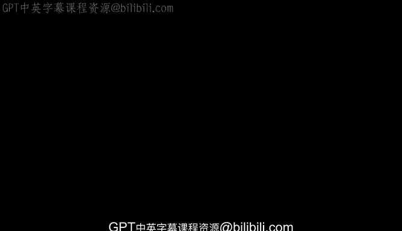
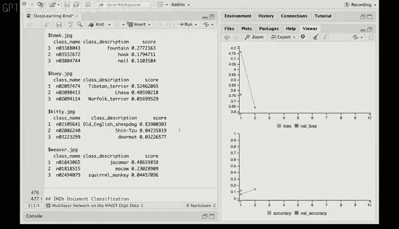

# R 版 76：卷积神经网络在R中的应用 🧠



在本节课中，我们将学习如何在R语言中构建和应用卷积神经网络来处理图像数据。我们将使用CIFAR-100数据集，这是一个包含100个类别的彩色图像数据集。课程将涵盖数据准备、模型构建、训练过程，并展示如何使用预训练模型进行图像分类。

---

## 数据准备与探索

首先，我们读取CIFAR-100数据集，并提取训练集和测试集。该数据集包含50,000个训练观测值，每个观测值是一张32x32像素的彩色图像，具有红、绿、蓝三个颜色通道。因此，输入数据`x`是一个四维数组。

响应变量是一个分类变量，我们将对其进行独热编码，生成一个100列的二进制矩阵。在之前的数字数据集中，我们得到了一个10列的二进制矩阵，现在扩展到100列。机器学习社区喜欢使用“独热”这个术语，它比统计学中传统的“分类”或“哑变量”说法更生动。

以下是数据准备步骤：

*   读取CIFAR-100数据集。
*   提取训练和测试数据。
*   将分类响应变量转换为100列的独热编码矩阵。

接下来，我们使用JPEG包来查看一些训练图像。我们设置一个5x5的绘图窗口，随机抽取25张图像进行显示。这些是32x32像素的小图像，分辨率不高，但包含了植物、动物、鱼类、树木等各种自然图像类别。

---

## 构建卷积神经网络模型

上一节我们查看了数据，本节我们将构建卷积神经网络模型。我们使用`keras_model_sequential`函数，并通过管道操作符`%>%`清晰地逐层指定模型结构。

管道操作符使代码更清晰，因为我们需要指定许多层。

模型的第一层是一个二维卷积层。每个卷积滤波器是一个3x3的小图像块，我们将其在目标图像上滑动并进行点积运算。我们需要指定输入形状为`(32, 32, 3)`。

接着，我们添加一个最大池化层。该层将滤波后图像的每个维度缩小两倍。它的作用是对每个不重叠的2x2区块取最大值，从而突出滤波器学习到的特定特征。

然后，我们重复这个过程：将池化层的输出传递给另一个卷积滤波器。随着图像尺寸的缩小，隐藏单元的数量会增加。这在教材中有详细描述，我们在此不深入讨论。

在模型末尾，我们有一个大小为1024的密集层，然后压缩到另一个大小为512的密集层，最后输出到大小为100的输出层（对应100个图像类别），并通过softmax层进行概率转换。

模型中还穿插了Dropout层，用于添加正则化，防止过拟合。

以下是模型结构代码示例：
```r
model <- keras_model_sequential() %>%
  layer_conv_2d(filters = 32, kernel_size = c(3,3), activation = 'relu', input_shape = c(32,32,3)) %>%
  layer_max_pooling_2d(pool_size = c(2,2)) %>%
  layer_conv_2d(filters = 64, kernel_size = c(3,3), activation = 'relu') %>%
  layer_max_pooling_2d(pool_size = c(2,2)) %>%
  layer_dropout(rate = 0.25) %>%
  layer_flatten() %>%
  layer_dense(units = 1024, activation = 'relu') %>%
  layer_dropout(rate = 0.5) %>%
  layer_dense(units = 512, activation = 'relu') %>%
  layer_dense(units = 100, activation = 'softmax')
```

我们可以使用`summary()`函数查看模型细节，该模型有接近一百万个参数。对于50,000个训练图像来说，这个数量是惊人的。

我们计划训练10个周期。由于模型层数多、参数量大，训练需要较长时间。在训练时，可以看到进度条。如果训练全部30个周期，最终准确率大约为46%。对于100个类别的数据来说，这个结果不算差。目前，通过使用各种技巧，有些CNN模型在此数据集上的准确率可以达到75%。

---

## 使用预训练模型进行图像分类

训练一个复杂的CNN需要大量资源和时间。幸运的是，一些深度学习网络已经过预训练并公开可用，我们可以直接使用。

有一个更大的图像数据集叫ImageNet，包含数百万张图像和1000个自然图像类别。我们将使用一个在其上预训练的、非常复杂的网络，称为ResNet50。我们可以直接用它来分类图像，也可以将其部分训练好的层作为我们网络的基础，并在其之上添加新的层。

这非常方便。接下来，我们将使用预训练网络对我们自己的相册中的图像进行分类。

我们有以下六张图像：一只拉萨阿普索犬、一只猫、一只织布鸟、一只停在喷泉上的鹰、一张鹰的特写，以及一些火烈鸟。

以下是使用预训练模型进行分类的步骤：

*   读入我们的图像。
*   将图像预处理为预训练网络所需的格式：224x224像素，三个颜色通道。
*   加载预训练的ResNet50模型。该模型在ImageNet数据集上训练，包含1000个类别。
*   使用模型对预处理后的图像进行预测。
*   解码预测结果，并输出概率最高的前三个类别。

运行代码后，我们得到了分类结果：
*   火烈鸟被准确识别。
*   鹰（特写）被识别为“鸢”（一种鸟），其他两个猜测也是鸟类。
*   鹰与喷泉的远景图被识别为“喷泉”，模型没有看到鸟。
*   拉萨阿普索犬被识别为“西藏梗犬”（第二名），两者都是西藏犬种，很相似。
*   猫被识别为“古代英国牧羊犬”，下一个猜测是“西施犬”，第三个是“门垫”。
*   织布鸟被识别为“鹪鹩”，两者看起来有些相似。

总体而言，预训练网络的表现算是成功的。

---

## 总结



本节课中，我们一起学习了在R中应用卷积神经网络。我们首先准备了CIFAR-100图像数据集并进行了探索。然后，我们逐步构建了一个CNN模型，了解了卷积层、池化层和Dropout层的作用。由于训练复杂模型耗时，我们介绍了使用预训练的ResNet50模型进行图像分类的实用方法，并验证了其在我们自有图像上的效果。这展示了迁移学习的强大能力，使我们能够利用现有的大规模训练成果来解决新的问题。