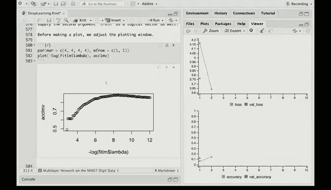

# R 版 77：文档分类 📄


在本节课中，我们将学习如何使用统计学习方法进行文档分类。我们将以IMDB电影评论数据集为例，构建一个模型来预测评论的情感倾向（正面或负面）。我们将重点介绍词袋模型的构建、数据的稀疏表示，并分别使用逻辑回归和神经网络模型进行分类。

---

## 概述

文档分类是自然语言处理中的一项核心任务。本节我们将使用IMDB电影评论数据集，该数据集包含带有情感标签（正面/负面）的评论文本。我们的目标是构建一个分类器，能够根据评论内容自动判断其情感。

我们将首先构建一个包含10，000个最常见单词的词典，并使用“词袋”模型将每篇文档转换为一个二进制向量。接着，我们会使用Lasso逻辑回归和神经网络两种模型进行分类，并比较它们的性能。

---

## 构建词袋模型

上一节我们介绍了文档分类的任务，本节中我们来看看如何将文本数据转换为模型可以处理的数值形式。我们采用的方法是“词袋”模型。

具体步骤如下：
1.  创建一个包含数据集中最常出现的10，000个单词的词典。
2.  对于每一篇文档（即一条评论），我们检查词典中的每个单词是否出现在该文档中。
3.  生成一个长度为10，000的二进制向量，如果单词出现则对应位置为1，否则为0。

以下是加载数据并构建词典的关键代码示意：
```r
# 假设 `imdb_data` 是已加载的数据集
# 此代码为概念示意，具体实现依赖于所使用的库
dictionary <- create_dictionary(imdb_data, max_words = 10000)
```

这样，每篇冗长的评论就被压缩成了一个稀疏的（大部分元素为0）的高维向量。

---

## 查看与解码数据

为了理解数据的具体形式，我们可以查看第一篇文档中前12个单词在词典中的索引位置。

以下是查看索引和将索引解码回单词的示例：
```r
# 查看第一篇文档中前12个单词的索引
first_review_indices <- x_train[1, 1:12]
print(first_review_indices)

# 定义一个解码函数，将索引转换为实际单词
decode_review <- function(indices) {
  # 此处需根据具体词典实现映射，并处理特殊标记（如起始、结束符）
  words <- dictionary$index_word[indices]
  return(words)
}

# 解码第一篇文档的开头部分
first_words <- decode_review(first_review_indices)
print(first_words)
```
解码后，我们可能会看到类似“brilliant cast location scenery story direction”的文本片段。由于我们限制了词典大小，一些不常见的单词可能未被包含。

---

## 独热编码与稀疏矩阵

由于得到的二进制向量非常稀疏（一篇文档只包含少量单词），直接存储为常规矩阵会浪费大量内存。因此，我们使用独热编码并将其存储为稀疏矩阵格式。

以下是将文档列表转换为稀疏二进制矩阵的函数：
```r
library(Matrix)

one_hot_encode <- function(documents, dict_size) {
  # 初始化一个列表，用于存储每篇文档的（行索引，列索引）对
  indices_list <- list()
  
  for (i in seq_along(documents)) {
    # 获取当前文档中出现的单词索引
    word_indices <- documents[[i]]
    # 只保留在词典范围内的索引
    valid_indices <- word_indices[word_indices <= dict_size]
    # 构建坐标：行号是文档ID i，列号是单词索引
    if(length(valid_indices) > 0) {
      indices_list[[i]] <- cbind(i, valid_indices)
    }
  }
  
  # 合并所有坐标
  all_indices <- do.call(rbind, indices_list)
  
  # 创建稀疏矩阵
  # 矩阵元素为1，表示该单词在该文档中出现
  sparse_mat <- sparseMatrix(i = all_indices[,1],
                             j = all_indices[,2],
                             x = 1,
                             dims = c(length(documents), dict_size))
  return(sparse_mat)
}

# 对训练集和测试集应用编码
x_train_sparse <- one_hot_encode(train_docs, dict_size = 10000)
x_test_sparse <- one_hot_encode(test_docs, dict_size = 10000)
```
运行后，`x_train_sparse` 的维度是 `25000 x 10000`，但其中非零元素的比例可能只有约1.3%，这极大地节省了存储空间和计算资源。

---

## 划分验证集

为了在训练过程中监控模型性能并选择超参数（如正则化强度），我们从训练数据中随机抽取一部分作为验证集。

以下是划分验证集的代码：
```r
set.seed(123) # 确保结果可重现
val_indices <- sample(1:nrow(x_train_sparse), size = 2000)
x_val <- x_train_sparse[val_indices, ]
y_val <- y_train[val_indices]

x_train_sub <- x_train_sparse[-val_indices, ]
y_train_sub <- y_train[-val_indices]
```
这样，我们就得到了用于训练的子集、用于验证的集合以及最终的测试集。

---

## 训练Lasso逻辑回归模型

现在，我们开始训练第一个分类模型——Lasso逻辑回归。Lasso（L1正则化）可以帮助我们进行特征选择，自动忽略那些对分类贡献不大的单词。

`glmnet` 包能够高效处理稀疏矩阵。以下是训练和评估模型的代码：
```r
library(glmnet)

# 拟合Lasso逻辑回归模型
# family = “binomial” 指定为二分类问题
# standardize = FALSE 因为所有特征都是二元变量，无需标准化
fit_lasso <- glmnet(x = x_train_sub, y = y_train_sub,
                    family = “binomial”,
                    standardize = FALSE)

# 在验证集上进行预测
predictions_val <- predict(fit_lasso, newx = x_val,
                           type = “class”, s = fit_lasso$lambda) # s 指定lambda值

# 计算验证集准确率
# 这里以某个选定的lambda为例，实际中可能需要交叉验证选择最佳lambda
accuracy_val <- mean(predictions_val == y_val)
print(paste(“Validation Accuracy:”, round(accuracy_val, 4)))

# 绘制模型在验证集上准确率随lambda变化的情况
# 代码略，结果图显示准确率最高可达约88%
```
该模型在验证集上取得了不错的性能，准确率最高达到约88%。

---

## 训练神经网络模型

接下来，我们尝试一个更复杂的模型——神经网络。我们构建一个包含两个隐藏层、每层16个神经元的前馈神经网络。

以下是使用Keras构建和训练模型的代码：
```r
library(keras)



model <- keras_model_sequential() %>%
  layer_dense(units = 16, activation = “relu”, input_shape = c(10000)) %>%
  layer_dense(units = 16, activation = “relu”) %>%
  layer_dense(units = 1, activation = “sigmoid”) # 二分类输出

model %>% compile(
  optimizer = optimizer_rmsprop(learning_rate = 0.001),
  loss = “binary_crossentropy”,
  metrics = c(“accuracy”)
)

history <- model %>% fit(
  x_train_sub, y_train_sub,
  epochs = 20,
  batch_size = 512,
  validation_data = list(x_val, y_val),
  verbose = 2
)

# 绘制训练历史，观察训练集和验证集上的准确率与损失
plot(history)
```
训练过程显示，模型在验证集上的准确率很快达到约88%-89%，但随后出现了明显的过拟合现象（验证集性能停止提升或开始下降，而训练集性能继续上升）。可以尝试使用Dropout等正则化技术来缓解过拟合。

---

## 总结

本节课中我们一起学习了文档分类的完整流程。

1.  **数据准备**：我们使用“词袋”模型将IMDB电影评论文本转换为二进制特征向量，并利用稀疏矩阵格式高效存储。
2.  **模型训练**：我们实践了两种不同的分类模型：
    *   **Lasso逻辑回归**：一个简单高效的线性模型，通过L1正则化进行特征选择，在验证集上获得了约88%的准确率。
    *   **神经网络**：一个具有两个隐藏层的非线性模型，虽然能快速达到相似精度，但更容易出现过拟合，提示我们需要加入正则化手段。
3.  **核心工具**：我们使用了 `Matrix` 包处理稀疏数据，`glmnet` 包拟合正则化逻辑回归，以及 `keras` 包构建和训练神经网络。

通过本课，你掌握了将文本数据转化为可用于机器学习模型的特征的基本方法，并了解了不同模型在文档分类任务上的应用与特点。