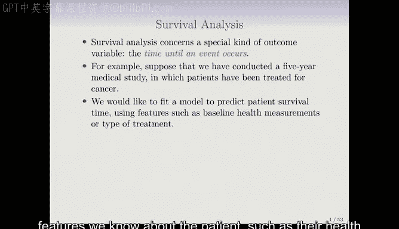
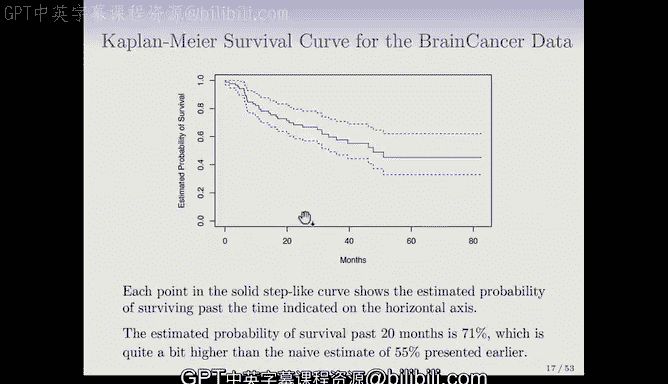

# R 版 79：生存数据与删失简介 📊

在本节课中，我们将学习生存分析的基础知识。生存分析是一种处理特殊类型结果变量的统计方法，该变量表示某个事件发生前所经历的时间。我们将重点介绍生存数据的特点、删失的概念，以及如何利用卡普兰-迈耶曲线来估计生存函数。

---

## 什么是生存分析？⏳

生存分析关注一种特殊的结果变量：即从某个起点到某个特定事件发生所经历的时间。例如，在一项为期五年的癌症治疗医学研究中，我们可能希望根据患者的健康指标或治疗类型等特征，来预测患者的生存时间。

这听起来像是一个回归问题，但存在一个重要复杂情况：研究中部分患者可能存活到了研究结束。对于这些患者，我们只知道他们的生存时间至少是研究时长，但不知道确切的生存时间。这种情况被称为**删失**。

如果删失比例很高（例如70%或80%），我们显然不希望丢弃这些数据。尽管信息不完整，但“患者至少存活了五年”这一事实本身也包含了关于患者及其特征的重要信息，我们需要有效利用这些信息。

---

## 生存分析的应用领域 🌍

生存分析虽然起源于医学领域，但其应用已扩展到其他任何存在删失结果的场景。

*   **客户流失分析**：一家公司希望建模预测客户取消订阅服务（即“流失”）的时间。在研究期内，并非所有客户都会流失。对于那些在研究期末仍未流失的客户，其“流失时间”就是删失的。准确预测哪些客户可能流失，公司可以采取干预措施（如提供特别优惠）来挽留客户。

---

## 生存数据的基本构成与符号 📝

对于每个个体（可以是人或其他观察单位），我们假设存在两个潜在时间：

1.  **真实事件时间 (T)**：感兴趣事件（如死亡、设备故障、客户流失）发生的时间。
2.  **真实删失时间 (C)**：个体被删失的时间（例如，退出研究、研究结束）。

我们实际观测到的是这两个时间中的较小值，记为 **Y**：
`Y = min(T, C)`

此外，我们还需要一个指示变量 **Δ** 来标记观测结果的性质：
`Δ = 1 if T ≤ C (观测到事件)`
`Δ = 0 if T > C (观测到删失)`

因此，我们的训练数据通常由 **n** 对 `(Y_i, Δ_i)` 组成。

**图示说明**：假设有四位患者。实心圆点代表事件（死亡）发生。患者1和患者3在研究中死亡。患者2在研究结束时尚存活（研究结束导致的删失）。患者4在死亡前因故退出了研究（退出导致的删失）。后两者都属于删失观测。

---

## 理解删失与潜在偏差 ⚠️

我们必须考虑删失的性质，因为它可能导致分析出现偏差。

假设一项癌症研究中，许多病情严重的患者因为身体不适而提前退出研究。如果我们不考虑他们退出的原因，简单地将他们视为常规删失，就会高估整体生存时间，因为这些本可能早期死亡的患者没有被计入死亡事件。

同样，在比较男性和女性的生存情况时，如果病情严重的男性更倾向于退出研究，我们可能会错误地得出男性生存时间更长的结论，而这种“优势”实际上是由删失偏差造成的。

**如何处理？** 通常，我们需要做一个关键假设：在给定观测到的特征条件下，个体的真实事件时间 **T** 与删失时间 **C** 是独立的。这意味着，已知患者的各项特征后，其生存时间长短不影响其被删失的可能性。上述例子违背了这个假设，因为“病情更重”同时影响了“生存时间短”和“提前退出”的可能性。

这个假设至关重要，但通常无法仅通过数据来严格检验。研究者需要与实验设计者深入沟通，了解删失发生的具体原因，从而评估该假设的合理性。

---

## 生存函数与卡普兰-迈耶估计 📉

面对生存数据，一个基本的汇总工具是**生存函数 S(t)**。它表示个体生存时间超过某个特定时间点 t 的概率：
`S(t) = P(T > t)`

生存函数是时间 t 的递减函数，因为随着时间推移，存活超过该时间的概率自然会下降。

**一个直接但有问题的方法**：以脑癌数据集为例，假设我们想估计存活超过20个月的概率。一个朴素的想法是计算存活超过20个月的病人比例。在88名患者中，有48人存活超过20个月，比例约为55%。但这是有问题的，因为在40名未存活超过20个月的患者中，有17人是在20个月前被删失的。朴素方法将删失者全部视为死亡，这很可能低估了真实的生存概率。

**卡普兰-迈耶估计量**提供了一种更聪明、无偏的方法来处理删失数据。其核心思想是计算一系列条件概率：

1.  将事件发生时间从小到大排序。
2.  在每个事件发生的时间点，计算“在存活到该时间点的条件下，在该时间点之后仍存活的概率”。
3.  将这些条件概率连续相乘，得到超过任意时间点 t 的生存概率估计。

**简单示例**：假设有5名患者，事件时间（死亡）依次为 Y1, Y3, Y5，中间有删失。
*   在时间 Y1，5名患者中有4人存活超过此点，条件生存概率为 4/5。
*   在时间 Y3，此时仍有3名患者处于风险中（删失者已退出风险集），其中2人存活超过Y3，条件生存概率为 2/3。
*   因此，存活超过 Y3 的总概率估计为 (4/5) * (2/3)。
*   在最后一个事件时间 Y5，所有处于风险中的患者均未存活超过该点，最终生存概率降至0。

这种方法巧妙地利用了删失数据：只要个体在某个时间点仍处于研究中，他们就会贡献到该时间点的风险集（分母）中。一旦被删失，则不再参与后续计算。

**回到脑癌数据**：使用卡普兰-迈耶方法估计的20个月生存概率为71%，显著高于之前朴素方法得到的55%。下图展示了基于该数据估计的卡普兰-迈耶曲线，它是一个阶梯函数，每次下降对应一个观测到的事件发生，并附有基于格林伍德公式计算的标准误。

---

## 总结 🎯

本节课我们一起学习了生存分析的基础概念。我们了解到生存数据的特点是响应变量为事件发生时间，并且常常存在删失。我们介绍了表示生存数据的基本符号 `(Y, Δ)`，并讨论了删失可能带来的偏差及其处理假设。最后，我们重点学习了**卡普兰-迈耶估计量**，这是一种利用条件概率乘积来无偏估计生存函数的非参数方法，是生存分析中最基础和重要的工具之一。在下一节中，我们将学习如何比较不同组的生存曲线。