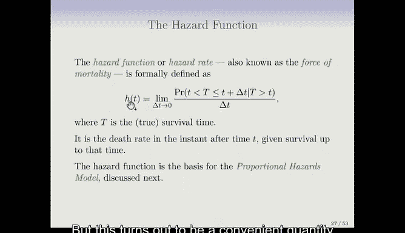
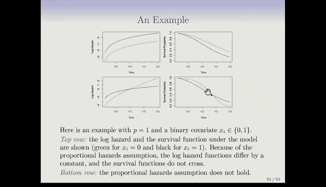

# R 版 80：比例风险模型 📊

在本节课中，我们将学习生存分析中的核心回归模型——比例风险模型。我们将从回顾两样本比较的Log-rank检验开始，逐步过渡到如何利用协变量对生存时间进行建模。

---

## 从两样本比较到回归分析

上一节我们介绍了如何用Kaplan-Meier曲线描述单样本生存数据。本节中我们来看看如何比较两个样本组的生存情况，并最终引入能够处理多个预测变量的回归模型。

对于两样本比较，我们很自然地会想到t检验。但由于生存数据中存在删失，t检验并不适用。为了克服这一挑战，我们采用Log-rank检验。

Log-rank检验的结构与Kaplan-Meier估计类似，它是在所有死亡时间点上进行汇总。

### Log-rank检验的构造

以下是Log-rank检验的基本步骤：

1.  首先，列出所有独特的死亡时间点 \(d_1, d_2, ..., d_k\)。
2.  对于每个时间点 \(d_k\)，我们关注一张列联表：
    *   \(R_k\)：在时间 \(d_k\) 处于风险集中的总人数。
    *   \(Q_k\)：在时间 \(d_k\) 死亡的总人数。
    *   将上述数字按组别（例如男性和女性）拆分：\(R_{1k}, R_{2k}\) 和 \(Q_{1k}, Q_{2k}\)。
3.  检验的思想是：如果两组的生存率相同，那么每组在时间 \(d_k\) 的期望死亡人数应与其风险人数成比例。

检验统计量 \(W\) 的构造思想如下：
我们计算第一组在所有死亡时间点的实际死亡总数，减去在零假设（两组生存相同）下的期望死亡总数，再除以其标准差。

公式化的表示为：
\[
W = \frac{\sum_{k} (Q_{1k} - E_{1k})}{\sqrt{\sum_{k} V_{1k}}}
\]
其中，\(E_{1k} = Q_k \times \frac{R_{1k}}{R_k}\) 是期望死亡数，\(V_{1k}\) 是其方差（具体公式见教材）。

在大样本下，\(W\) 近似服从标准正态分布 \(N(0,1)\)。我们可以据此计算p值，判断观察到的差异是否显著。

### 应用于脑癌数据

在脑癌数据中，我们比较男性和女性的生存曲线。Log-rank检验给出的统计量 \(W = 1.2\)，对应的双侧p值为 0.2。p值较大，因此我们不能拒绝“两组生存无差异”的零假设。

需要注意的是，生存分析的有效样本量更接近**事件（死亡）数**，而非总人数。本例总患者88人，但死亡事件仅30余例，分到两组后更少，这可能导致检验效力不足，难以检测出真实存在的差异。

Log-rank检验与我们将要讨论的Cox比例风险模型密切相关。

---

## 引入回归：比例风险模型

我们已经了解了单样本（Kaplan-Meier）和两样本（Log-rank）的分析方法，现在我们将上升到更一般、更常见的场景——回归分析，即研究多个预测变量如何影响生存时间。

由于删失的存在，我们不能简单地用生存时间 \(Y\) 或其对数对特征 \(X\) 做线性回归。我们将采用一种与Kaplan-Meier和Log-rank相似的思路：将生存视为一个随时间展开的过程，并逐时间点进行建模。

### 风险函数

在介绍模型前，需要理解一个新概念：**风险函数**，也称为死亡力。

风险函数 \(h(t)\) 的定义是：在存活到时间 \(t\) 的条件下，在接下来瞬间死亡的概率。
\[
h(t) = \lim_{\Delta t \to 0} \frac{P(t \leq T < t + \Delta t | T \geq t)}{\Delta t}
\]
这是一个理论量。如果已知生存分布，可以计算出风险函数。风险函数与生存函数之间存在一一对应的关系，但风险函数的形式对于接下来要介绍的模型更为便利。

### Cox比例风险模型

该模型由David Cox在1972年提出，已成为生存分析中最著名的回归模型。

模型假设，对于具有特征向量 \(X_i = (X_{i1}, X_{i2}, ..., X_{ip})\) 的个体 \(i\)，其在时间 \(t\) 的风险函数为：
\[
h(t|X_i) = h_0(t) \cdot \exp(\beta_1 X_{i1} + \beta_2 X_{i2} + ... + \beta_p X_{ip})
\]

*   \(h_0(t)\)：**基准风险函数**，它是任意、未指定的，表示所有特征 \(X\) 都为0时的风险。
*   \(\exp(...)\)：这部分保证了风险始终为正数。
*   \(\beta_j\)：特征 \(X_j\) 的系数，需要从数据中估计。

模型的核心思想是：每个个体的风险都是同一个基准风险 \(h_0(t)\) 乘以一个因子。这个因子取决于个体的特征，并使其风险按比例增加或减少。

**比例风险**的含义：对于任意两个个体，他们的风险之比在所有时间点上都是常数。例如，个体A与个体B的风险比是 \(\exp(\beta^T (X_A - X_B))\)，不随时间 \(t\) 改变。

这个模型的优势在于它对基准风险函数 \(h_0(t)\) 的形式没有任何假设（非参数部分），这使得模型非常灵活，能适应多种情况。它只假设特征以乘积因子的形式影响风险（参数部分），因此被称为**半参数模型**。

### 比例风险的图示与假设

假设一个最简单的二分类协变量情况（如治疗组 vs 对照组）。

*   **满足比例风险**：在对数风险图上，两条线是平行的，差距恒定；对应的生存曲线不会交叉。
*   **不满足比例风险**：风险函数会交叉（例如一组早期风险低，后期风险高），导致生存曲线也发生交叉。标准的Cox模型无法刻画这种情况。

比例风险假设通常是一个合理且有效的起点。在实际应用中，存在方法可以检验这一假设是否成立。

---

## 总结

本节课中我们一起学习了生存分析中从比较到回归的关键方法。

1.  我们首先学习了**Log-rank检验**，用于比较两个组的生存曲线，它通过汇总所有死亡时间点的信息来处理删失数据。
2.  接着，我们引入了**Cox比例风险模型**，这是生存回归分析的基石。该模型将个体的风险表达为一个非参数的基准风险函数和一个与特征相关的指数因子的乘积。
3.  模型的核心假设是**比例风险**，即不同个体间的风险比不随时间变化，这通常体现为生存曲线不相交。

这个半参数模型因其灵活性和稳健性，在实践中得到了极其广泛的应用。