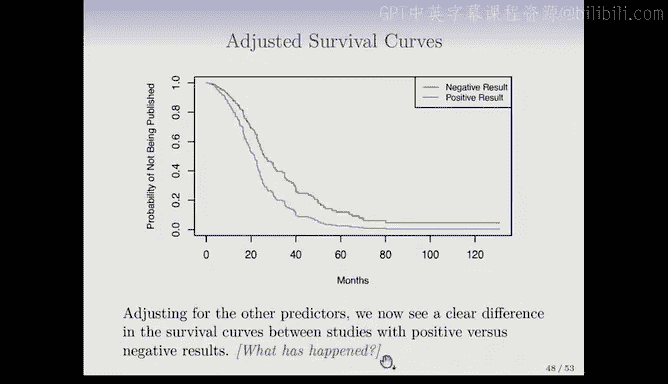

# R 版 81：Cox比例风险模型的估计与实例 📊


在本节课中，我们将学习如何估计Cox比例风险模型中的系数β，理解部分似然估计的核心思想，并通过实例分析掌握模型的应用与解读。

---

## 模型估计的核心问题

上一节我们介绍了Cox比例风险模型的基本形式。本节中我们来看看如何估计模型中的权重系数β。

假设我们已经有了模型，那么如何估计系数β呢？这是我们需要解决的问题。


## Cox的巧妙构思：部分似然估计

Cox提出了一个非常巧妙的构思，即部分似然估计。其精妙之处在于，我们无需指定基线风险函数 `h0(t)`。我们之前一直将其描述为“未指定”的，这意味着我们不必具体定义它，但仍然可以获得系数β的良好估计。

我们将采用与构建Kaplan-Meier曲线和对数秩检验相同的时间顺序逻辑。

在给定时间 `Yi`，所有在该时间点处于风险中个体的总风险，就是他们各自风险的总和。公式如下：

```
总风险 = Σ (所有在时间Yi仍处于风险中的个体的风险)
```

假设我们观察在某个时间点实际发生事件的个体，并将其风险与所有处于风险中的个体的总风险进行比较。可以想象，在给定时间点，我们有一个装有彩色球的袋子。以某种概率，我们抓取其中一个球，这个球就代表了发生事件的个体。但我们本可能抓到其他任何一个球。这就是此处的情况：所有处于风险中的个体都可能发生事件。

以下是他们的总风险。而这里是在该时间点我们实际观察到发生事件的个体，这是他的风险。问题是：实际发生事件的个体，其死亡概率是多少？分子是他的风险，分母是所有可能风险的总和。具体来说，这是在模型下，观察到实际发生事件的个体，在所有可能发生事件的个体中死亡的概率。

非常巧妙的是，由于是相对风险，基线风险 `h0(t)` 被约去了，我们得到了一个不依赖于 `h0` 的函数。因此，无论 `h0(t)` 是什么，我们都不必关心。我们得到的是这个相对风险。这是在模型下，观察到实际发生事件的个体死亡的概率。

注意这里的约分过程。现在，就像我们构建Kaplan-Meier曲线时对条件概率取乘积一样，我们对这些概率取乘积。我们为每个事件时间点推导出一个概率，现在对所有这些概率取乘积。

请记住，任何似然函数，如果样本是独立的，就是每个观测样本概率的乘积。这里也是同样的道理，只不过这是部分似然。在某种意义上，这是在模型下观察到我们所观测数据的概率，这就是似然性。

然后，我们将寻找使这个似然性最大的参数值β。即使观测数据在模型下出现的可能性最高。这就是最大似然估计的核心思想。

## 实例解析

以下是一个与之前相同的例子。我们有三个失效事件（用金色圆圈表示）和一些删失观测。

对于三个失效事件中的每一个，我们计算其相对风险函数，就像之前看到的那样，但只在死亡时间点计算。删失观测也会出现在后续死亡时间点的分母中，你可以在这里看到它们。

对于第一个失效事件，我们计算其关于β的相对风险函数。第二个和第三个失效事件同理。然后我们取它们的乘积。这就是部分似然。它只是系数β的函数，β是我们的特征权重构成的P维向量。现在，我们通过最大化这个函数来求解β。

与逻辑回归等许多我们见过的模型情况类似，这里没有封闭形式的解。因此，我们必须应用迭代算法，但这在现代软件中已不是问题，可以非常容易地完成。

我们不仅得到了所谓的最大部分似然估计，还获得了我们在最小二乘回归和逻辑回归中见过的其他有用结果。例如，我们可以得到用于检验如 `βj = 0` 这类原假设的P值。我们通常想知道一个特征是否重要，是否对患者的风险有贡献。同样，我们也可以得到标准误和置信区间。因此，我们在ANOVA和回归中见过的所有有用工具，在这里通过部分似然估计也能获得。

## 与对数秩检验的联系

我们已经掌握了回归方法，也见过对数秩检验。请记住，在回归中，我们检验系数是否为零。在预测变量仅为单个0/1变量的情况下，我们得到的结果等价于t检验。在线性模型中，如果只有一个预测变量，比如表示男/女的0/1变量，检验其系数就等价于进行两样本t检验。如果它们不等价，我们会感到不安，因为这是检验同一事物的两种合理方式。但在回归中，它们确实一致。

事实证明，同样的情况也发生在这里。当我们有一个只取两个值的单一预测变量时，我们既可以拟合Cox比例风险模型，也可以执行对数秩检验。书中提到了一些细节：从Cox比例风险模型中提取检验统计量，实际上有两到三种不同的方法。其中一种流行的方法被称为得分检验。令人高兴的是，在单一二元协变量的情况下，Cox比例风险模型中检验β=0的得分检验，恰好等于对数秩检验。因此，就像线性模型中的t检验和回归检验结果一致一样，Cox比例风险模型的得分检验也与对数秩检验完全相同。这是一个简洁而美好的联系。

## 模型细节与注意事项

关于比例风险模型，你可能已经注意到模型中没有截距项。这是为什么呢？如果我们回顾模型，如果在这里加入截距项β0，我们会得到 `e^(β0)`，这个项可以被吸收到未指定的 `h0(t)` 中。因为 `h0(t)` 本来就是未指定的，我可以将任何不依赖于x的常数项从指数部分转移到基线风险函数中，而不会改变模型，并且在计算风险比时它也会被约去。因此，加入截距项没有意义，因为它不提供任何信息。

我们之前讨论过对数秩检验中可能出现的“结”问题，即当时间以离散单位（如月）测量时，可能在同一个时间点有多个失效事件发生，这被称为“结”失效时间。正如提到的，对数秩检验可以无缝处理这种情况，Cox模型也能处理，但稍微复杂一些。不过，在本课程末尾提到的软件中，这些细节已经被多年来聪明的研究者们解决了。

你可能会好奇为什么它被称为“部分似然”。事实证明，在某种意义上，它不是完整的似然。这又是一个更技术性的话题，但由于其构建方式涉及未指定的 `h0(t)`，它非常方便，但不是所谓的完全最大似然，不过它是一个非常好的近似。如果你对这方面的理论基础更感兴趣，建议你阅读更多资料。

## 从模型获取生存曲线

我们一开始讨论了Kaplan-Meier生存曲线，以及生存函数作为生存数据的重要摘要。对于带有协变量的Cox模型，我们不仅对相对风险参数感兴趣，也对潜在的生存曲线感兴趣。现在，生存曲线是给定协变量X下关于时间t的函数 `S(t|X)`。我们想说，给定具有某些特征向量的个体（例如男性或女性，或具有特定临床测量的男性），其预测生存曲线是什么？你也可以从Cox模型中获得这个，即作为其特征函数的整个预测生存曲线。这与回归有些不同，通常在回归中，我们只估计给定X时响应的均值。而在这里，我们得到了整个分布的估计。

## 实例应用：脑癌数据

现在让我们看看比例风险模型应用于脑癌数据的情况。这里你会得到一个类似ANOVA的表格，列出了特征、系数、标准误、Z统计量（即系数与标准误的比值）以及双侧P值。同样，这是一个多元模型，类似于我们在回归中见过的多元模型，所有特征被一起拟合。在这个例子中，Karnofsky指数是显著的特征之一，实际上并非唯一，诊断结果（高级别胶质瘤）也非常显著。这正是Cox比例风险模型的杰出之处，因为它将这个包含删失等复杂问题，转化成了一个带有所有常规统计量的回归问题，使其非常易于使用。这也是它广受欢迎的部分原因。

关于系数的解释，需要依据相对风险。以Karnofsky指数为例，其系数β为-0.5，意味着相对风险是 `exp(-0.5) ≈ 0.95`。这表明，Karnofsky指数每增加一个单位，相对风险降低约5%。这里需要注意系数的符号及其解释。在这个例子中，系数是负的，你通常可能认为这是坏事，但因为建模的是相对风险，这里的负值是好的，因为它意味着相对风险在降低。这是一个需要牢记的重要细节。表格中报告了P值，这里被截断了，但实际值是0.0027。

## 另一个实例：论文发表数据

另一个例子是章节中提到的论文发表数据集。该数据集记录了NIH报告的临床试验结果论文的发表时间（以月为单位）。共有244项试验，其中88项在研究期间完全未发表，因此是删失的。其余已发表或尚未发表（删失）。结局变量是直到发表的时间。这里有很多协变量，不一一详述，但一个特别感兴趣的变量是：临床试验结果是否显著阳性是否会使其更早发表？这是有些人相信的观点，因此该研究旨在观察临床试验的阳性结果是否会增加其更快发表的机会。研究者希望调整许多可能的混杂因素。

以下是两组（阳性结果 vs. 阴性结果）的Kaplan-Meier曲线，此时忽略其他特征。仅看曲线，似乎没有太大差异。果然，对数秩检验的P值为0.36。这里的“阴性/阳性结果”指的是临床试验报告的治疗比较结果是阴性还是阳性。看起来，忽略所有其他特征时，差异不大。

但是，当我们使用Cox比例风险模型进行多变量分析时，情况发生了变化。在这里，阳性结果的P值非常显著。期刊的影响因子也很重要，其他一些变量也 marginally 重要。那么，这里发生了什么？为什么生存曲线如此相似，但Cox模型中的阳性结果却强烈显著？这一定是由于混杂因素造成的。这里存在一些我们需要调整的混杂因素，这正是进行此类多变量分析以调整其他混杂因素的原因。现在，调整后的效果非常显著，表明阳性结果对缩短发表时间有强烈的正面影响。

## 绘制调整后的生存曲线

我们可以利用这个多变量模型更进一步，生成调整后的生存曲线。我们想要的是给定协变量X的生存曲线 `S(t|X)`，即估计的生存曲线。对于阳性和阴性结果，我们希望调整其他特征的影响。当我们最初绘制那两条曲线时，我们只是对其他特征进行了平均。阳性结果组和阴性结果组，只是对所有特征取平均。如果这些特征在两组的分布不同，就会产生混杂。现在，当我们观察两条曲线时，我们要确保两组的特征设置相同。这意味着我们必须为那些其他特征选择某个值。我们可以使用任何值，但最合理的是使用均值。因此，对于连续预测变量，我们使用其均值；对于分类预测变量（如资助机制），我们使用最常见的类别（R01）。通过将特征设置为某个固定值，我们现在可以在阳性和阴性结果之间进行清晰的比较。观察调整后的曲线，我们现在看到了生存曲线之间的明显差异。发生了什么？你已经回答了这个问题，是混杂因素被调整了。



---

## 总结


本节课中，我们一起学习了Cox比例风险模型的估计方法。我们深入探讨了部分似然估计的核心思想，它巧妙地避免了指定基线风险函数。我们通过实例了解了模型的应用、系数的解读、与对数秩检验的联系，以及如何通过调整协变量来获得更准确的生存曲线比较。掌握这些内容，将使你能够利用Cox模型处理复杂的生存数据分析问题。