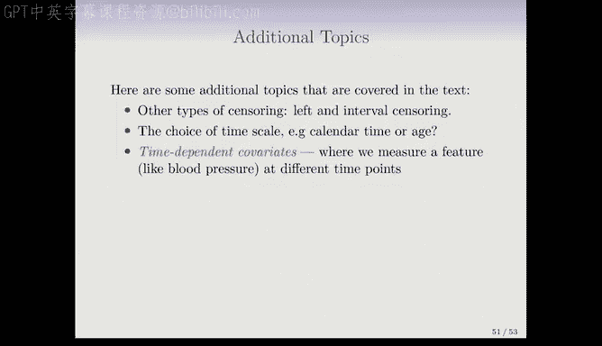
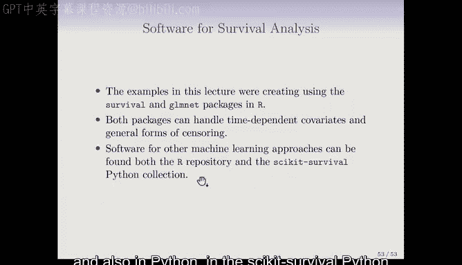

# R 版 82：模型评估与进阶主题 🎯

## 概述

在本节课中，我们将学习生存分析中模型评估的核心方法——C指数，并简要介绍生存分析中的其他进阶主题，包括不同类型的删失、时间尺度选择、时间依赖性协变量、比例风险假设检验，以及用于生存分析的其他机器学习方法和软件工具。

---

## C指数：生存分析的AUC 📊

上一节我们介绍了生存分析中的Cox比例风险模型。本节中我们来看看如何评估这类模型的预测性能。

在分类问题中，我们常用**AUC**（曲线下面积）来衡量分类器的准确性。对于生存分析，存在一个与之类似的指标，称为**C指数**（或一致性指数）。这是一种评估Cox模型（或其他生存模型）在测试集上拟合效果的吸引人的方法。

以下是计算C指数的步骤：
1.  使用训练好的Cox模型为测试集中的每个个体计算估计的风险评分。
2.  考虑所有可以比较的个体对（即能够确定谁的事件发生得更早的个体对）。
3.  计算在这些可比较的个体对中，模型正确预测生存时间相对顺序的比例。

其核心思想是：对于一对个体，如果个体A的实际生存时间长于个体B，那么一个“好”的模型应该预测个体A的风险评分低于个体B。C指数衡量了模型做出这种正确排序的能力。

用公式可以表示为：
`C-index = (满足条件的正确排序对数量) / (所有可比较的个体对数量)`
其中“条件”指：对于实际生存时间 `Y_i > Y_j` 的个体对，模型预测的风险评分满足 `risk_score_j > risk_score_i`。

在之前的出版物数据示例中，计算出的C指数约为0.773。这可以粗略地解释为：对于任意两篇论文，该模型能以约77.3%的准确率预测哪一篇会先被发表。这个解释方式与分类问题中AUC的解释非常相似。

---

## 生存分析中的其他进阶主题 🔍

我们已经深入探讨了Cox比例风险模型及其评估。接下来，我们将简要介绍生存分析领域的一些其他重要概念和扩展，这些内容在教材中也有涉及。

### 删失类型

我们之前讨论的删失主要是**右删失**，即研究结束时个体的确切生存时间未知。实际上，还存在其他类型的删失：
*   **左删失**：个体在研究开始前已经历了事件。
*   **区间删失**：我们只知道事件发生在某个时间区间内，而非确切时间点。
值得注意的是，我们讨论过的生存曲线、对数秩检验和Cox模型都可以处理这些不同类型的删失。

### 时间尺度选择

通常，生存分析使用日历时间作为时间尺度。但在某些研究中，根据研究问题，选择其他时间尺度可能更有意义。例如，在研究年龄对生存的影响时，可能会选择以年龄作为时间尺度。

### 时间依赖性协变量

在大多数回归模型中，协变量（特征）在个体层面是固定不变的。然而，在长期的生存研究中，我们可能会随时间多次测量某些指标（如血压、体重）。Cox模型的一个强大特性是能够纳入这种**时间依赖性协变量**。其原理是，随着时间推移，个体在不同风险集出现时，可以使用其在该时间点的最新协变量值。这使得模型能够捕捉协变量随时间变化对风险的影响。

### 比例风险假设检验

Cox模型的核心假设之一是**比例风险假设**，即不同个体或组别的风险比随时间保持恒定。检查这一假设是否成立非常重要。如果违背该假设，则需要考虑使用其他模型或对Cox模型进行扩展。

### 其他机器学习方法

本课程主要介绍了Cox比例风险模型，它是生存分析的线性回归类比。然而，课程中讨论的其他机器学习方法也有对应的生存分析版本：
*   **随机森林**
*   **提升方法**
*   **神经网络**
这些方法中的一些可以避免比例风险假设，目前正变得越来越流行，并处于持续发展中。

### 软件工具

本课程章节中的所有示例均使用R语言完成，主要依赖以下软件包：
*   **`survival`包**：由Terry Therneau开发，是R中进行生存分析的核心包，可处理右删失、左删失、区间删失以及时间依赖性协变量等。
*   **`glmnet`包**：用于拟合带正则化的Cox模型。
当然，在其他编程语言中也有相应的生存分析工具，例如Python中的`scikit-survival`库。

---

## 总结

本节课我们一起学习了生存分析中模型评估的关键指标——C指数，它类似于分类问题中的AUC，用于衡量模型预测生存时间顺序的能力。此外，我们还概览了生存分析的多个进阶主题，包括不同类型的删失数据、时间尺度选择、处理随时间变化的协变量、检验模型假设的重要性，以及将随机森林、神经网络等现代机器学习方法应用于生存数据的可能性。最后，我们介绍了实现这些分析的常用软件工具，如R中的`survival`和`glmnet`包。这些知识为进一步深入研究和应用生存分析奠定了坚实的基础。