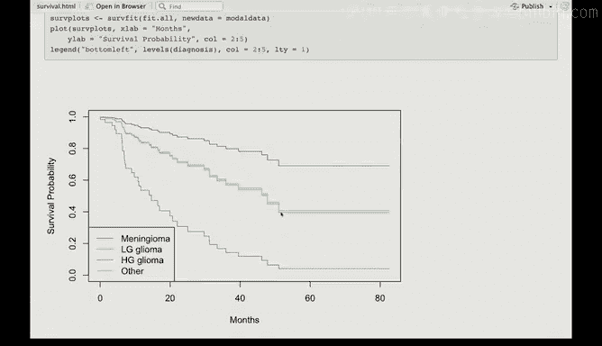

# R 版 83：生存曲线与脑癌数据 🧠📊


在本节课中，我们将学习如何使用R语言进行生存分析，具体以脑癌数据集为例。我们将绘制Kaplan-Meier生存曲线，进行对数秩检验，并拟合Cox比例风险模型。通过本教程，你将掌握生存分析的基本步骤和R语言实现。

---

## 数据概览

脑癌数据集包含88名脑癌患者的信息，记录了他们的生存时间、性别、诊断类别以及其他临床指标。我们的目标是分析这些因素如何影响患者的生存。

以下是数据集中的关键变量：
*   **`sex`**: 患者性别。
*   **`diagnosis`**: 脑癌的诊断类别。
*   **`status`**: 生存状态，`1`代表死亡（事件发生），`0`代表删失。
*   **`ki`**: Karnofsky指数（一种健康状况评分）。

数据集中，性别分布大致平衡（男性45人，女性43人）。在88名患者中，共有35例死亡事件。

**重要提示**：在生存分析中，必须正确指定状态变量。在本数据集中，`status = 1`表示死亡（事件发生），`status = 0`表示删失。

---

## 绘制Kaplan-Meier生存曲线

首先，我们为所有患者绘制整体的Kaplan-Meier生存曲线。Kaplan-Meier估计是一种非参数方法，用于估计生存函数。

我们使用 `survfit()` 函数，其响应变量需通过 `Surv()` 函数构建，格式为 `Surv(时间, 状态)`。

```r
library(survival)
# 拟合整体的生存曲线
fit_all <- survfit(Surv(time, status) ~ 1, data = brain)
# 绘制曲线，默认包含置信区间
plot(fit_all, xlab="时间（月）", ylab="生存概率", main="整体Kaplan-Meier生存曲线")
```

接下来，我们按性别分层绘制生存曲线，以直观比较男性和女性的生存差异。

```r
# 按性别分层拟合生存曲线
fit_sex <- survfit(Surv(time, status) ~ sex, data = brain)
# 绘制分层曲线，并添加图例
plot(fit_sex, col=c("blue", "red"), xlab="时间（月）", ylab="生存概率", main="按性别分层的生存曲线")
legend("topright", legend=c("男性", "女性"), col=c("blue", "red"), lty=1)
```

从图中观察，男性在约40个月后的生存概率似乎低于女性，但这种差异可能由随机变异导致。我们需要进行统计检验。

---

## 对数秩检验

为了检验男性和女性的生存时间是否存在统计学上的显著差异，我们进行对数秩检验。这可以通过 `survdiff()` 函数实现。

```r
# 执行对数秩检验
logrank_test <- survdiff(Surv(time, status) ~ sex, data = brain)
print(logrank_test)
```

检验结果显示P值约为0.23，大于常用的显著性水平（如0.05）。因此，**我们没有足够证据拒绝原假设，即男性和女性的生存分布没有显著差异**。

需要注意的是，虽然总样本量为88，但实际提供信息的是事件数（35例死亡）。因此，有效样本量小于88，这可能是P值不显著的原因之一。

---

## 拟合Cox比例风险模型

上一节我们进行了简单的组间比较，本节我们将使用Cox比例风险模型来量化多个预测变量对生存风险的影响。首先，我们仅纳入性别变量。

Cox模型的基本形式为：**h(t|X) = h₀(t) * exp(βX)**，其中 `h₀(t)` 是基线风险函数，`β` 是系数。

```r
# 仅以性别为预测变量拟合Cox模型
cox_fit_sex <- coxph(Surv(time, status) ~ sex, data = brain)
summary(cox_fit_sex)
```

模型摘要中，性别变量的P值同样约为0.23，与对数秩检验结果一致。Cox模型中的得分检验（score test）等价于对数秩检验。

**系数解释**：在Cox模型中，一个正系数（`β > 0`）意味着该预测变量值增加会**提高风险**（缩短生存期）；负系数（`β < 0`）则意味着**降低风险**（延长生存期）。风险比（Hazard Ratio, HR）为 `exp(β)`。

---

## 纳入更多预测变量

现在，我们在模型中纳入所有可用的预测变量，包括性别、诊断类别和其他临床指标，以评估在控制其他因素后，每个变量的独立影响。

```r
# 包含所有预测变量的Cox模型
cox_fit_full <- coxph(Surv(time, status) ~ sex + diagnosis + ki, data = brain)
summary(cox_fit_full)
```

以下是模型结果的关键解读：
*   **`diagnosis`**: 诊断类别是一个多分类变量。以“Menin Glioma”为参照组，其他类别的系数均为正且显著（例如“HG Glioma”），表明这些类别的患者死亡风险显著高于参照组。
*   **`ki`**: Karnofsky指数的系数为负且显著，表明该指数越高（健康状况越好），死亡风险越低。
*   **`sex`**: 在调整了诊断和KI指数后，性别的效应不再显著。

**重要提醒**：这些P值表示在**保持模型中其他所有变量不变**的情况下，该变量是否具有显著影响。如果变量之间存在相关性，某些变量可能因为其他变量的存在而显得不显著。

---

## 绘制调整后的生存曲线

最后，我们希望在调整了其他预测变量（如性别、KI指数）的情况下，可视化不同诊断类别患者的生存曲线。由于Cox模型输出的生存曲线依赖于所有预测变量的取值，我们需要为其他变量设定典型值（例如，分类变量取众数，连续变量取均值）。

```r
# 创建新数据框，设定诊断类别不同，其他变量为典型值
new_data <- with(brain,
                 data.frame(
                   diagnosis = levels(diagnosis), # 所有诊断类别
                   sex = rep("Male", 4), # 设定性别为众数‘Male’
                   ki = rep(mean(ki, na.rm=TRUE), 4) # 设定KI为均值
                 ))

# 基于完整模型和设定值，预测生存曲线
fit_adj <- survfit(cox_fit_full, newdata = new_data)
# 绘制调整后的生存曲线
plot(fit_adj, col=1:4, xlab="时间（月）", ylab="生存概率", main="按诊断类别调整后的生存曲线")
legend("topright", legend=levels(brain$diagnosis), col=1:4, lty=1)
```

调整后的曲线清晰地显示：
*   “Menin Glioma”患者生存预后最好。
*   “HG Glioma”患者生存预后最差，这与模型中其最高的风险比相对应。
*   其他两个诊断类别的生存曲线非常接近。

---

## 总结

本节课中，我们一起学习了生存分析在脑癌数据上的应用。我们掌握了以下核心技能：
1.  使用 `survfit()` 和 `plot()` 绘制**Kaplan-Meier生存曲线**。
2.  使用 `survdiff()` 进行**对数秩检验**，比较组间生存差异。
3.  使用 `coxph()` 拟合**Cox比例风险模型**，以评估多个因素对生存风险的联合影响。
4.  理解Cox模型系数的含义：**`exp(系数)` 即为风险比（HR）**。
5.  在调整其他协变量后，使用 `survfit()` 和设定典型值的方法，绘制**特定预测变量的调整后生存曲线**。



通过本案例，你已初步具备使用R语言进行基本生存分析的能力。