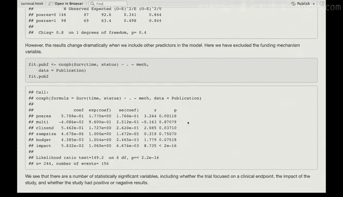

# R 版 84：Cox比例风险模型 I（出版物数据）📊

在本节课中，我们将学习如何应用Cox比例风险模型分析一项关于临床试验论文发表时间的研究数据。我们将探讨研究结果（积极或消极）是否会影响论文的发表速度，并了解在统计模型中控制其他变量（混杂因素）的重要性。

## 数据集介绍

接下来要分析的数据是出版物数据。Rob，你能介绍一下这个数据集吗？

这个数据集关注的是临床试验中描述的论文发表情况。

研究的结局变量是“直到发表的时间”。一个特别受关注的点是，研究（或试验）的结果是积极的还是消极的，这是否会导致发表速度的差异。人们可能会认为存在这种关联。

或者说，是否会影响最终能否发表。是的，“直到发表的时间”指的是从研究完成到论文发表的长度时间，我们关心它是否与试验结果的积极性相关。

关于数据中的删失：如果一个观测的时间是删失的，这意味着论文从未发表。或者，也可能是在数据收集结束时，研究已经结束但论文仍未发表。

这引出了医学领域临床试验和论文发表中可能存在的偏倚问题。这项研究正是试图检验是否存在这种偏倚。

## 数据准备与初步分析

数据的格式与我们之前处理过的类似。我们有两个关键变量：`time`（时间）和`status`（状态）。

在这个案例中，状态变量表示论文是否被发表。发表被视为一个积极的结果。

预测变量是研究结果是积极还是消极，这是一个二分类预测因子。

我们首先根据结果的“消极”或“积极”进行分层，绘制了**Kaplan-Meier生存曲线**。

从曲线来看，两条线非常接近。但在图表底部可以看到，如果结果是消极的，论文倾向于在更长的时间内不被发表（或永远不发表）。而结果积极的论文，似乎发表得稍快一些。

当然，其中也有一些论文等待了很长时间。中位时间大约在两年左右。这对于医学领域来说是一段非常长的时间。

## 应用Cox比例风险模型

现在，我们将使用**Cox比例风险模型**来拟合相同的数据。

我们进行了一项检验。这里我们没有使用对数秩检验，而是直接使用Cox模型来检验这个二分类变量（结果积极性）的显著性。

我们看到P值并不显著。因此，实际上，发表时间的差异在统计上并不显著。对数秩检验也会得出类似的结论。

随后我们也进行了对数秩检验，结果一致。

## 引入其他预测变量

上一节我们单独检验了结果积极性的影响。本节中，我们来看看当在模型中引入其他预测变量时会发生什么。

我们将把所有其他预测变量放入模型，除了“资助机制”这个变量。为什么把它排除在外？在教材的实际实验部分，我记得两种方式都尝试过。但在这里，我们选择不包含它。

以下是引入其他变量后模型的结果。我们看到有几个变量变得显著了。

*   **期刊影响力因子**：这是一个连续变量，衡量期刊的影响力，结果是显著的。
*   **临床终点**：这是一个指示研究是否使用临床终点的二分类变量，也是显著的。
*   **研究结果（积极/消极）**：有趣的是，在控制了其他变量后，这个变量现在也变得显著了。

这种情况经常发生：数据中常常存在混杂和掩盖效应。当你引入其他相关因素后，某个预测变量的真实效应强度反而可能显现出来。这正是本例中发生的情况。

最终，我们得到了几个重要的预测因子，它们能预测试验论文的发表时间：
1.  研究是否聚焦于临床终点。
2.  研究本身的影响力（注意，这里是研究的影响力，而非期刊的影响力因子）。
3.  研究结果是积极还是消极。

---

本节课中，我们一起学习了如何用Cox比例风险模型分析临床试验论文的发表数据。我们了解到，单独看“结果积极性”对发表时间的影响并不显著，但当在模型中纳入“期刊影响力”和“是否使用临床终点”等其他变量后，“结果积极性”的效应变得显著。这说明了在统计分析中考虑和控制潜在混杂因素的重要性，否则可能无法揭示变量间真实的关联。