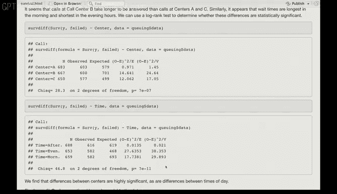

# R 版 85：Cox 模型 II - 呼叫中心数据分析 📞


在本节课中，我们将学习如何将 Cox 比例风险模型应用于一个模拟的呼叫中心数据集。我们将分析客户等待接通客服的时间，并探讨不同因素（如客服人员数量、呼叫中心和时间段）如何影响等待时间。

---

## 数据概述与模拟生成

我们使用的数据集是模拟生成的，旨在研究客户在拨打求助热线后，愿意等待客服接听电话的时长。响应变量是电话被接听前的等待时间，如果客户在电话被接听前挂断，则该数据会被**删失**。特征变量包括呼叫时**可用的客服人员数量**、**一天中的时间段**（上午、下午、晚上）以及**呼叫中心**（A、B、C 三个中心）。

以下是生成模拟数据的核心代码和步骤。我们首先设置样本量 `n=2000`，并随机生成特征变量：

```r
# 设置样本量
n <- 2000

# 生成特征变量
operators <- sample(5:15, n, replace=TRUE) # 客服数量，范围5-15
center <- sample(c("A", "B", "C"), n, replace=TRUE) # 呼叫中心
time_of_day <- sample(c("Morning", "Afternoon", "Evening"), n, replace=TRUE) # 时间段
```

接着，我们为模型设定真实的系数（`betas`），并定义一个风险函数。例如，`operators` 的系数为 0.04，这意味着每增加一名客服，电话被接通的**风险率**将增加 1.041 倍（即等待时间更短）。中心 B 的系数为 -0.3（以中心 A 为基线），意味着在中心 B 电话被接听的风险是中心 A 的 0.74 倍，即中心 B 的等待时间稍长。

我们使用 `coxed` 包中的 `serve.data` 函数，根据指定的最大可能等待时间（此处设为 1000 秒）、特征矩阵 `X`、真实系数 `betas` 和风险函数来生成最终的生存数据。

```r
library(coxed)
max_time <- 1000
# 生成数据
sim_data <- serve.data(max.time = max_time, x = X_matrix, beta = true_betas, hazard.fun = hazard_function)
```

生成的数据框包含事件时间 `y` 和事件指示变量 `failed`（`TRUE` 表示电话被接听，`FALSE` 表示客户在接听前挂断）。在本数据集中，约 90% 的电话被接听，10% 的观测被删失。

---

## 探索性生存分析

在拟合模型之前，我们先通过 Kaplan-Meier 生存曲线直观地查看不同分组下的生存情况。

上一节我们介绍了数据的生成过程，本节中我们来看看不同因素下的生存曲线差异。以下是按呼叫中心分层的生存曲线：


从图中看，三个中心的生存曲线差异似乎不大。同样，我们也可以绘制按时间段分层的生存曲线。

为了从统计上检验这些差异是否显著，我们进行对数秩检验。尽管从图形上看差异不明显，但由于数据集较大（2000个样本），检验结果显示**呼叫中心**和**时间段**的差异都具有统计学意义。这提醒我们，在大样本情况下，视觉上微小的差异也可能被检测为显著。

---

## 拟合 Cox 比例风险模型

现在，我们使用所有变量来拟合 Cox 比例风险模型，以量化各因素对等待时间的影响。

以下是拟合模型的核心代码：

```r
library(survival)
# 拟合 Cox 模型
cox_model <- coxph(Surv(y, failed) ~ operators + center + time_of_day, data = call_center_data)
summary(cox_model)
```

模型结果摘要显示：
*   **客服数量**：系数为正且显著，证实客服越多，等待时间越短。
*   **呼叫中心**：以中心 A 为基线，中心 B 的风险比显著更低（等待时间更长），而中心 C 与中心 A 无显著差异。
*   **时间段**：与下午（基线）相比，上午和晚上的等待时间有显著差异。



---

## 总结

本节课中，我们一起学习了如何将 Cox 比例风险模型应用于一个模拟的呼叫中心数据集。我们从数据模拟生成开始，经历了探索性生存分析（绘制 Kaplan-Meier 曲线和进行对数秩检验），最后拟合了多变量 Cox 模型来评估各因素对客户等待时间的影响。这个过程展示了生存分析在处理时间-事件数据，特别是包含删失数据时的标准工作流程和强大效用。