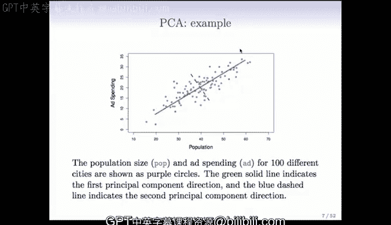

# R 版 86：主成分分析 📊


## 概述

在本节课中，我们将学习无监督学习的基本概念，并重点介绍其中一种核心方法：主成分分析。我们将了解其目标、计算方式以及在实际中的应用。

---

## 无监督学习简介

上一节我们回顾了监督学习的概念。本节中，我们来看看与之对应的无监督学习。

在监督学习中，我们拥有一个目标变量或标签，我们的任务是从训练数据的特征中预测这个标签。标签的存在“监督”了学习过程。

相比之下，无监督学习没有标签。我们只观察特征，目标是发现数据内部的结构或模式。例如，在没有被告知类别的情况下，将一组物体根据相似性进行分组。

因此，无监督学习的目标不如监督学习明确，但它在数据探索和特征理解方面至关重要。

---

## 无监督学习的目标与应用

无监督学习的目标较为宽泛，主要包括：
*   **发现观测值中的子群**：例如，将顾客根据购物行为分组。
*   **寻找数据的重要视图或特征**：例如，找出数据中变异最大的方向。

无监督学习正变得越来越重要，原因如下：
*   存在大量未标记数据（如图像、文本），获取标签成本高昂。
*   它有助于探索性数据分析，为后续监督学习做准备。

以下是几个应用示例：
*   **基因表达分析**：根据基因表达数据将乳腺癌患者分为不同亚型。
*   **市场细分**：根据浏览和购买历史对消费者进行分组。
*   **电影分类**：根据观众评分将电影分为不同类型（如惊悚片、爱情片）。

---

## 主成分分析介绍

现在，我们开始介绍第一种主要的无监督学习方法：主成分分析。

主成分分析是一种用于获取数据集低维表示的工具。它寻找变量（特征）的一系列线性组合，这些组合具有最大方差，并且彼此不相关。

第一个主成分是方差最大的线性组合。第二个主成分则是在与第一个主成分不相关的约束下，方差最大的线性组合，依此类推。

当变量众多且存在相关性时，主成分分析可以将其简化为少数几个能概括数据大部分信息的“汇总变量”。这既可用于数据可视化，也可作为监督学习前的特征预处理步骤。

---

## 主成分的定义与几何解释

假设我们有一组变量 **X₁, X₂, ..., Xₚ**。

**第一个主成分 Z₁** 定义为这些变量的一个线性组合：
**Z₁ = φ₁₁X₁ + φ₁₂X₂ + ... + φ₁ₚXₚ**

其中，权重 **φ₁₁, φ₁₂, ..., φ₁ₚ** 被称为**载荷**。载荷向量被约束为具有单位范数，即其平方和为1：
**φ₁₁² + φ₁₂² + ... + φ₁ₚ² = 1**

这个约束是为了防止通过无限增大权重来人为增加方差。在载荷向量的这个约束下，我们选择使 **Z₁** 的方差最大化的那一组载荷。

计算得到载荷后，每个观测值代入公式计算出的值称为该观测的**主成分得分**。

从几何上看，载荷向量定义了一个方向。将数据点投影到这个方向上，得到的投影坐标就是主成分得分。第一个主成分方向是数据方差最大的方向。

---

## 主成分的计算

以下是计算主成分的基本步骤：

1.  **数据标准化**：将每个特征变量中心化，使其均值为0。因为我们只关心方差，不关心均值。
    ```r
    # 假设 X 是 n x p 的数据矩阵
    X_centered <- scale(X, center = TRUE, scale = FALSE)
    ```

2.  **求解优化问题**：寻找载荷向量 **φ₁**，使得线性组合 **Z₁ = X φ₁** 的方差最大，同时满足 **||φ₁||² = 1**。这等价于求解：
    **max (φ₁ᵀ Xᵀ X φ₁) subject to φ₁ᵀ φ₁ = 1**

3.  **计算方法**：这个优化问题可以通过对中心化后的数据矩阵 **X** 进行**奇异值分解** 来高效解决。SVD将 **X** 分解为：
    **X = U D Vᵀ**
    其中，右奇异矩阵 **V** 的列就是我们需要的主成分载荷向量 **φ₁, φ₂, ...**。

4.  **得到成分与得分**：第一个主成分载荷是 **V** 的第一列。主成分得分则由下式计算：
    **Z = X V**
    **Z** 的第一列 **Z₁** 就是所有观测的第一个主成分得分。

---

## 总结

本节课中，我们一起学习了无监督学习的基本概念及其与监督学习的区别。我们深入探讨了主成分分析这一核心方法：

*   PCA 是一种降维和特征提取技术。
*   它通过寻找数据中方差最大的方向（主成分）来工作。
*   每个主成分是原始特征的线性组合，且各成分之间互不相关。
*   计算过程涉及数据中心化和奇异值分解。
*   PCA 的结果（载荷和得分）可用于数据可视化、噪声过滤或作为监督学习的输入特征。



理解主成分分析为处理高维数据和探索数据内在结构提供了强大的工具。