# R 版 87：高阶主成分分析 📊

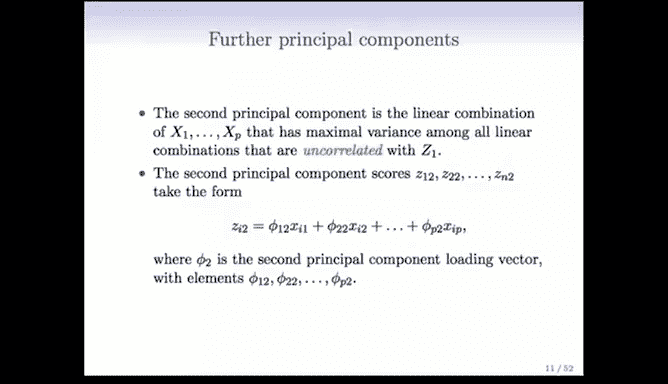

在本节课中，我们将学习如何计算高阶主成分，理解其数学原理，并通过一个实际案例来掌握主成分分析的应用。我们还将探讨主成分的方差解释比例以及如何决定需要保留多少个主成分。

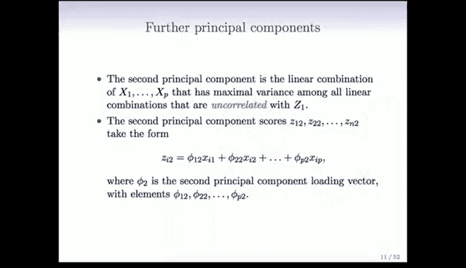

---

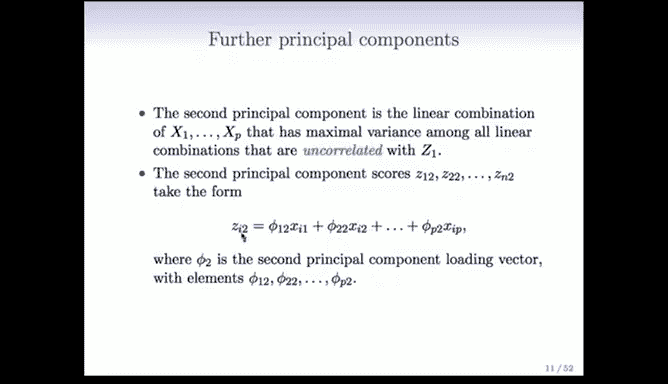

## 高阶主成分的计算

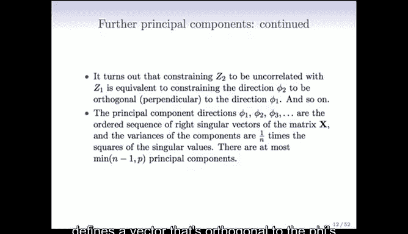

上一节我们介绍了第一主成分，它是数据方差最大的线性组合。当我们有 `P` 个变量时，可以进一步计算第二主成分。

第二主成分同样需要具有较大的方差，但为了避免与第一主成分重复，我们必须施加一个约束条件：**第二主成分必须与第一主成分不相关**。这样，它就能提供关于数据的不同信息。

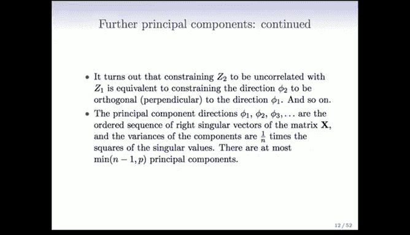

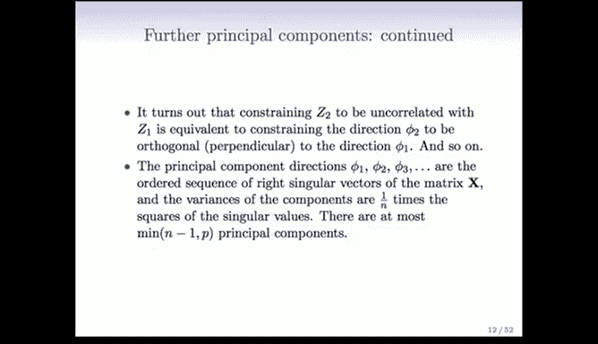

在满足不相关的约束下，第二主成分也是一个线性组合，其目标是最大化方差。我们可以用以下公式表示：

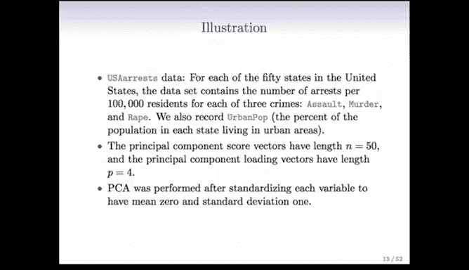

\[
Z_{2} = \phi_{21}X_{1} + \phi_{22}X_{2} + \cdots + \phi_{2P}X_{P}
\]

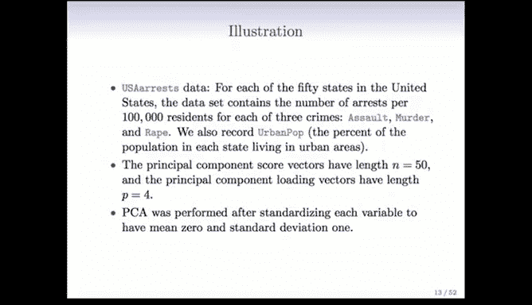

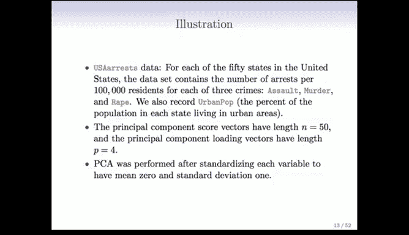

其中，\(\phi_{2}\) 是第二主成分的载荷向量，并且需要满足与第一主成分载荷向量正交的条件。

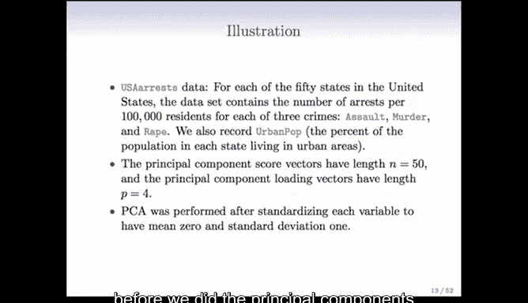

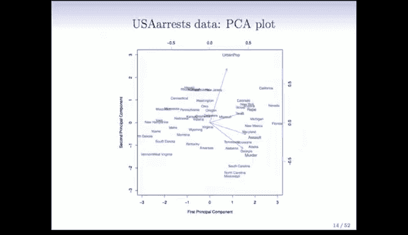

---

## 数学原理与奇异值分解

一个有趣的数学性质是，不相关性也意味着定义主成分的载荷向量是正交的。具体来说，第二主成分的载荷向量 \(\phi_{2}\) 与第一主成分的载荷向量 \(\phi_{1}\) 正交。

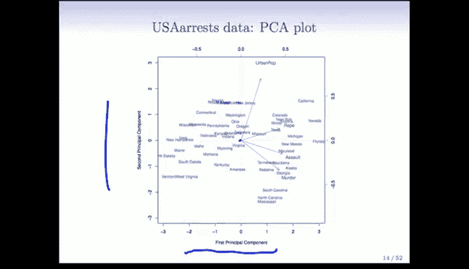

这个解可以通过数据矩阵 `X` 的**奇异值分解**得到。第二主成分由第二个右奇异向量定义。我们可以依次计算第三、第四主成分，以此类推，每个成分都最大化方差，同时与之前的所有主成分不相关。

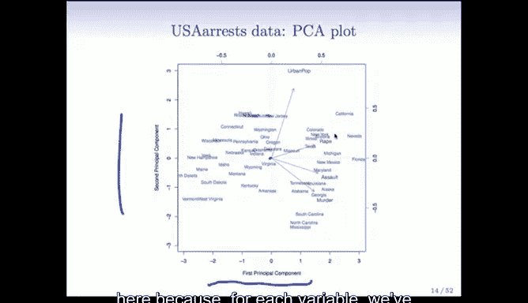

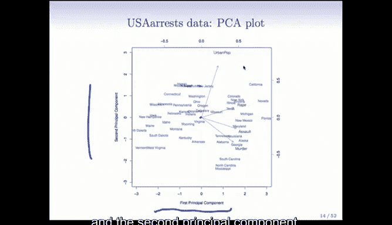

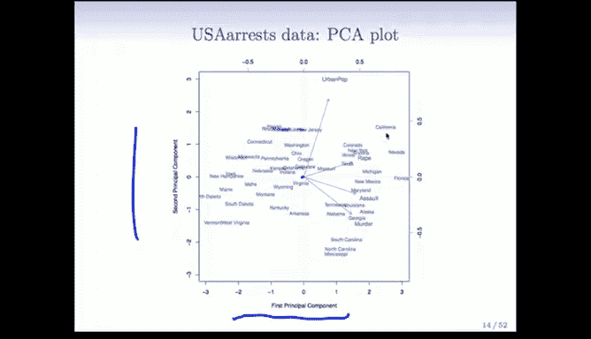

最多可以计算出 `n-1` 或 `p` 个主成分（`n` 是数据点数量，`p` 是变量数量）。这样，我们就得到了数据矩阵在主成分空间中的完整分解。

---

## 案例：美国各州犯罪数据

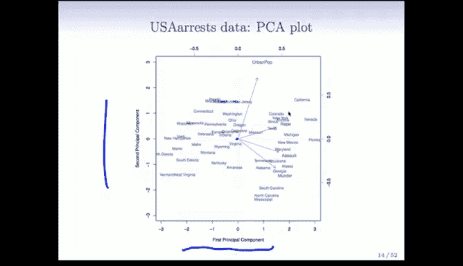

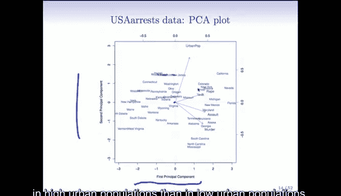

为了具体说明，我们使用一个关于美国各州犯罪率的数据集。该数据集包含50个州（观测值）的以下四个变量（已标准化）：
*   谋杀案逮捕率（每10万居民）
*   袭击案逮捕率
*   强奸案逮捕率
*   城市人口比例

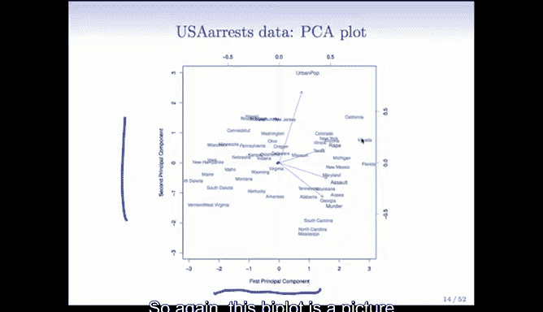

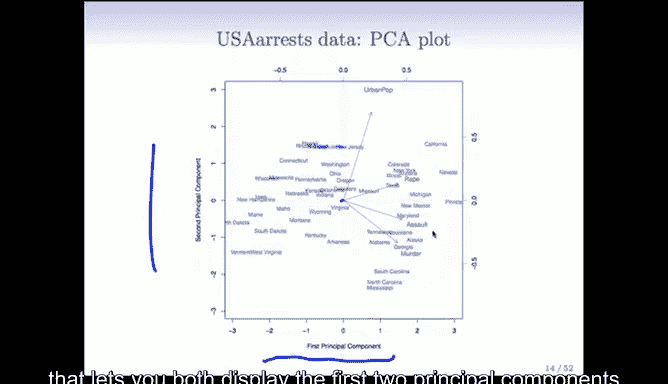

以下是分析结果的双标图，它同时展示了前两个主成分的得分（各州）和载荷（变量）。

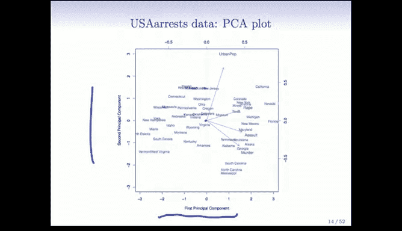

**如何解读双标图：**
*   **点**：代表每个州，其位置由它在第一、第二主成分上的得分决定。
*   **箭头**：代表每个变量，其方向由该变量在第一、第二主成分上的载荷决定。

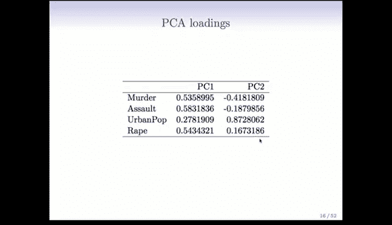

**主成分解读：**
*   **第一主成分（横轴）**：谋杀、袭击和强奸的载荷都很大且为正。因此，正方向代表高犯罪率地区（如佛罗里达州），负方向代表低犯罪率地区（如缅因州、新罕布什尔州）。
*   **第二主成分（纵轴）**：主要由城市人口比例驱动。正方向代表高城市化地区，负方向代表低城市化地区。

我们也可以通过载荷表来精确查看每个变量的贡献：

| 变量 | 第一主成分 | 第二主成分 |
| :--- | :--- | :--- |
| 谋杀 | 0.535 | -0.418 |
| 袭击 | 0.583 | -0.188 |
| 强奸 | 0.278 | 0.873 |
| 城市人口 | 0.543 | -0.167 |

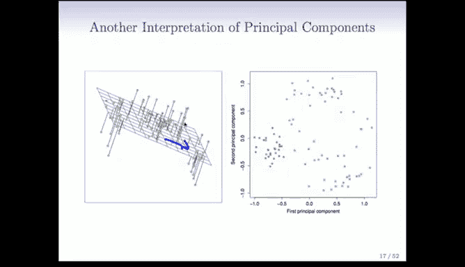

---

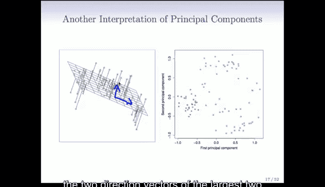

## 主成分的另一种视角：数据近似

主成分分析还有另一种等价的理解：寻找一个低维超平面来最佳近似数据点云。

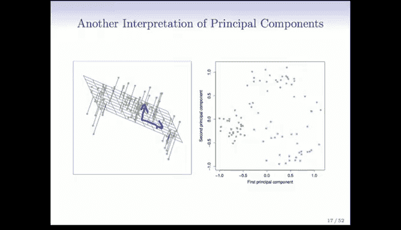

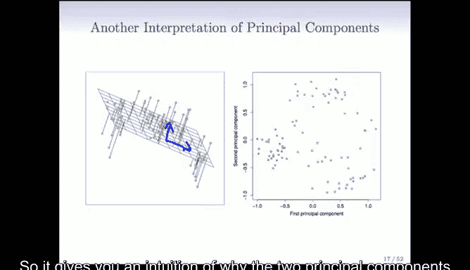

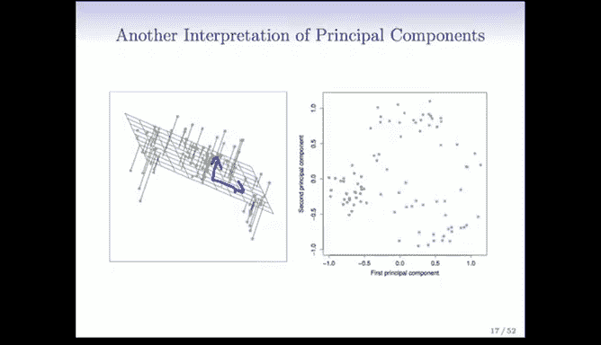

考虑一个三维空间中的数据点，我们可以寻找一个二维平面，使得所有点到该平面的**垂直距离**的平方和最小。这个最佳拟合平面正是由前两个主成分的方向向量所张成的。

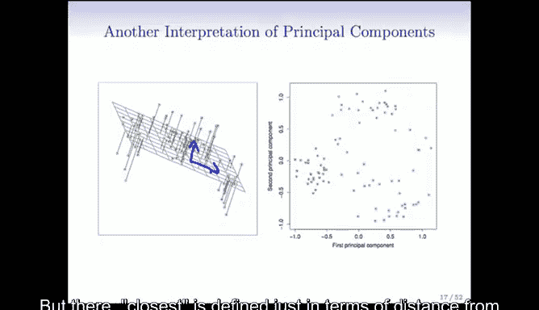

这与线性回归有本质区别：
*   **线性回归**：最小化响应变量 `Y` 在垂直方向上的预测误差（有监督）。
*   **主成分分析**：最小化所有变量 `X` 到超平面的垂直距离（无监督）。

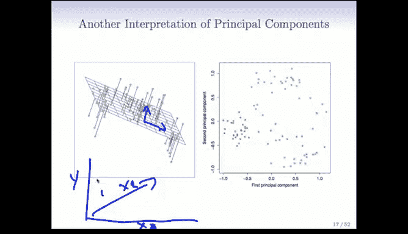

---

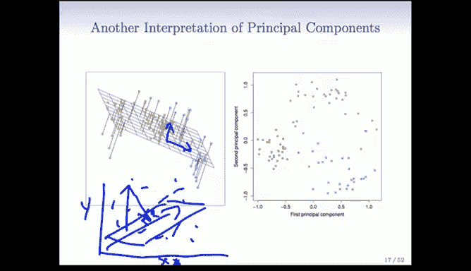

## 变量标准化的重要性

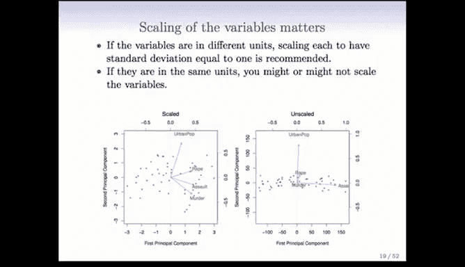

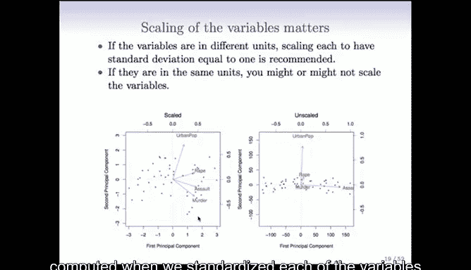

在进行分析前，我们通常会将变量标准化（均值为0，标准差为1）。这一点至关重要。

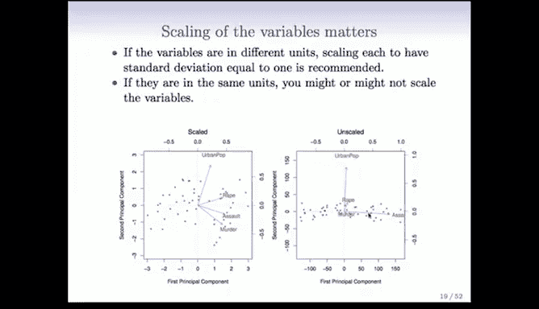

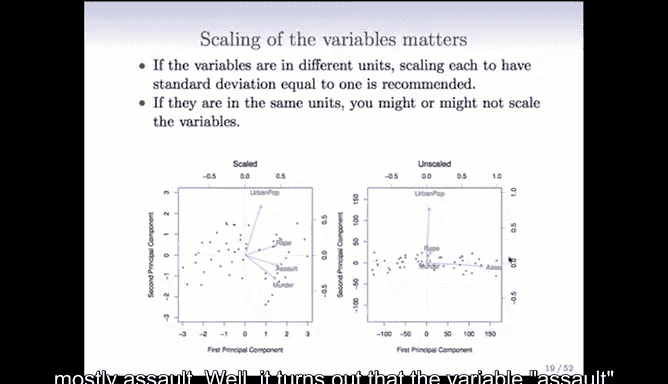

如果不标准化，测量单位或固有方差较大的变量会主导主成分。例如，在我们的犯罪数据中，如果“袭击”案的原始方差远大于其他变量，那么第一主成分将几乎完全由“袭击”案支配，从而掩盖其他变量的信息。

标准化确保了所有变量处于同等尺度，使得主成分能够公平地反映所有变量的共同变异。

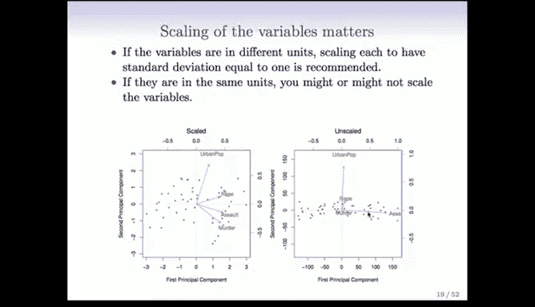

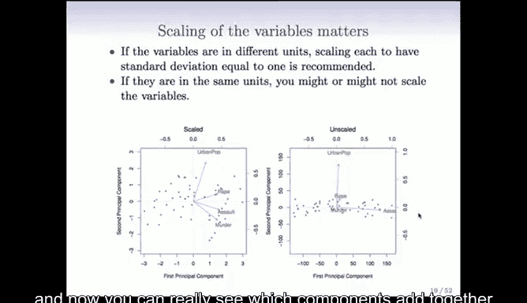

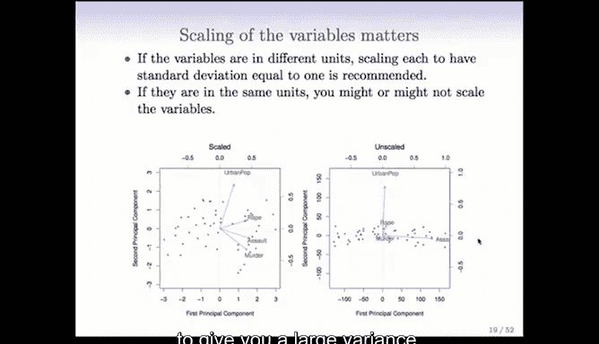

---

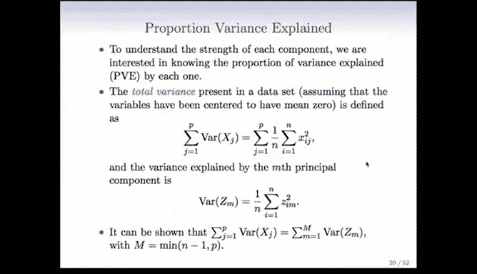

## 方差解释与主成分选择

与主成分分析紧密相关的是**方差分解**。我们可以计算每个主成分所解释的方差占总方差的比例。

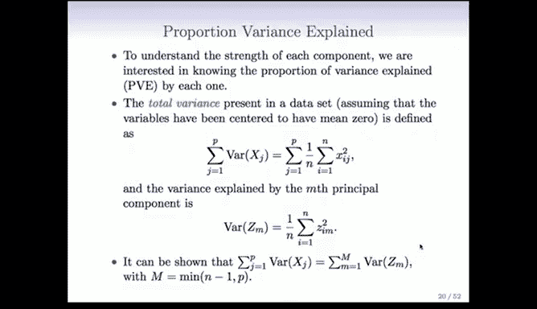

总方差公式（变量已中心化）：
\[
\text{总方差} = \sum_{j=1}^{p} \text{Var}(X_j)
\]

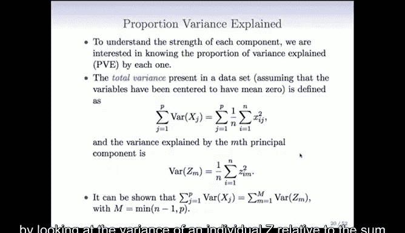

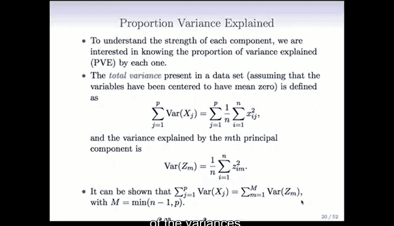

第 `m` 个主成分的方差：
\[
\text{Var}(Z_m) = \frac{1}{n} \sum_{i=1}^{n} z_{im}^2
\]

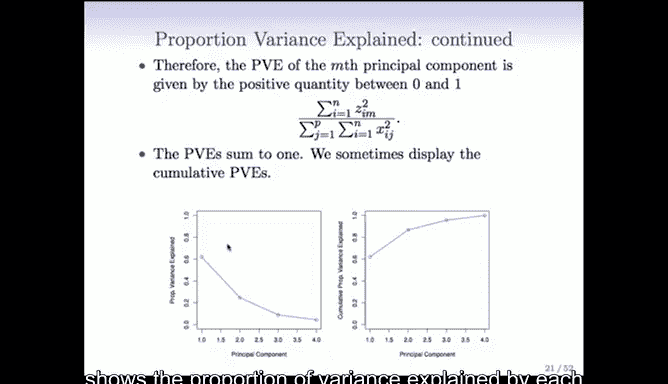

所有主成分的方差之和等于原始变量的总方差。因此，第 `m` 个主成分的**方差解释比例**为：
\[
\frac{\text{Var}(Z_m)}{\sum_{j=1}^{p} \text{Var}(X_j)}
\]

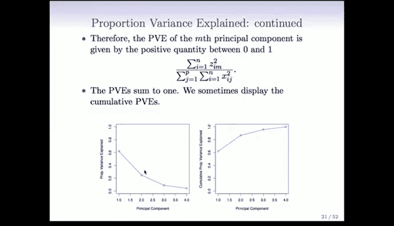

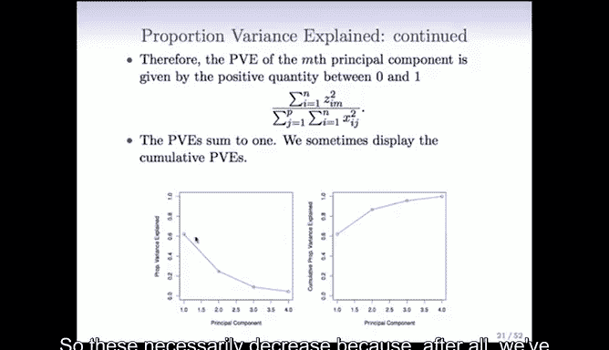

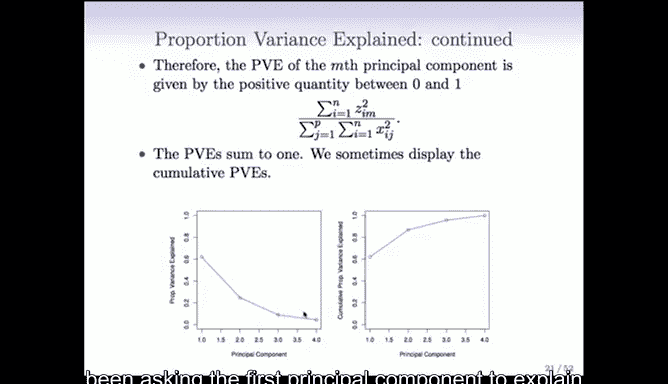

对于标准化后的犯罪数据，方差解释比例如下：
*   第一主成分：约 60%
*   第二主成分：约 22%
*   第三主成分：约 11%
*   第四主成分：约 7%

我们通常会绘制**碎石图**来可视化这些比例。一个常用的经验法则是寻找图中的“拐点”，拐点之后的主成分解释的方差比例急剧下降。例如，如果前两个主成分解释了绝大部分方差，我们就可以考虑只保留这两个成分。

---

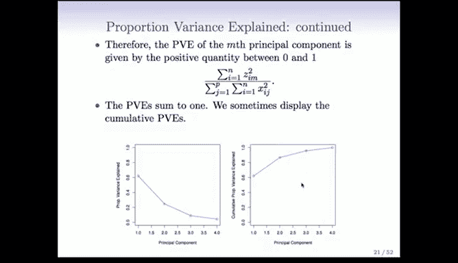

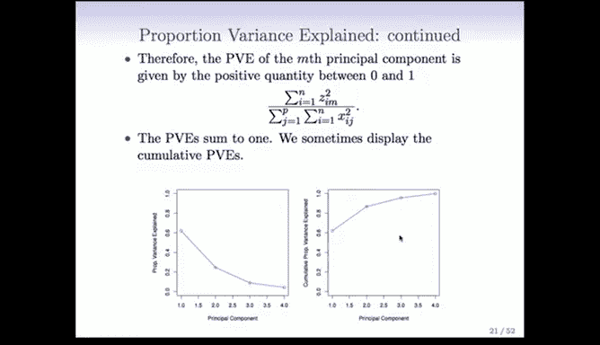

## 如何选择主成分数量？

选择保留多少个主成分没有绝对的标准答案。以下是一些指导原则：
1.  **累计方差解释比例**：根据分析目的，设定一个阈值（如80%或90%），选择能达到该阈值的最少主成分数。
2.  **碎石图拐点法**：观察碎石图，选择拐点处的主成分数量。
3.  **基于后续分析**：如果主成分将用于后续的回归分析等有监督学习，则可以使用交叉验证来确定最优的主成分数量。

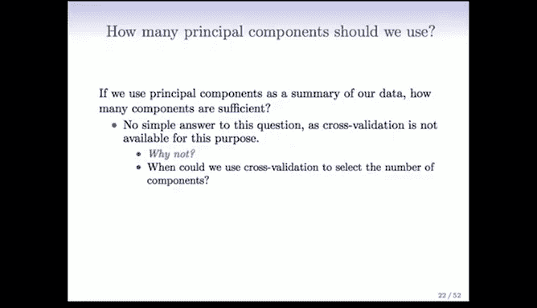

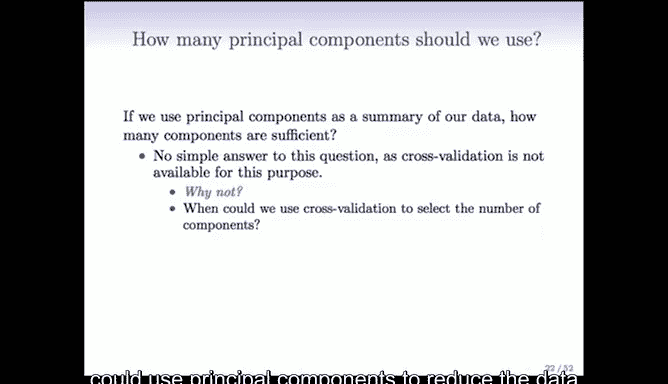

需要注意的是，在纯粹的无监督主成分分析中，由于没有响应变量，无法直接使用交叉验证。

---

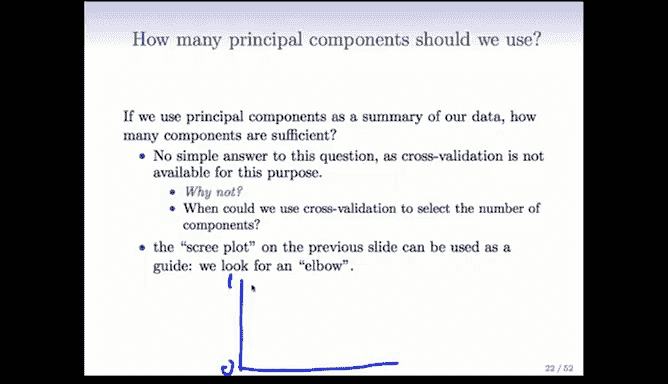

## 总结

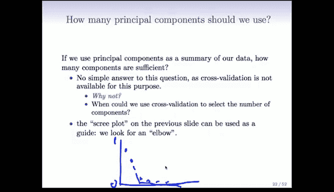

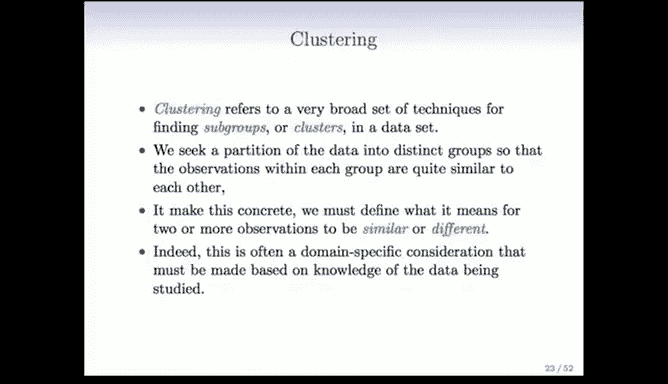

本节课中，我们一起学习了高阶主成分分析。
*   我们了解了如何计算与之前主成分不相关的高阶主成分，其数学基础是奇异值分解和载荷向量的正交性。
*   通过美国犯罪数据的案例，我们学会了如何解读双标图和载荷表，从而理解主成分的实际含义。
*   我们探讨了主成分分析的两种等价视角：最大化方差和最佳低维近似。
*   我们强调了变量标准化的重要性，以避免量纲差异对结果造成误导。
*   最后，我们学习了如何计算和利用方差解释比例来辅助决定保留的主成分数量。

主成分分析是应用统计学中最强大、最常用的工具之一。在下一节课中，我们将介绍另一个非常重要的无监督学习工具：聚类分析。