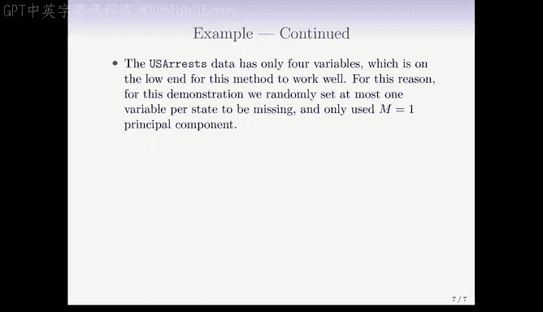

# R 版 90：矩阵补全与缺失值处理 📊


在本节课中，我们将学习如何处理数据矩阵中的缺失值，并介绍一种基于主成分分析的矩阵补全方法。这种方法不仅能填补缺失值，还能在数据不完整的情况下近似恢复主成分。

---

## 概述

数据矩阵 `X` 中常存在缺失条目，通常用 `NA` 表示。许多建模方法（如线性回归、广义线性模型和主成分分析）都需要完整的数据矩阵。因此，处理缺失值是一个重要步骤。有时，填补缺失值本身就是预测问题，例如在推荐系统中。

---

## 简单方法：均值填补

一种简单的处理缺失值的方法是**均值填补**。对于矩阵 `X` 的每一列（代表一个变量），将所有缺失条目替换为该列非缺失条目的均值。

**公式表示**：
对于变量 `j`，其均值 `μ_j` 计算如下：
```
μ_j = (1 / n_j) * Σ_{i: x_ij 非缺失} x_ij
```
然后将所有缺失的 `x_ij` 替换为 `μ_j`。

然而，这种方法忽略了变量之间的相关性。在填补缺失值时，我们应能利用这些相关性。此外，我们需要假设缺失值是**随机缺失**的，即缺失本身不包含信息。

---

## 基于主成分的矩阵补全

上一节我们介绍了简单的均值填补，本节中我们来看看一种更高级的方法——基于主成分分析的矩阵补全。

在本书第12.2.2节中，我们从矩阵近似的角度解释了主成分。其核心思想是，我们可以用一个低秩矩阵来近似原始数据矩阵 `X`。

**公式表示**：
我们希望通过两个矩阵 `A`（n × M）和 `B`（p × M）的乘积来近似 `X`，最小化以下目标函数：
```
min_{A, B} Σ_{(i,j) ∈ O} (x_ij - Σ_{m=1}^{M} a_im * b_jm)^2
```
其中，`O` 是所有观测到的 `(i, j)` 索引对的集合。`A` 的列可以看作是主成分得分，`B` 的列是主成分载荷。

一旦通过优化得到 `A` 和 `B` 的估计值，对于缺失的观测值 `x_ij`，我们可以用以下和式进行估计：
```
x_ij ≈ Σ_{m=1}^{M} a_im * b_jm
```
这种方法不仅填补了缺失值，还能近似恢复出完整数据下的前 `M` 个主成分得分和载荷。

**它是如何利用相关性的？**
主成分分析通过寻找最大化方差的线性组合来利用变量间的相关性。在这个矩阵补全问题中，如果某个变量存在缺失值，算法本质上相当于用其他相关变量对它进行“回归”来填补缺失值。在电影推荐的例子中，这相当于同时利用了用户之间的相似性和电影之间的相似性。

---

## 迭代算法

以下是求解上述优化问题的迭代算法步骤：

1.  **初始化**：创建一个完整的初始矩阵 `X̃`，例如用均值填补法填充所有缺失值。
2.  **迭代直至收敛**：
    *   **步骤一**：对当前完整的矩阵 `X̃` 进行主成分分析，得到 `M` 个主成分，从而获得矩阵 `A` 和 `B` 的当前估计。
    *   **步骤二**：使用当前估计的 `A` 和 `B`，按照公式 `Σ_{m=1}^{M} a_im * b_jm` 计算所有缺失条目的新估计值。
    *   **步骤三**：用步骤二计算出的新值更新矩阵 `X̃` 中的缺失条目。
    *   计算目标函数值，检查其下降是否已可忽略不计。

3.  **输出**：返回最终填补后的矩阵 `X`。

该算法简单有效，本质上是**迭代主成分分析**。

---

## 示例：美国犯罪数据

我们使用美国各州的犯罪数据（`USArrests`）作为示例。该矩阵有50行（州）和4列（谋杀、袭击、强奸犯罪率及城市人口比例）。我们人为地随机让20个州在随机一个变量上产生缺失值。

我们使用 `M = 1`（即一个主成分）运行上述算法。下图展示了20个缺失值的原始值与填补值的散点图。



结果显示，填补值与原始值的相关系数为0.63。相比之下，如果使用完整数据的第一主成分来近似这些值，相关系数约为0.73。这表明，在存在缺失值的情况下估计主成分，并未使结果质量显著下降。

---

## 如何选择主成分数量 M

为了应用该算法，我们需要选择用于填补的主成分数量 `M`。`M` 过小可能欠拟合，`M` 过大可能过拟合。

以下是选择 `M` 的一种方法：
我们可以模仿第5章中验证集的方法。具体操作是，随机将一部分**已知的观测值**也设为“缺失”，然后基于算法恢复这些已知值的表现来选择 `M`。这相当于为矩阵补全问题生成了一条交叉验证曲线。

**R语言实现**：
R语言中的 `softImpute` 包实现了矩阵补全算法，能够处理像Netflix数据那样大规模的问题。


---

## 总结

本节课我们一起学习了：
1.  处理数据缺失值的必要性。
2.  简单的均值填补法及其局限性。
3.  基于主成分分析的矩阵补全方法的核心思想与公式。
4.  用于求解的迭代算法步骤。
5.  通过美国犯罪数据的实例了解了方法的应用。
6.  如何通过设置“验证缺失值”来选择主成分数量 `M`。

矩阵补全是一个强大的工具，尤其适用于像推荐系统这类数据高度稀疏的场景。