# R 版 91：乳腺癌研究中的聚类分析示例 🧬

在本节课中，我们将通过一个乳腺癌研究的真实案例，学习层次聚类方法如何应用于基因表达数据分析，以识别疾病亚型并探索其与患者生存率的关系。

## 概述

上一节我们介绍了层次聚类的基本原理与步骤。本节我们将看到一个具体的应用实例：如何利用层次聚类分析乳腺癌患者的基因表达数据，从而发现潜在的疾病亚型，并评估不同亚型患者的生存差异。

## 研究背景与数据

该研究由斯坦福大学的研究团队完成。研究人员收集了88名乳腺癌患者的基因芯片数据，测量了约8000个基因的表达水平。

对于每位患者，每个基因都有一个定量测量值，用于反映该基因在该患者体内的活跃程度。这类研究旨在通过基因表达模式理解疾病的生物学基础，并探索是否存在需要不同治疗方式的疾病亚型。

数据规模为88名患者（样本）和8000个基因（特征），属于典型的高维数据。

## 分析方法与步骤

以下是本案例中数据分析的主要流程。

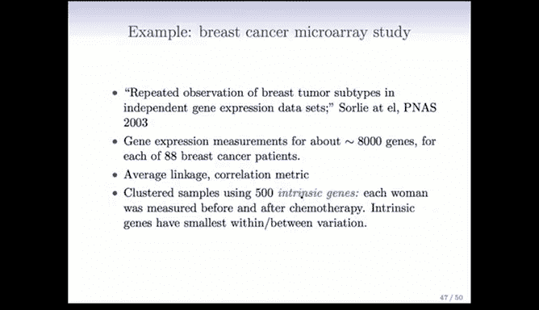


### 1. 选择距离度量与聚类方法

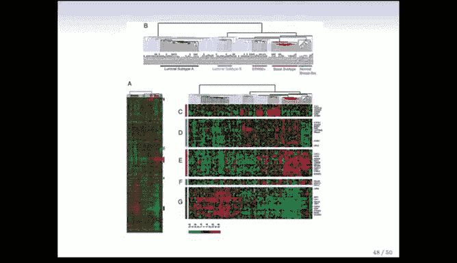

研究使用了**平均链接法**进行层次聚类，并选择了**相关性距离**作为度量标准。


选择相关性距离的原因是：虽然所有基因表达值在单位上一致，但测量得到的绝对表达水平可能因技术原因而不够可靠。相比之下，同一患者体内不同基因的相对表达模式（形状）被认为包含更重要的生物学信息。相关性距离恰好能捕捉这种模式相似性。

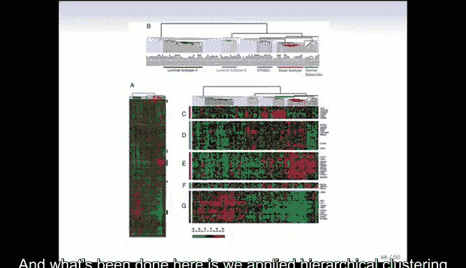

在R语言中，计算相关性距离并进行层次聚类的核心代码如下：
```r
# 假设 gene_data 是一个矩阵，行是基因，列是患者
# 计算样本（患者）之间的相关性距离
dist_matrix <- as.dist(1 - cor(gene_data, method="pearson"))
# 使用平均链接法进行层次聚类
hc_result <- hclust(dist_matrix, method="average")
```


### 2. 筛选特征基因

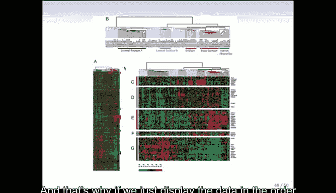

最初使用全部8000个基因进行聚类，得到的结果在生物学上不够清晰，未能提供有意义的见解。

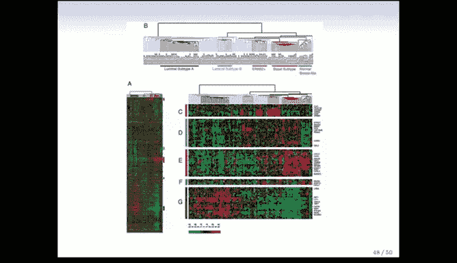

因此，研究人员转而使用一个被称为“**内在基因**”的子集。筛选方法基于以下生物学思想：化疗前后在个体患者体内变化很小，但在不同患者间差异很大的基因，可能更能反映患者固有的细胞生物学特性，从而更好地驱动聚类以区分患者。

具体操作是：对于每位患者和每个基因，计算其在化疗前后两个时间点测量值之间的变异。选择**个体内变异最小**的500个基因作为“内在基因”。这些基因被认为最能根据患者的生物学特性（可能包括对治疗的反应）来区分患者。

### 3. 生成与解读热图

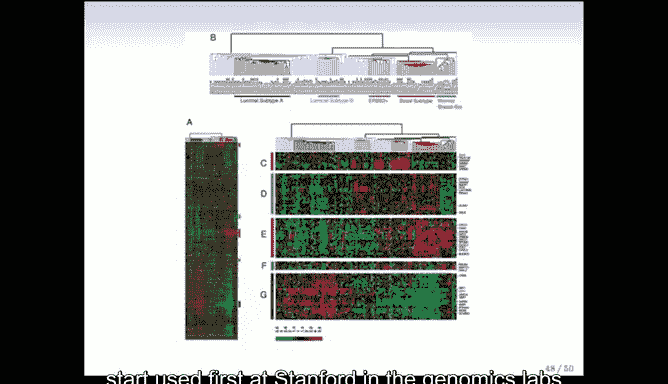

使用筛选出的约500个内在基因进行层次聚类，结果以**热图**形式展示。

热图是一种对此类基因表达数据非常有效的可视化方法：
*   **行**代表基因。
*   **列**代表患者。
*   **每个像素的颜色**代表标准化后的基因表达值：绿色表示低于平均表达水平，红色表示高于平均表达水平。

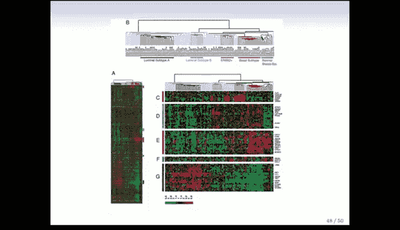

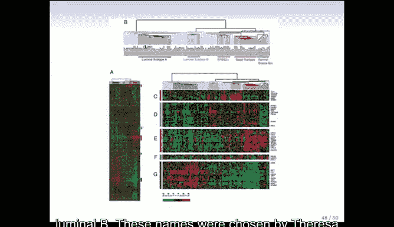

以下是生成热图的关键步骤：
1.  分别对**行（基因）** 和**列（患者）** 应用层次聚类。
2.  根据聚类树中叶节点的顺序，对行和列进行重新排列。
3.  按此顺序绘制热图。

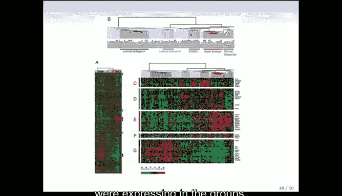

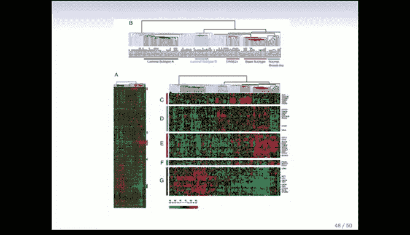


这种排列使得数据呈现出明显的红绿区块结构，而非杂乱无章的棋盘格图案，从而直观地揭示了基因表达模式在患者亚群中的一致性。这种可视化方法本身在基因组学领域就是一项重要的贡献，它使得研究人员能够一次性审视海量数据中的整体模式。

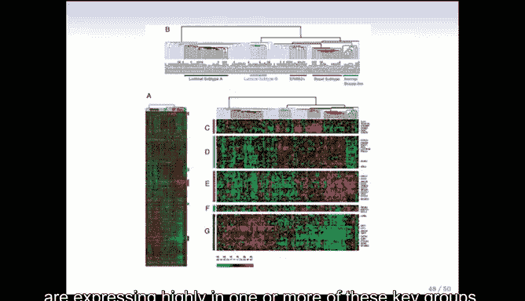

### 4. 识别患者亚型及其特征


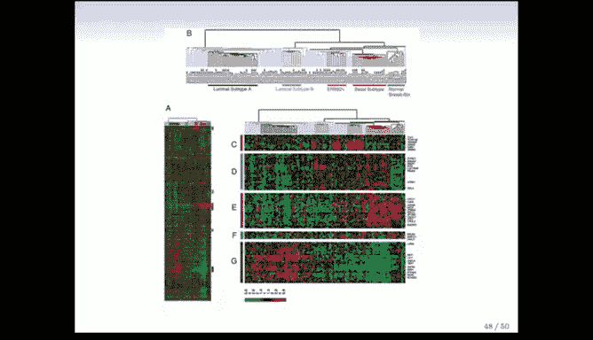

通过对患者进行聚类，并结合基因表达模式，研究人员将患者分成了若干个亚型，包括：Normal-like（正常样）、Basal（基底样）、ERBB2、Luminal A（管腔A型）、Luminal B（管腔B型）等。这些名称是基于在各亚型中高表达的特定基因群来命名的。

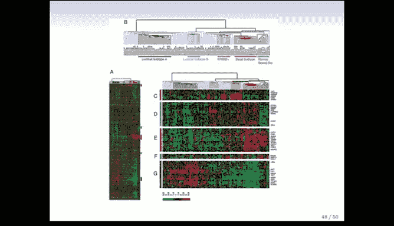

在热图中，可以进一步提取出在关键亚型中特异性高表达的基因模块（例如，图中标记为A、B、C、D、E的基因群）。肿瘤学家通过研究这些基因模块的功能，来理解不同亚型在细胞生物学层面的差异。


### 5. 关联临床结局：生存分析

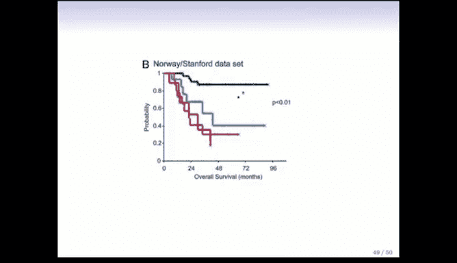

聚类分析的最终目的是服务于临床。研究人员绘制了不同亚型患者的**卡普兰-迈耶生存曲线**，以比较他们的预后。


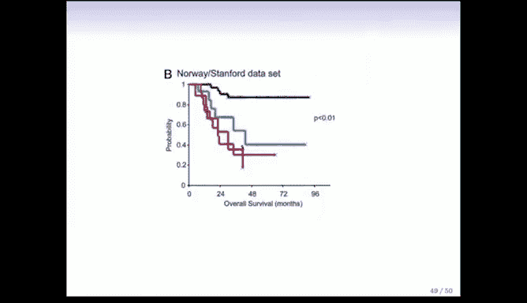

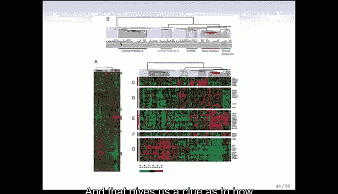

分析发现，例如Basal亚型和ERBB2亚型患者的生存率显著低于Luminal A亚型患者。这种生存率的显著差异，使得科学家们更加迫切地希望理解驱动这些亚型的基因有何不同，从而为针对不同亚型开发差异化治疗方案提供了线索。

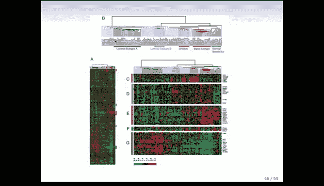

## 总结

本节课我们一起学习了一个将无监督学习（层次聚类）应用于重要科学问题的完整案例。我们看到了如何：
1.  根据数据特性（关注相对表达模式）选择合适的距离度量（相关性距离）。
2.  通过筛选“内在基因”进行特征选择，以提升聚类结果的生物学意义。
3.  利用热图对高维聚类结果进行有效可视化。
4.  将发现的患者亚型与临床结局（生存率）相关联，验证其生物学和医学意义。

这个案例充分展示了无监督学习在探索性数据分析中的强大作用：它能够在没有预先标签的情况下，从数据中发现隐藏的结构和模式，并为后续的生物学研究和临床决策提供重要假设和方向。

***
**本节内容对应扩展**：无监督学习是一个广阔的领域，除了主成分分析和聚类，还包括自组织映射、独立成分分析、谱聚类等多种技术。欲了解更多方法，可参考《The Elements of Statistical Learning》第14章及相关资料。