# R 版 92：主成分分析 (PCA) 📊

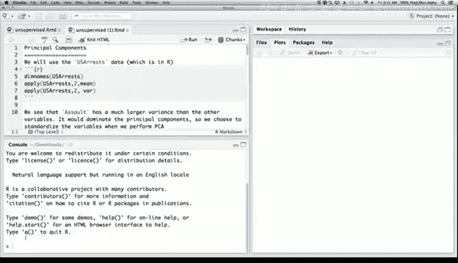

在本节课中，我们将学习无监督学习方法，特别是主成分分析 (PCA)。我们将通过一个简单的例子来演示其基本概念和应用。

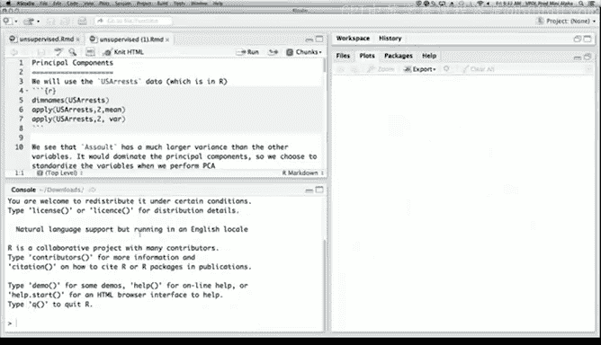

---

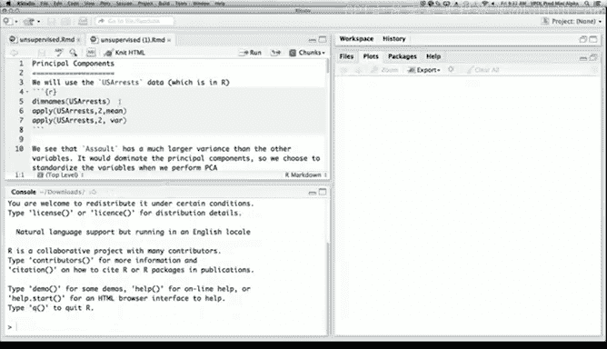

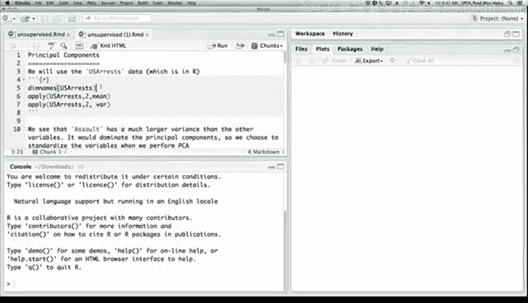

## 数据准备与探索

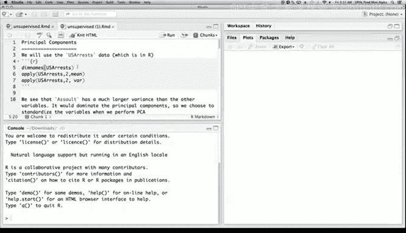

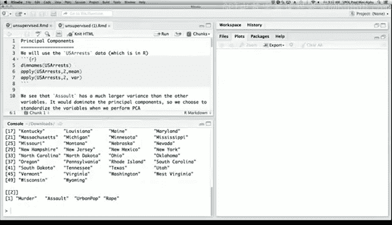

我们将使用R语言内置的数据集 `USArrests`。这个数据集包含了美国50个州在谋杀、袭击、强奸和城市人口比例四个方面的数据。

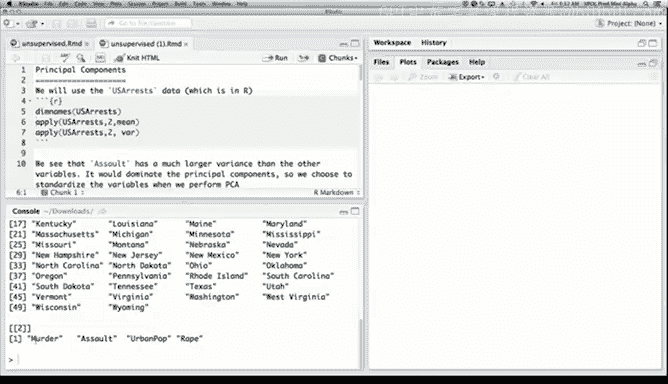

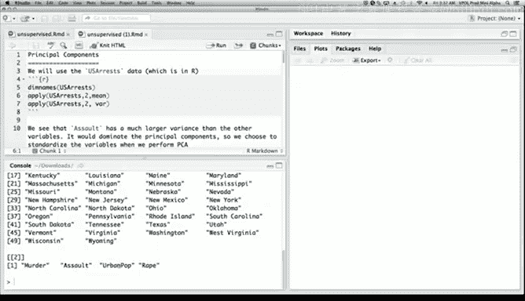

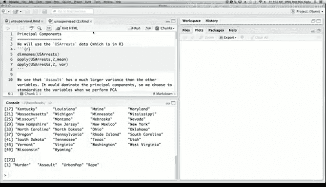

首先，我们查看数据的基本信息。数据集中每一行代表一个州，每一列代表一种犯罪类型或城市人口比例。

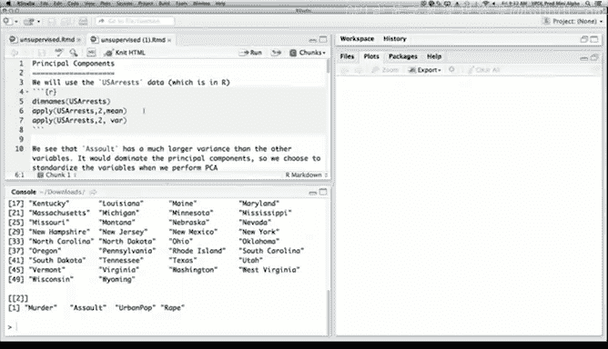

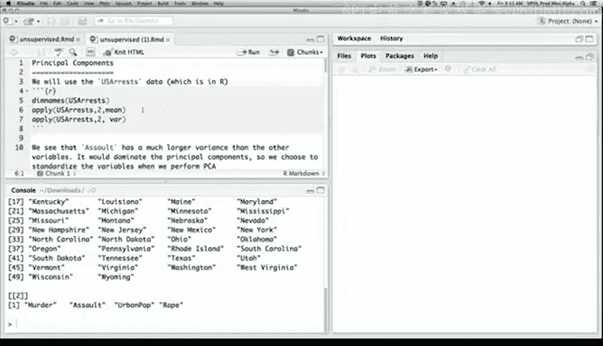

```r
dimnames(USArrests)
```

接下来，我们查看每个变量的均值和方差。

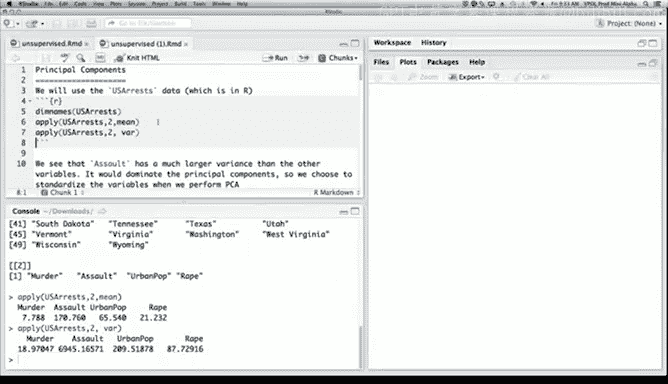

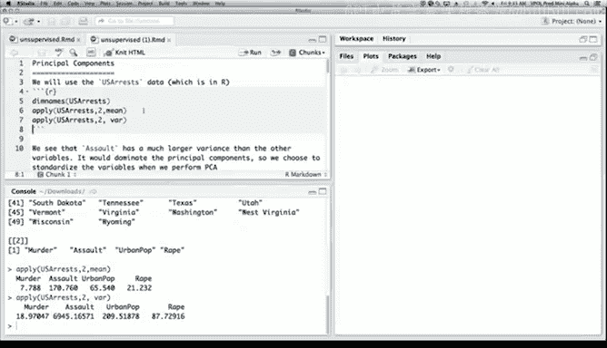

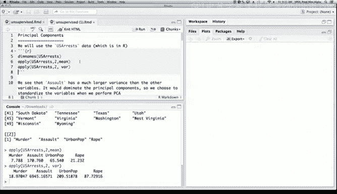

```r
apply(USArrests, 2, mean)
apply(USArrests, 2, var)
```

我们发现，不同变量的均值和方差差异很大。由于主成分分析关注的是方差，而不同变量的测量单位不同会导致方差不一致，因此我们需要在分析前对数据进行标准化处理，使每个变量具有单位方差。

---

## 执行主成分分析

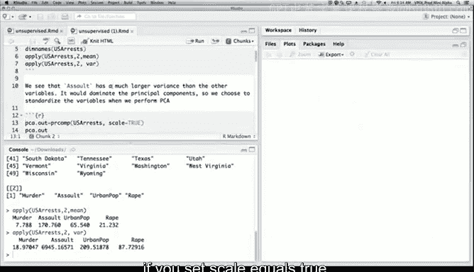

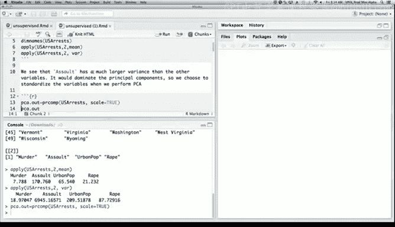

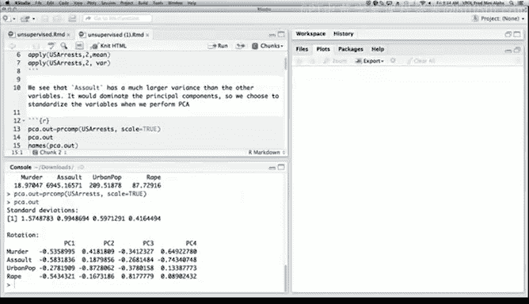

在R语言中，我们可以使用 `prcomp()` 函数进行主成分分析，并通过设置 `scale = TRUE` 来自动标准化数据。

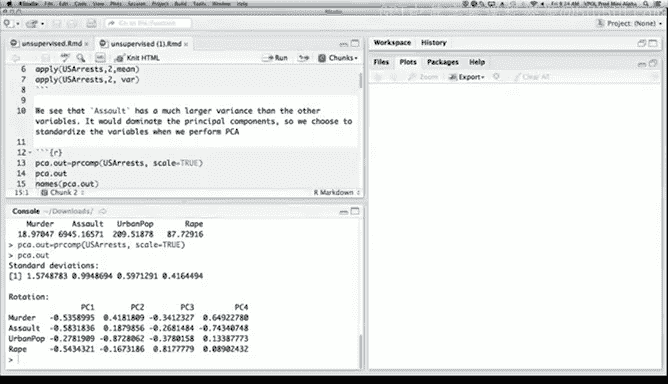

```r
pca.out <- prcomp(USArrests, scale = TRUE)
```

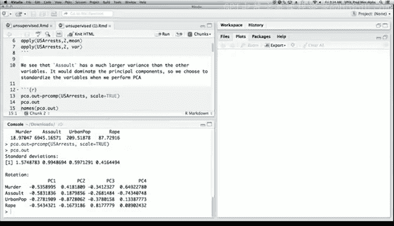

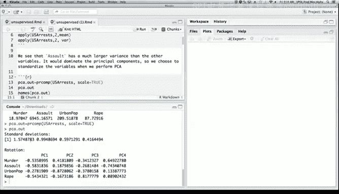

打印分析结果，我们可以看到四个主成分的标准差和载荷矩阵。

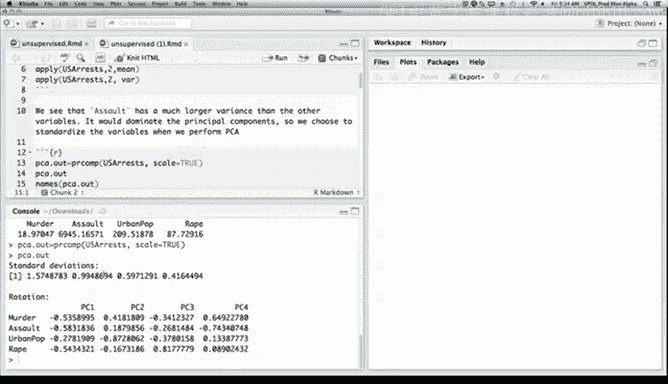

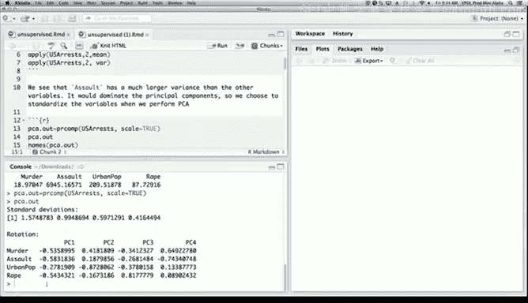

```r
print(pca.out)
```

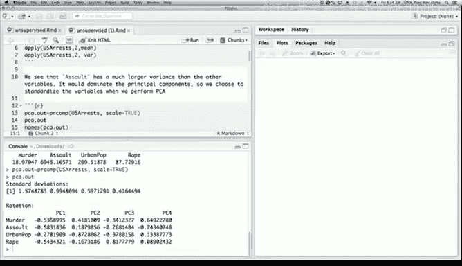

标准差是递减的，最大的为1.57，最小的为0.41。载荷矩阵显示了每个主成分与原始变量的关系。

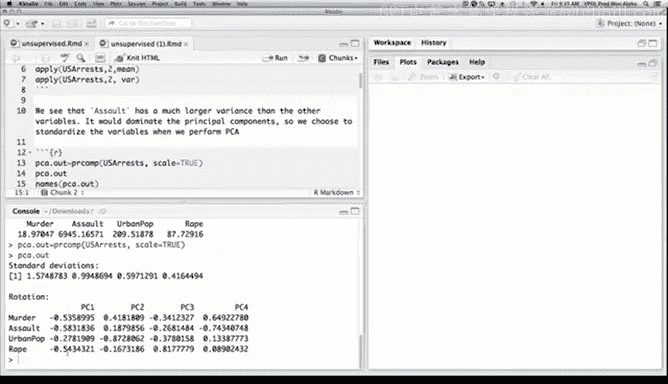

第一主成分在三种犯罪类型（谋杀、袭击、强奸）上具有较高的载荷，而在城市人口比例上载荷较低。这表明第一主成分主要反映了犯罪总量。


第二主成分在城市人口比例上具有较高的载荷，而在犯罪类型上载荷较低。这表明第二主成分主要反映了城市化程度。

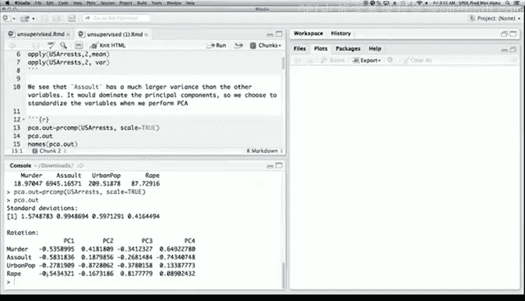

需要注意的是，主成分的符号（正负）可以任意翻转，因为方差不受符号影响。

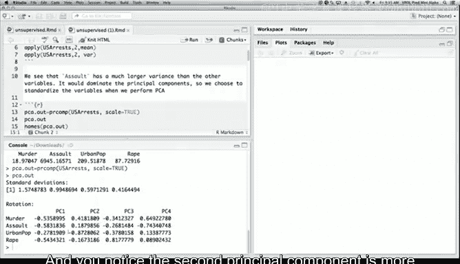

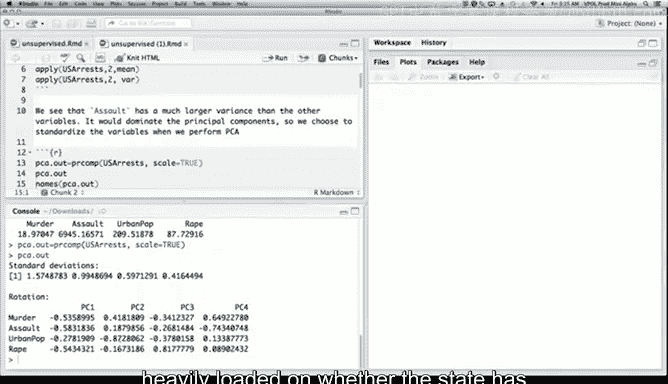

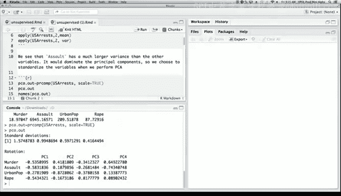

---

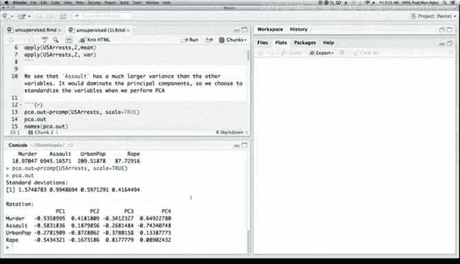

## 可视化分析结果

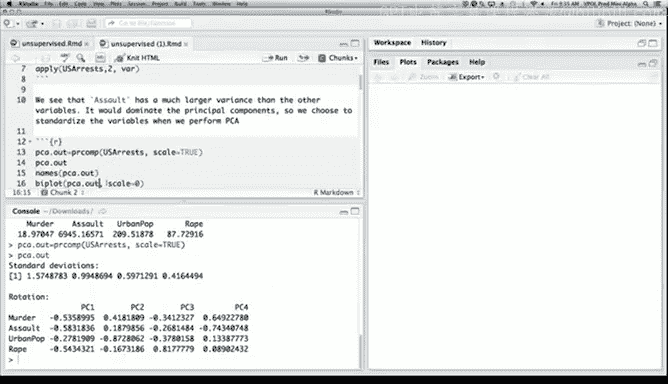

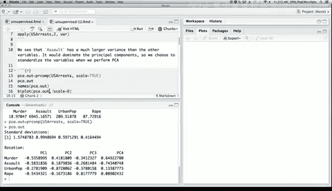

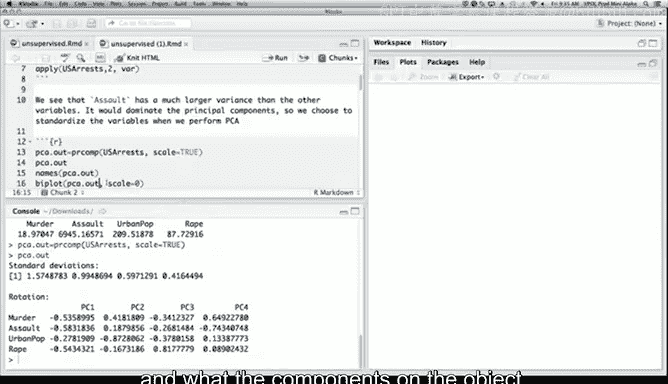

为了更好地理解主成分分析的结果，我们可以使用双标图 (biplot) 进行可视化。

```r
biplot(pca.out, cex = 0.6)
```

在双标图中，每个州的位置由其在前两个主成分上的得分决定，而红色的箭头方向表示原始变量在主成分上的载荷方向。

从图中可以看出，第一主成分（横轴）主要区分了犯罪率高的州（如佛罗里达、内华达、加利福尼亚）和犯罪率低的州（如缅因、北达科他、新罕布什尔）。

第二主成分（纵轴）主要区分了城市化程度高的州（如新泽西）和城市化程度低的州（如阿肯色、密西西比、北卡罗来纳）。

通过一个图，我们可以同时看到主成分得分和载荷，从而获得对数据的直观理解。

---

## 总结

本节课中，我们一起学习了主成分分析的基本概念和应用。我们了解到，主成分分析是一种通过线性组合将原始变量转换为不相关的新变量（主成分）的方法，其中第一主成分具有最大的方差。

我们使用 `USArrests` 数据集进行了演示，包括数据标准化、执行主成分分析以及通过双标图可视化结果。主成分分析是一种强大的数据降维和探索工具，鼓励大家在数据分析中多加应用。