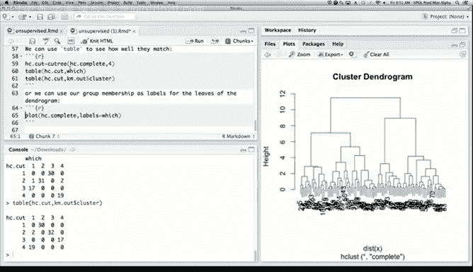
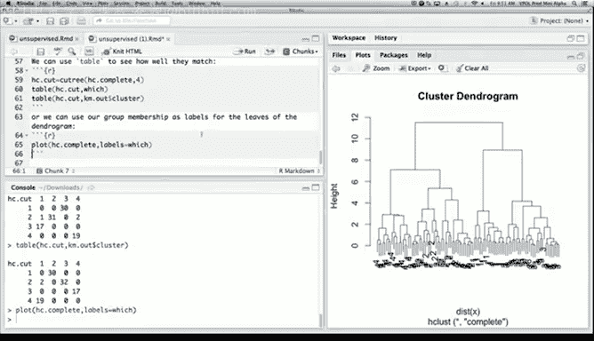
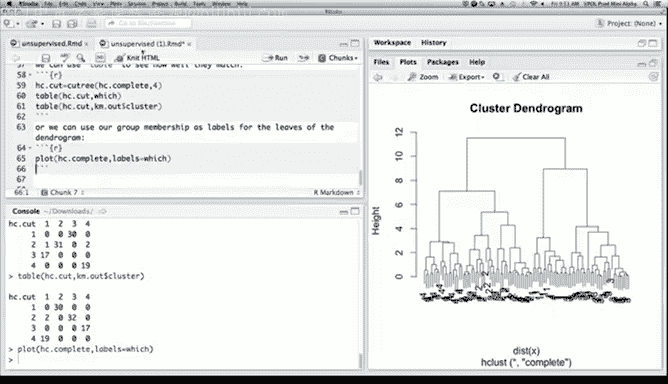
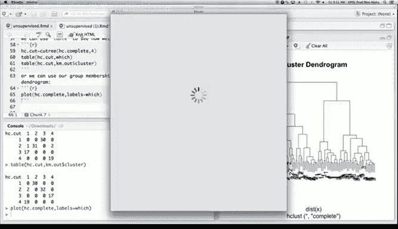

# R 版 94：层次聚类 📊

在本节课中，我们将学习层次聚类。层次聚类是另一种聚类方法，其工作原理与之前介绍的方法有所不同。我们将从距离矩阵出发，逐步构建聚类树，并通过可视化结果来理解数据的内在结构。

## 概述

层次聚类是一种自底向上的聚类技术。它从每个数据点作为一个独立的簇开始，逐步合并最相似的簇，直到所有数据点合并为一个大簇。这个过程会生成一个树状图，称为**树状图**，它直观地展示了数据点之间的层次关系。

## 距离矩阵与`hclust`函数

层次聚类基于距离矩阵进行计算。我们首先使用`dist()`函数计算数据点之间的成对距离矩阵。

```r
# 计算距离矩阵
dist_matrix <- dist(x)
```

接着，我们使用`hclust()`函数进行层次聚类。`hclust`是R中用于执行层次聚类的核心函数。

```r
# 执行层次聚类，使用“完全连接”方法
hc_complete <- hclust(dist_matrix, method = "complete")
```

要了解`hclust`函数的更多细节，可以使用`help(hclust)`命令查看帮助文档。此外，在网络上搜索R相关问题也是获取信息的有效途径。

## 可视化树状图

完成聚类后，我们可以使用`plot()`函数绘制树状图，以可视化聚类过程。

```r
# 绘制树状图
plot(hc_complete)
```

树状图从底部开始，展示了小簇如何逐步合并成大簇，最终形成一个包含所有数据点的大簇。通过观察树状图分支的高度，我们可以识别出数据中自然存在的簇。

## 连接方法比较

在层次聚类中，**连接方法**决定了如何衡量两个簇之间的距离。不同的方法会产生不同的聚类结果。

以下是三种常见的连接方法：

*   **完全连接**：使用两个簇中所有点之间**最大的**成对距离。这种方法倾向于生成紧凑的球形簇。
    ```r
    hclust(dist_matrix, method = "complete")
    ```
*   **单连接**：使用两个簇中所有点之间**最小的**成对距离。这种方法容易发现细长、链状的簇结构。
    ```r
    hclust(dist_matrix, method = "single")
    ```
*   **平均连接**：使用两个簇中所有点之间**平均的**成对距离。其结果介于完全连接和单连接之间。
    ```r
    hclust(dist_matrix, method = "average")
    ```

对于本示例数据，`method = "complete"`（完全连接）方法能更清晰地识别出四个预期的自然簇。

## 划分聚类与性能评估

上一节我们介绍了如何构建聚类树，本节中我们来看看如何从树状图中提取具体的簇划分，并评估其性能。

我们可以使用`cutree()`函数在指定高度（或指定簇数量）切割树状图，从而获得每个数据点的簇标签。

```r
# 将树状图切割为4个簇
hc_clusters <- cutree(hc_complete, k = 4)
```

获得簇标签后，我们可以将其与真实的类别标签进行比较，以评估聚类效果。

```r
# 创建混淆矩阵，比较聚类结果与真实标签
table(hc_clusters, true_labels)
```

混淆矩阵中的大数字表示正确聚类的数据点，小数字则表示误判的数据点。通过比较，我们可以计算聚类的准确率。

此外，我们还可以将层次聚类的结果与K均值聚类的结果进行比较，观察两种方法在特定数据上的一致性与差异。

## 增强可视化

为了更直观地展示聚类结果与真实类别的关系，我们可以对树状图进行增强可视化。

一种简单的方法是在绘制树状图时，使用`labels`参数，将每个叶节点（数据点）的标签设置为它所属的真实类别。



```r
# 使用真实标签作为叶节点标签绘制树状图
plot(hc_complete, labels = true_labels)
```



这样，在树状图的底部，我们可以直接看到每个数据点的真实归属，从而更容易识别出哪些点被错误地聚类了。虽然更复杂的着色方法需要额外的技术，但基本的标签方法已能提供清晰的洞察。

## 生成分析报告



最后，我们可以将所有的代码、结果和图形整合到一个R Markdown文档中。通过“编织”这个文档，我们可以生成一个包含完整分析过程的HTML或PDF报告，便于与同事分享或用于演示。

## 总结



本节课中我们一起学习了层次聚类。我们了解了其自底向上的工作原理，学会了使用`hclust()`函数进行聚类，并通过`plot()`函数可视化树状图。我们比较了完全连接、单连接和平均连接等不同方法的特点。接着，我们使用`cutree()`函数划分簇，并通过混淆矩阵评估聚类性能。最后，我们探讨了如何通过标记树状图来增强可视化效果，并介绍了如何生成完整的分析报告。层次聚类提供了一种无需预先指定簇数量的、可视化的数据探索方式。