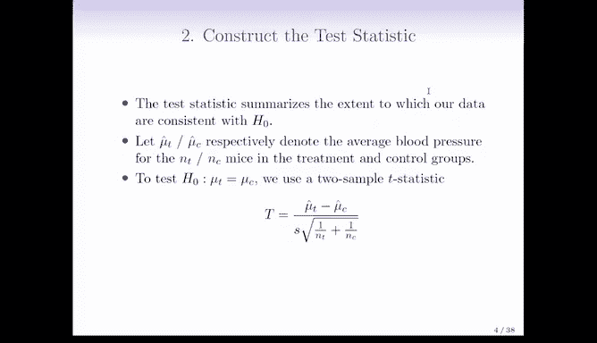

# R 版 95：假设检验入门 📊

在本节课中，我们将学习假设检验的基本概念，特别是当我们需要同时进行多个检验时的情况。我们将从单次假设检验的回顾开始，然后探讨处理多重检验的经典与现代方法。理解这些原理对于避免数据分析中的虚假发现至关重要。

---

## 什么是多重假设检验？🔍

上一节我们介绍了单次假设检验的基本框架。本节中，我们来看看当我们需要同时进行多个检验时会面临什么挑战。

在标准的单次假设检验中，我们通常检验一个零假设（例如，对照组和治疗组小鼠的预期血压相等）。然而，在许多现代数据分析场景中，我们可能需要同时进行成千上万个检验。

例如，我们可能有成千上万个生物标志物，并希望检验每个标志物在对照组和治疗组之间是否存在差异。这被称为多重假设检验，其中 `m` 代表检验的总数。

当 `m` 非常大时（例如数万次），一个核心问题变得尤为突出：我们很容易得到大量的**假阳性**结果。这意味着我们可能会错误地拒绝许多实际上成立的零假设，仅仅因为进行了大量检验。

---

## 假设检验基础回顾 📝

在深入多重检验之前，让我们快速回顾一下假设检验的四个主要步骤。我们假设您对此已有初步了解。

### 1. 定义假设
首先，我们需要定义零假设（`H₀`）和备择假设（`Hₐ`）。
*   **零假设 (`H₀`)**：代表“默认”或“无趣”的状态。例如，线性回归中的真实系数 `βⱼ = 0`，或者两组间的预期均值没有差异。
*   **备择假设 (`Hₐ`)**：代表我们试图发现的“有趣”或“不同”的状态。例如，`βⱼ ≠ 0`，或者两组均值存在差异。

### 2. 构建检验统计量
检验统计量用于量化数据与零假设的一致性程度。

例如，为了检验治疗组与对照组小鼠的预期血压（`μₜ` 和 `μ꜀`）是否相等，我们可以使用**两样本 t 统计量**：

`T = (μ̂ₜ - μ̂꜀) / SE(μ̂ₜ - μ̂꜀)`

其中，`μ̂ₜ` 和 `μ̂꜀` 是样本均值，分母是差值标准误的估计。`T` 的绝对值越大，数据与零假设的背离程度就越大。

### 3. 计算 P 值
P 值是一个常被误解但至关重要的概念。其正确定义是：
> **在零假设成立的前提下，观察到当前检验统计量（或更极端情况）的概率。**

一个**小的 P 值**提供了反对零假设的证据，因为它表明，如果零假设为真，观察到当前数据模式的可能性很低。

### 4. 做出决策
最后，我们根据 P 值决定是否拒绝零假设。通常，我们会预先设定一个**显著性水平**（例如 α = 0.05）。如果 P 值小于 α，我们则拒绝零假设。

---

## 理解 P 值：一个例子 📉

假设在我们的血压实验中，计算出的 t 统计量 `T = 2.33`。在零假设（`μₜ = μ꜀`）下，这个统计量近似服从标准正态分布 `N(0,1)`。

`P 值 = P(|T| ≥ 2.33 | H₀ 为真) ≈ 0.02`

这意味着，如果零假设确实成立，我们只有大约 2% 的概率会观察到绝对值如此之大（或更大）的 t 统计量。

面对一个 P 值为 0.02 的结果，有两种可能性：
1.  零假设为真，我们只是遇到了一个不太可能的事件（每进行 50 次检验，平均会发生一次）。
2.  零假设实际上不成立。

P 值越小，我们拒绝零假设、支持备择假设的信心就越强。然而，它**并不直接给出零假设为真的概率**。

---

## 总结 📚

本节课中，我们一起学习了：
1.  **多重假设检验的挑战**：当同时进行大量检验（`m` 很大）时，假阳性的数量会急剧增加，可能导致不可复现的虚假发现。
2.  **假设检验的核心步骤**：包括定义零假设与备择假设、构建检验统计量、计算 P 值以及基于 P 值做出决策。
3.  **P 值的正确定义与解释**：P 值是在零假设成立的假设下，观察到当前或更极端数据的概率。它是一个反对零假设的证据度量，而非零假设为真的概率。

理解这些基础是应对后续更复杂的多重检验校正方法的基石。在接下来的课程中，我们将探讨如何控制由多重检验引起的错误率。