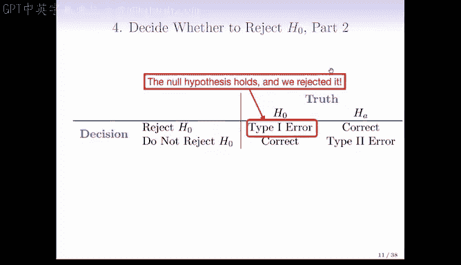
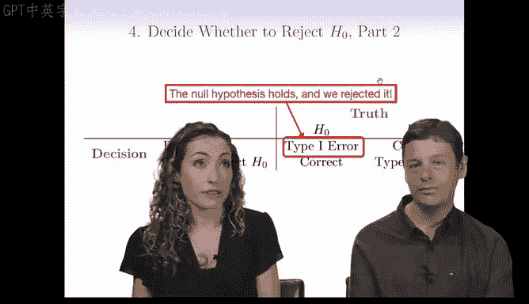
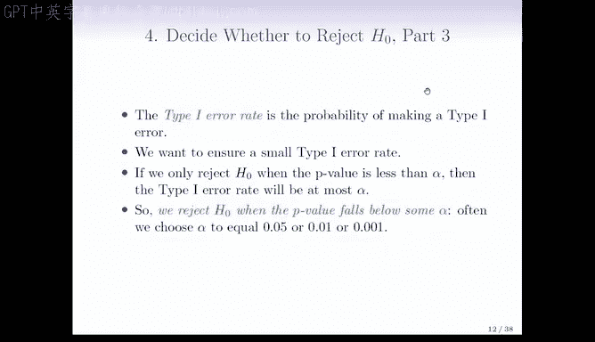

# R 版 96：统计学习 - 13.1 假设检验导论 II 🧪

在本节课中，我们将学习假设检验的核心决策过程。我们将探讨如何根据P值做出决策，并理解在此过程中可能出现的两类错误：第一类错误与第二类错误。

---

上一节我们介绍了P值的概念，本节中我们来看看如何基于P值做出决策。

现在我们需要做出决策，决定是否拒绝原假设。正如我们所说，一个小的P值表明，在原假设成立的情况下，出现如此大的检验统计量值是不太可能的。

因此，一个小的P值为我们提供了反对原假设 **H₀** 的证据。但这证据足够吗？通常我们需要一个二元决策：要么拒绝原假设，要么未能拒绝原假设。需要强调的是，我们从不“接受”原假设，我们只“拒绝”或“未能拒绝”它。

如果P值非常小，我们倾向于拒绝原假设，这通常意味着我们发现了关于世界的新颖且有趣的现象。但多小才算足够小？是否只有当P值低于0.00001时才拒绝？还是低于0.01就可以？

实践中，**5% 或 0.05** 常被用作拒绝原假设的临界值。但这只是一个约定俗成的数字。这个临界值应设定为多小，实际上取决于在此犯错（特别是犯第一类错误）的严重程度。这个0.05的阈值具有很强的领域特异性，绝非黄金标准。

进行假设检验时，我们需要思考以下这个“真相表”：

以下是决策与真相的四种可能组合：

*   **真相为 H₀（原假设成立）**：
    *   **决策：不拒绝 H₀**：这是理想情况。原假设成立，我们也没有拒绝它。在法庭比喻中，这相当于被告无罪且未被定罪。
    *   **决策：拒绝 H₀**：这被称为 **第一类错误**。原假设成立，但我们错误地拒绝了它。在法庭比喻中，这相当于一个无辜的人被定罪。这是我们进行假设检验时极力**控制**的错误类型。

*   **真相为 Hₐ（备择假设成立）**：
    *   **决策：不拒绝 H₀**：这被称为 **第二类错误**。备择假设成立，但我们未能拒绝原假设。在法庭比喻中，这相当于一个有罪的人被无罪释放。
    *   **决策：拒绝 H₀**：这也是理想情况。备择假设成立，我们也正确地拒绝了原假设。在法庭比喻中，这相当于有罪的人被定罪。

第一类错误和第二类错误都是我们希望避免的。为什么我们通常更强调控制第一类错误？这与原假设和备择假设之间的不对称性有关。原假设通常代表我们对世界的默认认知状态，需要有**强有力的证据**才能让我们改变这种认知。拒绝原假设就像宣布一个重大发现（例如，“维生素C能治愈癌症”），我们必须确保这个结论不是错误的（即第一类错误）。在医学研究中，我们最担心的就是第一类错误，因为它可能导致人们相信某种无效的治疗方法有效。

当然，第二类错误在实践中也是个问题。我们理想上希望同时降低两类错误。但现实是，降低其中一类错误往往会使另一类错误增加，两者之间存在权衡。标准的设定是认为**第一类错误比第二类错误更严重**。因此，我们更侧重于控制第一类错误。

第一类错误率是犯第一类错误的概率。我们希望这个概率很小。有一个简单的方法可以实现这一点：**如果我们只在P值小于某个阈值 α 时才拒绝 H₀，那么第一类错误率将最多为 α**。

因此，如果你希望第一类错误率不超过0.05，那么你应该在P值小于0.05时拒绝原假设。同理，如果你希望错误率是0.01或0.001，就使用相应的阈值。物理学家有时会选择更小的P值阈值，因为他们要求极高的确定性。

这里还需要考虑样本量的问题。如果你的样本量很小（例如20、30、40），可能很难积累足够的证据来获得一个极小的P值。相反，如果你的样本量非常大（例如谷歌拥有海量用户数据，或物理学实验拥有海量粒子碰撞事件），你甚至可以使用像 **10⁻⁶** 这样极小的α值。

但大样本量也带来了另一个问题：**如果样本量足够大，即使控制组和实验组之间的均值差异非常微小，你也极有可能得到一个非常小的P值**。这是因为原假设（例如，两组均值完全相等）在现实中几乎不可能**精确**成立。只要存在极其微小的差异，大样本量就能以极高的统计把握度检测到它，并产生一个显著的P值。

因此，**一个小的P值并不等同于一个大的实际效应**。它只告诉我们“有差异”的统计证据很强，但没有告诉我们这个差异有多大。这就是**统计显著性**与**实际显著性**（或科学重要性）之间的区别。一个结果可能在统计上是显著的（P值小于0.05），但在实际应用中可能微不足道。

---

本节课中我们一起学习了假设检验的决策框架。我们了解了如何根据P值与显著性水平α的比较来决定是否拒绝原假设，并深入探讨了在此过程中可能发生的第一类错误和第二类错误。我们认识到，大样本量能更容易地检测到微小差异，因此需要谨慎区分统计显著性与实际重要性。控制第一类错误是假设检验的核心原则，通常通过设定显著性水平α来实现。