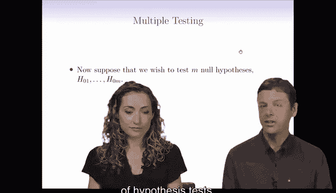
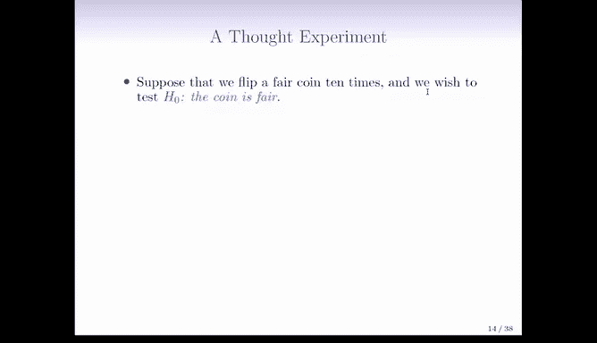
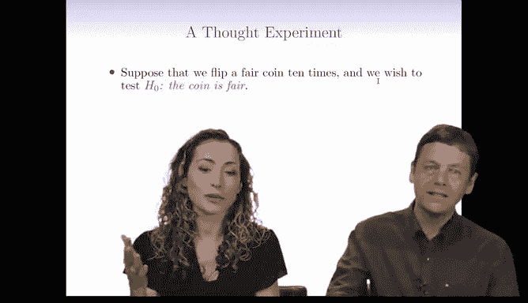
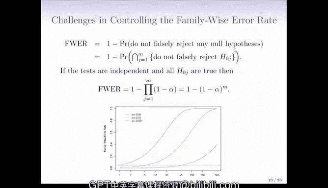

# R 版 97：多重检验与族错误率简介 📊

## 概述

在本节课中，我们将要学习如何处理多重假设检验的问题。当我们需要同时检验多个假设时，传统的统计方法可能会失效，导致大量错误结论。我们将介绍多重检验带来的挑战，并引入**族错误率**这一核心概念来应对这些挑战。

---

## 多重检验的挑战

上一节我们介绍了单次假设检验的基本原理。本节中我们来看看当需要同时进行多次检验时会发生什么。

假设我们同时检验M个不同的假设。如果我们简单地拒绝所有P值低于1%的零假设，那么当M很大时，我们可能会犯很多第一类错误。

为了说明这个想法，我们构建了一个思维实验。

假设我们找到1024枚公平的硬币，每枚硬币投掷10次。我们选择1024这个数字，是因为单枚硬币连续10次出现正面的概率是1/1024。因此，在检验这么多硬币时，平均而言，我们预期会有一枚硬币出现极端结果（例如连续10次正面或反面）。如果对这枚特定的硬币进行假设检验，我们会得到一个非常小的P值（约0.002），从而很可能错误地拒绝“硬币是公平的”这个正确的零假设。这个错误就是第一类错误。

这个例子表明，即使我们坚持使用非常小的P值阈值，只要进行足够多的假设检验，几乎必然会产生一些第一类错误。

以下是一个现实中的类比，进一步说明了这个问题：
*   研究人员检验了20种不同颜色的软糖与痤疮的关联。
*   对于其中19种颜色，P值都大于5%，未能拒绝零假设。
*   但绿色软糖的P值低于5%，因此被报道为“与痤疮相关”。
*   实际上，零假设（无关联）对所有颜色都可能成立，仅仅因为检验次数多，就几乎保证会出现至少一个假阳性结果。

因此，如果我们检验M个假设，并且所有零假设都为真，那么以α水平（例如1%）拒绝零假设时，我们预期会犯大约 `α * M` 个第一类错误。例如，进行10,000次检验，就可能产生约100个假阳性结果。

---

## 族错误率

既然多重检验会导致大量错误，我们该如何应对这种情况呢？最经典的方法是控制**族错误率**。

族错误率定义为**至少犯一次第一类错误的概率**。用公式表示如下：
`FWER = P(V ≥ 1)`
其中，`V` 代表在M次检验中，犯第一类错误的总次数。

控制族错误率意味着我们希望以很高的概率确保不犯任何第一类错误。这就像在法庭上，如果所有被告都是无辜的，我们绝不希望错误定罪其中任何一人。

然而，在实践中，当M很大时，控制族错误率非常困难。如果我们假设各次检验相互独立，且所有零假设都为真，并以α水平拒绝零假设，那么族错误率可以近似计算为：
`FWER ≈ 1 - (1 - α)^M`

从该公式可以看出，随着检验次数M的增加，即使α很小，族错误率也会迅速接近100%。例如，当α=0.001，M=500时，族错误率已高达约40%。这意味着，要在大规模检验中严格控制族错误率，就必须将单个检验的α设置得极其小，这在实际操作中往往不现实。

---

## 总结

本节课中我们一起学习了多重假设检验的核心挑战及其标准应对框架。
*   我们了解到，同时进行大量检验时，即使控制每次检验的显著性水平，也几乎必然会产生假阳性（第一类错误）。
*   我们引入了**族错误率**的概念，它衡量的是“至少犯一次第一类错误”的概率。
*   最后，我们通过公式 `FWER ≈ 1 - (1 - α)^M` 认识到，当检验数量M很大时，严格控制族错误率非常困难，需要更复杂的方法来平衡错误控制与统计功效。在后续课程中，我们将探讨诸如错误发现率等更适用于大规模检验的替代方法。