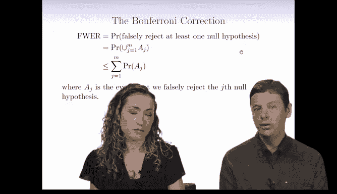
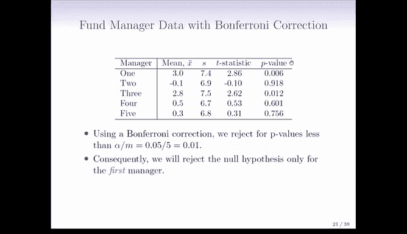

# R 版 98：控制族错误率的邦费罗尼方法 📊

在本节课中，我们将学习如何控制多重假设检验中的“族错误率”。当同时进行多个检验时，错误地拒绝至少一个原假设的概率会大大增加。邦费罗尼校正是一种经典且直接的方法，可以确保这个整体错误率不超过我们设定的水平。

上一节我们讨论了多重检验带来的挑战，本节中我们来看看一个具体的解决方案。

## 邦费罗尼校正的原理

邦费罗尼校正基于一个简单的概率不等式。假设我们同时进行 `M` 个独立的假设检验。定义事件 `A_j` 为在第 `j` 个检验中犯第一类错误（即错误地拒绝原假设）。那么，族错误率就是至少发生一个这类错误的概率，即这些事件的并集概率。

根据概率论中的布尔不等式，多个事件并集的概率不大于它们各自概率的总和。用公式表示如下：

**FWER = P(至少一个错误) = P(A_1 ∪ A_2 ∪ ... ∪ A_M) ≤ P(A_1) + P(A_2) + ... + P(A_M)**

如果我们希望将族错误率控制在水平 `α`（例如 0.05），一个保守的策略是让每个独立检验的显著性水平更严格。邦费罗尼方法规定，只有当某个检验的 p 值小于 `α / M` 时，我们才拒绝其原假设。这样，所有检验犯错误的总概率上限就是 `M * (α / M) = α`。

**校正后的显著性阈值 = α / M**

这意味着，如果你想在进行了 100 次检验后，仍保证整体错误率不超过 5%，那么每次检验的 p 值必须小于 `0.05 / 100 = 0.0005` 才算显著。

## 一个应用实例

为了更直观地理解，我们来看一个书中的基金经理数据示例。数据记录了五位基金经理相对于股市整体的超额回报率。

以下是数据的关键信息，包括平均超额回报、标准差以及检验“基金经理没有超额收益”这个原假设得到的 p 值。

*   基金经理 1: 平均超额回报 3%， p 值 = 0.001
*   基金经理 2: 平均超额回报 -1%， p 值 = 0.5
*   基金经理 3: 平均超额回报 10%， p 值 = 0.01
*   基金经理 4: 平均超额回报 1%， p 值 = 0.4
*   基金经理 5: 平均超额回报 0%， p 值 = 0.8

如果单独看每次检验，使用 0.05 的阈值，那么经理 1 和经理 3 的结果是显著的，我们会认为他们跑赢了市场。

然而，我们同时检验了五位经理（M=5）。如果不加校正，族错误率会远高于 5%。应用邦费罗尼校正，我们将显著性阈值调整为 `0.05 / 5 = 0.01`。

*   经理 1 的 p 值 (0.001) < 0.01 → **结果显著**
*   经理 3 的 p 值 (0.01) = 0.01 → **结果不显著**（通常要求严格小于阈值）

校正后，我们只能有把握地认为经理 1 的表现显著优于市场。这体现了多重检验校正的核心：为了保持整体推断的严谨性，我们牺牲了一些发现“显著”结果的能力。

## 方法的优缺点

邦费罗尼方法非常流行，主要有两个原因：它能**保证**将族错误率控制在预定水平 `α` 以下，并且**实施起来非常简单**，只需将单个检验的 p 值与 `α/M` 进行比较。

但是，这种方法也有一个明显的缺点：它非常**保守**。随着检验次数 `M` 的增加，阈值 `α/M` 会变得极其严格，使得拒绝原假设变得非常困难，从而降低了统计功效（即发现真实效应的能力）。因此，它更适用于检验数量 `M` 不是特别大的情况。

## 关于“诚实”的思考

多重检验校正本质上关乎科研或数据分析的“诚实性”。如果你从众多结果中只挑出看起来最显著的那一个进行报告，并假装只做了这一次检验，那么你就不需要校正。但这样做是误导性的。校正的必要性，源于我们内心承认自己确实考察了多个假设或可能性。即使不是故意欺骗，忽略多重检验问题也是一种常见的误解，会导致错误的结论。

本节课中我们一起学习了邦费罗尼校正方法。它是一种通过调整单个检验的显著性阈值，来严格控制多重假设检验中整体错误率的经典技术。虽然该方法较为保守，但其原理简单、保障性强，是处理中等数量多重比较问题的可靠工具。