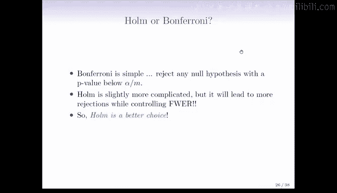

# R 版 99：Holm方法控制族错误率

在本节课中，我们将要学习一种在控制族错误率方面比Bonferroni方法略有优势的方法——Holm方法。我们将了解其工作原理、计算步骤，并通过实例与Bonferroni方法进行对比。

---

上一节我们介绍了Bonferroni校正法，它是一种控制多重假设检验中族错误率的经典方法。本节中我们来看看另一种方法——Holm方法。它在某些情况下能比Bonferroni方法拒绝更多的原假设，同时依然严格地将族错误率控制在预定水平（如5%）。

Holm方法的起始步骤与Bonferroni方法相同。

首先，对所有的M个假设进行标准的假设检验，并计算出对应的P值，记为P1, P2, ..., PM。

接着，将这些P值从小到大进行排序。我们用P(1)表示最小的P值，P(2)表示第二小的P值，依此类推。

以下是Holm方法的核心判定步骤：

我们按顺序检查这些排序后的P值，寻找第一个满足以下条件的P值：该P值大于其对应的调整后显著性水平。调整水平计算公式为：**α / (M + 1 - j)**，其中α是总体显著性水平（如0.05），M是假设总数，j是当前P值的排序序号（从1开始）。

具体来说：
1.  将最小的P值P(1)与 **α / M** 进行比较。
2.  如果P(1) ≤ α / M，则拒绝其对应的原假设，然后继续检查P(2)。
3.  将第二小的P值P(2)与 **α / (M - 1)** 进行比较。
4.  以此类推，直到找到第一个满足 **P(j) > α / (M + 1 - j)** 的P值为止。
5.  一旦找到这样的P值，就停止检验。拒绝所有排序序号小于j的假设对应的原假设，而序号大于等于j的假设则全部不予拒绝。

这种方法同样保证了族错误率被控制在α以内。并且，它通常能比Bonferroni方法发现更多具有统计显著性的结果（即拒绝更多的原假设）。从比较中可以看出，Holm方法对最小P值的判断标准与Bonferroni方法相同（都是α/M），因此它至少会拒绝Bonferroni方法所拒绝的所有假设。

---

为了更直观地理解，让我们回到基金经理的例子。

假设我们已经将10位基金经理的检验P值从小到大排序。

应用Holm方法后，前两个原假设被拒绝。这是因为最小的P值小于0.01（即α/M=0.05/10），而第二小的P值也小于α/(M-1)=0.05/9≈0.0125。

因此，基金经理3（对应第二小的P值）也刚好被判定为显著。这对于该经理来说是个好消息。而其他经理的P值仍然很大，所以不予拒绝。

这个简单的例子展示了Holm方法拒绝了两个原假设，而Bonferroni方法只拒绝了一个。但两种方法都将族错误率控制在5%。Bonferroni方法有时过于保守，它保证了错误率不超过5%，但实际错误率可能远低于5%，从而导致一些本应发现的信号被遗漏。

---

下面的示意图进一步说明了Holm方法相对于Bonferroni方法的优势。

图中展示了10次假设检验的P值，并已从小到大排序。
*   黑色水平线代表Bonferroni方法的阈值 **α/M**。所有低于此线的点都会被Bonferroni方法拒绝。
*   蓝色阶梯线代表Holm方法的动态阈值。它从与Bonferroni相同的起点开始，但后续的阈值更高。

图中黑点代表两种方法结论一致（要么都拒绝，要么都不拒绝）。而那个红色的点（比如排序第8的假设）则处于蓝色线之下但黑色线之上，这意味着它被Holm方法拒绝，但未被Bonferroni方法拒绝。这个“红色发现”正是Holm方法在控制族错误率前提下获得的额外成果。

另一幅更极端的示意图显示，Bonferroni方法可能只拒绝3个假设，而Holm方法能拒绝8个，这体现了Holm方法在发现能力上的潜在提升。

---

那么，哪种方法更可取呢？这取决于你的偏好和需求。
*   Bonferroni方法更简单直接，因此应用也最为广泛。
*   Holm方法稍复杂，但并非难以理解。两者都能控制族错误率，而Holm通常在统计功效上更优，即能发现更多显著结果。

有些人认为Bonferroni方法通常已经足够，而Holm方法略显“炫技”。在实际研究中，Bonferroni因其简洁性而被绝大多数人采用。当然，如果你将α水平设定得更严格（例如0.01），那么任何一种方法都可能无法拒绝任何假设。

---

本节课中我们一起学习了Holm校正法。我们了解到，它是Bonferroni方法的一种改进，通过使用动态调整的显著性水平，在严格保持对族错误率控制的同时，提高了检验的统计功效（即发现真实效应的能力）。理解这两种经典的多重比较校正方法，对于进行严谨的统计分析至关重要。