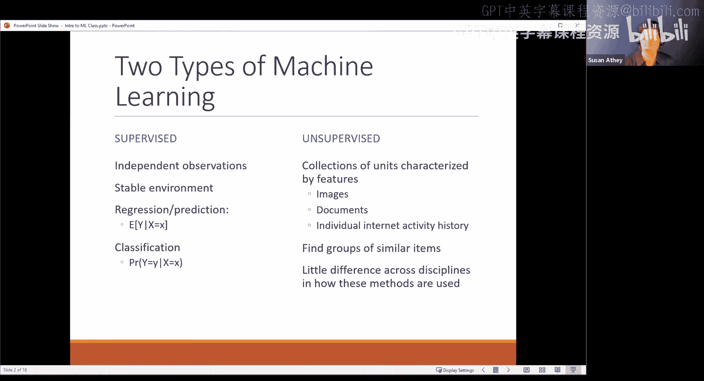
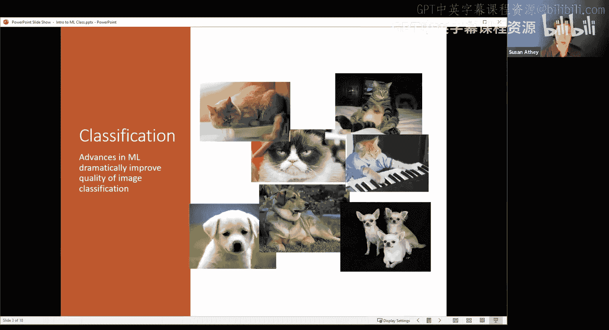
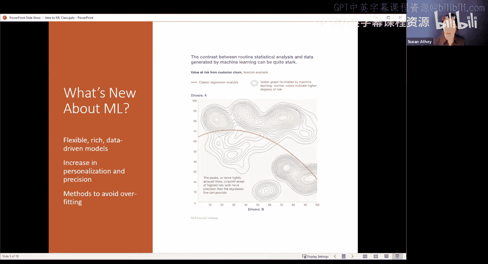
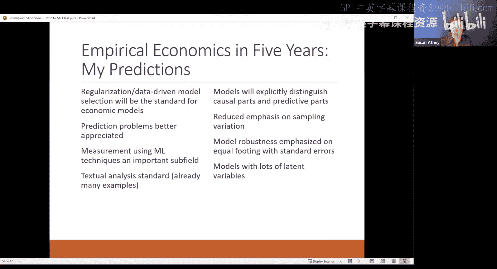

#  001：机器学习与经济学导论 🧠📈

在本节课中，我们将探讨机器学习与经济学（或计量经济学、社会科学）之间的关系。我们将从区分两种主要的机器学习类型开始，并深入探讨它们与社会科学中传统方法的异同，特别是预测与因果推断之间的核心区别。

## 机器学习的两大类型

机器学习领域广阔，但今天我们主要区分两种核心类型：**无监督学习**和**有监督学习**。

### 无监督学习

无监督学习是指处理没有预先标注标签的数据。例如，你有一堆图片、视频或文档，但没有人事先告诉你哪些是猫，哪些是狗。算法的目标是根据数据本身的特征，将其分成不同的组（聚类）。

**核心过程**：算法将相似的图像归为一组。之后，当你查看某个分组（例如第5476组）时，你发现里面的图片都是猫。于是你说：“我的机器学习算法发现了猫。” 但实际上，算法只是将看起来相似的图片放在了一起，是你后来赋予了“猫”这个标签。

不同学科在使用这些方法时，目的可能不同。它可能作为回归分析中的一个解释变量，也可能用于描述产品特征。但就其本身而言，如果你想知道如何操作，完全可以通过网络搜索、Coursera等平台找到优秀教程。对于社会科学家来说，直接应用这些方法即可，其核心目标在不同领域并无本质差异。

### 有监督学习

上一节我们介绍了无监督学习，本节中我们来看看**有监督学习**。这看起来更像社会科学中常做的回归分析。

在有监督学习中，我们从一个稳定的环境开始，拥有独立的观测数据。在最简单的情况下，观测值之间互不相关。这类似于计量经济学一年级课程中教授的条件均值建模问题，即用X的函数来预测Y的期望值：`E[Y|X] = f(X)`。

分类问题是有监督学习的另一个子集，此时Y是离散的标签（例如猫、狗、马）。这看起来很像社会科学中常用的多项逻辑回归。

因此，有监督机器学习似乎与社会科学在做同样的事情。甚至，当你上机器学习课程时，学到的第一个预测模型可能就是回归，第一个分类模型可能就是逻辑回归。这听起来我们完全在解决同一个问题。

但有趣的是，我们处理这个“相同”问题的方式却不同。接下来，我们将探讨为何我们会以不同方式处理同一问题，以及为何从相同方法中提出不同问题是有意义的。

## 分类问题示例：预测与理解的鸿沟

为了更具体地说明，让我们看一个机器学习中研究最广泛、也是过去15年取得巨大成功的分类问题示例：图像识别。

典型的分类问题是，你有一堆图片（比如动物图片），你的目标是给它们分类。在训练数据集中，你既有图像（X），也有标签（Y，如猫、狗、马）。

以下是构建分类模型的关键步骤：

1.  **特征提取**：首先需要将图像转化为可观测的特征。一个简单的方法是，将图像视为由红、绿、蓝三原色的亮度值组成的像素矩阵。这样，图像就被数字化为一组数值（X）。
2.  **模型构建**：然后，将这些特征X输入模型，以预测标签Y（例如，给定X，这是猫吗？）。

这里已经出现了一个细微的差距。在一些机器学习应用中，目标可能不是输出一个概率，而仅仅是给出“是猫”或“不是猫”的判断。在生产环境中，算法可能只输出类别标签。

然而，如果经济学家研究这个问题，我们通常会构建一个**逻辑回归**模型，试图输出一个概率 `P(Y="猫"|X)`。并且，我们通常对模型系数和函数形式本身感兴趣。我们会问：如果我改变某个X，概率会如何变化？我们真正试图理解的是模型的内在机制，而不仅仅是输出一个标签。

## 机器学习的优势与局限：以客户流失预测为例

机器学习，特别是像神经网络这样非常灵活的函数形式，在解决复杂的预测问题（如从像素数据中识别物体）方面取得了巨大进步。

以下是机器学习强大预测能力的一个例子（来自麦肯锡的宣传资料）：

*   **问题**：预测哪些客户会流失（停止使用服务）。
*   **方法对比**：
    *   **传统逻辑回归**：使用简单的、手动设定的函数形式（如线性或轻度非线性）。在二维驱动因素（A和B）空间中，其等概率线是一条平滑的曲线。
    *   **机器学习模型**：可以拟合出非常复杂的、具有多个山峰和山谷的等概率线。

假设麦肯锡正确运行了软件，并且其机器学习模型在测试集上预测流失的表现确实优于简单的逻辑回归模型。

但是，作为一个社会科学家或试图据此做决策的商业人士，你该如何使用这个输出呢？如果你照字面解释这个复杂模型，可能会得到反直觉的结论。例如，保持驱动因素A不变，增加驱动因素B，模型显示的流失概率可能会先升后降，再升再降。

这是因为**预测模型的目标仅仅是预测**。它的函数形式完全是为了最准确地预测Y（是否会流失）而优化的。这与**因果分析**的目标截然不同。因果分析要回答的是：如果B是我可以影响的（比如让用户更频繁登录网站），那么改变B是否会导致流失减少？这是一个完全不同的问题，需要用非常不同的模型和方法来回答。

因此，一个核心见解是：**不能随意将预测模型的结果解释为因果关系**。预测谁最可能流失，并不等同于确定谁应该接到销售电话以阻止其流失。那些最可能流失的人，也许是因为即将毕业搬离城市，销售电话对他们无效。所以，预测模型和用于干预决策的模型需要针对不同的问题来构建。

## 预测与因果推断：目标与方法的根本差异

上一节我们通过例子看到了预测与因果的不同，现在我们来更系统地梳理这种差异。

### 机器学习的核心：预测

在机器学习中，**预测**的目标是估计一个单一的数字：给定新的X，对Y的最佳预测是什么。其标准是**最小化在新数据集上的均方误差**。

可以这样理解：教授让研究助理用一些X和Y数据去构建一个模型。然后，教授隐藏一些只有X的数据，让助理根据X预测Y，并仅根据预测Y的准确性来评分。教授不关心助理用了神经网络还是随机森林，只关心预测是否准确。

机器学习就像一个机器人研究助理，可以运行海量模型并返回最好的那个。它之所以有效，是因为你可以通过**交叉验证**等技术，在不依赖额外假设的情况下，准确地评估模型在“未来”数据上的性能。你只需要关心它是否“有效”。

但需要注意的是，为了最小化预测误差，机器学习通常会接受一定的**偏差**，以换取更低的**方差**，这就是**偏差-方差权衡**。这与计量经济学中追求条件均值函数的无偏估计目标不同。

### 社会科学的焦点：因果推断与识别

经济学家和社会科学家则更关注**估计因果效应**和**识别**问题。识别是指：如果我拥有无限的数据，我能否回答我的因果问题？

考虑一个酒店的例子：
*   **因果问题**：如果我提高酒店价格，会失去多少客户？
*   **数据**：你收集了酒店的价格和入住数量数据。
*   **问题**：你可能会发现，数据中**价格和数量呈正相关**（价格高时，入住率也高）。这是因为价格高的时期（如节假日、会议期间）需求本身就很旺盛。
*   **预测视角**：如果目标仅仅是预测某天的入住量，高价格是一个很好的预测指标。
*   **因果视角**：但这并不意味着“提高价格”这个干预行为会导致入住量增加。数据中的价格变动主要源于需求波动，而非外生的价格实验。

经济学家始终在思考如何从相关关系中剥离出因果关系。我们痴迷于**标准误**，因为因果效应很难精确估计，抽样变异可能很大。我们也深知，**识别问题无法仅通过在一个随机保留的测试集上评估预测精度来解决**，因为测试集同样会保持数据中固有的伪相关模式。

## 互相借鉴：取长补短

### 对计量经济学的反思与改进

传统计量经济学宣称进行因果推断并思考数据生成过程，但实际操作中，我们常常告诉研究助理运行上百个不同的模型设定，从中挑选几个有代表性的结果报告，仿佛我们只估计了一个模型。这不是因为我们是“坏人”，而是缺乏系统、诚实地处理模型不确定性和进行稳健性检验的工具。

**机器学习可以帮我们走出这个困境**。它可以提供系统化进行稳健性检验的方法，完整、诚实地描述我们所做的一切，同时仍然能够报告我们关心的参数估计。这是本课程将要教授的内容之一：如何利用机器学习方法，摆脱那种运行一堆设定、希望自己足够全面又不过度挖掘数据的不可靠研究模式。

### 关键经验与未来方向

一些关键的经验包括：
1.  **问题分解**：许多计量经济学问题可以分解为**预测部分**和**因果部分**。一旦完成这种分解，就可以将预测部分放心地交给现成的机器学习工具。
2.  **目标导向的模型选择**：我们可以借鉴机器学习的数据驱动模型选择思想，但需要根据我们的计量目标（如参数估计）进行定制，使用不同的优化准则和目标函数，并保留进行统计推断的能力。
3.  **重视验证**：机器学习总是有一个测试集。经济学可以学习这一点，设计更巧妙的测试集（例如，利用不同市场、不同时期的数据）来评估反事实预测的好坏。
4.  **计算技术**：即使是对于结构模型，也可以借鉴随机梯度下降等强大的机器学习计算技术来提升性能。

展望未来，我们预测在五年内：
*   正则化、数据驱动的模型选择将成为社会科学的标准。
*   预测问题与因果模型之间的区别将得到更好的理解和界定。
*   使用机器学习进行测量（如文本分析）将成为一个重要子领域。
*   我们将更明确地区分模型中的因果部分和预测部分，并将预测部分委托给机器学习。
*   研究的重点可能会从过度强调抽样变异，转向更多关注模型稳健性。

## 总结

本节课中，我们一起学习了机器学习与经济学交叉领域的基础。我们首先区分了无监督学习和有监督学习。然后，通过图像分类和客户流失预测的例子，深入探讨了**有监督机器学习（专注于预测）** 与**社会科学传统方法（专注于因果推断）** 在目标和方法上的根本差异。机器学习擅长在复杂数据中寻找预测模式，但其结果不能直接等同于因果效应。经济学家则长期致力于在存在混淆因素的情况下识别因果关系。最后，我们讨论了两者如何取长补短：机器学习可以为计量经济学提供强大的预测工具和系统化稳健性检验的方法，而计量经济学的因果推断框架则能帮助机器学习应用提出更正确、更有意义的问题。理解这些区别与联系，是将两者有效结合的关键第一步。