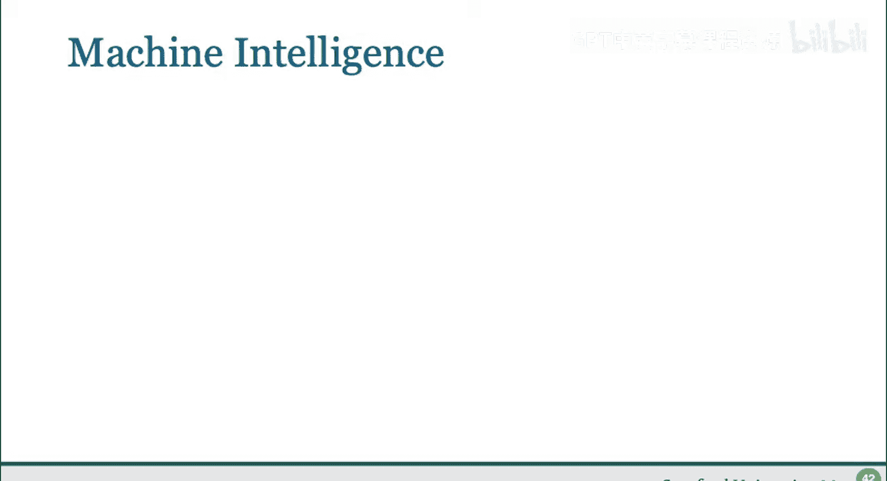
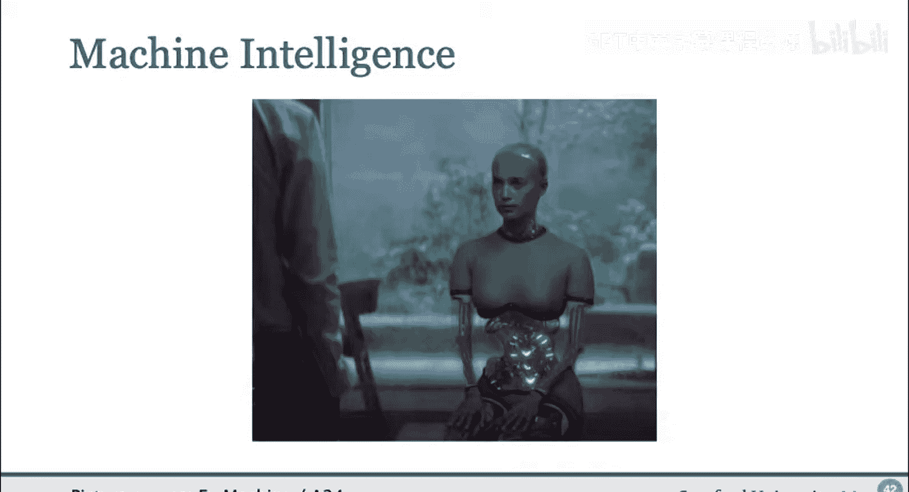
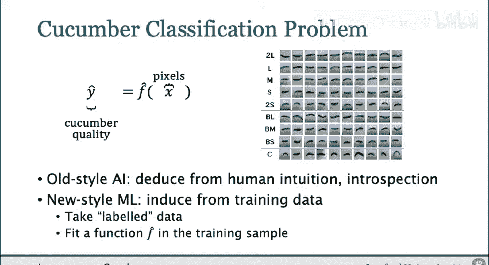
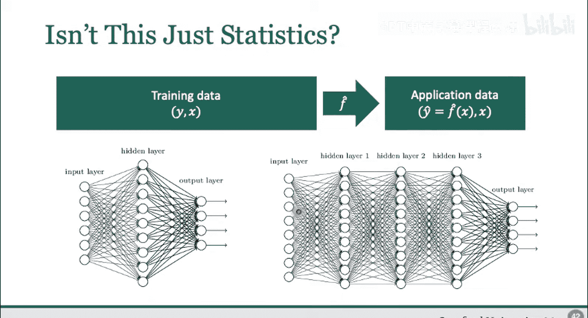
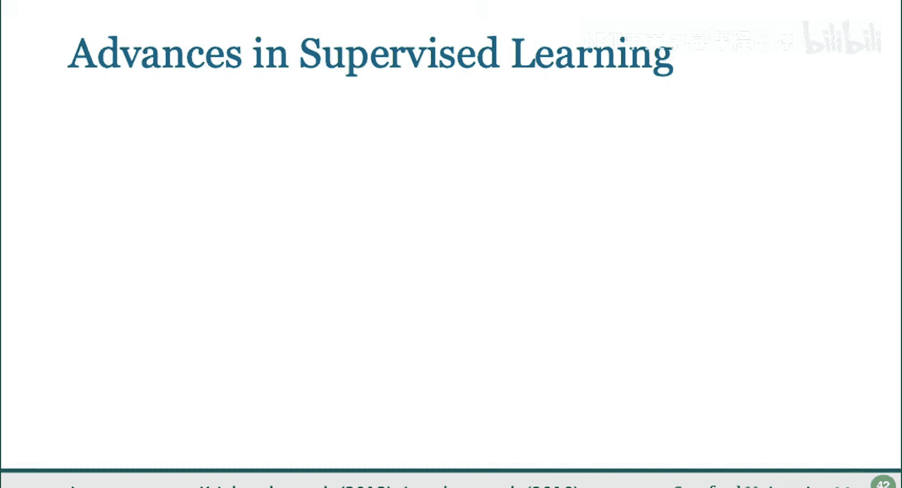
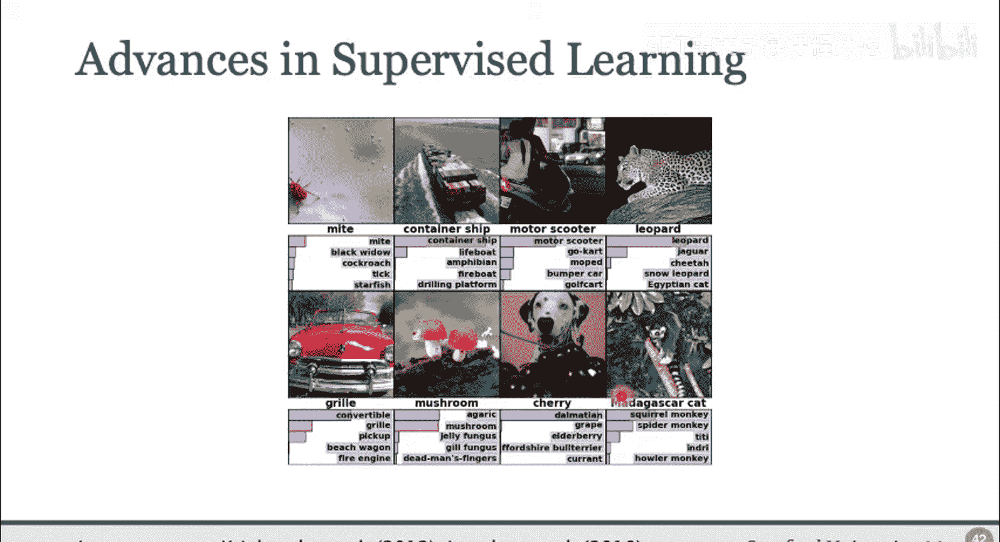
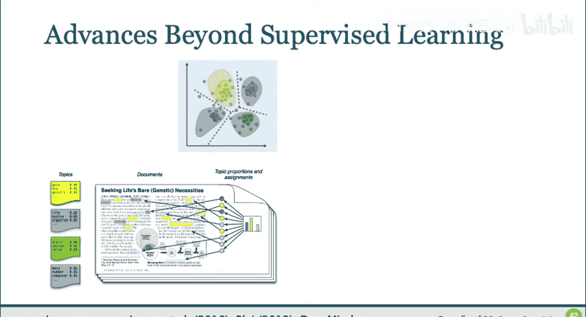
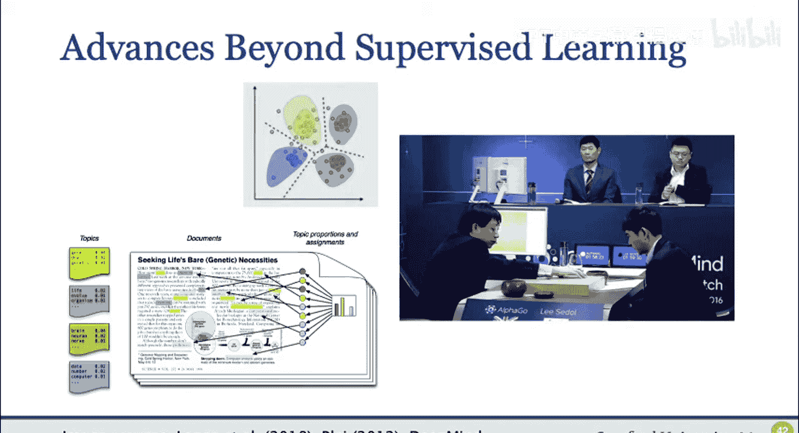
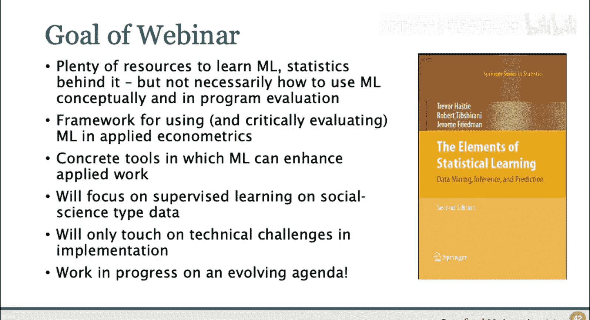
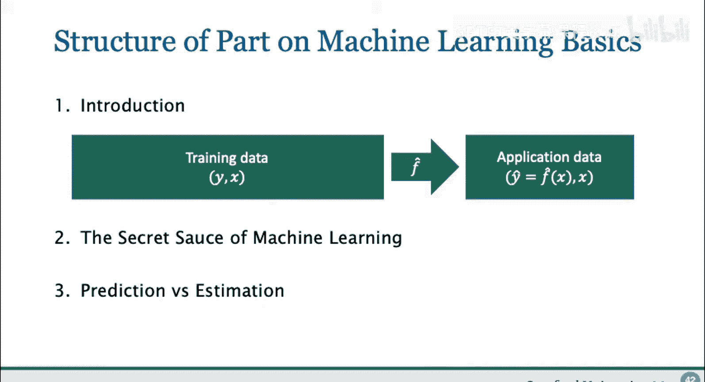

#  002：应用机器学习导论 🧠

在本节课中，我们将从应用视角介绍机器学习。课程将面向应用计量经济学的研究者和实践者，探讨如何将机器学习纳入计量经济学工具箱，并了解基于机器学习的新工具如何改进实证分析。

## 概述：现代机器智能的奇迹

当我们思考机器智能时，可能会联想到科幻电影中的未来场景。然而，许多机器智能技术已经存在于我们的日常生活中。

例如，Facebook不仅能识别照片中的人脸，还能识别出具体是哪位好友。Google Translate不仅能将图片中的文字转换为计算机可读格式，还能将其翻译成另一种语言并叠加在原图上。此外，现代汽车能够检测环境中的障碍物并采取规避行动，一些汽车甚至能完全自动驾驶。

这些例子构成了我们接下来几个模块的动机。具体来说，我们首先想探究：我们是如何能够解决如此复杂的机器智能任务的？其次，基于我们对这些任务及其解决方法的了解，我们能否为应用计量经济学学到一些东西，从而改进我们通常进行的分析（例如分析田野实验）？

## 从传统AI到现代机器学习 🥒

为了更好地理解现代机器智能的工作原理，让我们从一个日本黄瓜农场的故事开始。农场需要根据质量对黄瓜进行分类，这通常是一项繁琐的人工任务。农场主的儿子试图通过建造一台机器来自动完成这项工作：用相机拍摄每根黄瓜的照片，然后让计算机判断其质量。

这本质上是一个**分类问题**。我们拥有数据 **X**（即图片的像素），目标是基于 **X** 预测黄瓜的质量 **Y**。

### 传统方法：基于规则的编程

最初，人们可能会尝试通过编写程序来模拟人类的决策过程。例如，程序可以尝试识别黄瓜与背景的像素，测量黄瓜的颜色和曲率，然后根据预设的规则（如“颜色健康绿”且“曲率低于某阈值”）判断是否为高质量黄瓜。

这就是传统人工智能的方法：理解人类如何决策，然后将规则编码到计算机中。然而，这种方法并不十分成功。

### 现代方法：基于数据的统计学习

现代机器学习则将这个问题转化为一个**统计问题**，核心思想是从训练数据中学习映射关系，而非依赖人类直觉来编写规则。

具体来说，我们可以使用**标注数据**（即已知每张图片对应黄瓜质量的数据），然后拟合一个函数，将图像映射到质量类别。通过寻找一个拟合效果特别好的函数，我们就能解决这个分类问题。

这个过程看起来很像统计学：我们拥有结果变量 **Y** 和协变量 **X**，希望提取 **X** 与 **Y** 之间的关系结构。

## 机器学习为何不同？🔍

那么，机器学习与传统的线性回归等方法有何不同？

第一个明显的区别在于，机器学习使用**更灵活、更丰富的数据驱动模型**。在传统计量经济学中，我们可能拟合简单的线性回归或逻辑回归。但在图像分类问题中，**X** 是所有像素构成的高维向量，简单的逻辑回归模型 **P(Y=1|X) = 1/(1+e^{-(β₀+β₁X₁+...+βₖXₖ)})** 效果不佳。

原因有二：
1.  向量 **X** 维度太高。
2.  该函数形式不足以捕捉像素与质量之间的复杂关系。理解图像需要理解相邻像素之间的关系，而标准函数形式在这方面非常不足。

因此，机器学习需要使用更复杂的函数。例如，我们可能使用**神经网络**。在神经网络中，输出 **M** 不仅仅是输入 **X** 的函数，而是**中间变量**的函数。可以将其理解为“函数的函数”。

一个简单的神经网络输出可以表示为：
`M = σ( W₂ * σ( W₁ * X + b₁ ) + b₂ )`
其中 **σ** 是激活函数（如sigmoid函数），**W** 是权重矩阵，**b** 是偏置项。

在实践中，我们使用的层数远不止两层。从简单神经网络发展到**深度学习**，就是通过添加更多层来实现的。因此，预测函数可能看起来像多个嵌套的复杂变换。

## 机器学习成功的关键要素 ⚙️

为了使这种灵活的方法有效工作，我们需要另外两个关键要素：

1.  **限制函数表达能力以避免过拟合**：我们需要确保机器学习在搜索复杂函数时找到的模式不是虚假的。
2.  **使用数据决定允许的表达能力**：即决定**正则化**的程度，这个过程也称为**调参**。

此外，机器学习工具之所以具有巨大影响力，还因为它们**易于获取**。除了概念上的突破，我们现在拥有处理复杂数据的计算能力，并且相关的软件工具（如Google的TensorFlow）对所有人开放。前文提到的日本农场主的儿子，正是利用这些开源工具实现了黄瓜分类器。

## 聚焦：监督学习与预测 📈

在本课程中，我们将重点讨论一种特定类型的机器学习：**专注于预测的监督学习**。

在监督学习中，我们拥有带标签的数据（即已知 **Y** 和 **X**），目标是学习 **Y** 与 **X** 之间的关系。本课程开篇提到的许多智能任务，都可以转化为监督学习问题。

以下是监督学习的一些应用实例：
*   **黄瓜分类**：预测黄瓜质量。
*   **信贷审批**：银行根据客户过去的财务行为数据，预测其贷款违约的可能性。
*   **税务审计**：税务局利用历史审计数据，预测哪些报税表可能存在问题。
*   **图像识别**：如Facebook的人脸识别。
*   **自动驾驶（简化版）**：可以将所有传感器输入作为 **X**，将人类驾驶员的操控动作作为 **Y**，通过预测人类在特定情境下的行为来实现初步的自动驾驶。虽然这不是最先进的方法，但它凸显了监督学习范式的力量。

## 监督学习的巨大成功 🏆

监督学习取得了令人瞩目的成功，图像识别竞赛ImageNet的结果就是一个例证。

在ImageNet竞赛中，参赛者会获得一个包含已标注图片的大型训练集，然后需要在一个未标注的新图片集上进行识别。评估标准是算法的错误率。

过去十年间，顶级机器学习算法的性能突飞猛进：
*   最初，机器的错误率约为三分之一（约33%），这已经相当令人印象深刻。
*   到2017年，错误率已降至约2%。
*   相比之下，人类在相同任务上的错误率约为5%。

这意味着，机器在图像识别这项人类原本擅长的任务上，已经系统地超越了人类。

## 超越监督学习：更广阔的机器学习世界 🌐

机器学习的成功远不止于监督学习或预测任务。

*   **无监督学习**：旨在发现**无标签数据**中的结构。例如：
    *   **聚类分析**：寻找相似数据点的群组。
    *   **主题模型**：用于从大量文本中自动提取结构，例如理解文本主题随时间的变化。
*   **强化学习**：在游戏AI领域取得了突破。例如，AlphaGo通过分析人类棋谱学习围棋，而更先进的AlphaZero则完全通过自我对弈来发现超越人类和现有计算机程序的策略。

## 本课程的目标与范围 🎯

本系列课程的目标并非教授最前沿的机器学习技术或如何训练神经网络。我们的重点在于**将机器学习世界与应用计量经济学及行为科学的世界连接起来**，将机器学习作为一种工具来使用。

市面上已有大量资源来学习机器学习及其背后的统计学原理。因此，本课程更侧重于从概念上展示如何使用这些工具，以及如何将其具体应用于项目评估等场景。

具体来说，本课程的目标是：
1.  提供一个框架，用于在应用计量学中使用和批判性评估机器学习。
2.  在此基础上，将其与因果推断和项目评估中的典型任务结合起来。
3.  最终，为大家提供一些具体的工具，展示机器学习如何切实增强应用研究工作。

### 课程范围说明：
*   **数据**：重点关注社会科学类型的数据集（例如，根据房屋特征预测房价，或预测扶贫目标对象），而非处理大型像素图的图像分类问题。
*   **技术**：将主要讨论如何使用现有工具，而非从头编写代码。但会提供足够的概念理解，以便大家知道需要注意什么，以及如何利用这些工具改进工作。
*   **前沿性**：课程内容非常贴近当前研究，属于一个不断发展的议程，相关方法在未来几年可能还会演变。

## 总结与预告 📚

本节课我们一起学习了机器学习的应用导论。我们探讨了现代机器智能的核心通常具有**预测任务**的结构：利用包含结果变量 **Y** 和协变量 **X** 的训练数据，学习一个函数并将其应用于新实例。

在下一节课中，我们将深入探讨**机器学习的“秘密武器”**，理解是什么使得这种预测如此成功，尤其是当我们使用标准线性回归工具处理像复杂像素图这样的任务显得力不从心时。

在本次系列课程的最后一个模块中，我们将通过指出机器学习技术与计量经济学常用技术**目标不同**，来总结二者的区别。并以此为基础，提供一个框架，说明在哪些领域可以最有效地利用机器学习，以及在哪些领域需要特别谨慎。

下节课见！