#  003：应用机器学习的“秘方” 🧠

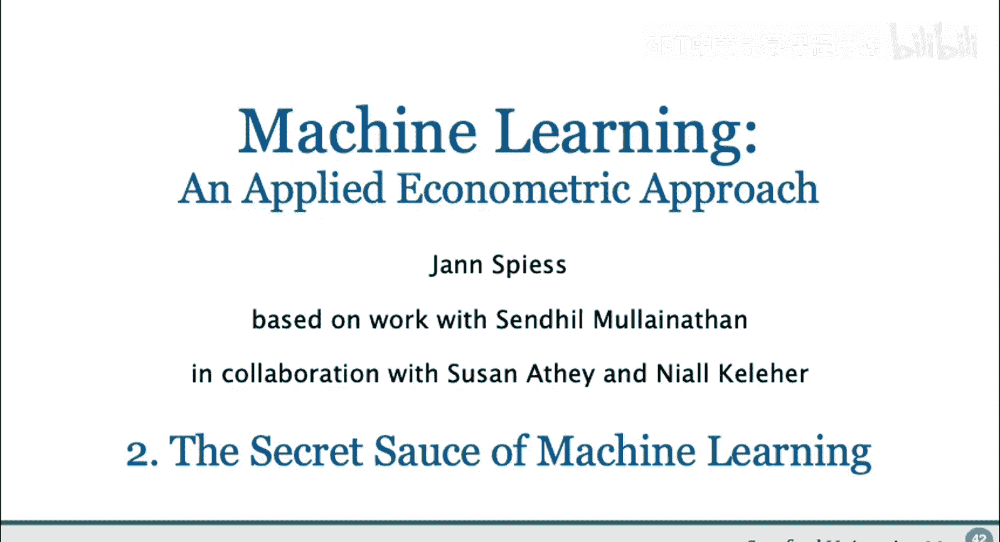

在本节课中，我们将从应用视角深入探讨机器学习，特别面向希望将机器学习纳入计量经济学工具箱的研究者和实践者。我们将理解基于机器学习的新工具如何改进实证分析。

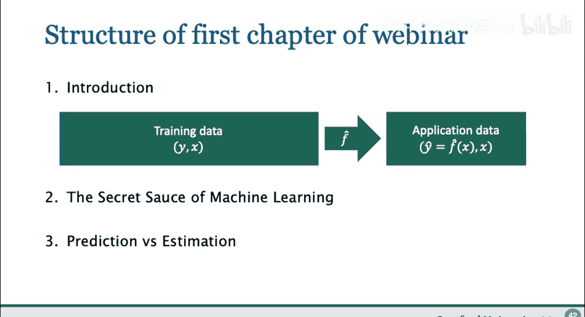

在上一节中，我们讨论了机器学习特别擅长解决预测问题，即从训练数据中找到一个能很好外推到新数据点的预测函数。这种预测问题的解决方案对于解决机器智能问题的进展至关重要。

本节中，我们将探讨机器学习为何在预测方面表现如此出色，尤其是在处理非常复杂的数据和使用非常复杂的函数形式时。接着，在课程的下一个部分，我们将讨论机器学习工作方式的一些启示，特别是当我们真正关心估计（包括因果估计）时，机器学习如何应用。

现在，让我们完全专注于解决一个预测问题。以下是我们的设定。

## 预测问题的设定 📊

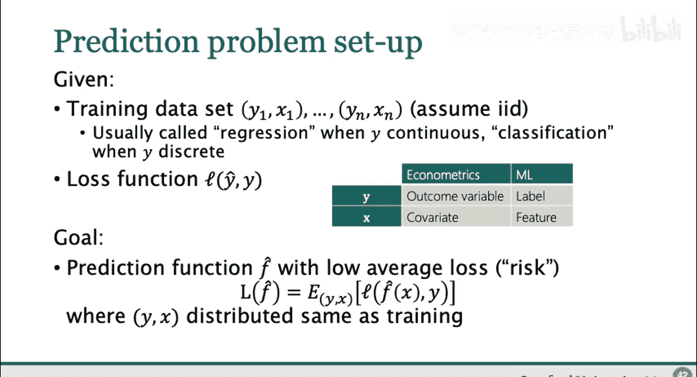

我们假设有一个训练数据集。数据点由一个结果变量 **Y** 和一个右侧变量或协变量 **x** 构成。我们的目标是根据 **x** 预测 **y**。

为了更精确地定义，我们假设存在一个损失函数。该损失函数表达了当真实值为 **y** 时，我们预测为 **ŷ** 所必须付出的代价。

我们的目标是基于协变量 **x** 和使用某个预测函数 **f**，预测来自同一分布的新数据点的结果 **Y**，使得这个平均损失尽可能小。

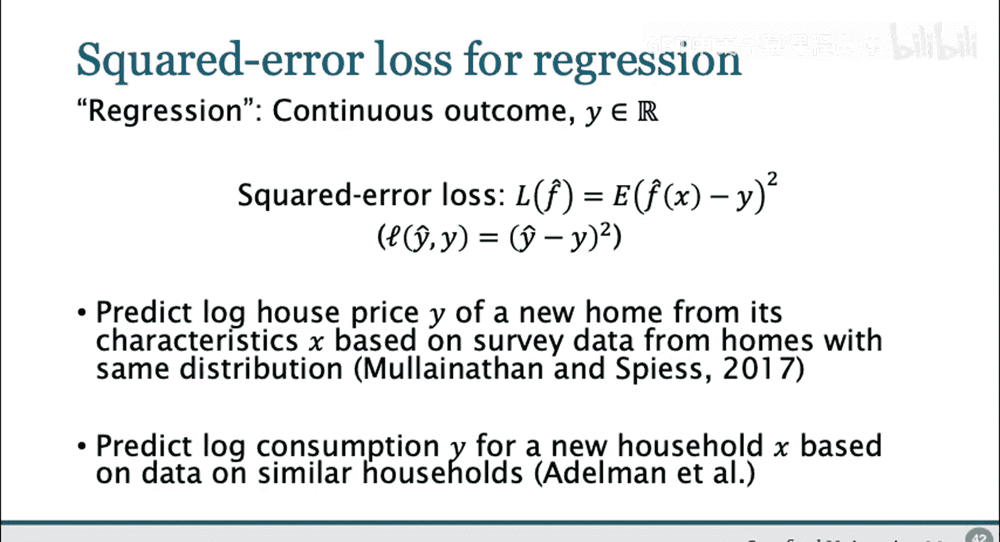

到目前为止，这听起来很像标准的计量经济学：有一个结果 **Y**，一些协变量 **x**。标准计量经济学和机器学习之间的第一个区别仅仅是这些变量的称呼不同。具体来说，我称之为结果变量 **Y** 的，在机器学习中通常被称为**标签**。我称之为协变量 **X** 的，通常被称为**特征**。

让我重新表述机器学习的目标：机器学习的目标是获取一个带有标签数据的训练数据集（即每个实例都有标签和特征），并从中找到一个预测函数，使得当我们根据特征预测新数据点的标签时，平均损失或风险尽可能小。需要澄清的是，这里我讨论的是**监督学习**，意味着我们的训练数据集中确实有标签，我们不需要在没有标签指导的情况下从协变量中寻找结构。

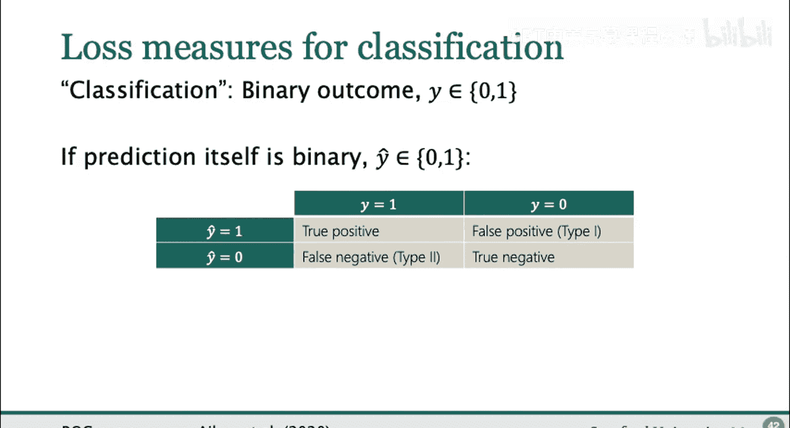

## 两种标准的预测问题 🔍

以下是两种标准的预测问题。

第一种称为**回归**，即当结果变量本身是连续的时候。我们经常为了方便或因其对特定任务有良好性质而使用的标准损失函数是平方误差损失。我们的目标是最小化预测值与来自同一分布的新实例的真实标签之间的平均平方差。换句话说，这里的损失函数就是 **(ŷ - y)²**。

我将贯穿今天课程使用的两个例子：
1.  预测新房子的**对数房价 (y)**，基于该房子在具有相同分布的房屋样本中的特征 **X**。
2.  预测基于家庭特征的**消费**。这在例如贫困瞄准和社会项目针对特别贫困人群时，是一个非常重要的任务，因为消费可能是衡量其贫困程度的一个良好指标。

第二种典型的预测情况是当感兴趣的结果本身是二元的。在这种情况下，我们称这种预测练习为**分类**。

考虑预测本身是二元的情况。基本上，真实值是 0 或 1，我给出我的最佳猜测。在这种情况下，我可能犯两种错误，因此有两种情况我们可能希望将代价与所犯的错误关联起来。

第一种情况是真实值实际上是 0，但预测是 1。我们称之为**假阳性**或**第一类错误**。第二种情况是真实值是 1，但我的预测是 0。我们称之为**假阴性**或**第二类错误**。如果我想设计一个损失函数，我可以为第一类和第二类错误设定特定的代价，可能基于我关心的具体问题，然后尝试找到一个分类函数来最小化该错误或与之相关的代价。

然而，在许多二元分类的情况下，我们实际上预测的是结果为 1 的**概率**。在这种情况下，量化分类规则质量的一种流行方法是绘制**受试者工作特征曲线**。该曲线的 x 轴是假阳性率，y 轴是真阳性率。对于每一个假阳性率（即假阳性占所有负例的比例），我绘制相应的真阳性率（即真阳性占所有实际正例的比例）。通过在不同的阈值下（例如，我称所有预测概率非常高的人为 1，并改变该阈值），我可以绘制假阳性率和真阳性率相互对应的曲线。曲线越靠近图的左上角，我的预测就越好。因此，量化二元预测或分类质量的另一种方法是查看该曲线，并询问该曲线离左上角有多远，例如，可以通过积分曲线下的面积来实现，这给了我**曲线下面积**。

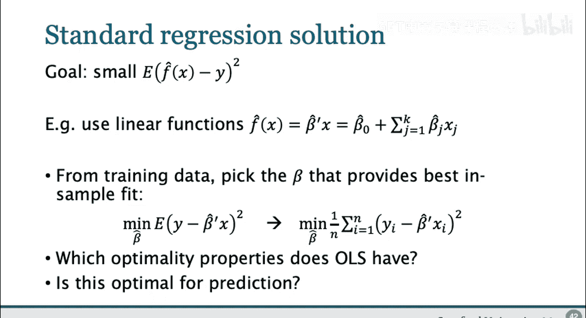

虽然我不会在这里详细讨论分类（即对二元结果进行预测），但了解术语“受试者工作特征”和“曲线下面积”有助于理解这些指的是量化分类函数质量的不同方式，或者换句话说，量化当感兴趣的结果是 0/1 时的预测质量。

## 回归预测与线性回归 📈

现在我想回到回归情况下的预测目标，即我们的结果实际上是连续的。假设我们想找到一个预测函数 **f̂**，使得相对于真实结果 **y** 的平均平方误差或均方误差尽可能小。

例如，我们可以尝试通过使用线性函数来实现这一点。这些线性函数非常像线性回归。它只是对不同的协变量 **X** 赋予一个系数，这里假设这些协变量或特征本身是连续变量。

因此，从训练数据中，例如，我可以选择线性回归中的系数 **β**，它提供了最佳的样本内拟合。这是我们非常熟悉的，这就是简单的线性回归。那么线性回归做了什么？它说我的目标是最小化样本外均方误差。我能做的最好的事情是什么？我只需查看已有的数据，并询问哪组系数能最小化我已有数据中的误差，这就是我想要选择的系数。

让我们退一步思考一下：这种方法（我们非常熟悉，因为它就是线性回归）在解决手头的预测问题方面有多好？

首先，有一些好消息：我们知道线性最小二乘法或线性回归具有许多最优性质，这些性质适用于这种情况。例如，根据高斯-马尔可夫定理，如果这里所有的误差项都是同方差的（意味着误差不会随协变量 **X** 系统性变化），那么 OLS 确实是具有最小方差的系数 **β** 的无偏估计量。

我刚才说了一大堆东西。首先，我指出它是无偏的，因为我称其为最优无偏估计量。其次，我说在所有无偏估计量中，它具有低方差。但当我们谈论样本外预测时，这并不立即清楚是否正是我们想要的。确实，我们现在可以问一个问题：这些性质是否也转化为样本外的最优预测器。

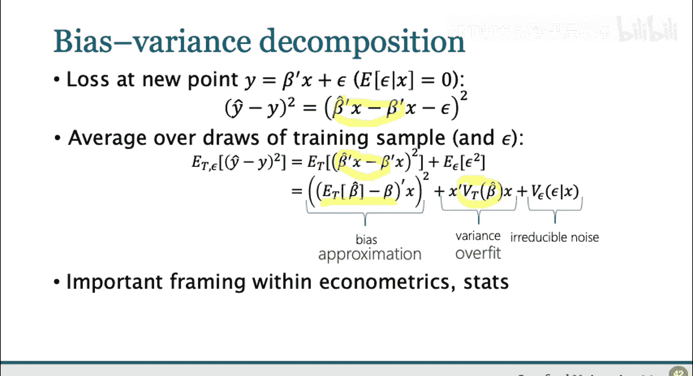

## 偏差-方差权衡与过拟合 ⚖️

现在我想通过一个稍微形式化的论证来理解线性回归估计量是否不仅在估计参数 **β** 方面表现良好（正如我们刚才讨论的，这意味着它具有零偏差和低方差），而且这些性质是否也转化为良好的预测解决方案。

为此，我考虑一个新数据点，我假设这个新数据点实际上是由协变量 **x** 和结果 **y** 之间的线性关系以及一些额外的噪声生成的。所以我假设这个新数据点由 **y = β * x + ε** 给出。

当我用某个 **β̂**（即我在训练数据集中的 OLS 解）来估计我的系数 **β** 时，我会犯一定的错误。这个错误对应于我的预测 **ŷ** 与真实值 **y** 之间的差异，或者换句话说，我的预测 **β̂ * x** 减去真实值 **β * x** 再减去 **ε**。

当我将其平方并对它取平均时（既对训练样本的抽取取平均，也对误差 **ε** 取平均），我们会看到这个误差有多个组成部分。

首先，我总是会犯一些错误，因为有这个额外的项 **ε** 我无法消除，所以在我的损失计算中会存在一些不可约的方差。其次，真实系数 **β** 和我的估计值 **β̂** 之间会存在差异。这部分损失实际上可以写成两个部分的和。首先，我可以问，平均而言，如果我重新抽取许多训练数据样本，我的 **β̂** 是否接近 **β**？这是偏差部分，即 **β** 与 **β̂** 的平均值之间的差异。其次，我可以问，当我重新抽取训练样本时，我的 **β̂** 从一次抽取到另一次抽取的变化有多大？这贡献了方差。

换句话说，我获得的损失有三个组成部分：
1.  不可约的噪声。
2.  偏差，即平均而言，我的系数与真实系数相差多少。
3.  方差，即当我反复计算系数时，这个系数从一次抽取到另一次抽取的变化有多大。

这种被称为**偏差-方差分解**的分解是计量经济学和统计学中良好预测挑战的重要框架，因为它表明当我的兴趣在于良好预测（即我希望平均而言接近真实值）时，一个无偏的估计量不一定是最优估计量。因为虽然它的偏差分量为 0，但可能意味着方差分量比它必须的要高。有时我可以通过平衡这两者来做得更好。换句话说，通过最优地解决偏差-方差权衡。

对于机器学习，函数形式可能看起来比这种线性回归更复杂，有时损失函数也与平方误差损失不同。因此，我个人更喜欢一种表述，即我们在这里面临**近似**与**过拟合**之间的权衡。

这是什么意思？**近似偏差**发生在我的函数即使在平均意义上也无法很好地近似真实函数时。另一方面，如果函数非常灵活，因此可以非常详细地拟合我想要拟合的函数，那么近似质量就很高。然而，这种高近似质量也意味着存在高**过拟合**，这意味着从一次抽取到另一次抽取，我不仅拟合了信号（即 **y** 和 **x** 之间的真实关系），还拟合了很多噪声（即这里的 **ε**），导致高方差。因此，总的来说，我喜欢称之为近似与过拟合之间的权衡，这很好地推广到其他不一定与简单线性回归处于同一空间的机器学习方法。

## 近似与过拟合的实例演示 📉

为了进一步探索这种近似与过拟合的权衡，并给出一个不依赖于我刚才展示的数学的例子，让我们考虑一个情况，我们的目标是拟合协变量 **x** 和结果 **y** 之间的这种关系，目标是找到一个能在新数据点上预测良好的函数。

这里我查看了 8 个数据点，并使用结果 **y** 和协变量 **x** 之间的简单线性回归来找到关系。现在，我可以通过查看当我绘制新数据点（此处为红色）时，这条线拟合得如何来尝试找出它的表现。我将蓝色数据点称为我的训练样本，红色数据点称为我的测试样本。我的目标是使用训练样本来尽可能接近测试样本点相对于我的回归线。换句话说，我希望位于一条尽可能接近这些红点的线上，以便根据它们的 x 值很好地预测它们的 y 值。

现在，让我们思考一下我们是否能比这里看到的做得更好。例如，我们可以使用一个更复杂的函数，不仅仅是 **y** 和 **x** 之间的简单线性关系，而是可以使用一个 2 次多项式或抛物线来拟合。

这条蓝色的曲线实际上更好地拟合了训练数据集中的点，因为它更灵活。它能够更好地捕捉训练数据集中那些蓝点之间的关系。然而，同时我们看到在测试数据点上的拟合实际上变得更差。这里发生了什么？我们有一个更复杂的函数。这个更复杂的函数能够更详细地近似 **y** 变量和 **x** 变量之间的关系，但同时它也更容易过拟合，因为一些灵活性不仅用于更好地拟合 **y** 和 **x** 之间的真实关系，还用于拟合一些噪声。

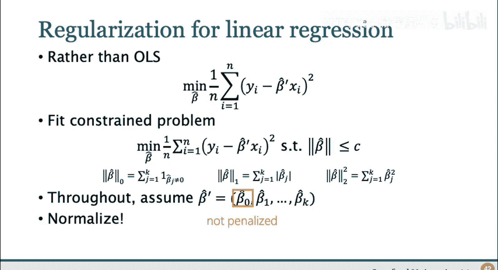

当我们为多项式添加更多次数时，这一点变得更加极端。例如，当我在这里再添加两个次数，并查看 4 次多项式时，我看到蓝线开始几乎完美地拟合训练数据集中的点，然而它在测试数据集上的拟合方式却越来越差。那么这里发生了什么？

随着我们为函数添加更多的自由度（在这里我通过向回归中添加额外的多项式来表达），我的样本内拟合（此处为蓝色）变得越来越好。因此，样本内拟合误差越来越低，因为我添加的自由度越多，这个函数就越能近似任何潜在的关系，并且它能更好地拟合已经看到的数据。

同时，对于新数据点的拟合（这正是我追求的目标），预测质量最初会增加（意味着损失会越来越低），但随后它也开始越来越多地拟合数据中的特异之处，因此在某个点之后，净损失会增加，预测质量会下降，因为过拟合的负面影响超过了更好近似的正面影响。

总结来说，随着模型变得更复杂，它开始越来越地拟合真实函数，因此其近似质量增加。但同时，它也开始越来越地拟合噪声，过拟合也随之增加。因此，当我们进行机器学习，当我们想要能够在非常高维度中预测良好时，重要的是我们不仅要使用能够很好表达该关系的灵活函数形式，还要限制它们的表达能力，或者换句话说，我们使用**正则化**来控制我们允许的过拟合程度。最优情况下，在我刚刚展示的例子中，我们会找到一个点，在这个点上这两个权衡以一种使整体预测质量更好的方式达到平衡。

## 正则化的具体方法：LASSO 与 Ridge 🛠️

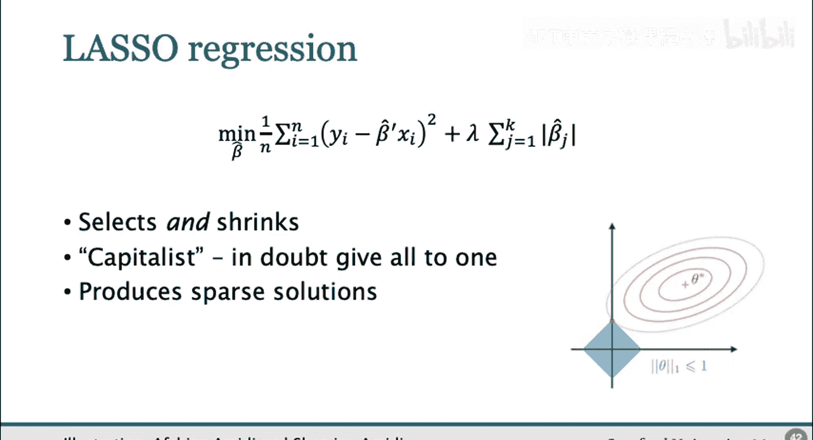

现在我想给出几个具体例子，说明这种正则化可能是什么样子。我刚才展示的例子中，我们只是简单地改变了线性回归中的多项式次数。在实践中，这可能不是构建更复杂或更简单函数的最明智方式，尤其是在已经有很多协变量可用的情况下。因此，相反，我们将在这里明确地包含正则化，即明确限制函数的表达能力，目前仍在线性回归的框架内。

具体来说，与其运行最小化样本内拟合的 OLS 解，我们最小化样本内拟合，但受到一些约束，这些约束表明我们的函数不能太复杂。具体来说，我们将通过使用系数的某种范数或伪范数来实现这一点，并规定这些系数不能太大。

我们在这里考虑的典型范数有哪些？第一个实际上不是一个真正的范数，但非常直观。它说让我们限制允许为非零的系数的数量。换句话说，当我使用这里的第一个准则时，我会说让我们找到只使用特定数量变量（例如可用变量中的 C 个）的回归拟合，所有其他变量必须为 0。基于这些变量，我尝试找到最佳拟合。这会给我一个稀疏解。然而，它有一个很大的缺点，即计算上不可行，因为我实际上必须尝试许多不同的变量组合才能找到最优解。

相反，我们经常使用的一种正则化方式是使用一个范数，该范数规定让我们对所有系数的绝对值设定一个限制，即我们取线性回归中系数的绝对值，并对这些绝对值求和，然后不允许这个绝对系数和太高。

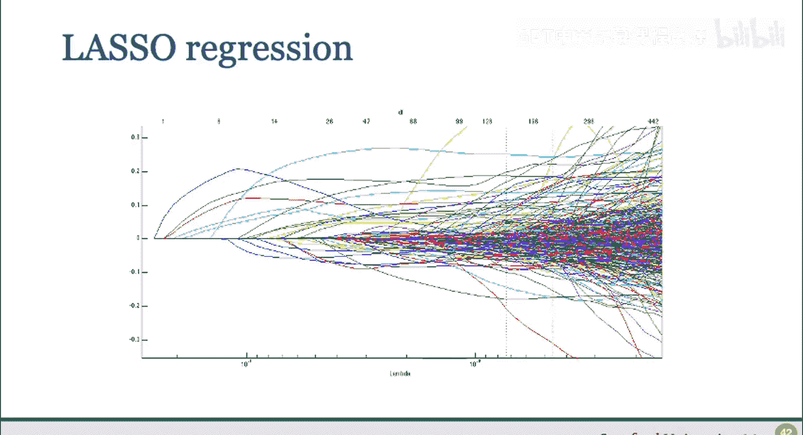

第三种表现良好的正则化方式是使用欧几里得范数或这些回归系数的平方和。并规定让我们找到一个解，其中这些回归系数的平方和不太高。

在所有这些情况下，我们实际上都获得了一个杠杆，通过它我们可以控制函数的复杂性。例如，通过规定只有给定数量的系数可以非零，或者系数的总大小不允许超过某个阈值。

我现在将详细讨论其中的两个例子，特别是对应于 L1 范数（绝对系数和）和 L2 范数（平方系数和）的例子。并且，为了技术假设和实用性，我将假设这些系数不惩罚截距项，并且我们已经对 X 协变量进行了标准化，使得不同的方向实际上具有可比性，并且对系数施加范数是有意义的。

### LASSO 回归

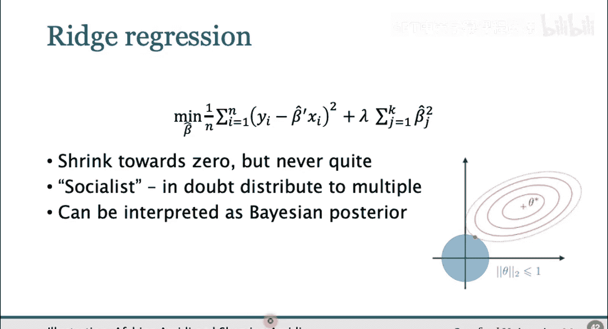

我想考虑的第一个例子是我们用 L1 范数（即各个绝对系数大小的和）来限制系数大小的情况。

这意味着所有允许我使用的系数必须位于原点周围的这个菱形内。因此，与其找到位于这些同心圆中心的无约束最优点，我将在可行集内（即在这种情况下较小的系数集合内）找到根据预测所隐含的距离最接近该中心的点。

在实践中，我们实际上不会解决这个问题。在许多情况下，我们会解决该问题的拉格朗日松弛形式，该形式用影子成本替代了系数不能太高的约束，该影子成本表示基本上每当系数增大时都必须付出代价。换句话说，我们求解拉格朗日问题，即我们希望最小化样本内损失加上系数大小的成本。

这种特定的回归称为**LASSO 回归**。我现在想讨论它的几个性质。

从右边的图中你已经可以看到的第一个性质是，它倾向于产生不仅收缩（因为我们将成本与较大的系数相关联，所以系数比 OLS 的小）而且通常是稀疏的结果，意味着这种回归方法也会选择用于预测的变量子集，并使许多变量恰好为零。原因是，我们之前讨论的约束的可行集虽然是凸的，但也有“角点”，这意味着在某些情况下会产生恰好为零的解。

理解 LASSO 作用的一种方式是，LASSO 是**资本主义的**。当 LASSO 可以选择多个非零系数，并且这些系数以类似的方式贡献于预测时，它倾向于只选择其中一个，因此它倾向于选择“赢家”，倾向于产生许多零的解。

在实践中，这看起来如何？在实践中，我们可以改变与更复杂系数相关的成本 **λ**。这里有一个图表，我正是这样做的：我运行了一个 LASSO 回归，并改变了系数 **λ**。在这种情况下，**λ** 在左侧非常高，在右侧非常低。所以这里的轴与通常的方向相反。这意味着在左侧，拥有非零系数的成本非常高。确实，我们看到成本高到足以使最优解实际上将所有系数设置为 0。现在，每条彩色线代表一个系数。随着我们降低 **λ**，随着我们使包含系数变得越来越便宜，我们看到一些系数开始变为非零，并且随着我们降低较大系数的成本，它们也开始增加。有趣的是，越来越多的系数将进入我们的支持集，即越来越多的系数将被选择，但这并不一定意味着所有这些系数都会增加，也可能它们首先增加，然后随着其他系数被包含而再次减少。

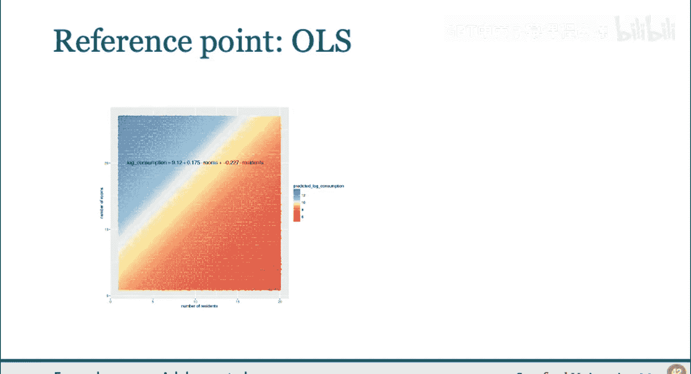

因此，这又是进行正则化的一种方式，这是通过规定让我们使用一个约束来控制线性回归解的复杂性的一种方式，该约束与“我只想对有限的一组变量进行线性回归”非常相似，但与其限制变量的数量（这在计算上非常困难，并且具有一些不良特性），我取而代之的是希望找到一个解，其中系数的大小不太大，在这种特定情况下，我通过绝对值的和来衡量这些系数的大小。

### Ridge 回归

另一种流行且非常相似的回归方法是**Ridge 回归**，其中我使用系数的平方和作为惩罚参数，而不是绝对值的和。所以现在我必须在系数的平方和变大时付出代价。

那么在我们之前的图片中，这会是什么样子？在我们之前考虑如何限制参数大小（即惩罚或系数大小到特定数字）的约束集的图片中，这意味着在这种情况下，我们会将它们限制在原点周围的圆内。

具体来说，例如，如果我将参数限制在平方和最大为 1 的范围内，那么我将恰好将我可以使用的参数限制在半径为 1 的原点同心圆内，并且我将选择在预测所隐含的特定距离度量下最接近 OLS 解的点。

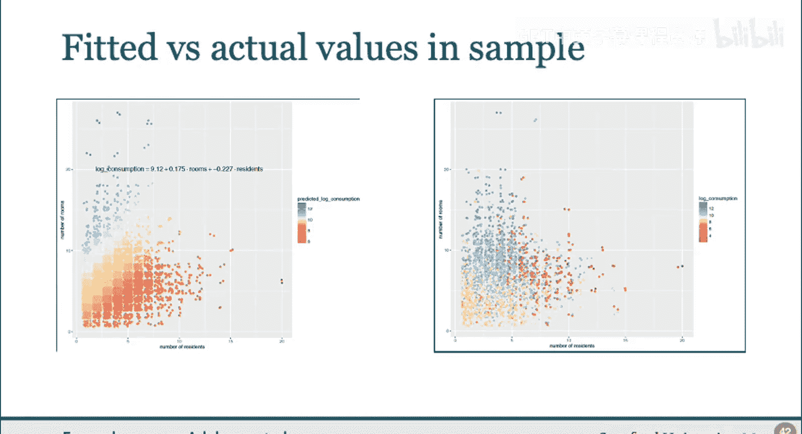

与 LASSO 不同，Ridge 回归的性质截然不同。虽然 Ridge 回归仍然导致系数大小变小（因为它对较高的系数施加了代价），但 Ridge 回归不太可能将某些系数恰好设置为零。相反，如果有多个系数可以发挥类似的作用（意味着它们对产生的预测具有类似的作用），Ridge 倾向于成为**社会主义的**，意味着在存疑时，它会在多个系数之间分配预测能力，并产生多个非零但不太高的系数，而不是产生少数非零且高的系数以及许多为零的系数。

换句话说，这个社会主义估计量不产生稀疏解，而是倾向于产生所有系数都不太高但也没有太接近零的解。这种估计量的一种解释是，它可以被解释为贝叶斯后验，其中我假设我的系数具有以零为中心的正态先验，这正好导致了那种收缩。

## 从线性到非线性：回归树 🌳

我们现在已经看到了两种可以限制线性回归复杂性的方法。第一种 LASSO 倾向于资本主义，并将某些系数恰好设置为 0。第二种 Ridge 倾向于社会主义，并以系数不太高的方式分配系数，但也没有将任何系数恰好设为零。还有第三种方法称为**弹性网络**，它通过添加一个混合了 Ridge 惩罚和 LASSO 惩罚的惩罚来混合这两者。在这种情况下，我既可以调整我想要为复杂性付出多少代价的参数 **λ**，也可以调整通常称为 **α** 的参数，它告诉我如何混合这两者。

这些是我们经常称之为机器学习估计量的两种估计量，但老实说，它们非常接近线性回归，也来自统计学，Ridge 估计量是一个非常经典的统计估计量。然而，我以此作为我们讨论机器学习的切入点，因为尽管这些估计量非常接近线性回归，但它们具有机器学习估计量通常具有的许多一般结构。

具体来说，许多监督学习算法（即构建用于解决预测问题的算法）的特征在于特征的组合：首先，它们优化哪个函数类；其次，它们正则化的方式（即控制复杂性的方式）；第三，它们解决在正则化约束下找到优化拟合的估计量的优化问题的方式。

我展示的线性回归估计量只是一些例子，现在我想展示一些属于同一种结构的其他算法。

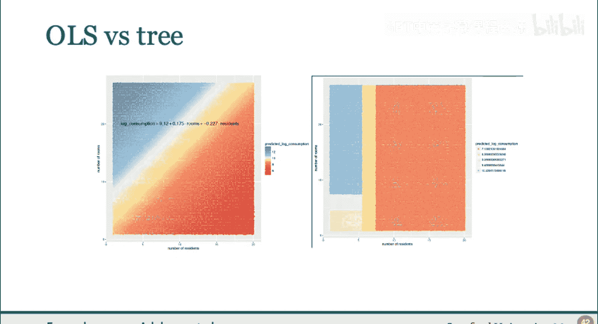

为了激发我想看的下一种估计量，我想考虑一个在公共政策中使用预测方法的重要例子：**贫困瞄准**。在贫困瞄准中，我们的目标是找到那些特别需要支持的家庭。因此，我们可以有效地将其视为一个预测问题，其中感兴趣的结果是消费，我们可用的变量（即可用的特征）是我们拥有的任何特征，例如可用于瞄准的行政数据。因此，实际上，我们正在解决一个预测问题，右侧是家庭特征，左侧是消费（或者在这种情况下，我们使用对数消费）。

现在让我给你一个非常具体的例子，我们只用两个变量来预测对数消费。我们在这里考虑的两个变量是 x 轴上的居民人数和 y 轴上的房间数。在这里，我们通过颜色梯度将预测绘制为颜色。具体来说，我们看到了基于对数消费对常数项、房间数和居民数的线性回归的预测。我们看到，线性回归由于其构造方式，具有这些非常全局的梯度，在这种情况下转化为从左上角（消费被认为特别高）到右下角（消费被认为特别低）的梯度。然而，请注意，并非此图上的每个区域实际上都有我们样本中的家庭。因此，让我们只看样本中的那些家庭。

仅针对样本中的那些家庭，我们看到实际上很少有家庭同时拥有非常高的居民数和非常高的房间数，但有一些家庭居民数少而房间数多，也有一些家庭房间数少而居民数多。

那么，让我们看看这种试图拟合这两个变量与对数消费之间全局关系的线性回归，与我们样本中的实际消费值相比如何。在左侧，我绘制了预测消费，在右侧，我们看到的是实际消费。我们看到这大致吻合，是的，在左上角，消费确实非常高，这些是居民数少、房间数多的人。在右侧，居民数非常多的地方，消费看起来确实非常少。然而，当我观察这一点时，我会认为左侧的线性关系在表达这两个变量如何影响结果（这里不是消费）方面并不是很好。

具体来说，当我观察这个时，我会说可能存在一些交互作用，即房间数如何影响消费在很大程度上取决于居民数。具体来说，左侧有一个梯度。因此，对于较少的居民数，随着房间数增加，消费似乎上升。然而，这种关系在右侧不太明显。似乎基本上大多数生活在居民数非常多的家庭中的人消费较低或可能生活在贫困中。

换句话说，这里似乎存在一种关系，它是某种分箱（在居民数方面可能存在一个临界阈值）和一些交互作用（低消费与房间数之间的关系也取决于居民数，而不仅仅是线性回归建模的简单相加方式）的组合。

我们现在可以采取的一种方法是退一步说，这个特定的函数看起来效果不是很好，那么我们为什么不尝试一些其他线性回归，例如，我们手动创建一些这样的特征。我们可以手动创建一些这样的分箱，然后在我们的线性回归中包含交互项。然而，这听起来非常繁琐，并且不清楚当变量远不止这两个时，我们是否能够很好地完成这个迭代过程。

相反，我现在建议使用一种自动搜索这种交互作用的方法，具体来说，我现在想介绍**回归树**。

## 回归树的工作原理 🍃

回归树试图拟合与到目前为止我们讨论的线性回归类型估计量不同的函数形式。

具体来说，回归树通过递归地跨不同特征进行分割来预测结果，创建一个决策树，其中每个分割对应于询问一个特征是否低于或高于某个阈值，然后通过在最终叶节点中对落入该叶节点的所有实例取平均值来形成预测。

让我们看一个具体例子。在这种情况下，假设我们想预测房价，我们面前看到的这个回归树意味着，如果浴室数量低于 1.5（换句话说，如果浴室数量是 0 或 1），那么平均房价（对数单位）是 9.4。或者，如果浴室数量至少为 2（意味着我们向右走），那么平均房价（对数）约为 10。

这将给我一个预测函数。但是，当然，我可能希望得到更精确的预测。所以我可以在我们的预测函数中添加更多层，现在创建一个完整的决策树，将不同的特征映射到叶节点中的预测。

在这种情况下，这个决策树不仅会考虑连续变量，还会考虑一些离散变量，因此它将能够以下列方式分割。如果我有一个实例（在这种情况下是一栋房子），其中浴室数量低于 1.5（意味着浴室数量为 0 或 1），并且楼层类型为 4、5 或 6，那么预测的房价（对数）将为 9.1。然而，例如，如果我有一栋有 7 个浴室的房子（这意味着我会在顶部向右走），那么我也会在底部向右走。所以，我的预测房价将是 11。原则上，我可以进一步扩展这些回归树，添加更多层。那么让我们看看这种方法在我们之前的贫困预测例子中表现如何。

在左侧这里，我绘制了 OLS 拟合值，我们看到，由于 OLS 的性质，OLS 试图拟合一个全局梯度，这意味着居民数和房间数的边际贡献不受这些变量取值的影响。

回归树走向另一个极端。回归树递归地拟合一棵树，试图通过递归分割从而找到交互效应来尽可能好地解释结果。例如，这棵树首先按居民数分割，然后在居民数内部，如果居民数非常低，则开始按房间数分割；而如果居民数较高，可能会再次按居民数分割。因此，它能够表达这两者之间的强烈交互效应，具体来说，对于低居民数，相对于房间数的梯度看起来与高居民数时截然不同。确实，看起来在这些数据中，高居民数本身已经表明消费低，而只有在居民数较少的家庭中，我们才看到相对于房间数的清晰梯度。

## 寻找最优树与交叉验证 🔄

我现在想讨论如何找到一棵最优树。具体来说，找到一棵好树面临两个挑战。第一个挑战实际上是计算上的。找到一棵最优拟合的树并不容易。我们通常通过使用**贪婪优化算法**来解决这个问题，该算法递归地找到一棵树，这是我多次顺便提到的。这只是说，与其找到一棵整体最优的树，我们通过总是向前一步做最好的事情来找到一棵树，但不一定是整体最好的事情。换句话说，我们通过首先在第一次分割中跨看起来最好的变量进行分割来拟合树，然后在每个叶节点中再次按在该叶节点内看起来最好的变量进行分割，然后在第三层在各自叶节点内看起来最好的变量内再次拟合，而不考虑我将进一步分割叶节点，只是向前一步。这是第一个挑战。

第二个挑战是，我该在哪里停止？我可以简单地继续越来越多地分割。例如，在这种情况下，在左下角的叶节点，我可以比在该点分割的那两个或三个变量更进一步地分割。换句话说，为什么我们不简单地继续越来越多地分割，直到每个叶节点中只剩下一栋房子？

答案相当直观。如果每个叶节点中真的只剩下一栋房子，我们将能够完美地拟合我们已经看到的任何数据。但同时，这极不可能产生良好的样本外预测，因为对于一栋我们尚未见过的房子，它最终所在的叶节点可能只有另一栋房子，而这另一栋房子可能完全不同，这可能是一个非常糟糕的预测。

因此，换句话说，我们再次看到这里存在近似与过拟合的权衡。例如，在这种情况下，我们允许树拥有的层数（即它可以分割的层数）决定了近似程度，但也决定了过拟合程度。我们拥有的层数越多，近似就越好，这棵树就越能潜在地拟合任何甚至非常复杂的关系。但同时，我们得到的过拟合也越多。因此，这种拟合可能越特异，这实际上可能使我们的样本外预测更差。

因此，和以前一样，我们有以下结构：我们有一个函数类（这里的函数类是回归树的函数类）；我们有一个正则化器（例如，可以是树的层数，也可以是我在停止分割前希望每个叶节点中至少拥有的最小实例数）；最后，我们需要一个算法来实际为我们解决那个问题，在这种情况下我简要提到，是一个贪婪算法，即一个近似算法，即使结果不一定是最优的，也能给我们一个好的结果。

这意味着这棵树非常遵循与 Ridge 回归和 LASSO 回归相同的结构，尽管函数类非常不同，并且使用的正则化器当然也特定于该函数类。

然而，就像在 LASSO 回归或 Ridge 回归的情况下一样，对于树，我告诉过我们应该正则化，即我们应该选择一个复杂性参数以避免复杂性太高，但我实际上没有告诉你如何选择那个正则化参数。我没有告诉你如何为 Ridge 和 LASSO 选择表达复杂性代价的 **λ**，也没有告诉你如何选择我们的树应该拥有的层数。

在我告诉你这在机器学习中是如何完成的之前，我想让你思考一下：你会如何选择正确的参数？这里有一个我们可以使用的技巧。

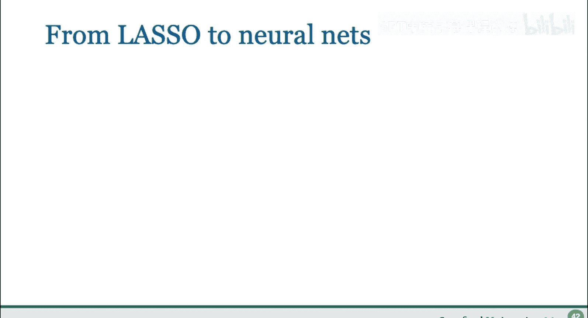

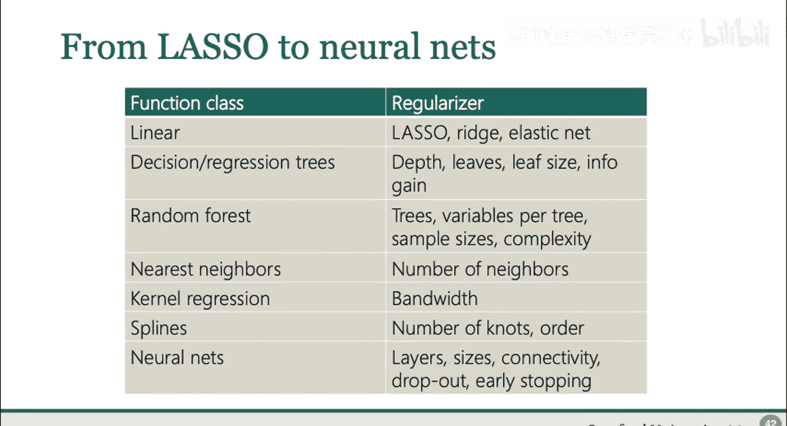

假设我们将数据分成两部分。正如我们之前的图片中所做的那样，我们在一些数据点上拟合我们的数据，然后我们使用其他一些数据点来查看我们做得如何。之前我在 8 个数据点上拟合了我们的数据，然后查看了另外 8 个数据点以了解我们做得如何。现在，我们对我们考虑的所有不同复杂性重复此操作。在之前的理想化例子中，我们首先考虑了一个简单的回归线（它是线性的），然后考虑了一个抛物线（即 2 次多项式），然后我们还考虑了一个 4 次多项式。

与其将选择复杂程度的指导仅仅基于样本内拟合（这只发生在蓝点内部，这只告诉我们更复杂是好的），我们现在可以简单地使用那些红点上的拟合，并说：我们在尚未见过的数据上表现如何？当然，如果你有很多数据，这是一件很棒的事情。这意味着我们仍然可以使用大量数据来拟合我们的函数，然后使用大量数据来查看我们做得如何，这将使我们能够最优地选择我们的正则化参数。

然而，在实践中，数据通常是稀缺的。让我们考虑一种情况，我们实际上没有奢侈地拥有那 8 个点再加上额外的 8 个点，所以我们没有蓝点和额外的红点。但假设我们只有那些蓝点，即我们已经用来拟合数据的那些点。那么，为了获得关于选择哪个正则化参数的信息，我们可以做些什么不同的事情呢？

这个问题的答案是，我们可以通过重复我们在这里运行的保留练习来使用一个技巧，即我们保留一些我们尚未查看的数据用于预测练习，并在我们已经看到的点内重复相同的样本内操作。

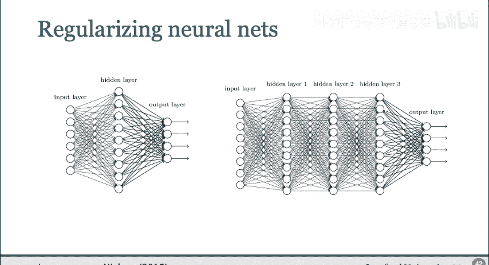

具体来说，我们可以做以下事情：在我们之前用来拟合回归线的 8 个点中，我们每次保留其中两个。所以第一次我们做的时候，你在左上象限看到的这两个红点，这两个我们不包含在拟合回归线中。相反，我们用它们来评估样本外拟合。当我们第二次做的时候，我们保留另外两个点；第三次，另外两个点；第四次，另外两个点。换句话说，我们将我们的点集（在这种情况下）分成四组，每次我们保留其中一组，只使用所有其他组，然后我们评估我们做得如何。通过查看我们在这个保留练习中的平均表现。

这被称为**交叉验证**。当我们考虑如何选择正则化参数时，我们可以通过进行保留样本来做到这一点（即我们通过简单地不使用某些点进行拟合来在我们的样本中创建一个样本外集），但为了避免损失大量样本量，我们可以将其扩展到交叉验证，这意味着我们在样本内创建重复的保留。

这就是它的样子：我们创建折（这里折是四折）。每次我们只使用不在当前组中的数据来拟合我们的函数（所以在每种情况下这都是红数据），我们保留当前活动折中的数据用于验证（这里我们将保留第一折）。然后我们计算我们的误差（即当我们从红点预测到绿点时产生的损失），然后我们通过平均所有折上的误差来评估我们的整体拟合，从而产生一个误差，平均而言，它给出了我们的函数在样本外表现如何的答案。

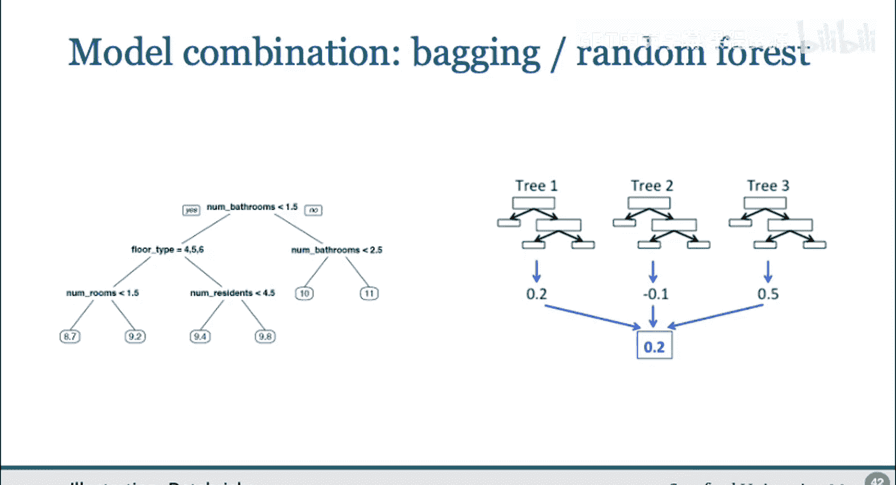

因此，机器学习的“秘方”至少包含一个额外的成分。除了使用非常灵活的函数形式和使用正则化限制表达能力之外，一个关键要素也是使用数据来学习实际应该正则化多少，这称为**调参**，通常我们通过交叉验证来完成，这是我刚刚简要介绍的方法。

## 机器学习预测的典型流程 🏗️

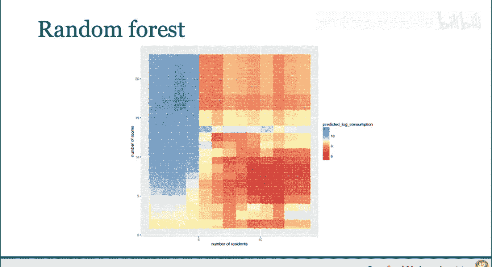

因此，这里是一个机器学习预测练习的典型结构，它也适用于你将在未来网络研讨会中听到的许多应用。

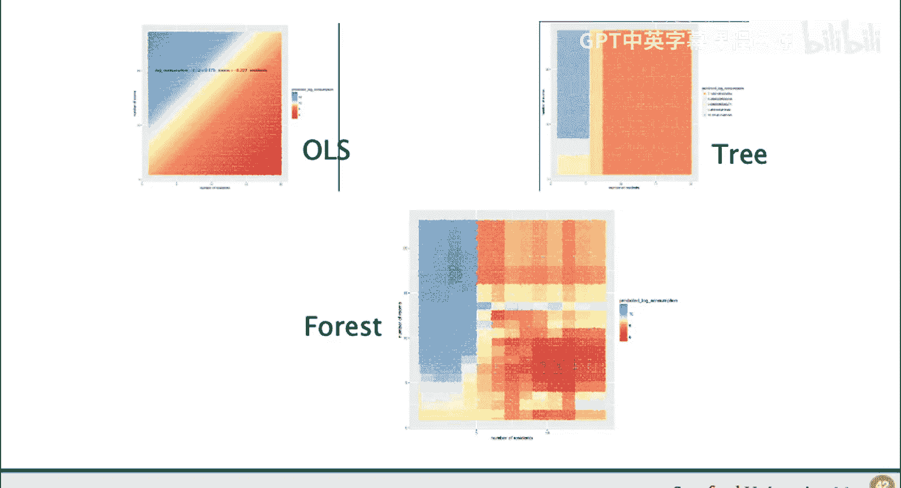

我们通常将样本分成两部分：一部分用于拟合我们的函数，第二部分保留用于最终验证。在拟合样本上，我们的目标是获得一个预测函数 **f̂**，我们首先运行交叉验证以找到我们想要用于函数复杂性的参数。换句话说，我们使用数据驱动的调参（通过交叉验证）来确定我们的正则化参数。然后我们拟合该函数，然后使用该函数，并估计其最终属性，例如，它在保留样本上的损失。

那么，为什么我们在这里保留一些额外数据很重要？尽管我们尽了最大努力并在拟合样本中使用了交叉验证，但由于我们现在基于数据本身选择了所有调参参数，我们在交叉验证中获得的损失可能仍然是乐观的，因为它是根据我们损失测量在交叉验证中的最佳可能调参选择来评估的。因此，当我们做这样的工作时，保留一些我们尚未接触的最终数据来验证我们实际做得如何总是很重要的。

这就是**防火墙原则**发挥作用的地方：只要我们确保除了用于最终验证最终函数之外，我们没有使用额外的保留样本，我们根本没有使用它来选择函数。只要满足这一点，那么非常简单的计量经济学保证确保我们的最终损失估计（例如）是无偏的，并且可以用有效的标准误差很好地估计。而我们在拟合样本上所做的任何事情都不必遵循任何特定的协议，但可以包括尝试一些不同的方法，因为这不会影响我们的最终估计。

因此，在我看来，这给了计量经济学在那个防火墙的两侧两个不同的角色。首先，我们当然希望能够保证我们的预测函数最终表现如何，我们通过获取一个保留样本并使用（例如）有效的标准误差为我们的函数在保留样本上的性能创建置信区间来实现这一点。同时，在拟合样本中，计量经济学可以极大地帮助更好地理解在某种情况下哪种函数可能表现良好。然而，最终，哪个函数更好纯粹是一个经验问题。这是一个关于哪个函数在样本外表现良好的问题，并且我们可以证明具有良好的样本外特性，假设我们的唯一目标确实是找到一个能很好预测样本外的预测函数。因此，这在一定程度上解放了我们在拟合样本上可以做的事情：我们可以使用不同的函数形式，看看其中哪些看起来最好，我们甚至可以组合其中的多个，这是我稍后会回过头来讨论的一点。

## 更广泛的机器学习方法 🌐

到目前为止，我认为我们遇到的两种机器学习方法（特别是正则化线性回归和回归树）具有共同的结构。它们结合了非常灵活的函数形式、一个正则化器（即限制表达能力的方式），以及一种使用数据来决定允许多少灵活性的方式。

当然，这里有一些重要的研究者选择。首先，我们必须实际知道我们想要为哪个函数类进行优化。这可能取决于我们的具体应用。其次，我们必须确保我们以某种方式分割和管理数据，使得最终估计实际上代表了我们关心的损失的估计，例如，我们确保以代表我们最终想要使用预测函数的方式来预测感兴趣的结果。另一个重要的选择是我们如何在数据中表示特征。特别是对于线性回归，结果可能看起来截然不同，这取决于我们如何表示 X 变量中的信息。最后，重要的是，我们必须首先决定使用哪个函数类和哪个正则化器。

正如我所说，到目前为止，我专注于系数限制给定的线性回归，以及树（其中作为正则化器，例如，我讨论了树拥有的层数或每个叶节点中至少应有多少实例）。

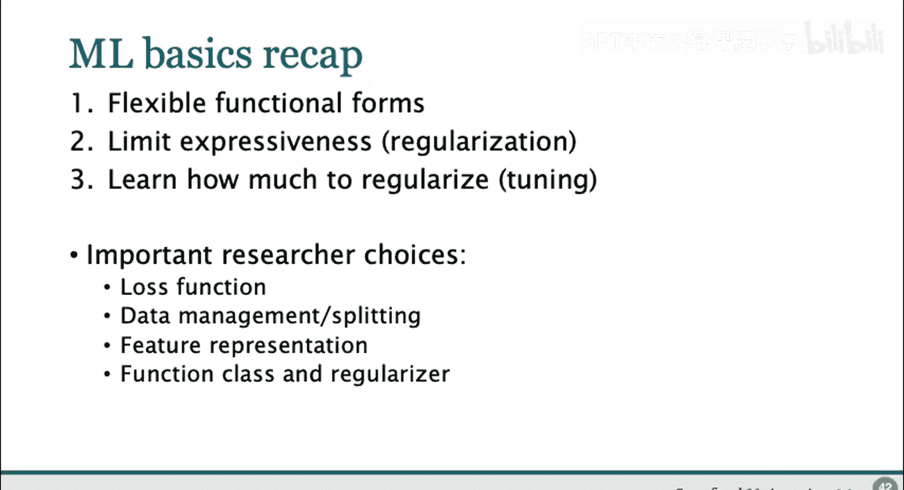

我现在想论证，这种结构更为普遍，并且包含许多其他机器学习预测方法。

具体来说，我们可以通过函数类和正则化器的组合来表征许多可用的方法，并且在许多情况下，还有使用哪种优化算法的额外层次。

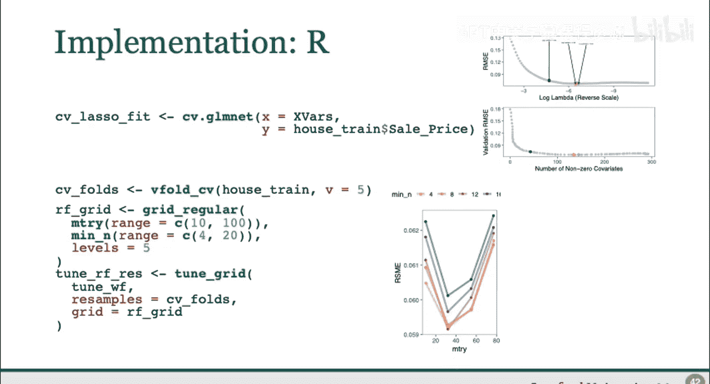

让我给你一个极端的例子。对于我们在第一个模块中讨论的**神经网络**，有不同的方法来正则化它们。首先，请注意，神经网络基本上类似于逻辑函数的逻辑函数的逻辑... 所以它是一个依赖于输入函数之函数的函数... 因此，这些神经网络可以变得任意复杂，我们添加的层越多。这已经暗示了第一种正则化方式，即限制这些层的数量：层数越少，神经网络的表达能力就越弱。同样，层之间的连接越多，神经网络的表达能力就越强，因此也可能更容易过拟合。这可能是一种相当明显的正则化方式，但也有一些不那么明显的方式。这里有一个特别聪明的方法。

一种聪明的正则化方式称为**早停**。它说，与其越来越多地优化神经网络，我们为什么不在某个水平停止优化算法，例如，在一定的步数之后。这将意味着我找到的最优解实际上不是样本内的最优解，而是在试图最优拟合样本内拟合之前就停止了。这听起来像是放弃正确优化，但它实际上具有正则化的特性。它具有通过不过度正则化（不过度优化）来避免过度过拟合的特性，并且具有不需要那么多优化步骤因此运行更快的额外特性。

## 模型组合：集成方法 🤝

除了这些不同的机器学习预测器之外，我们还可以将来自不同函数类的机器学习预测器相互组合。在这种情况下，例如，我们可以使用这些不同预测之间的加权平均，其中我们以与选择某些正则化参数相同的方式选择权重本身（例如，通过交叉验证），以找到在预测方面特别有效的组合。

现在，平均而言，这些**集成**方法表现相当好可能并不奇怪，因为它们基本上投资于不同预测算法的组合。更令人惊讶的可能是，这样的集成方法基本上在预测竞赛中始终优于每个单独的预测器，包括最好的那些。这表明不同函数类的预测算法之间存在某种互补性。

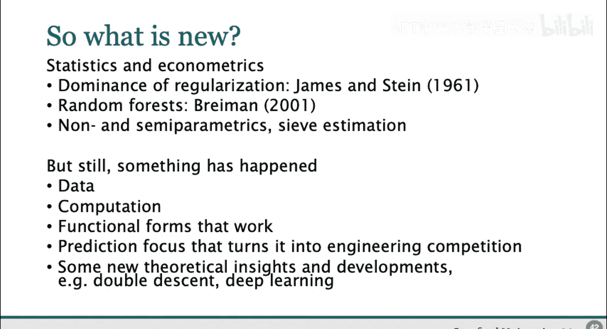

我们可以组合模型的第二种方式是组合相同类别的模型。一些最成功的、开箱即用的机器学习算法（在我们经常处理的那种社会科学数据上表现特别好）实际上是我们将多棵树组合成更复杂预测器的方式。

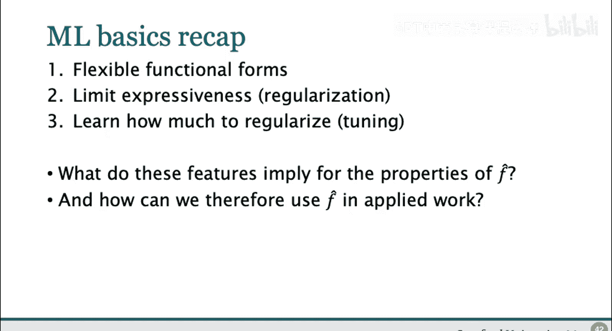

我们可以做到这一点的第一种方式称为**装袋**或**自助聚合**。在回归树的情况下，将许多树聚合在一起将被称为**随机森林**。因此，与其运行一棵简单的回归树（我们只取一棵树），我们反复从数据中抽取自助样本。然后我们从每个自助样本中构建树。当我们形成预测时，我们只需平均这些不同树的预测。

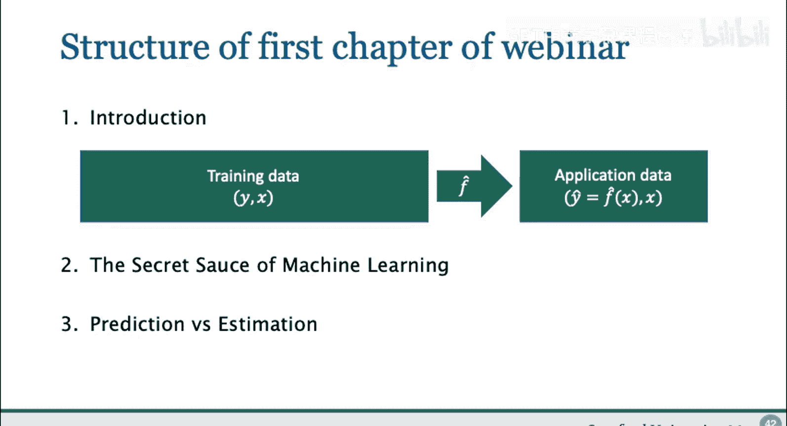

因此，以前我们获得来自线性回归或单棵树的预测，现在我想向你展示当我们从随机森林形成预测时，在贫困预测（或在这种情况下根据居民数和房间数预测消费）的情况下是什么样子。正如你所看到的，通过组合许多树， resulting 的图片实际上相当平滑。这里有一些奇怪的区域，看起来房间数多且居民数多时，预测的对数消费突然再次上升并且是非单调的，我最好的猜测是这只是因为该区域没有足够的数据。但当我看这里的大图时，它既能够捕捉居民数和房间数的交互效应，也能够捕捉左侧房间数的梯度，其方式比单棵树平滑