#  004：应用机器学习——预测与估计

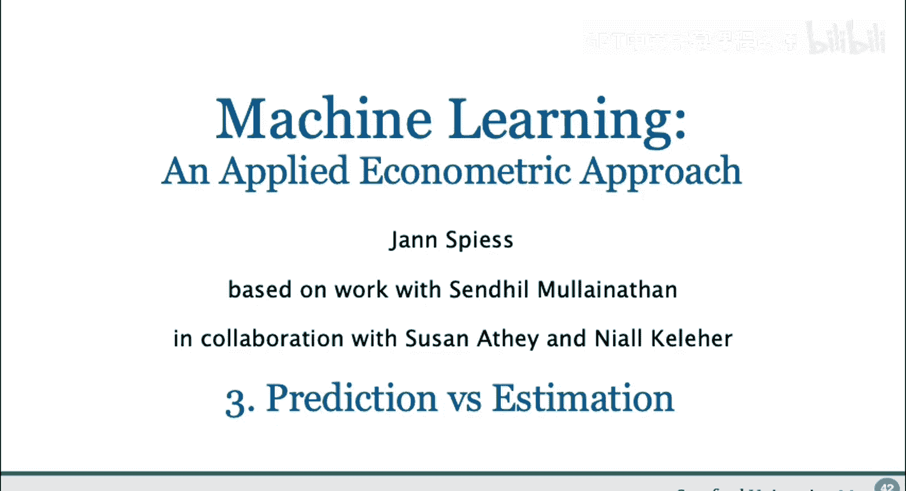

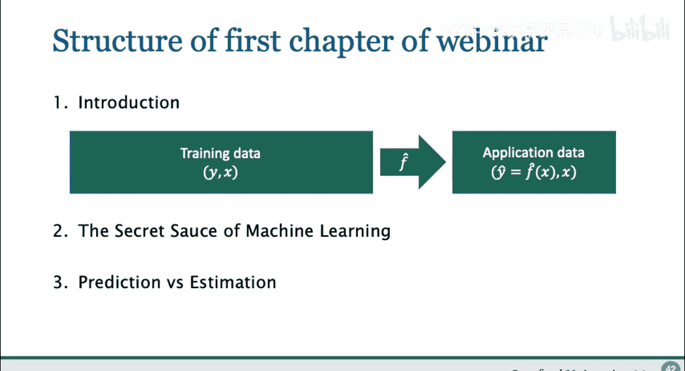

在本节课中，我们将要学习机器学习在应用中的核心区别：预测与估计。我们将探讨机器学习为何擅长预测，以及为何其输出通常不适合直接用于传统的参数估计和因果推断。

## 概述

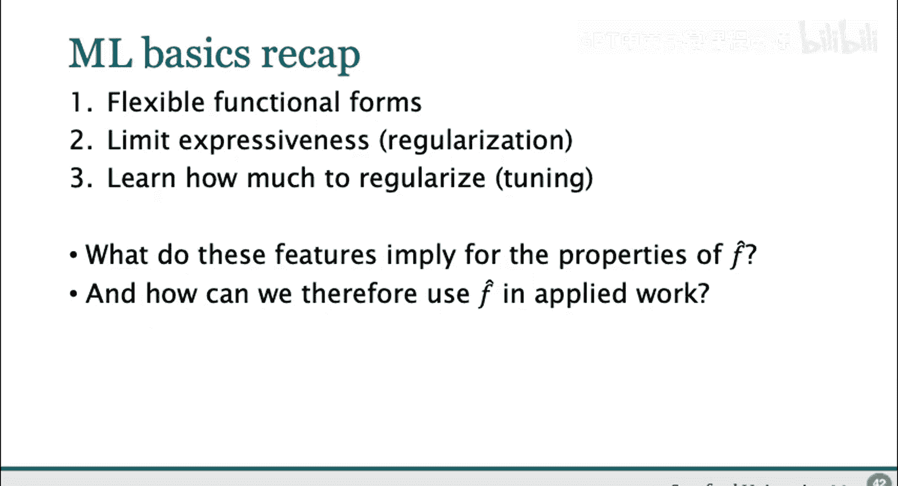

在上一节中，我们介绍了机器学习如何通过灵活的函数形式、正则化和数据驱动的调优来实现出色的预测性能。本节中，我们将深入探讨这些特性对模型输出的影响，并明确区分预测问题和估计问题的目标差异。

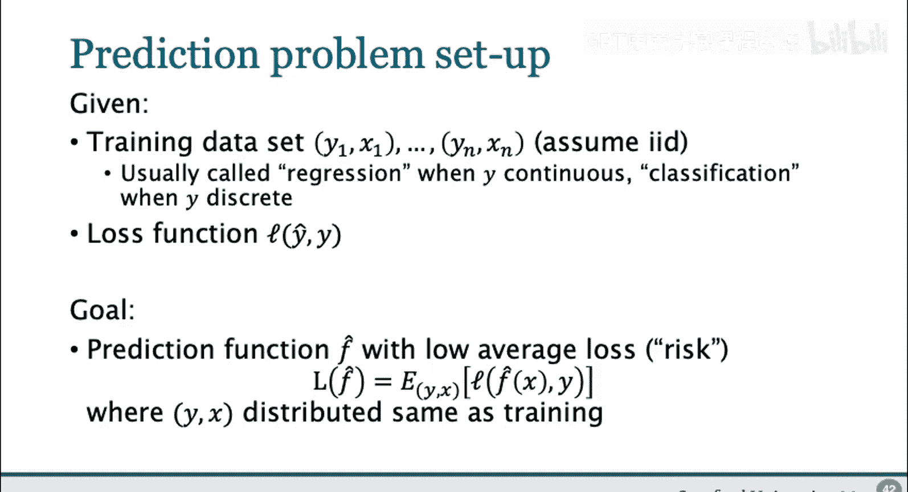

## 机器学习输出的解读

现在，假设我们已经找到了一个性能优异的预测函数 `f_hat`。这个函数可能是一个正则化线性回归（如Lasso或Ridge），也可能是一个随机森林或提升树模型。我们能否从这个函数 `f_hat` 中学习到关于真实世界的知识？

具体来说，我们常常希望利用拟合出的 `y` 与 `x` 的关系函数，来对条件期望 `E[y|x]` 进行推断，即理解 `y` 与 `x` 之间最优的真实回归关系。当模型输出形式常见时（例如正则化线性回归本身就是线性形式），这种诱惑尤其强烈。问题是，我们能在多大程度上使用这个正则化线性回归的系数来说一些关于世界的事情？例如，哪些协变量真正重要，甚至说明 `x` 与 `y` 之间的因果关系？

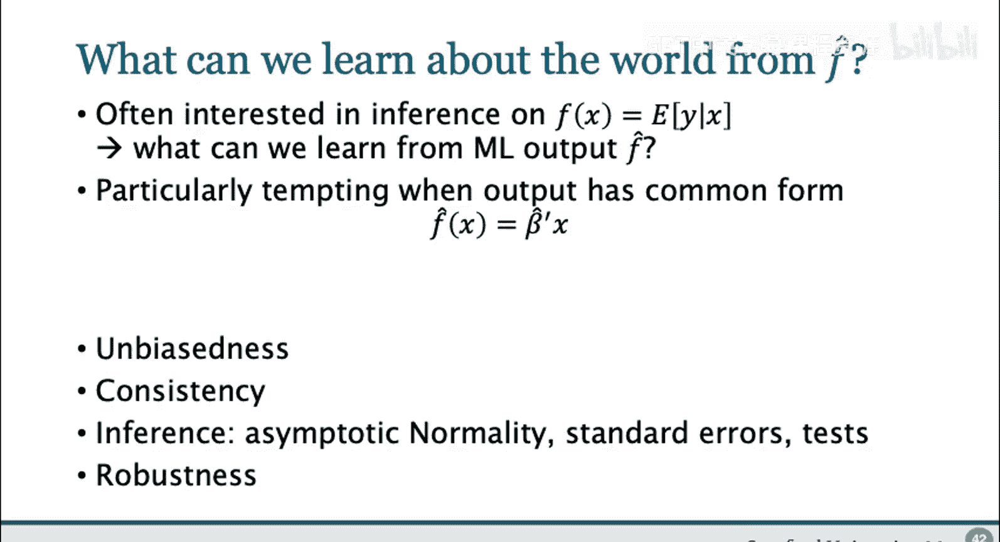

在典型的计量经济学中，我们关心这些系数的以下性质：
*   我们想知道系数是否有偏，即它平均而言是否接近真实值。
*   我们想知道系数是否一致，即在大样本下是否很好地逼近真实系数。
*   我们可能还想进行统计推断，例如建立渐近正态性、计算标准误或进行假设检验，以便从数据中了解真实参数 `beta`。
*   最后，我们可能希望理解估计的稳健性，例如我们的结论是否依赖于数据的某些特定特征，或者在某些假设不完全成立时是否依然能很好地推广。

## 以Lasso为例：预测与估计的冲突

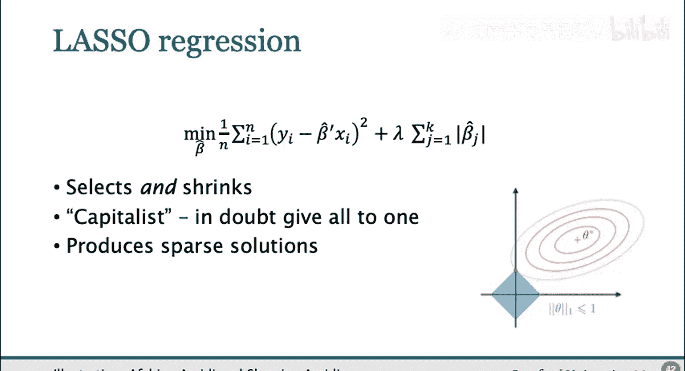

为了研究我们是否能像使用线性回归那样，用机器学习的输出来了解世界，我们从Lasso开始，因为它产生的输出看起来非常相似。

Lasso拟合一个线性回归，并附加一个约束：系数不能太大。这使我们即使在回归中包含大量 `x` 变量时也能拟合Lasso，并以一种平衡函数表达能力（复杂度）与过拟合风险的方式进行。参数 `lambda` 越高，复杂度的成本就越高，系数就会越小，可能为零的系数也越多。具体来说，Lasso不仅会收缩系数，还会进行变量选择，即许多系数可能为零。如果有多个系数能产生相似的预测结果，Lasso可能会“资本化”，只选择一个“赢家”并将所有权重赋予它。

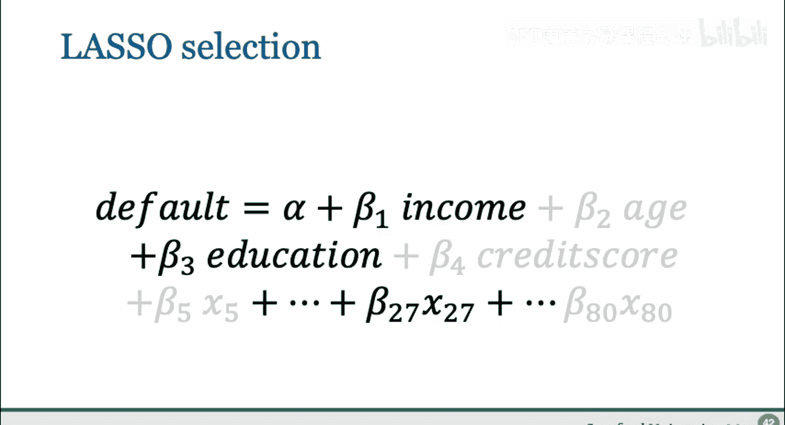

在一个预测违约概率的例子中，我们使用包含80个变量的数据集。与OLS相比，Lasso通过惩罚过大的系数（在Lasso中，也隐式地惩罚了大量非零系数），只使用这些变量的一个子集。人们希望由此产生的稀疏解能告诉我们哪些变量是重要的。

然而，当我们对同一数据集的不同随机子集多次运行Lasso（即使保持惩罚参数 `lambda` 不变）并检查每次运行中被选择的变量时，结果令人深思。虽然有些变量被持续选择，有些被持续排除，但许多变量在某些次运行中被选择，在另一些次中则不被选择。这表明，在高维数据中，由于协变量之间可能存在高度相关性，Lasso选择的变量集合可能非常不稳定。

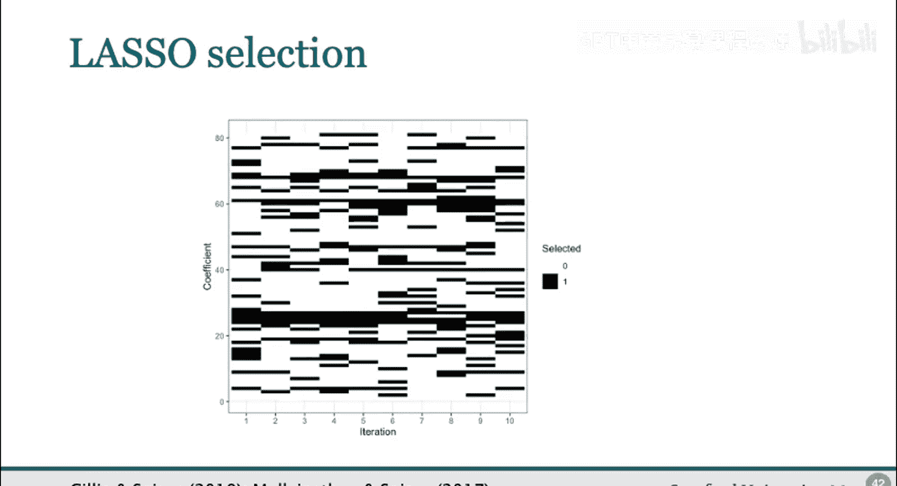

以下是可能发生的几种偏差：

*   **压缩偏差**：如果 `x2` 和 `x3` 高度相关且都影响 `y`，Lasso可能只包含 `x2`，因为 `x2` 已经可以很好地表达 `x3` 的大部分影响。这减少了复杂度成本，却没有使预测差很多。这导致被包含的变量集合是真实模型的一个子集。
*   **扩张偏差**：一个不在真实模型中的变量 `x1` 也可能被包含进来。如果 `x1` 恰好与真正影响 `y` 的 `x2` 和 `x3` 的组合高度相关，那么单独包含 `x1` 可能比单独包含 `x2` 或 `x3` 预测得更好。由于包含 `x2` 和 `x3` 两者成本很高，Lasso可能倾向于只包含那个与两者都相关、能较好解释结果的变量 `x1`。
*   **系数大小的偏差（遗漏变量偏差）**：即使 `x3` 未被选择，这并不意味着变量 `x2` 的系数能被正确估计。通过排除 `x3`，Lasso也会导致 `x2` 的系数产生遗漏变量偏差。Lasso通过排除变量，主动地产生或鼓励了遗漏变量偏差。
*   **收缩偏差**：即使 `x2` 和 `x3` 都被选中，向零收缩也会带来一些偏差，但这通常比遗漏变量偏差的误导性要小。

在高维情况下，这种相关性经常发生，因此我们必须意识到此类偏差可能发生，并在解释时非常谨慎。

## Ridge回归与树模型的类似问题

Ridge回归本质上倾向于“平均主义”，通过惩罚系数的平方和来平滑系数。在一个简单的两变量例子中（假设结果仅依赖于 `x2`），我们可以明确写出 `x1` 和 `x2` 的系数如何随 `x1` 和 `x2` 之间的相关性以及正则化参数变化。这里也会出现扩张偏差（Ridge给本不重要的 `x1` 赋予权重）和收缩偏差（`x2` 的系数被低估）。

这种行为并不局限于线性回归类估计器。例如，查看拟合回归树时选择的顶部变量，也会发现类似的不稳定模式：有些变量被频繁选择，但许多变量只是有时被选择。仅仅观察一棵树不太可能告诉我们底层稳定的真实关系，因为它会随着数据抽样的不同而频繁变化。

## 核心结论：区分预测与估计

从以上所有分析中，我的核心结论是：我们应该仔细区分，不仅是我们使用的方法，还有这些方法试图回答的问题。

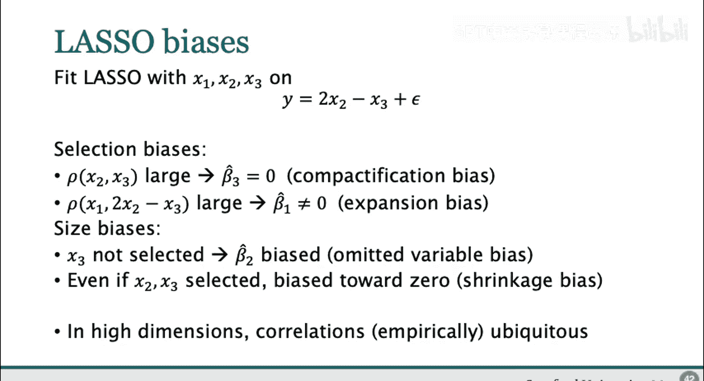

具体来说，我想区分以下两个目标：
1.  **预测的目标**：我们关心的是样本外损失最小化。
2.  **估计的目标**：我们关心的是对系数的推断，并找出哪些 `x` 具体影响了 `y`。

在高维情况下，即使系数不稳定、有偏、不一致，我们仍然可以处于一个预测良好的世界。因为在大数据中，许多看起来相当不同的函数可以具有相似的预测属性，很难区分它们，因此也很难进行良好的估计。

我的重要结论是：正是那些使机器学习预测如此成功的特性（复杂性、正则化、调优），也使得估计变得困难。它们使得理解系数、解释系数变得更加困难（因为偏差），也使得进行统计推断变得更加困难（因为我们使用了数据驱动的调优）。

因此，机器学习在解决 **“y-hat”问题**（即寻找良好预测的问题）方面非常出色，但其本身并非为解决 **“beta-hat”问题**（即对参数进行推断的问题）而构建。

## 术语澄清

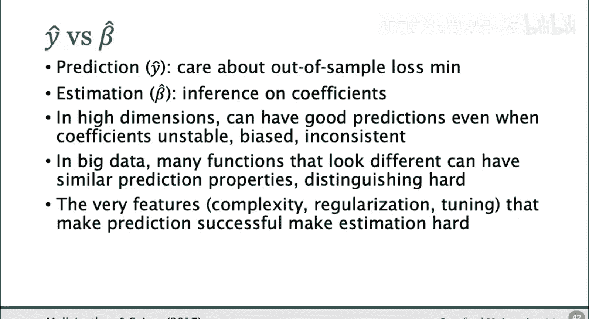

*   **预测**：我指的是在分布保持不变的情况下，能否在来自同一分布的新数据上获得 `y` 的良好拟合。这不是一个需要结构或因果知识的反事实问题（例如“如果政策改变，明天会发生什么”），而是纯粹的拟合问题。
*   **估计**：我指的不仅仅是近似最优预测函数（机器学习在这方面很擅长），而是指像**估计一致性**这样的性质，即系数在并非由预测损失隐含的某种范数下接近真实系数。机器学习通常不擅长提供这种保证。

## 对实际工作的启示

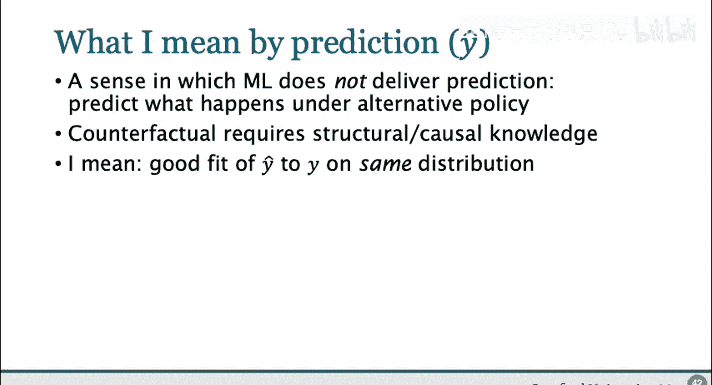

机器学习提供了高质量的预测（y-hat）。虽然预测质量可以通过保留集（如验证集）获得一定的统计保证（例如，能以某种统计不确定性说明其预测至少有多好），但通常**没有关于估计质量的保证，也没有估计一致性**。至少，建立估计一致性（系数收敛到真实系数）比建立预测一致性要困难得多。

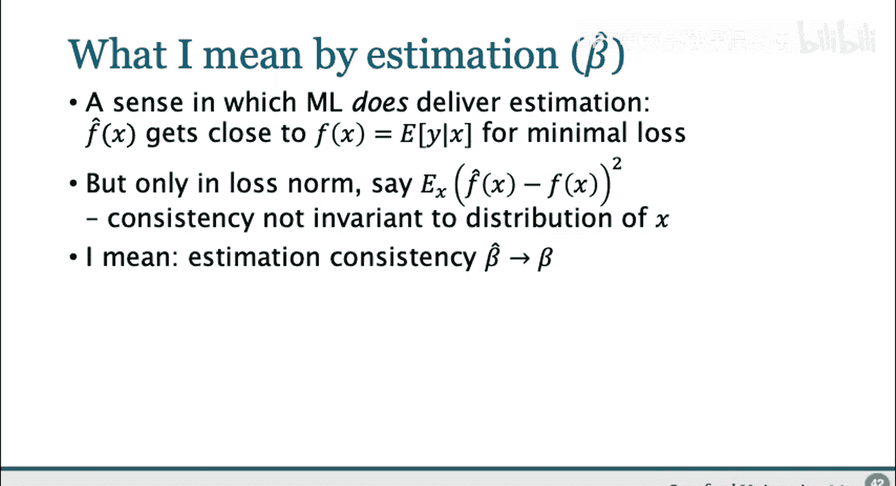

因此，当我们查看机器学习输出时，我们不应将其解释为结构性的或因果性的（即 `x` 如何与 `y` 相关），而应将其视为它本来的样子：一个出色的预测器。

另外，对 `f_hat` 进行统计推断也非常困难，因为许多机器学习方法非常复杂，且使用了数据驱动的调优，因此很难使用像自助法这样的工具，而且自助法通常可能失败。

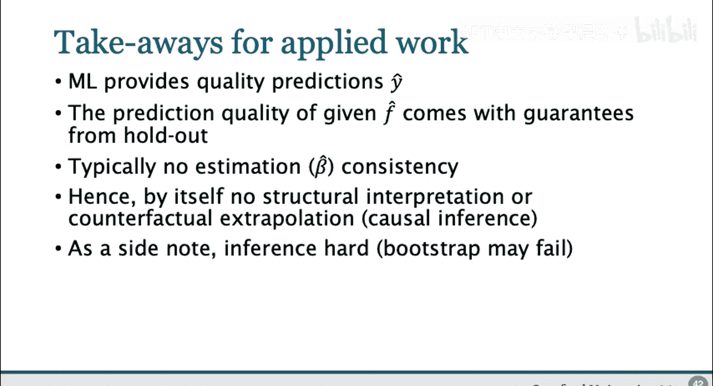

## 机器学习的适用场景

那么，我们可以在哪里使用机器学习呢？我认为应该将其用于预测问题，并询问哪些是有趣的预测问题。以下是一些案例：

以下是几个主要的应用方向：

1.  **数据预处理**：例如，处理文本数据、图像数据，将非常复杂的数据简化为最重要的组成部分。这通常可以转化为预测问题（例如，从卫星图像数据预测作物产量或经济结果，然后使用处理后的图像数据作为代理变量）。
2.  **本质上是预测任务的问题**：即预测本身就是感兴趣的问题。这类问题也被称为“预测性政策问题”。一个很好的例子是**贫困目标定位**：我们需要了解哪些家庭可能消费水平低，以便决定帮助哪些家庭。虽然理解什么导致低消费也很有趣，但对于“应该向哪里提供帮助”这个目标定位问题，拥有一个良好的预测可能最为重要。
3.  **作为更复杂问题的一部分**：在许多我们关心某些参数的问题中，可能存在一些隐含的预测问题，例如使用高维变量作为控制变量、用于倾向得分、或作为高维工具变量。在我的同事Susan Athey接下来的讲座中，将专门讨论如何将两者结合，即如何使用机器学习的工具、技术和思想来增强因果推断。这通常需要针对特定任务仔细调整机器学习方法，而不是简单地直接使用现成的模型。

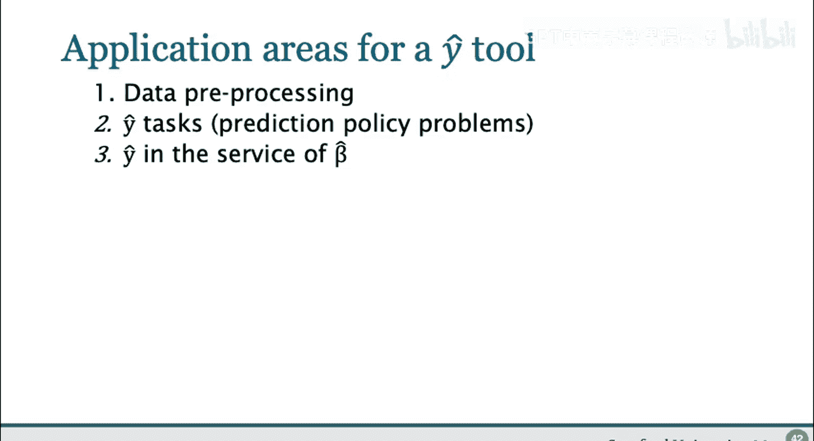

## 总结

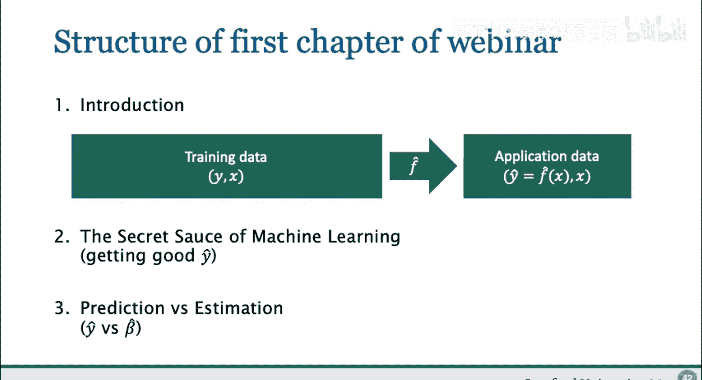

本节课中我们一起学习了机器学习在应用中的核心分野。我们首先回顾了机器学习通过灵活性、正则化和数据驱动调优获得良好预测的原理。然后，我们深入探讨了这些特性如何使模型输出（如Lasso的系数）不稳定、有偏，从而不适合直接用于传统的参数估计和因果推断。核心在于明确区分了**预测**（关注样本外损失最小化，得到好的 `y-hat`）和**估计**（关注参数推断，得到好的 `beta-hat`）这两个不同目标。最后，我们指出了机器学习在纯粹预测任务、数据预处理以及作为复杂因果推断框架组成部分等方面的正确应用场景。记住，机器学习是出色的预测引擎，但并非现成的因果推断或参数估计工具。