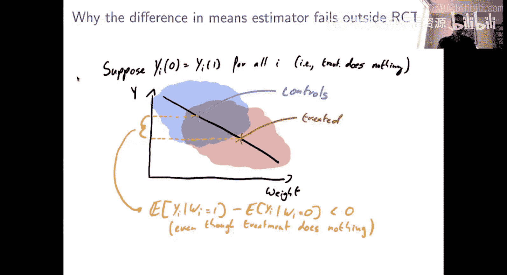

#  005：平均处理效应导论

## 概述
在本节课中，我们将开始学习如何将机器学习方法应用于因果推断的核心任务——估计平均处理效应。我们将从理解平均处理效应的基本概念开始，并探讨在随机试验中如何估计它。

## 从预测到因果推断
上一周我们回顾了机器学习方法，它们主要用于预测任务，即基于历史数据理解在给定情境下通常会发生什么。然而，在许多经济或社会科学应用中，我们关心的是因果问题。我们不仅想知道在某种情况下通常会发生什么，更想知道如果我们采取某种干预措施（例如减少道路上的汽车数量），情况会发生怎样的改变。这是一个不同性质的问题。

在本课程中，我们将看到，如果处理不当，将原本为预测设计的机器学习方法直接应用于因果任务可能会带来问题。但与此同时，如果方法得当，机器学习方法可以被有效地调整以用于因果任务，并发挥巨大作用。

## 本周目标与课程结构
本周，我们的目标是理解如何严谨地将机器学习方法部署于估计平均处理效应这一经典任务。我们将介绍一种基于“双重稳健估计”的方法论，该方法可以将通用的“黑箱”式机器学习估计作为输入，并输出具有有效置信区间的估计结果。

我们将通过四个部分来达成这个目标：
1.  **第一部分（本部分）**：介绍平均处理效应的概念，并讨论在随机试验背景下如何思考它。
2.  **第二部分**：探讨一些使用机器学习进行处理的简单思路，并与经典的基于回归的方法进行比较。
3.  **第三部分**：介绍倾向得分方法及其相关的估计工具。
4.  **第四部分**：将前两部分的方法结合，介绍“双重稳健”方法。这是实践中推荐使用的方法。

## 平均处理效应的定义
我们采用一个经典的统计设定。假设我们有 N 个独立采样的单元。对于每个单元 i，我们观察到一个特征向量 **X_i**（背景信息）、一个响应变量 **Y_i**（我们希望通过处理来改善的结果）和一个二元处理变量 **W_i**（0 表示未处理/对照组，1 表示处理/处理组）。

为了讨论因果关系，我们引入“潜在结果”的概念：**Y_i(0)** 和 **Y_i(1)**。
*   **Y_i(0)** 表示如果单元 i 接受控制（W=0）时，我们将会观察到的结果。
*   **Y_i(1)** 表示如果单元 i 接受处理（W=1）时，我们将会观察到的结果。

那么，我们实际观察到的结果 **Y_i** 就是对应于其实际接受的处理 **W_i** 的那个潜在结果：**Y_i = Y_i(W_i)**。

潜在结果的有用之处在于，它们能让我们直接定义因果效应。对于单元 i，处理的因果效应就是其两个潜在结果之间的差异：**τ_i = Y_i(1) - Y_i(0)**。

平均处理效应（ATE）就是这些个体处理效应在整个抽样分布上的平均值：
**τ = E[Y_i(1) - Y_i(0)] = E[Y_i(1)] - E[Y_i(0)]**

平均处理效应通常被视为衡量一个处理在特定人群中有效性的首要且有用的概括性指标。

## 核心挑战：缺失数据问题
估计平均处理效应并非完全 trivial，核心困难在于“缺失数据问题”。对于每个单元，个体处理效应 **τ_i = Y_i(1) - Y_i(0)** 是两个结果（处理下的结果和未处理下的结果）的差值。然而，我们永远只能观察到其中一个：要么观察到 **Y_i(1)**（如果被处理），要么观察到 **Y_i(0)**（如果在对照组）。我们永远无法同时观察到两者。正是这个根本性的缺失问题使得估计平均处理效应变得有趣且具有挑战性。

## 最简单的情况：随机试验
作为热身，让我们先讨论能够估计平均处理效应的最简单情况——随机试验。

在随机试验中，处理分配是随机的。这意味着谁接受处理、谁接受控制是完全随机决定的，处理分配与单元的潜在结果之间没有关联。可以想象为，对每个人抛一枚硬币，正面则分配处理，反面则分配控制。

随机试验之所以有效，是因为在随机化条件下，我们可以证明平均处理效应 **τ** 等于处理组观测结果的平均值与对照组观测结果的平均值之差：
**τ = E[Y_i(1)] - E[Y_i(0)] = E[Y_i | W_i=1] - E[Y_i | W_i=0]**

这个等式的关键在于第一步：由于处理是随机的，所以整个样本中 **Y_i(1)** 的平均值，等于在 **W_i=1** 条件下 **Y_i(1)** 的平均值。第二步则是根据定义，当 **W_i=1** 时，我们观察到的 **Y_i** 就是 **Y_i(1)**。

这意味着，尽管存在根本性的缺失数据问题，但在随机试验中，我们可以通过简单地计算处理组和对照组的平均结果之差，来无偏地估计平均处理效应。

### 示例说明
假设我们想了解交通限行对空气质量的影响。在理想情况下，一位“全知”的统计学家每天都能看到两个潜在结果：有限行时的污染水平 **Y_i(1)** 和无限行时的污染水平 **Y_i(0)**。个体效应是 **τ_i = Y_i(1) - Y_i(0)**，平均处理效应 **τ** 就是所有 **τ_i** 的平均值。

然而在现实中，即使是最好的随机试验数据，我们每天也只能根据抛硬币的结果，观察到 **Y_i(1)** 或 **Y_i(0)** 中的一个，永远看不到 **τ_i**。但根据上述理论，我们仍然可以通过计算“有限行日”的平均污染水平减去“无限行日”的平均污染水平，来估计平均处理效应 **τ**。

## 非随机试验的挑战
我们并非总是处于随机试验中。在观察性研究中，处理分配通常不是随机的，而是与某些“混杂因素”相关。

考虑一个简单的例子：我们想了解某种预防肥胖的治疗对“质量调整生命年”的影响。我们没有随机试验数据，只有电子病历记录，其中治疗由医生根据情况决定。医生很可能不会随机分配治疗，而是优先将治疗分配给体重较高的患者。

假设治疗实际上完全无效，即对每个患者都有 **Y_i(1) = Y_i(0)**。但由于医生倾向于治疗体重更高的人，而体重与结果（生命年）可能存在负相关，导致处理组的平均体重高于对照组。如果我们简单地计算处理组与对照组的平均结果之差，可能会发现处理组的结果更差，从而错误地得出治疗有害的结论。这实际上反映的是“选择偏差”，而非真实的因果效应。

## 总结
在本节课中，我们一起学习了：
1.  **因果推断的核心**：从预测“通常会发生什么”转向理解“如果采取干预会怎样”。
2.  **平均处理效应（ATE）**：定义为个体潜在结果差异 **Y_i(1) - Y_i(0)** 的总体平均值，是衡量处理效果的关键概括指标。
3.  **估计ATE的核心挑战**：缺失数据问题——我们永远无法同时观测到同一个体的 **Y_i(1)** 和 **Y_i(0)**。
4.  **随机试验的解决方案**：在处理随机分配的条件下，ATE 可以简单地通过处理组与对照组的观测结果均值之差来无偏估计：**τ = E[Y|W=1] - E[Y|W=0]**。
5.  **观察性研究的挑战**：当处理分配非随机，并与影响结果的混杂因素相关时，简单的均值比较会产生偏差，导致错误的因果结论。

在下一节中，我们将开始探讨当处于非随机试验（观察性研究）时，如何从概念和统计上解决估计平均处理效应的问题。