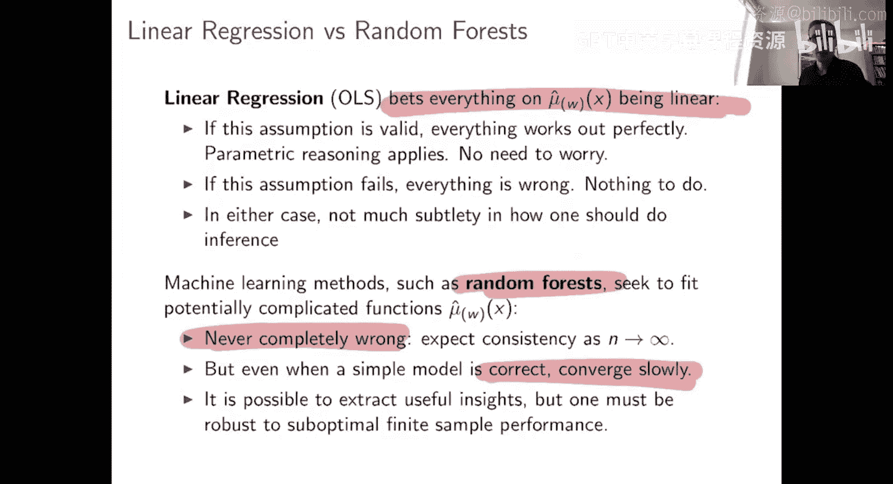

#  006：平均处理效应与混杂

在本节课中，我们将学习如何在非随机试验中估计平均处理效应。我们将重点讨论混杂问题，并介绍一种通过控制可观测协变量来识别处理效应的方法。我们还将探讨如何使用线性回归和机器学习方法来估计这些效应，并比较它们的优缺点。

上一节我们讨论了平均处理效应和随机对照试验。我们解释了为什么在随机试验中估计平均处理效应非常理想。但我们也提到，并非所有需要估计平均处理效应的场景都是随机试验。

那么，我们的下一个问题是：在非随机试验中，我们能做什么？

现在我们要关注的是这样一种情况：我们观察到一些处理前的协变量 **X**，并且我们担心处理分配并非完全随机，它可能与这些协变量 **X** 相关联。在这种情况下，我们需要控制这些协变量。如何最好地做到这一点，正是我们要探讨的方向。特别是，我们将看到机器学习如何融入这个过程。

在深入之前，显然有一个问题：在什么条件下，控制这些 **X** 就足够了？在什么条件下，引入这些 **X** 能帮助我们识别平均处理效应，即使我们不在一个随机试验中？我们需要明确这一点。

因此，我将贯穿始终使用一个假设，这个假设被称为**无混杂性**。该假设认为，处理分配在整体上可能不是随机的，但一旦你控制了协变量 **X**，处理分配就“如同随机”。在给定 **X** 的条件下，处理分配是随机的。

正如我将在接下来的几张幻灯片中讨论的，一旦你有了这个假设，控制协变量 **X** 就足以识别平均处理效应。然后，我们的主要问题就变成了：既然平均处理效应是可识别的，我们如何估计它？

为了更正式地描述这个假设，即“在给定已测量的协变量 **X** 的条件下，处理分配如同随机”，我们需要明确其含义。我们将沿用之前的设定：我们有 **X**、**Y**、**W**，其含义与之前相同，潜在结果的定义相同，平均处理效应的定义也相同。

但我们不再像之前那样假设进行的是随机试验。随机试验的假设是处理分配 **W** 独立于潜在结果。现在我们不假设这一点，而是只假设：一旦你控制了 **X**，对于 **X** 的每一个固定值，数据看起来就像是来自一个随机试验。这个假设也被称为“选择基于可观测变量”或“无未测混杂”。这意味着，如果存在任何与处理分配 **W** 相关的变量，并且这种关联使你偏离了随机试验的假设，那么你需要能够测量这些变量并控制它们，以便进入这个理想的设定。

这里你可能有一个疑问：我们担心的是混杂问题，而这个假设被称为“无混杂性”，这是怎么回事？关键在于，如果处理分配概率 **W** 可能随 **X** 变化，那么总体上你是存在混杂的，你不具备随机试验类型的假设。但一旦你将 **X** 纳入考虑，一旦你控制了 **X**，那么在给定 **X** 的条件下，处理分配看起来就如同随机。所以，在控制 **X** 之前你是混杂的，但控制 **X** 之后你就达到了无混杂状态。这就是这个假设的含义。

这个假设非常重要。它并非在所有应用中都成立，例如在工具变量问题中，你感兴趣的是这个假设不成立的情况。但在许多感兴趣的场景中，它是成立的。本周接下来的课程都将围绕在这个假设成立时，如何推断平均处理效应。

好的，我们有了一个假设，很好。我们也有了一个问题。现在，我们如何进行？如何估计潜在的平均处理效应？

从这里出发有很多方法。我现在要讨论一种方法，在第三部分讨论另一种方法，而双重稳健方法可以结合这两种思路以获得更好的效果。

让我们从一种思路开始。其核心观点是：在这个一般的无混杂性设定下，平均处理效应并不等于 **Y** 在 **W=1** 条件下的平均值减去 **Y** 在 **W=0** 条件下的平均值，这是我们上一部分最后一张图看到的情况。

但你可以尝试进行类似的推导，现在重新表达平均处理效应是什么。如果你上过概率论课程，这会很好理解。否则，我希望你能接受推导的最终结果是合理的。我们将在这里应用条件期望的迭代法则，一旦我们条件于 **X**，这里的这三行本质上与之前的证明相同。它们说明，在给定 **X** 的条件下，接受处理的潜在结果的期望值，等于在给定 **X** 且接受处理条件下 **Y** 的期望值。

推导的最终结果是，我们发现平均处理效应可以表示为这些条件响应函数之差的期望。其中，**μ_w(x) = E[Y | X=x, W=w]**。所以，**μ_w(x)** 是非参数回归问题的解，我们试图从 **X** 和 **W** 预测 **Y**。

这个计算表明，在无混杂性假设下，平均处理效应是：在给定 **X** 的情况下，如果你知道 **μ_1(x)** 和 **μ_0(x)** 函数，那么对个体在治疗和对照下的最佳预测结果之差的期望。这是对 **τ** 的一种刻画。

我们如何将其转化为一种估计策略呢？至少，这个符号强烈暗示了一种方法：**μ_w(x)** 是一个非参数回归问题，所以你可以尝试解决它。真实的 **τ** 是 **μ_1(x)** 和 **μ_0(x)** 之差的期望。那么我们可以尝试从数据中估计 **μ_0(x)** 和 **μ_1(x)**。**μ_0(x)** 是在对照组中，给定 **X=x** 时 **Y** 的期望。你可以通过学习在对照组中从 **X** 预测 **Y** 来学习 **μ_0(x)**。类似地，学习 **μ_1(x)**。然后，通过在整个数据集上取这两个回归函数预测值的平均差来估计 **τ_hat**。

到目前为止我所展示的是，如果你使用真实的 **μ_0(x)** 和 **μ_1(x)** 来做这件事，那么这将是无偏的平均处理效应估计量。很明显，如果 **μ_hat_w(x)** 一致收敛于 **μ_w(x)**，那么这个估计量对于平均处理效应是一致的。一致性是好的，但这能让你得到置信区间吗？这很复杂。

为了讨论这个策略有多好，为了总体上讨论通过取 **μ_1(x)** 和 **μ_0(x)** 函数预测值之差的平均值来估计平均处理效应有多好，我们需要具体讨论在第一步和第二步中，你是如何得到这些 **μ_hat** 估计的。这里有很多不同的策略。

其中一种经典策略是使用线性回归，更正式地说，是普通最小二乘法。OLS 方法首先假设一个线性模型。记住，**μ_w(x)** 衡量的是在给定协变量值 **x** 和处理状态 **W** 的情况下，**Y** 的期望值。线性回归拟合线性函数，所以如果线性模型实际上是正确设定的，你就可以找到正确的函数形式。

我们首先假设 **μ_w(x)** 是正确设定的线性函数。然后，我们可以拟合 **μ_0(x)** 为 **x * β_0**，等等。我们可以通过在对照组中回归 **Y** 和 **X** 来估计 **β_hat_0**，在治疗组中回归 **Y** 和 **X** 来估计 **β_hat_1**。这只是非常标准的操作。然后，一旦我们得到估计，我们可以像往常一样从线性回归中提取预测值。那么我们对平均处理效应的估计是什么？它只是线性回归预测值之差的平均值。你可以进行代数运算，这等价于取两个回归参数 **β_hat_1** 和 **β_hat_0** 的差，然后与 **X** 的平均值 **x_bar** 进行内积。

这就是线性回归。它好吗？它坏吗？有什么优缺点？这里很清楚。线性回归本质上依赖于线性模型在这个设定下的正确设定。优点是：当线性模型正确设定时，这非常棒。它简单、熟悉、易于运行，具有良好的理论保证，以参数速率收敛，能给你想要的一切。缺点是：如果线性设定不成立呢？那么线性回归就不会给出正确答案。所以，如果你设定的参数假设是有效的，这非常好，否则就不是。这就是线性回归。

你还能做什么？我想很明显我要讲到哪里了。在这门课中，我们想使用机器学习，我们希望避免假设函数是线性的，除非我们有强有力的科学理由这样做。

所以，一个想法是：让我们遵循相同的策略，只是不再假设 **μ_w(x)** 函数具有线性形式并用线性回归拟合它们，而是假设它们是通用的，用机器学习来拟合它们，然后看看我们能得到什么。

这里需要强调一点：上周我们讨论了机器学习，有很多机器学习黑箱，如深度网络、提升树、随机森林、Lasso 等，可以帮助你从 **X** 预测 **Y**。表面上，我们并不是在做预测。表面上，我们试图得到的是这些条件响应函数 **μ_w(x) = E[Y | X, W]**。但请注意，在平方损失下，给定 **X** 和 **W** 时对 **Y** 的最优预测是什么？它就是 **E[Y | X, W]**。所以，实际上，一个“先知”会预测 **Y_hat_i = μ_{w_i}(x_i)**。一个好的预测方法应该使用非常接近这些函数的东西进行预测。

因此，我们要做的是：选择我们最喜欢的机器学习方法来从 **X** 和 **W** 预测 **Y**。通常，我会运行这个。你可以分别在治疗组和对照组中从 **X** 预测 **Y**，或者尝试为两者拟合一个联合模型。几周后我们会更多地讨论这一点。然后，你可以使用这些预测作为我们关心的函数 **μ_0(x)** 和 **μ_1(x)** 的估计。接着，我们估计 **τ_hat** 为 **μ_hat_1(x_i)** 和 **μ_hat_0(x_i)** 之差的平均值。

具体来说，**μ_hat_1(x)** 是这样得到的：你问机器学习方法：“这里有一个协变量为 **X_i** 且接受了治疗的人，你对结果的预测是什么？”机器学习方法会告诉你这个值。然后，对于同一个人 **X_i**，现在我告诉你他们没有接受治疗，你能预测结果 **Y** 会是什么吗？机器学习方法会给出预测值。那么 **τ_hat** 就是这些预测值之差的平均值。

这里的希望是，机器学习方法应该能够在不建模 **μ_0(x)** 和 **μ_1(x)** 函数具体形状的情况下实现准确的预测。所以，乍一看，如果机器学习方法是完美的，这几乎就像一顿免费的午餐？你不假设线性，但你仍然拟合了 **μ_1(x)** 和 **μ_0(x)** 函数，然后你就可以进行了。让我们看看实际情况如何。

最简单的方法是尝试一下。我将尝试在整个过程中使用回归调整的形式，所以我将要考虑的所有估计量都将具有这种形式。然后，我将尝试两种不同的策略来学习 **μ_hat**：我们可以从线性回归中得到它们，或者从某种机器学习方法中得到它们。本周我将使用随机森林作为通用机器学习的一个标准方法，没有其他原因，只因为它们是机器学习方法，非常容易运行，调参很少，非常适合用作可重复示例。

好的，这是两种基本设定。然后我将在两个不同的模拟研究中讨论它们：一个是响应函数（治疗组和对照组中给定 **X** 时 **Y** 的期望）是线性的，因此线性回归是正确设定的；另一个是响应函数不是线性的。这将如何运作？

在幻灯片上，我简要展示了如何通过线性回归得到 **τ_hat**，以及如何使用随机森林得到它。我们的平均处理效应估计将是预测值之差的平均值。

我们将看什么设定呢？正如我提到的，我们将看一个线性设定和一个非线性设定。在线性设定中，**Y** 对 **X** 的响应是线性的，线性函数在治疗组和对照组中可能不同。在非线性设定中，**Y** 和 **X** 之间的关系是非线性的，这里有一个阶梯函数和二次项。线性回归无法捕捉这一点。

会发生什么？对于线性回归，这可能很熟悉。我在这里改变样本量，在低端我们有 100 个样本来估计平均处理效应，在高端有 1600 个。这里显示的是箱线图，它展示了在多次模拟中得到的平均处理效应估计值的分布。

首先要注意的是，无论样本量如何，箱线图总是以真实值为中心。通过线性回归得到的平均处理效应估计是无偏的。这很好，正如我们所希望的。当你获得更多数据时还会发生什么？你的估计总是无偏的，但箱线图会变窄，你变得更准确。在 100 个样本时，你平均上是正确的，但在大多数重复实验中你错得很远；而在 1600 个样本时，你平均上是正确的，并且大多数时候都非常接近真实值。这是你希望看到的。

在非线性设定中，线性回归是错误设定的，情况如何？有些事情看起来和以前一样：线性回归将给出相同的平均答案，无论样本量如何，随着你收集更多数据，它会越来越准确地给出那个答案。但你的问题是，线性回归的那个平均答案并不等于真实答案。这里真实的平均处理效应是零，在第一个设定中你平均上得到了零，而在这里你没有平均上得到零。这表明，如果线性设定不正确，线性回归在收集越来越多数据时是无望的，你无法得到正确答案。

那么随机森林呢？这实际上非常有趣。现在是一幅完全不同的图景。首先，记住在这里零是正确的。随着你收集更多数据，你在两种设定中都更接近正确答案，无论是在线性设定还是非线性设定中，你都收敛到正确答案。但是，这里存在一个需要处理的问题。我们没有像线性回归那样的情况：当模型正确设定时，你不仅更准确，而且在有限样本下也是无偏的。在这里，你总是收敛到正确答案，但在有限样本中你可能偏差很大。在线性设定中，我们看到，在我观察的所有样本量下，平均处理效应的点估计都系统地向上偏倚。它们完全不以零为中心。在非线性设定中，有趣的是，对于大样本量，处理效应估计更好地以正确答案为中心，但对于小样本，你也偏差很大。

这将是一个问题，正如我们将在后续部分看到的。这个问题的真正原因是，如果你只关心在非常大的样本中得到正确答案，这就不是问题。正如我所说，随机森林会给你一致性，一致性意味着在无限数据的极限下，你会得到正确答案。但通常当你运行这个时，你关心的不仅仅是收敛性，你想要一个好的收敛速率，你想要有效地使用你的数据，并且你想要即使在中等样本量下也能覆盖真实值的置信区间。问题在于，使用这种有偏的估计量，本质上它们不会有好的收敛速率，并且使用标准构造方法得到置信区间基本上是无望的。这是一个问题。

线性回归和随机森林之间的权衡是什么？线性回归赌一切是线性的。如果这个假设有效，你得到无偏性。我还没有展示置信区间的构造，但线性回归的无偏性与其置信区间有效密切相关。所以，如果线性假设有效，用线性回归一切都很完美；如果它失败，一切都失效了。这让我们进入计量经济学课程中可能非常熟悉的场景：你非常努力地思考设定一个参数模型，一旦你选择了正确的参数模型，估计就很容易了。但机器学习让你进入了一个不同的世界。线性回归取决于你是否写下了正确的模型，你要么在做正确的事，要么在做错误的事。但对于随机森林，你永远不会完全错误，但也永远不会完全正确。你永远不会完全错误，因为你总是会在无限数据下得到正确答案。但你通常以一种相当缓慢的方式达到那里。为了得到能有效使用数据的准确的平均处理效应估计或构建置信区间，你必须对此做些什么。

本节课中，我们一起学习了在非随机试验中估计平均处理效应的核心挑战——混杂。我们引入了**无混杂性**假设，该假设指出在控制可观测协变量 **X** 后，处理分配如同随机。在此假设下，平均处理效应 **τ** 可以表示为条件期望函数之差：**τ = E[μ_1(X) - μ_0(X)]**，其中 **μ_w(x) = E[Y | X=x, W=w]**。

我们探讨了两种估计 **μ_w(x)** 并进而估计 **τ** 的方法：
1.  **线性回归**：假设 **μ_w(x)** 是线性的。若假设正确，估计量无偏且高效；若假设错误，估计量不一致。
2.  **机器学习（如随机森林）**：不假设具体函数形式。估计量具有一致性，但在有限样本下可能有偏，收敛速度可能较慢，且难以构建有效的置信区间。

这两种方法代表了在模型设定灵活性与统计推断可靠性之间的经典权衡。在接下来的课程中，我们将探讨如何结合这些方法的优点，例如通过双重稳健估计等方法，来获得更可靠、更高效的估计。