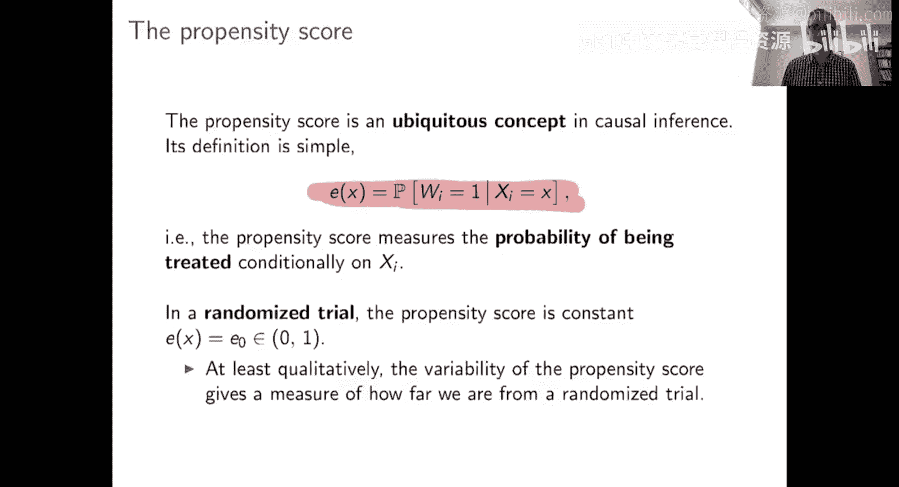
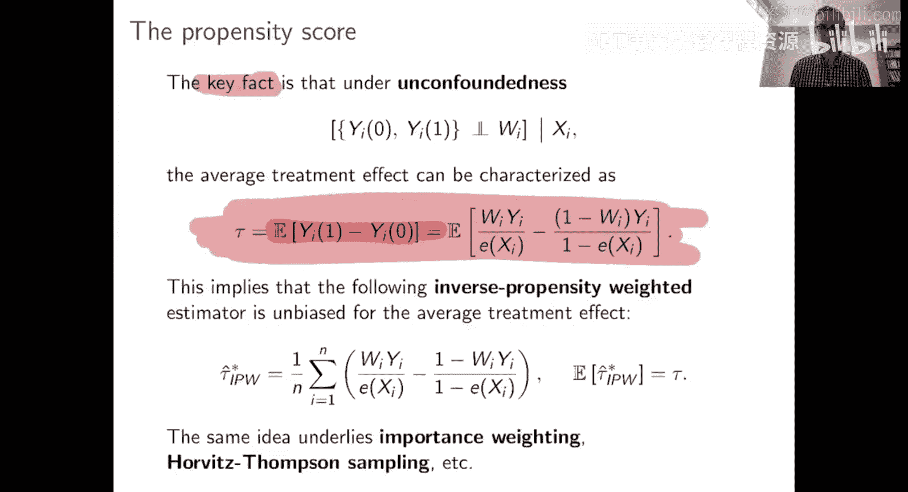
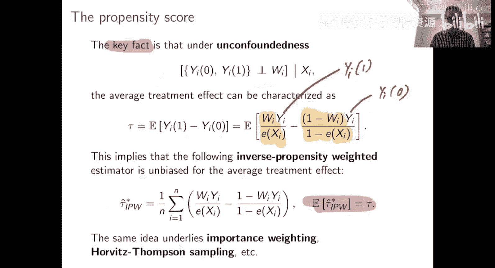
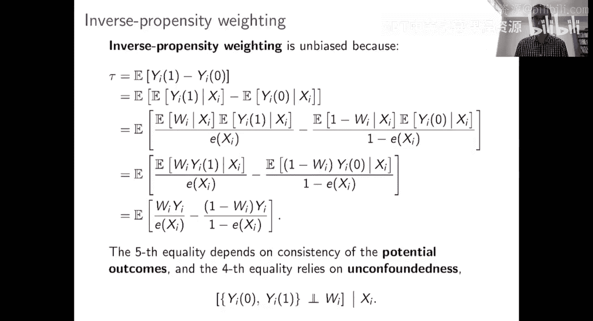
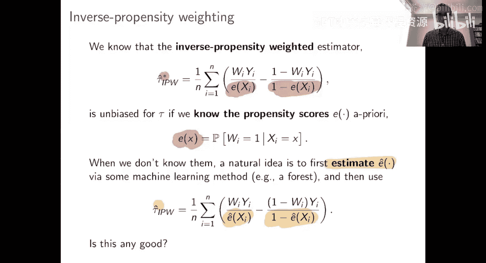
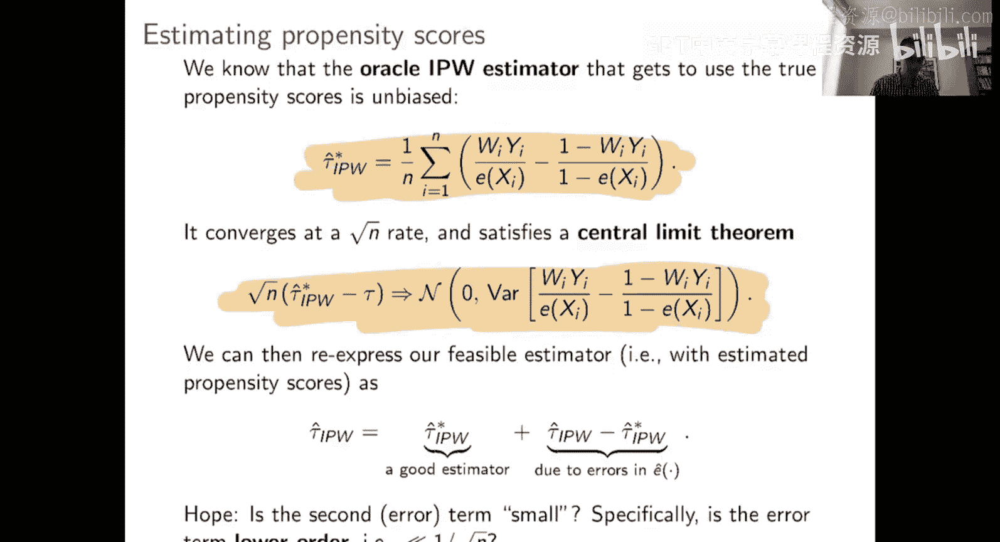
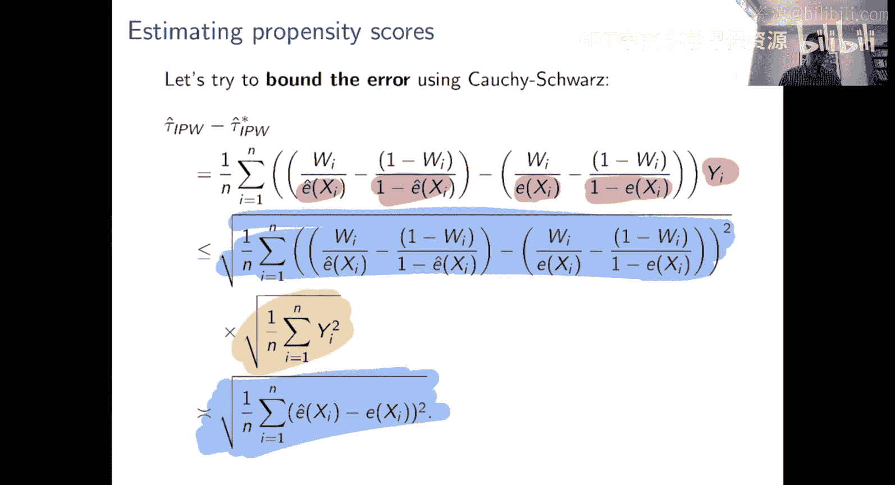
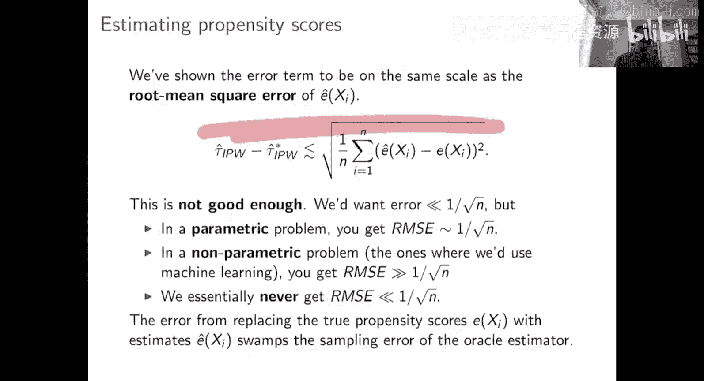
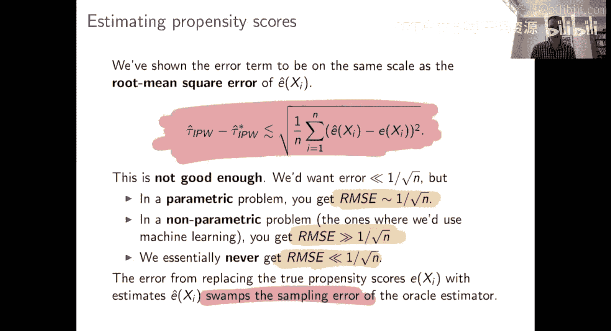
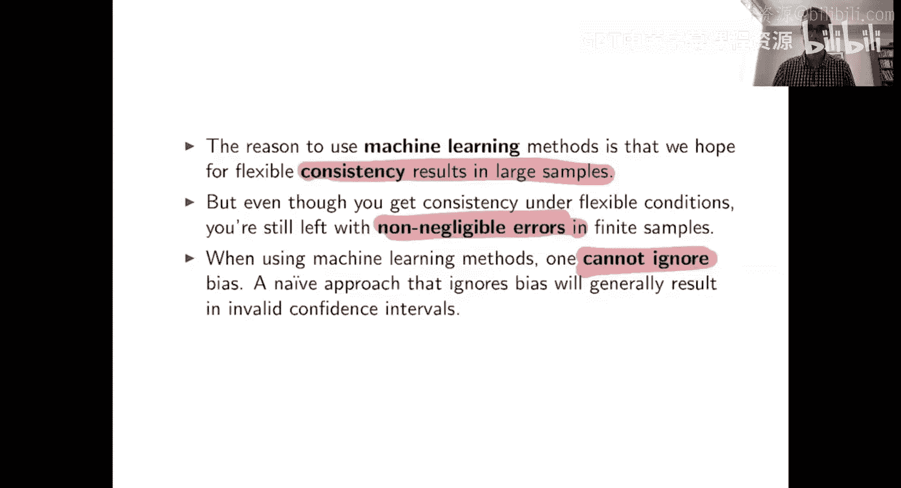

#  007：倾向得分与平均处理效应

## 概述
在本节课中，我们将要学习倾向得分以及基于倾向得分的平均处理效应估计方法。我们将探讨倾向得分的定义、基于逆概率加权的估计器，并分析当使用机器学习方法估计倾向得分时可能遇到的问题。

---

## 倾向得分的定义与重要性

上一节我们讨论了基于回归调整的机器学习方法。本节中，我们来看看另一种核心方法：倾向得分。

倾向得分有一个简单的定义。在给定协变量 **X** 的条件下，接受处理的概率即为倾向得分。其公式表示为：
`e(x) = P(W=1 | X=x)`

在随机试验中，处理是均匀随机分配的。用倾向得分的语言来说，这意味着在随机试验中，倾向得分是常数。例如，在一个公平的50/50随机试验中，倾向得分恒为0.5。

这从性质上表明，如果随机试验是倾向得分恒定的设置，那么观察一个给定观察性研究中倾向得分的分布，可以让你了解该研究在多大程度上偏离了随机化。

---

## 逆概率加权估计器

在无混淆假设下，平均处理效应可以通过一种称为逆概率加权的变换来表征。这是我们在第二部分看到的相同条件。

平均处理效应 **τ** 可以重新表述为以下期望值：
`τ = E[ WY / e(X) ] - E[ (1-W)Y / (1-e(X)) ]`

这个表示法的有趣之处在于，它不依赖于潜在结果，而只依赖于实际观测到的结果 **Y** 和处理状态 **W**。因此，这是一个可以测量的量。

基于这个表示法，可以立即推导出一个实用的平均处理效应估计器，即逆概率加权估计器。其形式如下：
`τ̂*_IPW = (1/n) Σ [ (W_i Y_i) / e(X_i) - ((1-W_i) Y_i) / (1-e(X_i)) ]`

这个无偏性结果直接告诉我们，在已知真实倾向得分 **e(X)** 的情况下，逆概率加权估计器是平均处理效应的无偏估计。

这类思想在统计学的许多领域都很常见，你可能在其他领域以“重要性抽样”或“Horvitz-Thompson估计”等名称遇到过类似的想法。

---

## 为什么逆概率加权是无偏的？

简要解释如下：处理分配 **W** 是二元的（0或1）。当 **W=1** 时，你只能观察到处理组的潜在结果 **Y(1)**。同理，当 **W=0** 时，你只能观察到对照组的潜在结果 **Y(0)**。

至于比率项 **W/e(X)** 和 **(1-W)/(1-e(X))**，请记住 **W** 是实际是否接受处理，而 **e(X)** 是接受处理的概率。这些比率在期望上等于1，因此在期望中会相互抵消，从而得到无偏性。

验证这一点的正式论证依赖于无混淆假设。

---

## 使用估计的倾向得分

目前我们得到的结果是，这个“先知”IPW估计器（使用真实倾向得分）对于平均处理效应是无偏的。需要强调的是，构建这个估计器需要知道每个单元的真实倾向得分 **e(X)**。

如果不知道真实的倾向得分怎么办？一个很自然的想法是先估计倾向得分 **ê(X)**。

这本质上是一个预测任务：你试图从 **X** 预测 **W**。你可以使用任何喜欢的机器学习方法来完成这个任务，例如提升树、随机森林或深度网络。

一旦估计出倾向得分，你就可以将其代入IPW框架，就像你知道真实倾向得分一样操作。在机器学习和因果推断的发展历程中，这实际上是人们最早想做的事情之一。

当然，问题是：这样做有效吗？我们知道使用真实倾向得分的先知IPW估计器是好的。那么使用估计倾向得分的可行IPW估计器好吗？

---

## 评估可行IPW估计器

为了评估可行估计器是否有效，我们可以尝试一种论证思路。我们希望证明，如果能够准确估计倾向得分，那么可行估计器的行为会与先知估计器相似。

这个论证需要两部分：首先，理解先知IPW估计器的理想性质；其次，研究可行估计器与先知估计器之间的差距，并论证这个差距相对于原始估计器的随机波动来说很小。

先知IPW估计器 **τ̂*_IPW** 是N个独立同分布项的平均值，每一项都是目标参数 **τ** 的无偏估计。因此，在非常一般的条件下，它会满足中心极限定理，并以 **1/√n** 的速率收敛。

我们希望使用估计倾向得分的可行估计器 **τ̂_IPW** 也能表现出类似的行为，同样以 **1/√n** 的速率收敛。

我们希望可行估计器看起来像先知估计器加上一个误差项。为了使论证成立，我们需要这个误差项远小于 **1/√n**，从而可以被忽略。

---

## 误差项分析

我们能否忽略倾向得分估计在IPW中引入的误差？我们需要尝试给出一个上界。

我们试图界定 **τ̂_IPW** 和 **τ̂*_IPW** 之间的差异。应用柯西-施瓦茨不等式，我们可以得到一个上界。

这个上界主要包含两项。第一项涉及估计倾向得分 **ê(X)** 与真实倾向得分 **e(X)** 之差的均方根误差。

分析表明，可行IPW估计器与先知IPW估计器之间的差异，在常数项内，大约与倾向得分的均方根误差同阶。

这足够好吗？答案是否定的。为了使误差不影响，我们需要可行估计器与先知估计器之间的差异远小于 **1/√n**。然而，这要求倾向得分的均方根误差远小于 **1/√n**。

在机器学习应用中，这通常是不现实的。在参数化问题中，也许能达到 **1/√n** 的收敛速率。但我们应用机器学习的问题通常更复杂，是非参数化的。在这些情况下，均方根误差通常远大于参数速率 **1/√n**。

因此，这个论证无法成立。更仔细的研究会表明，当你使用通用的机器学习方法估计倾向得分时，可行IPW估计器通常与先知IPW估计器并不接近。

---

## 核心问题与启示

核心问题在于：虽然机器学习方法能在非常一般的条件下，在大样本中给我们一致的估计（即正确的答案），但这并不意味着在有限样本中，我们可以忽略其估计误差。

在IPW中，使用 **ê(X)** 代替 **e(X)** 所产生的误差通常是不可忽略的。如果你不考虑这个误差，你可能会对你的估计器的准确性做出非常错误的判断。

一个天真的、忽略这种估计误差的方法，通常会导致置信区间和其他推断陈述出现严重错误。

为什么会出现这种情况？对于先知IPW，标准的置信区间构造方法会给出长度约为 **1/√n** 的区间。但是，如果你使用基于机器学习的方法来估计倾向得分，你会引入一个额外的误差项，这个误差项远大于 **1/√n**。一旦误差项大于你最初构建的置信区间，这些置信区间就失效了。

---

## 解决方案的方向

至此，你可能会认为情况很糟糕，我们应该抛弃基于机器学习的方法，回到参数化建模。因为至少当参数模型设定正确时，我们知道该怎么做。

但事实证明，尽管机器学习方法的简单直接应用在这里行不通，但确实存在可行的方法。

解决方案在概念上非常简单。你仍然可以做我们一直在做的事情：取一个简单的估计器，将基于机器学习的预测值代入，然后尝试忽略机器学习方法的误差。

关键在于，你需要谨慎选择将机器学习预测值代入哪种估计器。单独的回归调整不行，单独的IPW也不行。

在本讲的最后部分，我将介绍一种能够胜任这项工作的估计器。

---

## 总结
本节课中，我们一起学习了倾向得分及其在平均处理效应估计中的应用。我们定义了倾向得分，介绍了基于逆概率加权的估计器，并深入分析了当使用机器学习方法估计倾向得分时，所引入的估计误差为何不可忽略。这为我们理解后续更稳健的方法（如双重稳健估计）奠定了重要基础。关键在于，直接“插入”机器学习预测值到传统估计框架可能带来较大偏差，需要更精巧的估计器设计来克服这一问题。