#  008：平均处理效应与双重稳健性

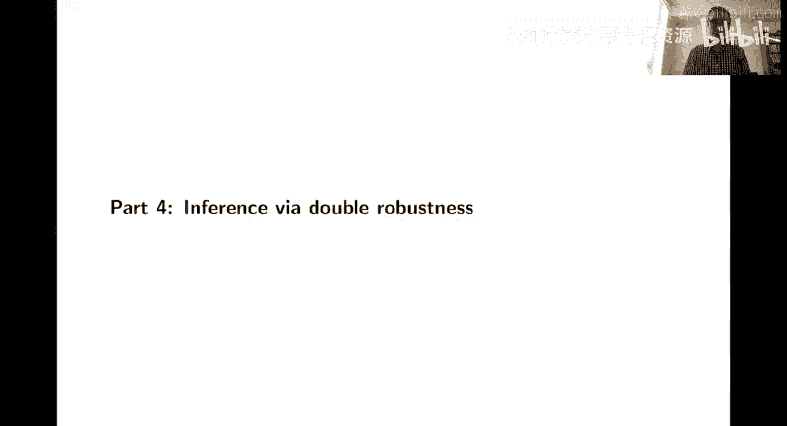

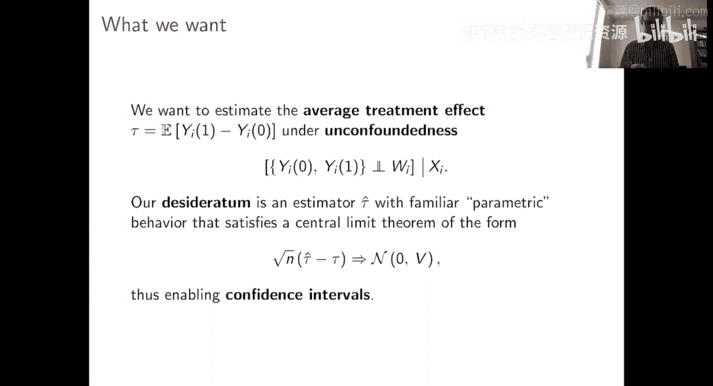

在本节课中，我们将学习一种基于机器学习来估计平均处理效应的优秀方法。我们将探讨其核心原理、具体形式以及为何它能提供可靠的统计保证。

## 概述：我们追求的目标

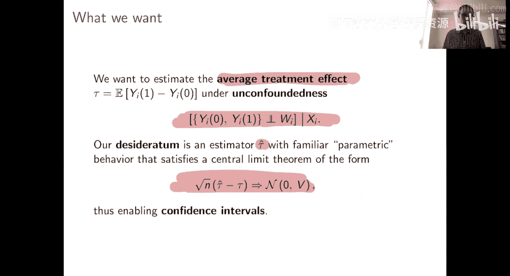

我们一直在讨论平均处理效应。在无混淆假设下，我们希望估计平均处理效应。但“优秀”具体指什么？

这里的“优秀”指的是具有**参数化类型保证**的估计量。我们希望得到一个估计量 $\hat{\tau}$，它能够：
*   以 $\sqrt{n}$ 的速率收敛到平均处理效应。
*   满足中心极限定理。
*   使我们能够以常规方式构建置信区间。

为何这是一种“优秀”的标准？在参数建模的经典设定中，如果你使用一个设定正确的线性模型进行回归，你本质上就能得到这些性质：$\sqrt{n}$ 收敛速率和置信区间。使用机器学习时，你希望在保持灵活性的同时，最终得到与传统参数建模相媲美的优良性质。

## 我们的工具：机器学习黑箱

我们拥有机器学习工具，但这概念有些模糊。我需要更具体地说明“使用机器学习”意味着什么。这意味着我们拥有一个**预测黑箱**。它灵活，但并非完美。

具体来说，我们假设有一种方法可以估计 $\hat{\mu}_w(x)$ 和 $\hat{e}(x)$（即条件响应函数和倾向得分），并且它们在均方根误差意义下以 $n^{-1/4}$ 的速率收敛。

这个假设可能看起来有些奇怪。首先，我们为何用均方根误差来表述这个假设？因为机器学习方法的宣称优势在于**预测**，而衡量预测好坏的一个自然标准就是在平方误差损失下的表现。最优预测器就是 $\mu_w(x)$。因此，机器学习声称擅长预测，就意味着它声称擅长最小化均方根误差。

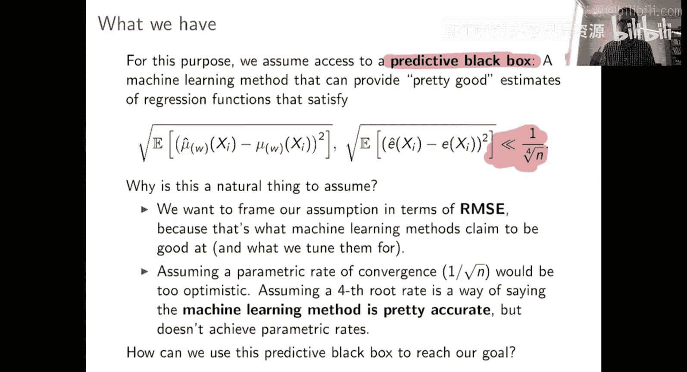

其次，为何是 $n^{-1/4}$ 这个速率？这是一个更微妙的问题。简而言之，这个收敛速率比参数模型中的 $n^{-1/2}$ 速率要慢。这是一个**更弱的假设**，它为机器学习模型留出了空间：它们可以做得很好，但不必达到参数模型的完美收敛速度。这个特定的速率便于推导简洁的形式结果，并且明显弱于参数问题的结果。

那么，问题来了：如何利用这个预测黑箱来实现我们的目标，即估计平均处理效应？

## 解决方案：增强逆概率加权估计量

答案是，我们需要同时估计两个模型（响应函数和倾向得分），并以一种巧妙的方式将它们结合起来，让两个模型的误差相互抵消。

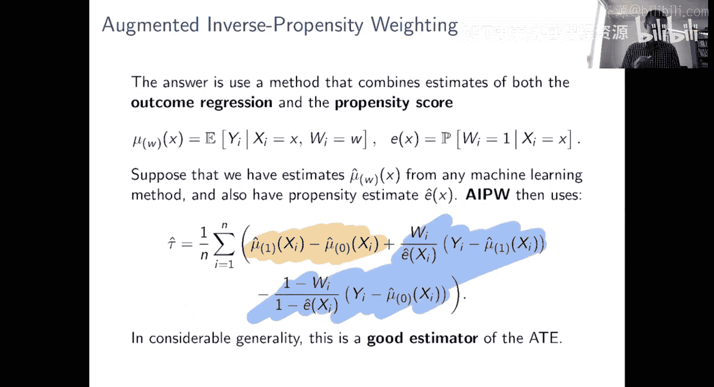

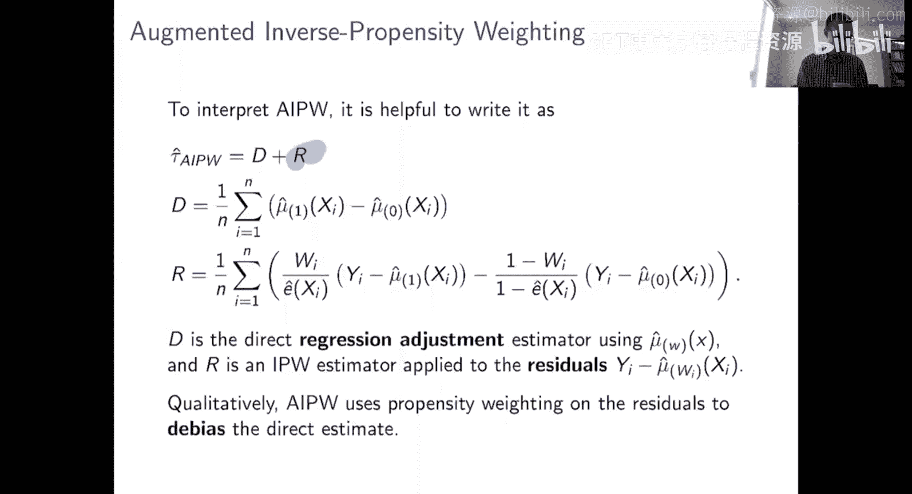

具体做法是使用以下函数形式的估计量，它被称为**增强逆概率加权估计量** 或 **AIPW**。

$$
\hat{\tau}^{AIPW} = \frac{1}{n} \sum_{i=1}^{n} \left[ \hat{\mu}_1(X_i) - \hat{\mu}_0(X_i) + \frac{W_i (Y_i - \hat{\mu}_1(X_i))}{\hat{e}(X_i)} - \frac{(1-W_i) (Y_i - \hat{\mu}_0(X_i))}{1 - \hat{e}(X_i)} \right]
$$

简单来说，在相当一般的条件下，即使 $\hat{\mu}$ 和 $\hat{e}$ 来自机器学习方法，AIPW 也是一个平均处理效应的良好估计量。

看到这个公式，你的第一反应可能是：这太复杂了。我理解这种感受，但我希望在你理解它的工作原理后，会觉得它并不像看起来那么可怕。

## 分解与理解 AIPW

我们可以将 AIPW 估计量分解为两部分：橙色部分和蓝色部分。

$$
\hat{\tau}^{AIPW} = \underbrace{\frac{1}{n} \sum_{i=1}^{n} [\hat{\mu}_1(X_i) - \hat{\mu}_0(X_i)]}_{D} + \underbrace{\frac{1}{n} \sum_{i=1}^{n} \left[ \frac{W_i (Y_i - \hat{\mu}_1(X_i))}{\hat{e}(X_i)} - \frac{(1-W_i) (Y_i - \hat{\mu}_0(X_i))}{1 - \hat{\mu}_0(X_i)} \right]}_{R}
$$

我们可以这样解释它们：
*   **橙色部分 $D$**：这很熟悉，就是我们之前讨论过的基于机器学习的**回归调整**估计量。在灵活性假设下，从机器学习得到的 $\hat{\mu}$ 是一致的，因此 $D$ 在相当一般的条件下是平均处理效应的一致估计量。但机器学习方法收敛速度不够快，因此 $D$ 不会以 $\sqrt{n}$ 的速率收敛，存在收敛偏差，我们无法为其构建置信区间。
*   **蓝色部分 $R$**：这是我们对 $D$ 应用的**修正项**。仔细观察 $R$，并将其与之前看到的 IPW 估计量比较，会发现它们看起来很相似。IPW 的形式是 $\frac{1}{n} \sum_{i=1}^{n} \left[ \frac{W_i Y_i}{\hat{e}(X_i)} - \frac{(1-W_i)Y_i}{1-\hat{e}(X_i)} \right]$。而 $R$ 项是在应用 IPW，但应用的对象不是原始结果 $Y_i$，而是这些**残差**：对于处理组是 $Y_i - \hat{\mu}_1(X_i)$，对于控制组是 $Y_i - \hat{\mu}_0(X_i)$。

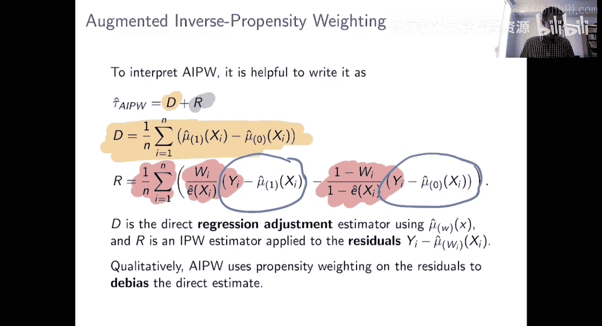

这样做的直觉是：想象你认同回归调整估计量，觉得它不错，但我告诉你机器学习方法有误差，单独的回归调整会留下偏差。那么，一个想法是尝试“修补”它。$Y_i - \hat{\mu}_w(X_i)$ 衡量了第一次回归阶段后**残留的信号**。如果 $\hat{\mu}_w(X_i)$ 是 $Y_i$ 的完美预测，那么残差就是均值为零的不可约噪声，$R$ 项基本为零。但如果第一次回归确实留下了一些信号，那么这些残差中就包含了衡量纯回归调整估计量 $D$ 偏差的信息。于是，你可能会希望将这些残差放入 IPW 框架中，以提取残留的信息。**你先进行回归调整，然后用 IPW 来修正回归调整，吸收任何残留的信息**。这听起来像是一个过于乐观的想法，但事实证明它非常有效。

## 一个模拟示例

让我们通过一个简单的模拟示例来看这个过程。这里有一个非参数函数。

此设定中的平均处理效应是 -0.05。
1.  **第一步（回归调整）**：使用随机森林估计 $\hat{\mu}_0$ 和 $\hat{\mu}_1$，然后计算预测值的平均差。这是回归调整估计量 $D$。平均我们得到 0.09，而真实值是 -0.05。结果一致但不够好。
2.  **第二步（修正）**：拟合倾向得分模型 $\hat{e}$。将随机森林的残差应用于 IPW，得到修正项 $R$。在这个例子中，修正项 $R$ 是 -0.1。
3.  **第三步（合并）**：将修正项 $R$ 加到原始估计量 $D$ 上：$0.09 + (-0.1) = -0.01$。这仍然不完美，但比原始的回归调整更接近真实答案。

为了了解效果如何，下图展示了 100 次重复模拟中治疗效应估计的箱线图。

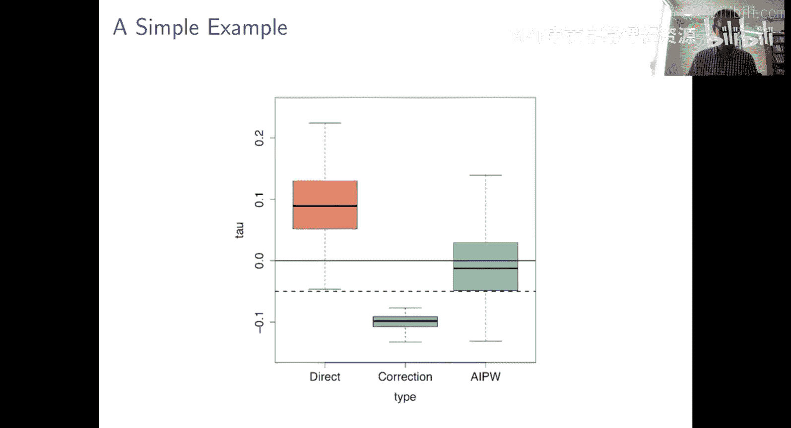

*   第一个箱线图是回归调整估计量 $D$。它并不好，平均值高于真实值，并且在所有模拟中估计值都大于真实值。
*   第二个是修正项 $R$，它是一个非常稳定的向下修正。
*   第三个是 AIPW 估计量。虽然仍不完美，但平均而言，AIPW 比单独的回归调整更接近正确答案，并且真实处理效应开始落在 AIPW 估计值的分布范围内。

希望这个例子能帮助你理解，这个看似令人生畏的 AIPW 函数形式，其实有一个简单的解释：**先进行回归调整，然后取残差并将其代入 IPW 进行修正**。

即便如此，你可能觉得实现起来很复杂。我想安慰你的是，一旦你知道 AIPW 是使用机器学习估计平均处理效应时应该做的事情，你通常可以找到实现它的软件包。例如，在我和 Susan 维护的 `grf` 包中，你可以调用 `causal_forest` 函数，它会基于随机森林为你计算所需的 $\hat{\mu}$ 和 $\hat{e}$，然后你可以调用 `average_treatment_effect` 函数来获得 AIPW 估计量及其标准误，这一切都为你自动完成。

## AIPW 的理论保证：双重稳健性

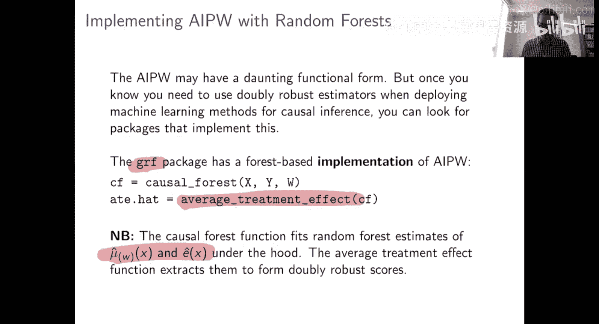

我已经铺垫了很久，说 AIPW 是优秀的。现在让我们具体谈谈 AIPW 在何种意义上能给出平均处理效应的良好估计。

关键结论是，AIPW 实际上满足了我们之前试图为 IPW 证明但未能证明的那种定理。

我首先写下 AIPW 的“神谕”版本（使用真实的 $\mu$ 和 $e$）：

$$
\tilde{\tau}^{AIPW} = \frac{1}{n} \sum_{i=1}^{n} \left[ \mu_1(X_i) - \mu_0(X_i) + \frac{W_i (Y_i - \mu_1(X_i))}{e(X_i)} - \frac{(1-W_i) (Y_i - \mu_0(X_i))}{1 - e(X_i)} \right]
$$

我们的策略是证明，在关于机器学习方法的合理假设下，使用估计值 $\hat{\mu}$ 和 $\hat{e}$ 的**可行 AIPW 估计量**，其一阶行为与这个使用真实值的**神谕 AIPW 估计量**是等价的。

定理（简化版）如下：
假设我们从机器学习得到的估计值以 $n^{-1/4}$ 的 RMSE 速率收敛。那么，可行估计量 $\hat{\tau}^{AIPW}$ 和神谕估计量 $\tilde{\tau}^{AIPW}$ 在 $\sqrt{n}$ 尺度上是等价的。即，将它们的差乘以 $\sqrt{n}$，依概率收敛到零。它们是**一阶等价**的。

我不会在这里证明这个结果。但我想强调结果的形式，并与 IPW 的情况进行对比。
*   对于 IPW，我们试图界定可行估计量与神谕估计量之间的差异。我们发现，如果倾向得分以 $n^{-1/4}$ 的速率收敛，那么可行估计量与神谕估计量之间的差异最多被控制在 $n^{-1/4}$ 的量级，没有改善，你被所用方法的准确性所限制。
*   但对于 AIPW，情况相反。我们只假设回归函数以 $n^{-1/4}$ 的速率收敛，然而，将这些具有 $n^{-1/4}$ 尺度误差的 $\hat{\mu}$ 和 $\hat{e}$ 代入这个估计量，所导致的最终误差尺度却小于 $n^{-1/2}$。这似乎违反了“垃圾进，垃圾出”的原则。但事实是，AIPW 估计量经过精心设计，使得 $\hat{\mu}$ 和 $\hat{e}$ 的一阶误差会相互抵消。因此，你可以代入具有 $n^{-1/4}$ 尺度误差的组件，但最终结果的变化却小于 $n^{-1/2}$。

这意味着我们可以做我们原本想用 IPW 做的事情：研究神谕估计量 $\tilde{\tau}^{AIPW}$，为其建立一个以 $n^{-1/2}$ 速率收敛的中心极限定理，然后利用上述等价性论证，证明可行的 $\hat{\tau}^{AIPW}$ 也满足你为神谕估计量证明的任何保证。

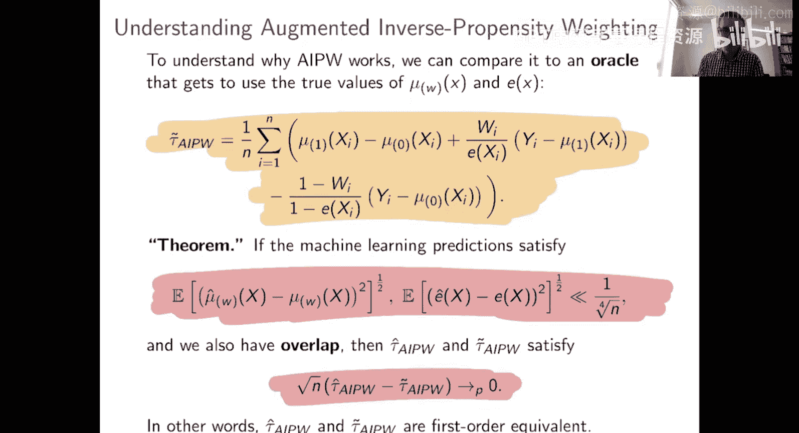

具体来说，$\tilde{\tau}^{AIPW}$ 只是独立同分布项的平均值。独立同分布项的平均值在相当一般的条件下满足中心极限定理。

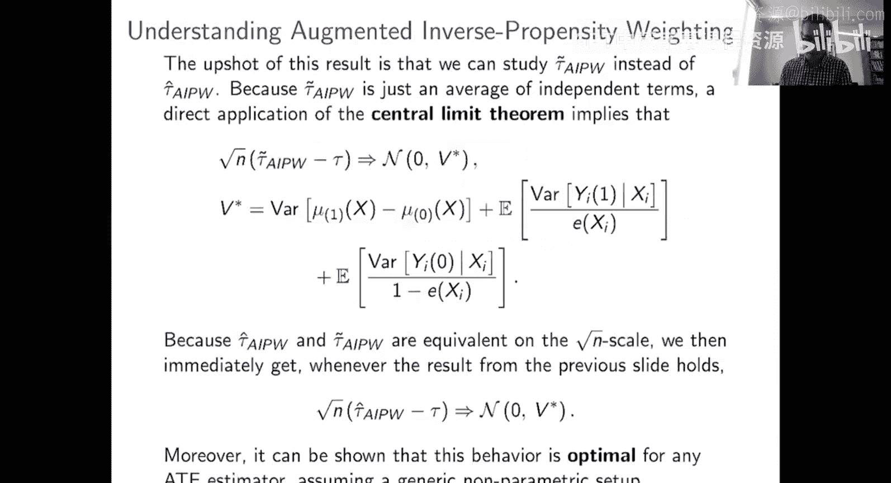

神谕估计量 $\tilde{\tau}^{AIPW}$ 是渐近正态的，以 $n^{-1/2}$ 的偏差围绕真实平均处理效应波动。其方差取决于图中蓝色方框内的量 $V^*$。由于 $\hat{\tau}^{AIPW}$ 和 $\tilde{\tau}^{AIPW}$ 在 $\sqrt{n}$ 尺度上等价，一旦你得到了神谕估计量的中心极限定理，你也就得到了可行估计量的中心极限定理。

这是今天我给出的第一个结果，它表明：**你不需要使用参数模型，可以从对机器学习的合理假设出发，结合来自多个不同机器学习模型的预测，最终得到具有经典高斯参数速率行为的平均处理效应估计量**。实际上，这里得到的 $V^*$ 是一个非常好的方差参数，在非参数假设下，这是你能为平均处理效应估计得到的**最优**中心极限定理。

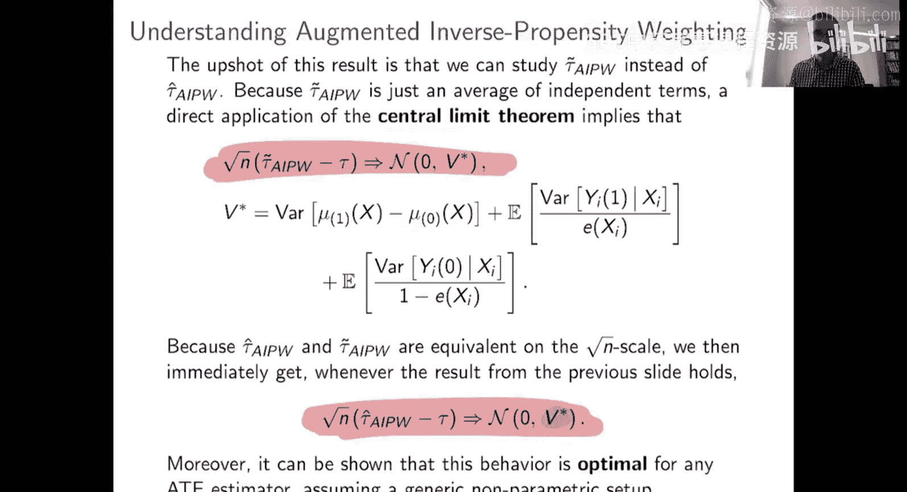

证明实际上给出了更多信息。渐近地，你可以将 $\hat{\tau}^{AIPW}$ 写成这些 $\hat{\Gamma}_i$ 的平均值，我称之为**双重稳健得分**。

$$
\hat{\tau}^{AIPW} = \frac{1}{n} \sum_{i=1}^{n} \hat{\Gamma}_i
$$

其中
$$
\hat{\Gamma}_i = \hat{\mu}_1(X_i) - \hat{\mu}_0(X_i) + \frac{W_i (Y_i - \hat{\mu}_1(X_i))}{\hat{e}(X_i)} - \frac{(1-W_i) (Y_i - \hat{\mu}_0(X_i))}{1 - \hat{e}(X_i)}
$$

这些双重稳健得分通常不是独立同分布的，因为你插入了 $\hat{\mu}$ 和 $\hat{e}$ 从而引入了跨项的依赖性。但在我们所作的假设下（即 $\hat{e}$ 和 $\hat{\mu}_w$ 以 $n^{-1/4}$ 的速率收敛），这些 $\hat{\Gamma}_i$ 足够接近独立，以至于你可以忽略这种依赖性，并可以像 $\hat{\tau}^{AIPW}$ 只是独立 $\hat{\Gamma}_i$ 的平均值那样为其构建置信区间。

因此，你可以做非常常规的事情：估计样本均值的方差，然后构建渐近正态置信区间。一旦你使用 AIPW 估计量，你就可以为 $\tau$ 构建非常标准的置信区间。

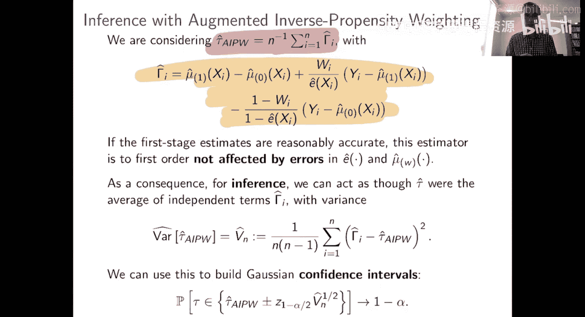

## 重要细节与注意事项

我想通过强调几个在定理陈述中忽略但仍然重要的细节来结束讨论。

### 1. 交叉拟合

我声称只要 $\hat{\mu}$ 和 $\hat{e}$ 足够准确，你就可以将它们代入 AIPW 估计量，一切都会很好。这**几乎**是对的。但要使这完全成立，你需要使用一种称为**交叉拟合**的算法技巧。

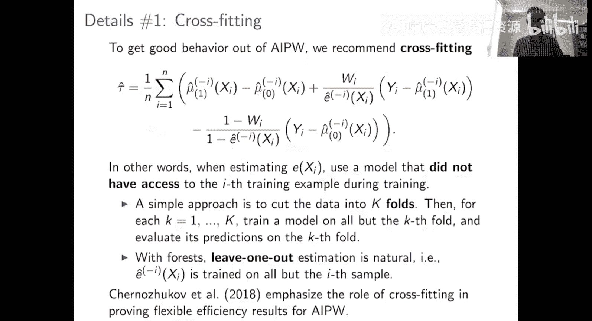

最简单的交叉拟合类型是：将数据集分成两半（例如 A 和 B）。用 B 半的数据训练模型，用来预测 A 半数据的值；用 A 半的数据训练模型，用来预测 B 半数据的值。本质上，你永远不要使用在训练过程中看到过第 $i$ 个样本的模型，来预测第 $i$ 个样本的 $\hat{\mu}_1(X_i)$。

交叉拟合很重要。大多数实现 AIPW 与机器学习的标准软件包都会为你做这件事。如果你想手动实现，需要记住使用交叉拟合。它在算法上并不比交叉验证更复杂。交叉拟合的保证是：机器学习方法使用单个数据点的特殊性不会影响你的统计保证。

### 2. 重叠性

要使 AIPW 给出平均处理效应的良好估计，你需要三个条件：
1.  无混淆性。
2.  机器学习方法相当准确。
3.  **重叠性**。

重叠性意味着倾向得分不能太接近 0 或 1。具体来说，我假设存在一个正常数 $\eta$，使得每个人都有至少 $\eta$ 的概率被处理，以及至多 $1-\eta$ 的概率被处理。数据集中没有人在给定 $X$ 的条件下几乎被确定性地分配到控制组或处理组。

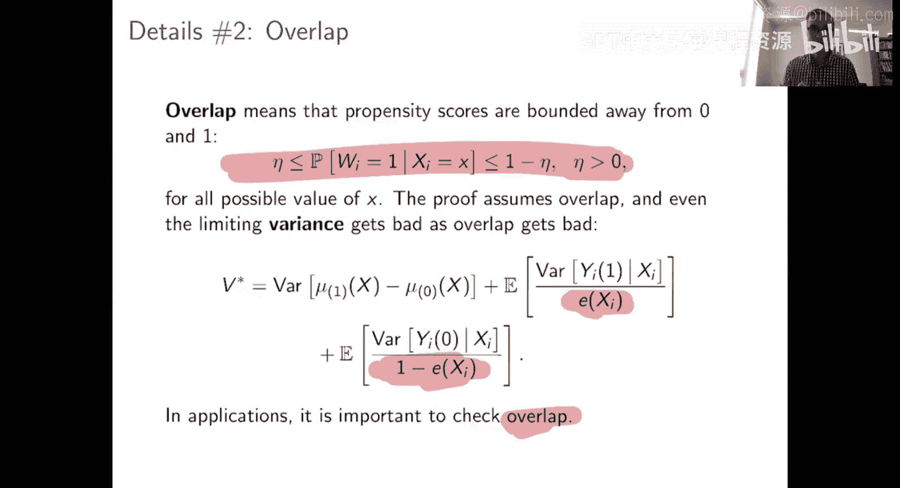

重叠性在概念上是必要的：如果你试图在一个某些人被确定性分配的数据集中估计处理效应，你会感到担忧，这是对的。另一个更算法化的理由是：在 AIPW 的方差公式中，你需要除以 $e(x)$ 和 $1-e(x)$。如果 $e(x)$ 接近零，就会产生很大的值。因此，即使有所有的理论保证，如果你让倾向得分接近 0 或 1，你的方差也会很糟糕，处理效应估计将不准确。

在实践中该如何处理？我建议你考虑重叠性问题。通常，你不需要过于担心，因为与无法从数据验证的无混淆性不同，**重叠性是可以从数据中检查的**。运行 AIPW 时，你拥有倾向得分的估计值 $\hat{e}(x)$。每次都可以绘制 $\hat{e}(x)$ 的直方图。如果直方图在 0 和 1 之间分布良好，远离极端值，那么情况就好。如果它在 0 或 1 处出现尖峰，你可能存在重叠性问题。

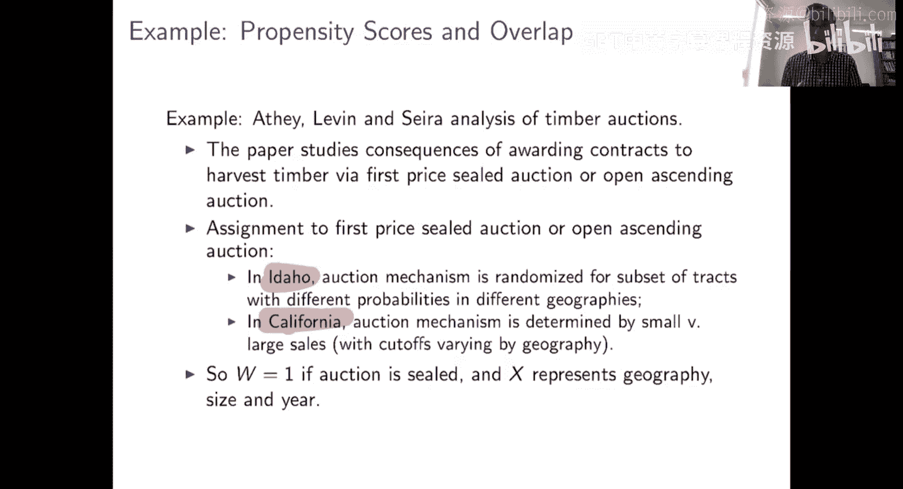

下图展示了 Susan 及其合著者一篇论文中的例子。他们研究不同的拍卖机制，问题是使用公开密封拍卖与公开升序拍卖的效果有何不同。

*   **爱达荷州**：情况良好。大多数倾向得分远离 0 和 1。
*   **加利福尼亚州**：所有控制组的倾向得分几乎都为 0，所有处理组的倾向得分几乎都为 1。这表明基于协变量，大多数单位被确定性分配。如果你的倾向得分图看起来像这样，你就需要担忧了。

如果存在重叠性问题，你可以做几件事：将数据集过滤到重叠性更好的区域；尝试改变所研究的问题（例如，如果很多倾向得分接近 0 但接近 1 的不多，可以估计**处理组的平均处理效应**，这需要使用略微不同的函数形式）；等等。一旦你知道存在问题，通常可以解决它。

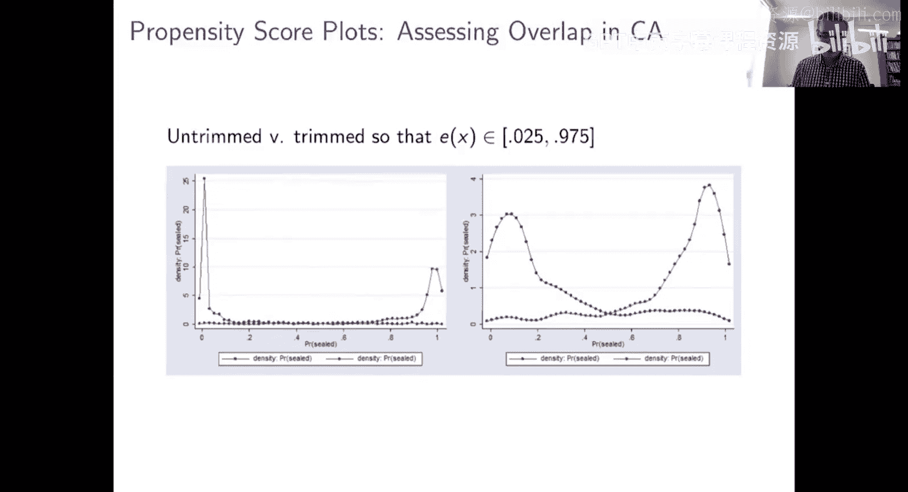

## 总结与对比

回顾一下我们在这节课中所做的内容：
我们想要估计平均处理效应，这是因果推断中最标准的目标之一。我们想在观察性研究中估计它，这意味着我们必须以某种方式控制预处理变量 $X$。我们想使用机器学习来控制这些 $X$，以避免做出参数假设。

乍一看，有许多流行的想法：你可以做回归调整，可以做逆概率加权。你可能会想：“我知道该怎么做，我取回归调整公式，但插入机器学习，一切都会好的，对吧？”**不对**。不幸的是，机器学习方法相当准确，但不如设定正确的参数模型那样准确。因此，这行不通，你得不到置信区间。

然后你可以看 IPW，再次说：“嘿，我知道该怎么做，我看到一个倾向得分，我要用机器学习方法估计我的倾向得分，把它插进去，这就会奏效，对吧？”**同样不行**。它会是一致的，但我们没有得到可与良好 $\sqrt{n}$ 速率参数型保证相媲美的、构建置信区间所需的保证。

那么，情况是否无望？**不**。你可能想做的那些最简单、最朴素的事情行不通，但你可以通过正确的策略将机器学习很好地用于因果推断。这里一个好的策略就是 **AIPW**。它是一个精心设计的估计量，从回归调整开始，并使用 IPW 来修正回归调整，这样做可以一阶抵消回归调整和 IPW 的误差。

你可能觉得我是凭空变出这个估计量的，这有点奇怪。但我想向你保证，这是一个“大帽子”，你可以从中变出许多其他东西，并且有理论指导如何做到。AIPW 只是具有这种性质的估计量的第一个例子。如果你听说过“正交矩”或“双重稳健性”这些术语，它们是非常通用的术语，既适用于 AIPW，也适用于许多其他估计量。

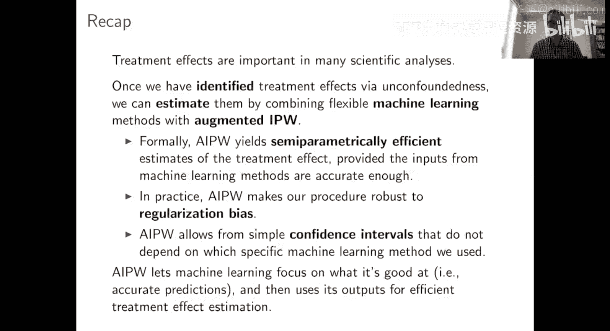

那么，线性回归和机器学习的区别是什么？
一方面，线性回归在给定一个设定正确的线性模型时，具有非常好的行为（参数行为），它以 $n^{-1/2}$ 的速率收敛，一切都很完美。但在一般情况下，如果线性模型不正确，那么线性回归就是不一致的，你会得到错误的答案，这很糟糕。
另一方面，机器学习更灵活。在线性设定下，它没问题；在一般设定下，它也没问题。你使用机器学习的原因是为了在相当一般的条件下，获得对你想要预测的东西的良好估计。这很好。

使用机器学习开启了一扇灵活性的大门，但这样做的代价是，你现在需要记住，实际上，机器学习方法在部署时产生的误差，通常比你在参数模型中使用参数方法时所习惯的误差要大一些。你需要使用对中等有限样本误差具有鲁棒性的后处理策略。

在平均处理效应估计的背景下，我们看到 **AIPW** 是具有这种性质的一种解决方案。在本课程中，我们将看到更多这样的例子。

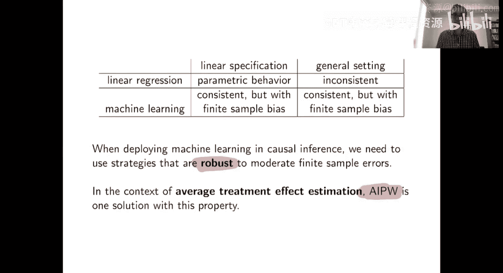

## 参考文献

最后，我为你提供一些参考文献。前三篇更接近我今天所讲的内容，它们更广泛地概述了这一研究议程。
1.  **Chernozhukov, V., Chetverikov, D., Demirer, M., Duflo, E., Hansen, C., Newey, W., & Robins, J. (2018). Double/debiased machine learning for treatment and structural parameters. *The Econometrics Journal*, 21(1), C1-C68.** （阐述了议程，以及你可以在哪些问题中插入机器学习并获得因果参数的良好参数型保证和置信区间。）
2.  **Farrell, M. H., Liang, T., & Misra, S. (2021). Deep neural networks for estimation and inference. *Econometrica*, 89(1), 181-213.** （在深度神经网络的背景下详细阐述了今天介绍的内容，并证明了应用这些结果所需的保证。）
3.  **Chernozhukov, V., Escanciano, J. C., Ichimura, H., Newey, W. K., & Robins, J. M. (2022). Locally robust semiparametric estimation. *Econometrica*, 90(4), 1501-1535.** （进一步推广了议程。）

我今天更多地讨论了非参数设定。在高维设定中，也存在非常类似的讨论，你想使用 LASSO 等方法（而不是在非参数设定中使用的树、森林或提升法）来估计平均处理效应。如果你对高维设定感兴趣，下面两篇论文是入门的好地方：
4.  **Belloni, A., Chernozhukov, V., & Hansen, C. (2014). Inference on treatment effects after selection among high-dimensional controls. *The Review of Economic Studies*, 81(2), 608-650.**
5.  **Belloni, A., Chernozhukov, V., Fernández-Val, I., & Hansen, C. (2017). Program evaluation and causal inference with high-dimensional data. *Econometrica*, 85(1), 233-298.**

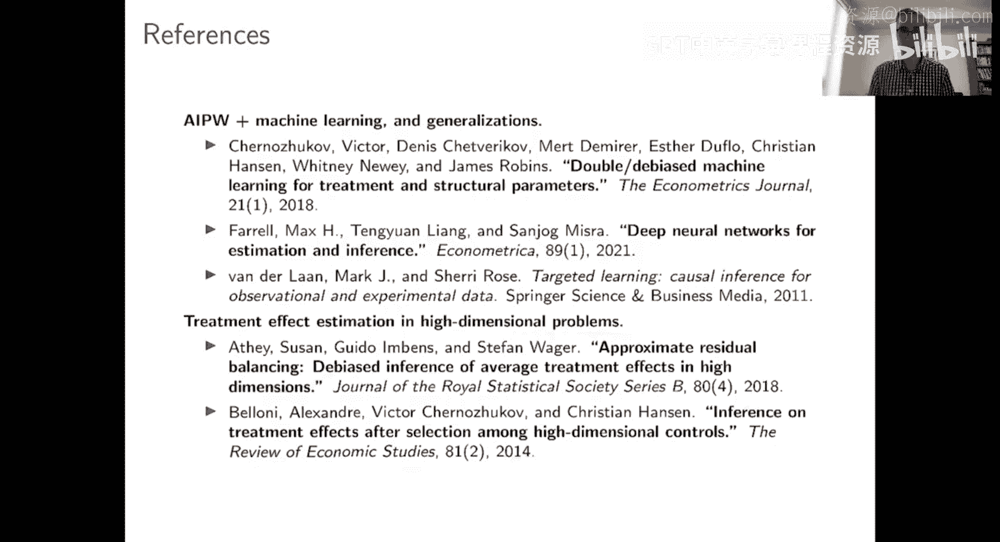

本节课中，我们一起学习了如何使用双重稳健的 AIPW 方法，在利用机器学习灵活性的同时，获得对平均处理效应的可靠统计推断。这是将现代机器学习与经典因果推断相结合的关键一步。