#  009：条件平均处理效应概述

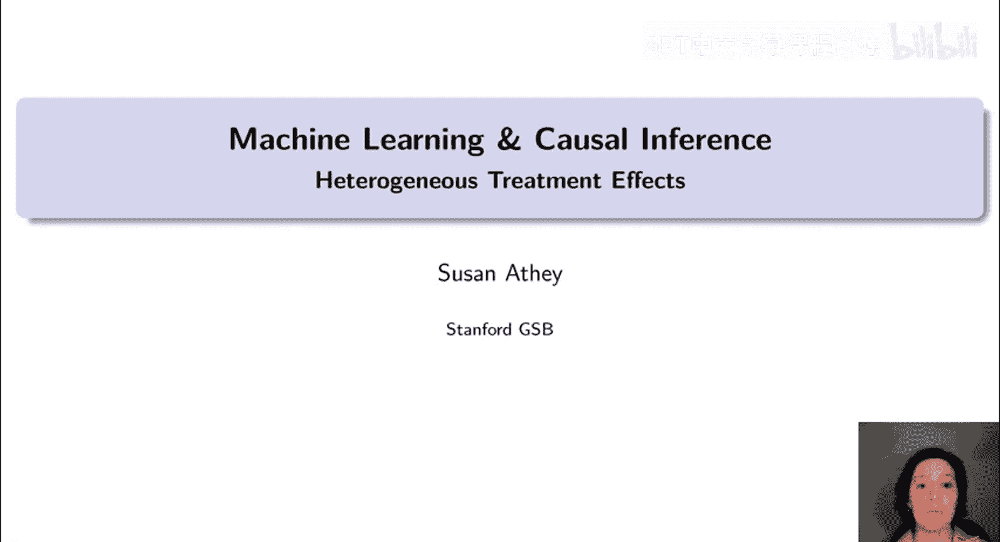

在本节课中，我们将要学习如何利用近十年来发展的新方法，结合机器学习来估计处理效应的异质性，即处理效应如何随个体可观测特征的变化而变化。

机器学习在利用数据进行政策分析方面具有巨大潜力。其主要优势之一是允许我们构建更精细的统计模型，并提供系统化、可重复的算法来实现这一点。机器学习能够改进对政策、项目或干预措施效果的因果推断，因为我们能够对反事实（即个体在未接受处理的情况下会发生什么）做出更精细的预测。我们也能更有效地利用可观测变量来控制混杂因素，即那些可能同时影响处理分配和结果、若被忽略则会导致因果效应估计产生偏差的变量。机器学习有潜力在这方面做得更好，因为它拥有经过提炼和改进的算法，能够灵活地利用数据，从而减少对预设函数形式假设的依赖。这反过来有助于我们采用更具可重复性的方法来应对因果推断中的一些挑战。缺乏可重复性以及对函数形式的敏感性，一直是阻碍因果估计在政策问题中可信度的因素之一。

其次，我们可以更好地理解什么对谁有效以及为什么有效。利用机器学习理解处理效应异质性的来源可以提供洞察，也允许我们更好地将处理措施定向到效果最好的人群。例如，这涉及估计个性化或定向的处理分配策略，这里的“个性化”指的是针对个体可观测特征进行定向。

然而，我们需要考虑对机器学习工具进行修改，以使其发挥最大效用。特别是，我们有许多成熟的机器学习方法在实践中对预测任务表现良好，但它们不一定具备完善的统计性质。回想一下，对于预测问题，你并不真正需要很多统计性质，因为你可以在测试集中评估模型预测结果的好坏。如果你的唯一目标是做好结果预测，我们可以在测试集中看到真实情况并评估我们的表现。然而，在因果推断中，情况则不同。人们不会带着处理效应标签走来走去，我们不知道真实的处理效应是什么。我们不知道如果你在治疗组但没有服药会发生什么，也不知道如果你在对照组但服了药会发生什么。因此，我们实际上没有每个个体的真实情况，所以我们必须做更多工作来弄清楚如何评估用于机器学习的因果推断方法的性能。

对于许多应用，我们还需要有效的置信区间，范围从科技公司的A/B测试（你仍然需要确保发现的结果不仅仅是抽样变异）到药物或疫苗的临床试验（我们需要确保你没有仅仅为了找到药物对某些亚组有效而进行数据挖掘，然后试图通过FDA批准）。因此，我们需要确保我们的方法能给出可靠的结果。

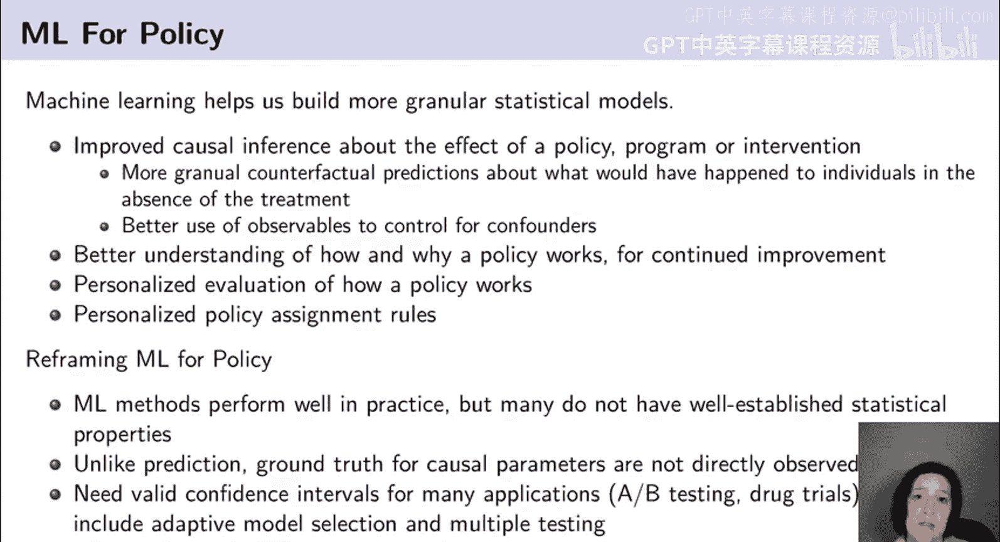

在本节课以及后续课程中，我将讨论如何实现两全其美：如何利用机器学习进行数据驱动的发现（如处理效应异质性），同时保持可重复性并允许有效的统计推断。

## 结合机器学习与因果推断的主题

上一节我们介绍了机器学习在因果推断中的潜力，本节中我们来看看结合两者时出现的一些主题。

其中一个重要主题是，我们可以使用机器学习算法进行数据驱动的模型选择，采用非常灵活的函数形式。尽管社会科学界几十年来一直尝试使用核方法等来实现这一点，但很多时候这些方法在现实世界中的表现并不理想，尤其是在存在大量协变量的情况下。而现代机器学习算法在处理大量协变量、灵活利用数据以及适应数据以找到合适的函数形式方面做得非常好，交叉验证等技术对此非常有帮助。

另一个重要主题是正则化。我们希望平衡对丰富灵活函数形式的渴望与在测试集中表现良好的需求，即避免过拟合。这可以包括惩罚化、正则化回归、模型平均和抽样等技术。随着课程的深入，我们将在机器学习的不同应用背景下讨论这些技术。

我们记得，机器学习的主题之一是在一个分布稳定、预留的测试集中，通过拟合优度来评估成功。因此，当我们将这些机器学习主题引入因果推断时，我们将尝试分解问题，以便找到可以应用此类机器学习优化的部分，同时不牺牲我们的主要目标，即获得因果效应的准确估计，在某些情况下是无偏或一致的因果效应估计，或者能够为这些效应生成置信区间。

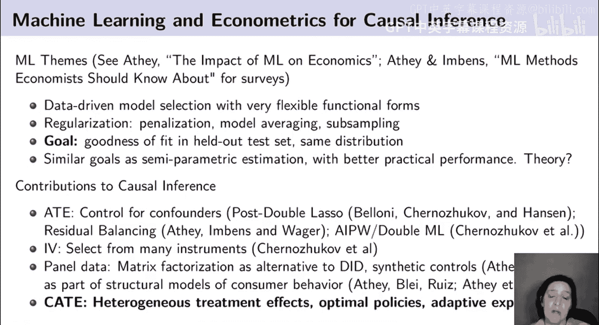

这些目标与计量经济学文献中的半参数估计目标相似，但机器学习方法具有更好的实际性能（我们尚未完全理解其原因）。过去十年来，结合机器学习与因果推断的学界一直在填补一些理论空白，并阐明如何应用机器学习方法以及可以进行哪些修改，以便它们在以前可能使用参数估计的环境中表现最佳。

思考机器学习对计量经济学贡献的一个简单方式是回顾半参数计量经济学文献，并用灵活的机器学习方法替代先前研究的核方法或其他类型的方法。我们会发现，只要进行适当的修改并确保我们针对正确的标准进行优化，这实际上相当成功。

到目前为止，我们已经看到了相当多的成功案例，并且在这个领域出现了多个蓬勃发展的文献。我们看到了对估计平均处理效应的贡献，本系列的其他课程已经涵盖了这一点。我们也看到了对工具变量法的贡献，例如尝试使用机器学习从众多可能的工具变量中进行选择。在其他课程中，我们将讨论面板数据模型，例如矩阵分解作为差分法等的替代方法。

但在本节课中，我们将讨论异质性处理效应，这将为后续应用（如估计最优策略，甚至进行自适应实验以估计最优处理分配策略）奠定基础。

## 异质性处理效应的应用

现在我们已经了解了结合机器学习与因果推断的背景，接下来探讨估计异质性处理效应的具体应用场景。

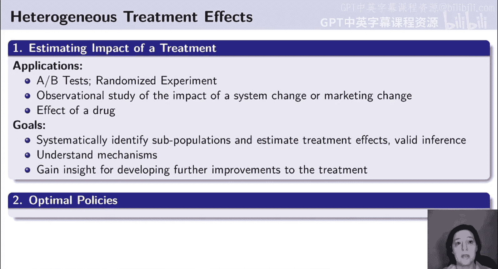

在多种应用中，估计不仅仅是平均处理效应，而是理解处理效应如何随个体特征变化，是非常有用的。最初激励我研究这个问题的一个例子是大型科技公司的A/B测试。在大型科技公司，工程师花费时间开发新算法或新想法，然后他们想要测试这些想法。通常，某项算法改进在某些情况下可能比其他情况效果更好，或者某个网页设计在某些场景下可能比其他场景效果更好。但就像FDA和之前的科学家一样，科技公司中A/B测试平台的管理者明白，如果允许工程师事后分析数据，他们总能找到某些群体或情境下他们的新发明是有效的。这种在数据中挖掘直到找到处理有效的某些人群的事后分析，众所周知容易导致错误发现，即P值篡改。因此，即使在大型科技公司，对于人们如何使用A/B测试结果也存在相当严格的限制。另一方面，了解算法在何处效果好、何处效果差当然非常有用，这可以为开发新算法提供见解，帮助你决定也许应该只在效果好的场景中应用这项新创新。在条件相同的情况下，你当然希望这样做。这促使我尝试开发可以内置到A/B测试平台中的方法，以自动搜索数据并揭示异质性处理效应，但要以可靠且不易出现错误发现问题的方式进行。

类似的动机也出现在药物试验等场景中。我们可能想了解药物对谁有效、对谁无效，以及副作用在哪些人群中是问题。同样，我们希望以数据驱动的方式进行，而不想仅仅局限于预先设定的假设。其他类型的应用包括观察性研究，例如我们发布了新产品，想了解其影响，或者想了解投放广告的影响。

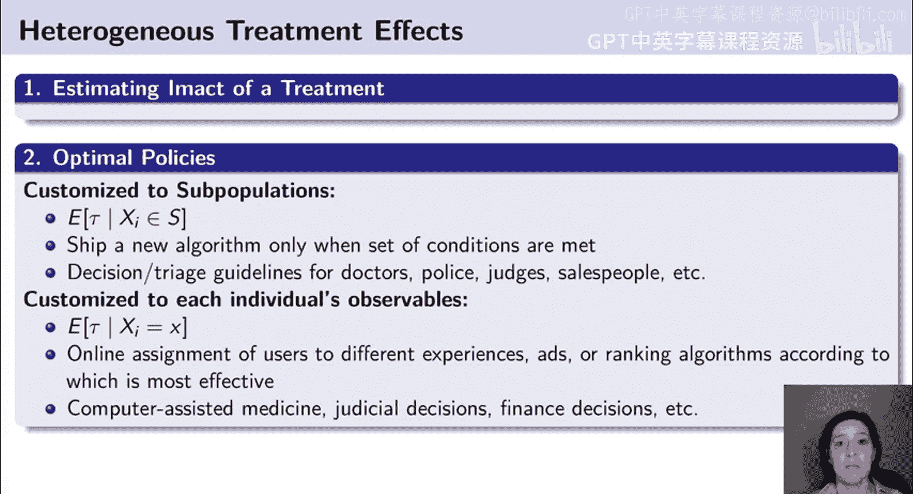

在所有这些情况下，我们的目标是系统地识别亚群并估计处理效应，同时进行有效的推断，以确保我们的发现不仅仅是由于抽样变异。同样，当我们考虑定向策略时，必须记住抽样变异可能是一个相当大的问题。如果我试图了解一种药物对像你这样的人效果如何，那么你是复杂的、不同的、独特的，我们永远没有足够的数据来真正完全理解治疗对特定个体的效果，特别是如果我们观察到该个体的许多特征。一旦我们深入到这种个体层面的、非常定向的处理效应估计，抽样不确定性将变得很重要。

我们也希望理解机制。如果我们知道某个群体（例如年轻女性）对某种药物有更多副作用，这可以帮助我们形成关于为什么她们会有这些副作用的假设，从而可能帮助我们重新配制药物，开发新的改进疗法。

## 异质性处理效应与最优策略

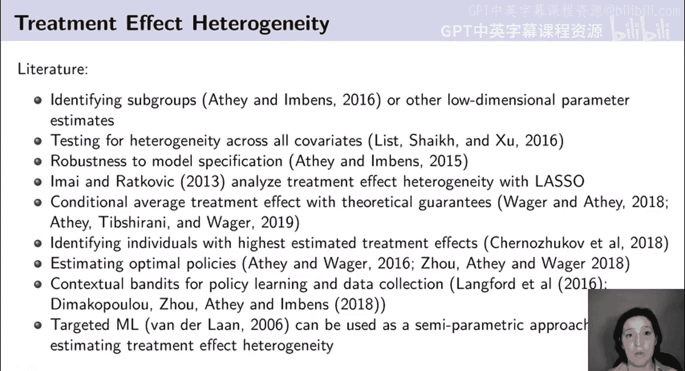

理解了处理效应对谁更好或更差之后，一个重要应用是确定谁应该接受处理。一个处理可能对每个人都比对照更好，因此仅仅因为存在处理效应异质性，并不一定意味着个性化或定向的处理分配策略比统一的处理分配策略更好，这取决于具体情况。找到处理效应异质性比找到不同群体的最优治疗异质性要容易得多，但有时治疗成本高昂，因此即使治疗对所有人都有益，弄清楚谁应该最优先接受治疗仍然有用。

在本节课中，我不会详细介绍最优处理分配策略的方法（这将在后续课程中讨论），但我想强调，异质性处理效应问题是理解最优处理分配策略的一个输入。这是异质性处理效应的一个应用，但即使你不打算用它来定向处理分配策略，你也可能对理解处理效应异质性感兴趣，例如为了激励未来的创新。

## 异质性处理效应的方法概览

现在，让我们深入探讨异质性处理效应的具体方法。首先需要说明的是，相关文献相当广泛且增长迅速，这里仅列出了过去十年中分析处理效应异质性的一部分论文。我想强调的是，这里不只有一个问题，也不存在适用于单一问题的最佳方法。相反，围绕处理效应异质性存在许多问题，每个问题都有其相应的方法集。今天我将讨论一种类型的方法，即识别具有不同平均处理效应的亚组。这在某些情况下有用，在其他情况下则不然。

我们可能还想做一些事情，比如测试所有协变量上的异质性，并弄清楚如何处理多重检验问题。我们可能对处理效应异质性感兴趣，以理解模型设定稳健性问题。如果处理效应随特征变化很大，模型设定的差异可能会产生更大的影响。我们可以尝试理解灵活的条件平均处理效应估计，这也是我今天要讨论的另一个问题。另一种类型的问题是识别具有最高估计处理效应的个体，我今天也会展示一些这方面的例子。因此，与其将其视为一场竞争，认为某个群体认为某个问题重要而另一个群体认为另一个问题重要，我鼓励你思考在你的背景下，哪个或哪些问题是相关的以及为什么，然后找到处理这些问题的最佳方法。

## 机器学习方法在因果推断中的调整

如前所述，机器学习方法在实践中表现良好，但它们通常不具备完善的统计性质，因为这通常不是其目标，你可以使用测试集评估性能。但由于因果参数的真实情况无法直接观测，在异质性处理效应估计乃至一般因果效应估计中，统计推断扮演着更重要的角色。

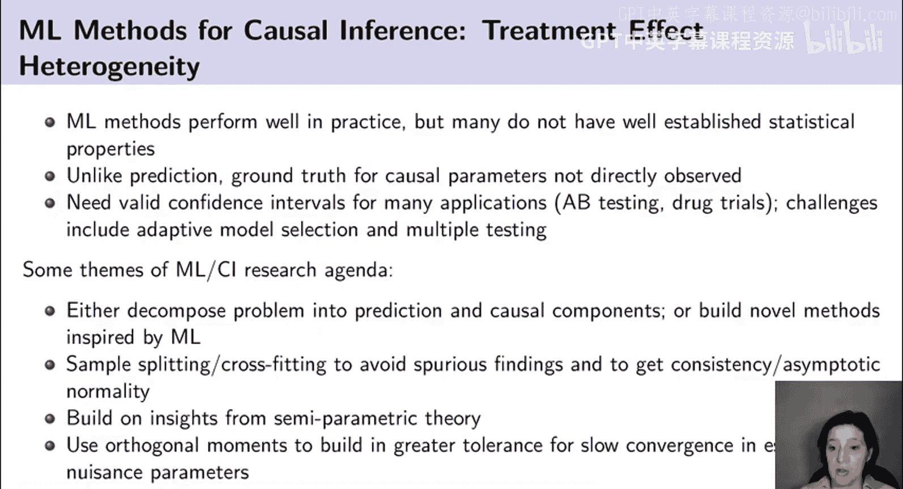

在这方面出现的一些主题包括：首先，我们可能将问题分解为预测部分和因果部分，然后将属于预测问题的部分外包给机器学习方法。这样做有一些优势，因为如果你进行这种分解，你可以插入任何你想要的机器学习方法。由于机器学习方法不断改进，计算方式也在变化，创新不断出现，我们可以拥有一个单一的因果推断方法，并搭配最现代、最新的机器学习插件方法。当然，不同的机器学习方法在不同的环境中效果更好，因此我们可以根据我拥有的特定数据类型进行定制，并使用最新最好的方法。

另一种方法是构建受机器学习启发但专门为因果推断环境量身定制并进行根本性改变的新方法。就我个人而言，这两种方法我都尝试过，我认为它们各有其位。不断更新为因果推断量身定制的机器学习方法以利用最新最好的计算技术等工作量很大，因此能够使用现成的方法可能非常有利。但同时，如果你有特定的目标，你最好尝试真正解决你正在解决的问题，这也可能有其优势。

另一个主题是样本分割或交叉拟合。我们避免机器学习过拟合的一种方法是进行交叉验证以平衡偏差和方差。但这还不足以获得有效的统计性质。因此，机器学习与计量经济学文献真正关注并发现无论在理论上还是实践中都效果良好的事情之一就是样本分割和交叉拟合，这基本上归结为：不使用相同的数据来选择模型或确定模型设定，并得出感兴趣的参数估计。例如，这可能意味着，如果我使用倾向得分加权来估计平均处理效应，我不会使用相同的数据来估计倾向得分模型和加权特定观测值。因此，用于加权观测值的倾向得分是使用不包括该观测值的数据集估计的。当我们试图实际估计处理效应时，这类技术有助于参数估计的有效性。

我们还发现，一般而言，基于半参数理论的见解非常重要。已有大量理论探讨了在不知道函数形式的世界中如何估计感兴趣的参数（如因果效应），因此我们可以利用该理论，在引入机器学习时提出性能良好且高效的（就最小方差而言）估计量。其中一个见解是使用正交矩，我们将在不同的应用中逐步展开，但它们基本上会内置对干扰参数收敛速度较慢的容忍度。机器学习方法非常灵活，因此它们收敛到真实值的速度会比像平均值这样的东西更慢。这些技术将帮助我们利用收敛较慢的机器学习方法，同时仍然获得像平均处理效应或条件平均处理效应这样可能以更快速度收敛的估计。

## 形式化分析框架

为了开始形式化分析，考虑潜在结果框架。提醒一下，我们将用 `(X_i, Y_i, W_i)` 表示一个独立同分布受试者集合中的每个成员，其中 `X_i` 是特征或协变量（个体的特征），`Y_i` 是响应或结果，`W_i` 是处理分配。根据潜在结果框架，我们将假设存在量 `Y_i(0)` 和 `Y_i(1)`（有时用下标表示，有时不用）。我们将这些解释为：如果第 `i` 个受试者接受处理或未接受处理，我们将测量到的响应。因此，对于每个人，他们都有一个如果被处理会发生的结果，以及一个如果是对照单元会发生的结果。

我们这里的目标是估计条件平均处理效应，即给定协变量特定实现值时的处理效应期望值。需要提醒的是，即使在随机实验中，我们也只能看到个体在两种处理场景之一中的结果。如果我们不做任何额外的假设，没有额外假设就不可能估计处理效应或基于 `X` 的条件处理效应，因为我们看不到任何个体同时处于处理状态和对照状态。因此，我们必须有某种方式利用来自一些被处理个体和不同对照个体的数据来估计这些处理效应。文献中常用的一个假设是无混淆性，也称为可忽略性或基于可观测变量的选择。这基本上意味着，在给定可观测特征的条件下，处理分配如同随机分配。当这个假设成立时，可以使用多种方法来估计处理效应。历史文献侧重于匹配或倾向得分估计等方法，这些方法通常是一致的，至少只要存在重叠性，即对于每个 `x` 值，每种处理状态都有一定的发生概率。

## 基于回归树的方法

我将考虑的第一个分析异质性处理效应的方法将建立在一种称为回归树或分类与回归树的方法之上。在深入探讨将回归或分类树应用于因果效应之前，让我先快速回顾一下简单的预测树或分类树是如何工作的，然后我们将推广这些方法并将其应用于估计因果效应的问题。

这是一个使用泰坦尼克号沉没时谁生谁死的数据应用分类树的例子。在这类树中，我们首先看乘客的舱位等级。如果他们的舱位等级大于2.5，这意味着他们是低等舱，即泰坦尼克号上的廉价票乘客。我们在这个左分支看到，501名低等舱乘客中有370人死亡。因为舱位等级是预测生死的重要因素，所以树首先在这个变量上分裂。然后我们看右分支，可以说，如果你在一等舱或二等舱，理解谁生谁死的下一个重要预测因素是年龄。所以，如果你的年龄不大于16岁，即你是孩子，那么上层阶级的36个孩子中有34个存活。现在，如果你是上层阶级的成年人，那么你是在一等舱还是二等舱又很重要，看起来在一等舱的人中，存活者更多，而在二等舱的成年人中，死亡者更多。这是一种根据舱位等级和年龄将数据划分为亚组的简单方法，仅仅通过将数据划分为这些亚组，我们就可以相当准确地预测谁生谁死。

我还没有告诉你这棵树是如何创建的，只是告诉你如何解释它和理解结果。但回归树和分类树自推出以来就非常受欢迎（这是一种已经存在了几十年的机器学习模型），原因之一是它们很容易向人们解释。一旦你看到这棵树，你当然必须理解你是如何得到这棵树的，但一旦你看到这棵树，预测将仅仅基于叶子节点中的比例。因此，很容易理解为什么像上层阶级的孩子这样的人被分类为可能存活。这是因为在我们拥有的训练数据中，符合这些特征的人中有34/36存活。所以，在理解给定这棵树如何得到估计值方面，没有太大的黑箱。

另一方面，得到这棵树稍微复杂一些，但理解如何得到这棵树实际上也不那么复杂。在树的顶部，算法所做的是查看数据中的所有协变量以及每个协变量上所有可能的分裂方式，并找到分裂的方式，其中本质上对于分类问题，你是在最大化分裂的分类能力，你试图找到同质的组。关于组同质意味着什么有几种不同的衡量标准，我现在不深入讨论。但你本质上是在试图找到能最大化分裂判别能力的分裂方式。如果这是一个回归问题，我们只是试图预测某个值，我们基本上会尝试最大化两个组在平方和方面的差异。

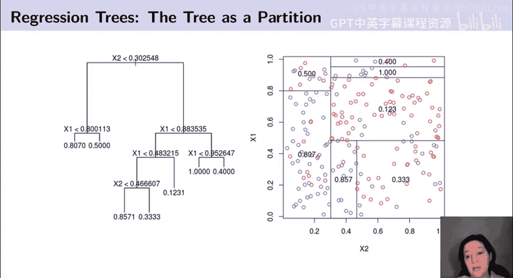

理解树的另一种方式是认识到你构建的任何特定回归树或分类树也可以表示为协变量空间的一个划分。在左边这里，我描绘了一棵基于两个协变量 `X1` 和 `X2` 的树，而在右边，我将同一棵树描绘为协变量空间的一个划分。所以，树基本上是在弄清楚如何将这个 `X1`-`X2` 方框划分为矩形，试图找到在矩形内结果同质的矩形。

以前我们在计量经济学中传统上做这件事的一种方式（我过去常做）可能是取这个 `X1` 和 `X2` 的方框，并将其划分为比如100个正方形，通过十分位数图。实际上，Raj Chetty 有一个很好的 Stata 包来做这件事，但这在我自己的实证工作中经常做。我们在这里做的是，不是将其划分为100个正方形（这可能占用很多正方形，并且每个正方形中可能没有太多数据，可能不必要地精细），而是发现我们实际上可以用更少数量的矩形相当准确地表示这个数据生成过程的性质，并且我们使用数据来弄清楚如何做到这一点。所以我们发现，我们首先在 `x2` 维度上分裂，然后看左边说对于 `x2` 的低值，我们想在 `x1` 的高值处分裂，但实际上对于 `x2` 的高值，我们在 `x1` 的较低值处分裂，我们根据 `x2` 是低还是高以不同的方式切割它。这给了我们灵活性，但允许我们更有效地描述数据。

## 因果树方法

现在我们已经回顾了回归树和分类树的样子，我们可以考虑如何应用这些思想来估计异质性处理效应。特别是，我们的目标是将人群划分为亚组，以最小化处理效应的均方误差。

我们将如何使用因果树？它旨在解决什么样的问题？它旨在允许我们在没有预先分析计划的情况下报告处理效应的异质性，但事后能提供有效的置信区间。因果树的特别之处在于，它将尝试提出一种数据驱动的方法来估计处理效应异质性，但仍然会得出少量估计参数（相对于数据量而言较小）。所以我们可以将其视为一种移动球门柱的方式。我们将使用数据来定义问题并进行估计，因为我们将使用数据来确定亚组是什么，然后其次，估计这些数据定义的亚组的处理效应。

我们将通过样本分割来解决过拟合问题。也就是说，我们将在一半样本中选择亚组或确定亚组，并在另一半样本中估计处理效应。这看起来可能效率低下，因为我们只使用一半数据来实际产生处理效应估计。但进行样本分割将给我们带来很多优势，因为事实证明，如果我们不进行样本分割，我们常常会得到不一致的处理效应估计。有方法可以直接弥补这一点，但事实证明，要击败样本分割的性能实际上相当困难，因为一旦你开始尝试纠正你使用相同数据来确定亚组和估计效应的事实，你就必须相当保守。因此，在实践中，使用样本分割将具有这些巨大优势。它将非常透明，因为你将使用一半数据来决定亚组，然后干净地使用尚未接触的第二部分数据来估计效应，因此很容易向人们解释为什么他们应该相信你的估计。这种透明度很有帮助，也能给你带来很大的稳健性。我们不需要很多花哨的理论来理解这种方法为什么有效。

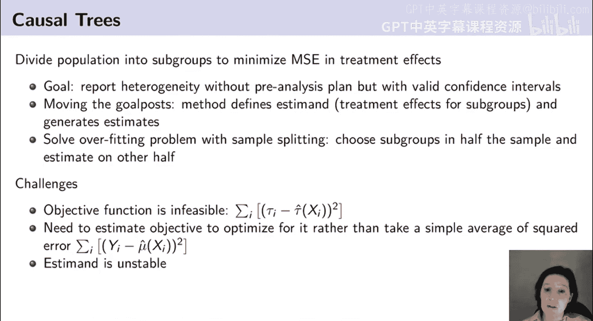

一旦我通过采用这种样本分割方法解决了一个问题，剩下的挑战就是弄清楚我应该如何准确定义亚组？挑战的本质是什么？为什么这不是对现有回归或分类森林的直接应用？如果我们试图优化亚组以处理效应异质性，我们感兴趣的不是结果的均方误差，而是处理效应的均方误差。然而，正如我们所讨论的，因果推断的基本问题是我们无法观测到个体处理效应，所以我们不知道如何应用这些现成的现有方法，因为目标不可行。因此，我们需要做的是找到一种方法来解决这个问题，我将提出几种不同的替代方案，但我们发现更可取的一种是实际估计那个目标函数。

这种方法的另一个挑战（这可能是一个相当大的挑战）是，当你进行样本分割时，你的估计会有些不稳定。我可以分割数据并找到一个划分（一棵树），但如果我再次对数据进行抽样，我可能会得到一棵不同的树。这并不是说其中任何一个是错误的，它们都是对处理效应异质性的良好描述，但它们并不相同，这使得结果更难复制，并可能妨碍结果的可靠性。这个问题没有简单的解决方案。

## 适应回归树以估计条件平均处理效应

面对如何使回归树和分类树适应估计条件平均处理效应的问题，在 Athey 和 Imbens 的论文中，我们提出了几种不同的方法，并在该论文中讨论了这些方法的优缺点。

你可能尝试使用回归树和分类树分析处理效应异质性的第一件事就是构建一个单一模型，将结果 `y` 建模为 `x` 和 `W` 的函数，即仅仅将你的处理指标 `W` 视为另一个特征或协变量，并将其扔进回归树中。我们称之为单树方法。这有什么问题？你的树甚至可能不在处理效应上分裂，所以如果你有树的一部分在 `x` 上分裂，通过 `x` 定义亚组，但没有通过 `W` 定义不同的亚组，那将意味着你在该区域对那些 `x` 的隐含处理效应估计将为零。这对于得出处理效应异质性没有太大帮助，因为无论 `W` 是什么，我们都会得到相同的答案。

我们称之为双树方法的第二种方法，后来被伯克利的一个小组 Künzel 等人的一篇论文称为 T-learner，他们将相同的分类法应用于一般的机器学习方法。所以他们将单树方法称为 S-learner，将双树方法称为 T-learner。在为两个不同的处理组和对照组分别构建两个单独的模型的情况下，这可能效果更好，因为它将确保你在构建预测模型时实际关注你的处理变量。但它可能有一个相当微妙的缺点。要看到这个缺点，想象一下我们正在考虑一个特定的 `x` 值，一个60岁的男性。如果我们只是为治疗组和对照组分别构建两个单独的模型，并说使用像树这样的东西，可能治疗树在性别上分裂但不在年龄上分裂，而对照树在年龄上分裂但不在性别上分裂。如果我们想了解这个模型告诉我们关于一个60岁男性的处理效应是什么？那么，治疗组中该男性的预测将是治疗个体中男性的平均结果。但来自对照树的该个体的预测将基于他的年龄。因此，为了估计他的处理效应，我们最终会比较男性的平均治疗结果与老年人的平均对照结果。当然，这没有任何意义。为什么我们要比较治疗男性与对照老年人？这不是在比较同类事物，因此最终可能导致处理效应的有偏估计、虚假的处理效应估计。你可能发现存在处理效应异质性，而实际上如果比较治疗男性与对照男性并没有差异，但比较治疗男性与老年对照单元却看起来存在处理效应异质性。

这可能看起来是树特有的问题，但在树的背景下思考这个问题的一个原因是，你可以立即看到问题所在，并更清楚地了解发生了什么。更复杂的机器学习方法也会有同样的问题，但可能不那么透明，不容易看出发生了什么。因此，这不是一个估计处理效应异质性的好方法。只有当你对治疗组和对照组的结果有非常准确的估计时，它才会有效。如果你没有足够的数据来完全估计结果函数的样子，你会做得很差。

我们在这篇论文中提出的第三种方法是转换结果法。这需要一点解释，我不会在本节课中深入讨论细节，但我们的做法是找到一种转换结果的方法。然后，如果你转换了结果，你就能够用这个转换后的结果构建一个单一的预测模型。这后来被推广到实际使用 AIPW 得分（增广逆倾向加权得分）作为回归或预测模型中的结果。在我们的论文中，我们展示了这种方法在多大程度上有效，并表明它效果尚可，但在效率方面也可能有一些缺点。

我们在这篇论文中做的是估计均方误差标准，这是在我们论文中表现最好的方法，尽管在某些情况下转换结果类型的方法也可能效果更好。这也有助于我们看到我在引言中提到的主题之一：有时你可以通过修改问题然后应用现成的预测方法来处理因果推断问题，有时你会想要实际修改方法。现在我将向你展示我们如何修改方法。

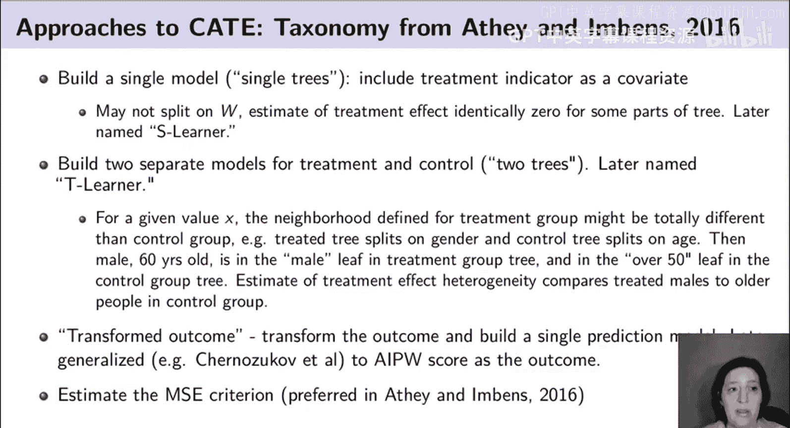

## 转换结果法概述

尽管我们不会在这些课程中深入探讨转换结果法的全部细节，但我可以简要概述一下，以举例说明如何将现成的机器学习方法应用于估计条件平均处理效应的问题。

其思想是，有一种转换结果的方法，使得转换后结果的期望值实际上是处理效应。为了理解这一点，我可以定义这个转换结果 `Y_i^*`。如果 `p` 是分配概率（接受处理的概率），我可以做一个简单的转换：如果是一个被处理的观测值，我只需将其结果除以 `p`；如果你是一个对照观测值，我首先取你结果的负值，然后除以 `1-p`。这将是我对个体单位处理效应的估计。如果你仔细想想，这有点疯狂，因为你的结果，也许你的结果被限制在0和1之间，或者是在0到100之间，例如，我在考试中的分数。我的问题可能是治疗单元是否在考试中获得更高的分数。所以我可以看着你，然后说，嘿，如果我做了50/50的治疗对照分割，如果我找到一个被治疗的特定人，假设在考试中得了75分。那么，他们的转换结果将是75除以0.5，即150。所以我对他们处理效应的估计将是150。这很疯狂，因为没有人可能有150的处理效应，因为这个人的分数在0到100之间。现在，我取对照组中的另一个人，假设他们的分数是72。那么我对那个人处理效应的估计将是 `-72` 除以0.5，即 `-144`。这也是一个非常嘈杂、极端、不现实的对某人处理效应的估计。但想法是，平均而言，如果我汇总这个转换结果并平均所有人，大约一半的人将被治疗，所以我将乘以0.5这些非常大的处理效应估计。另一半将是对照，所以我将乘以0.5，并取他们结果的负值来得到对他们的这个估计，然后我取差值。平均而言，这将是样本平均治疗结果与样本平均对照结果之间的差异。记住，对照个体我们已经转换并乘以了 `-1`。所以，如果我平均所有这些转换结果，我将得到处理效应的估计。

这是一个简单的见解，表明这是处理效应的一个非常嘈杂的估计，但对于个体而言，即使该个体仅被观测为治疗或对照，我仍然可以查看他们的结果，并得出他们处理效应的无偏估计。这对那个个体来说不是很有用，但如果我平均与该人相似的人，我将得到他们平均处理效应的无偏估计。一旦我明白了这一点，我可以说，好吧。如果我取任何群体并平均这些转换结果，我得到处理效应，那么我就可以使用这个转换结果作为任何预测方法的左侧因变量。由此产生的预测将是条件平均处理效应的估计。

这起初看起来可能只适用于随机实验，但实际上，在具有无混淆性的环境中，即观察性研究中，我可以用估计的倾向得分替换那个 `p`。事实上，我可以更进一步，也可以使用 AIPW 方法，这基本上会针对结果进一步调整，因此我可以估计一个结果模型和一个倾向模型，得出 AIPW 得分，并将其用作左侧变量。

这是使用现成模型、预测模型来估计条件平均处理效应的一种方法。但还有其他方法，这就是我将在本节课剩余部分重点讨论的内容。

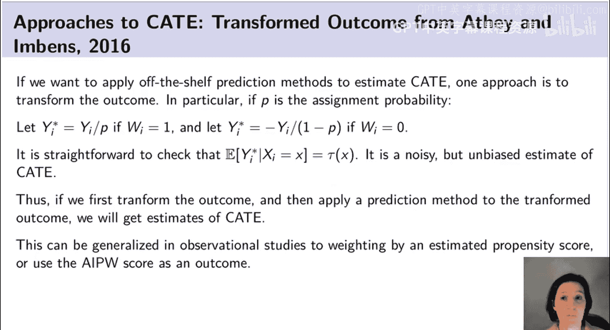

## 因果树方法的详细说明

为了进一步解释这种因果树方法，我需要引入一些符号。首先，我们将有不同的集合，不仅仅是训练集和测试集，我们还将有一个称为估计样本的集合。我们称之为训练集的实际上是用于构建树的集合，估计集将是我们用于构建参数估计的集合。然后我们还将考虑假设的测试样本。它不会直接用于估计，但我们想讨论我们的最终目标是在测试集中做好处理效应估计的均方误差。

为了描述这是如何工作的，我们将使用大写 `Π` 来表示一个划分，并让 `τ̂(x)` 首先由用于形成处理效应估计的估计样本和划分 `Π` 来参数化。因此，我们让 `τ̂(x, S, Π)` 为样本 `S` 中 `x_i` 被分配到的叶子节点中的样本平均处理效应。同样，你取一个单位及其协变量，如果我理解他们的协变量，我可以根据这个划分 `Π` 确定他们在哪个叶子节点中。这就像我们之前有矩形划分的例子，对于每个 `x`，它落入一个矩形，所以 `L` 是由其协变量决定的该单位所在的叶子节点。一旦我有了这个单位所在的矩形，我对处理效应的估计就只是该叶子节点中该单位的样本平均处理效应。所以所有这些符号只是说，它是叶子节点中治疗结果样本平均值与对照结果样本平均值之间的差异。这里我们求和的是估计集中与这个 `x` 位于同一叶子节点的单位。

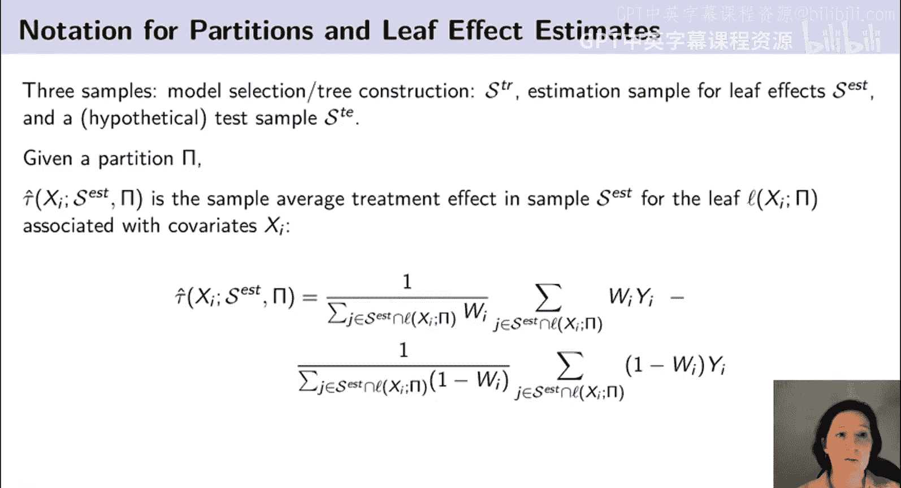

## 目标函数与优化

正如我之前提到的，我们想要做的是尝试找到一个划分，尽可能好地使我们的估计处理效应与实际处理效应相匹配。因此，我可以定义这个不可行的均方误差目标函数：如果我能实际观测到 `τ_i`（第 `i` 个单位的真实处理效应，这是我无法观测的），那么目标函数是什么。我实际上要将其定义为两个集合的函数，所以我的总体目标是最小化测试集中的均方误差。但我的 `τ̂` 估计将由我用于构建样本平均估计的估计集以及我的划分来参数化。记住，我的划分又来自训练集。所以 `τ̂` 和 `Π` 来自训练集，但 `τ̂` 是叶子节点的样本平均处理效应，根据估计集估计。然后我的最终目标是找到一个好的 `τ̂` 函数，在一个独立的隐藏测试集中表现良好。

所以我可以将这个均方误差目标写为测试集中 `τ_i` 减去 `τ̂` 的平方和。然后我可以做一点代数运算将其展开，并看到这个均方误差实际上可以写成三项：`τ_i²`、`-2τ_i τ̂` 和 `τ̂²`。现在，我可以思考这个均方误差的期望值是什么，其中我对训练集和测试集取期望。我想做的是，在我选择划分 `Π` 的时候，以一种在期望中能很好地最小化测试集均方误差的方式来选择我的划分 `Π`。所以在我选择划分 `Π` 的时候，我不知道我的 `S` 和 `S_test`。但我会尝试选择我的 `Π`，使其在期望中在这方面做得好。

当我取期望时，我可以做更多代数运算（应该说，要得到这个表达式，幕后还需要几行代数运算），但当我取期望时，我可以做一些代数运算，并以我在这里最后一个方程中完成的方式表达它。第一项是 `τ̂` 的方差。基本上，一个更富有表现力、变化更多的 `τ̂`，在其他条件相同的情况下，如果最小化测试集的均方误差，将是好的。我们知道方差将是好的原因之一是，我们的 `τ̂` 根据构造在划分的叶子节点内将是无偏的。我们知道它将是无偏的原因在于，估计集是独立的，估计集没有用于构建 `Π`，所以因为我们的 `τ̂` 定义为样本平均值的差异，它将是一个无偏估计。因为它是无偏的，在无偏的条件下，拥有一个随 `x` 准确调整、变化更多的 `τ̂` 将在最小化测试集均方误差方面做得更好。

然后我们可以看最后一项，一直到最后，我们有这一项 `E[τ_i²]`。这个期望实际上不依赖于我的估计 `τ̂`。因此，在选择 `Π` 时，我们可以忽略它。所以无论 `Π` 是什么，`τ_i²` 的期望都是相同的。所以，即使估计 `τ_i²` 的期望可能很困难，但如果我比较两个划分，这并不重要。记住，我将使用这个均方误差的期望值作为选择划分 `Π` 的目标函数，这是我们的目标。我们需要一个好的目标函数来比较不同的 `Π`。如果我比较两个 `Π`，我将取一个 `Π` 的均方误差与另一个 `Π` 的均方误差的差值，而这个 `E[τ_i²]` 将抵消掉。所以我可以忽略它，即使它很难估计，我也不必关心它。

中间项是 `τ²` 对 `x` 的期望。`τ` 是一个未知参数，我们不知道真实的 `τ` 是什么。但我们可以使用数据来估计它。所以，这一切将归结为提出这两个表达式的好估计量，然后将其用作选择 `Π` 的标准。

我想强调，这个表达式大量使用了这样一个事实：在我们提出的特定算法中，我们的估计 `τ̂` 将是无偏的。这对于这个特定公式成为均方误差的良好估计至关重要。如果我不知道我的 `τ̂` 是无偏的，这个代数运算就不成立，我也无法得到这个特定的表示。

## 因果树算法

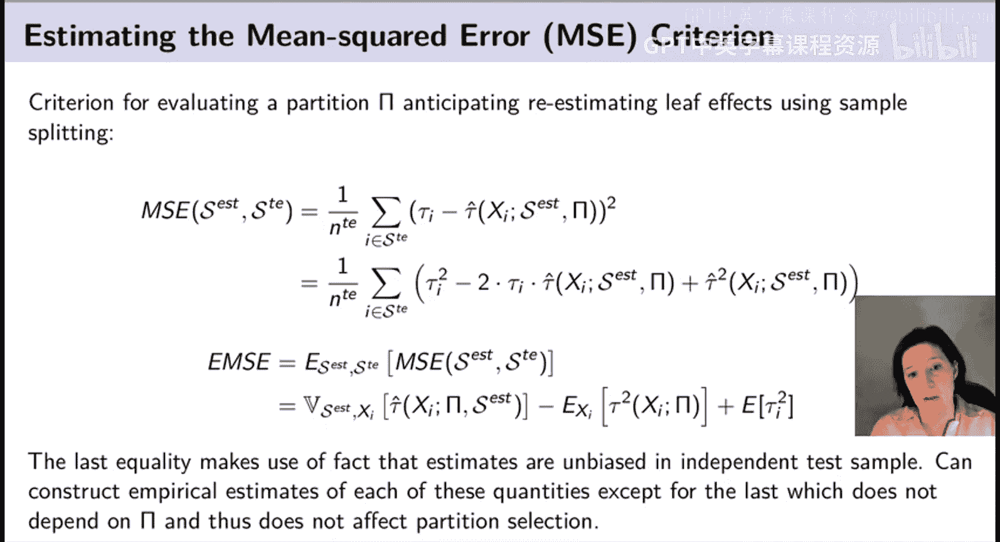

一旦我们解决了提出要优化的目标的问题（同样，我们只是用一点代数推导出了一个目标），我们发现了即使我们无法观测到任何特定观测的 `τ_i`，我们也可以得出不可行均方误差标准的估计。一旦我有了均方误差标准，我就可以使用因果树算法，该算法与原始回归树算法非常相似，只是我优化的是不同的标准。特别是，我将使用一种贪心算法递归地将协变量空间 `X` 划分为一个划分 `Π`，在每个节点，分裂将被选择为最小化我们对所有可能二元分裂的期望均方误差估计的那个。我还必须进行一些小的修改，以确保每次我进行分裂时，每个叶子节点中实际上都有治疗单元和对照单元，并且有最小数量的这些单元。我不想最终得到一个只有治疗单元的叶子节点，因为那样我就无法估计样本平均处理效应。我将使用交叉验证来选择划分的深度，该深度最小化使用留出折叠作为测试集代理的处理效应均方误差估计。最后，我将通过将我的划分修剪到从交叉验证中选择的深度来选择这个最优划分 `Π*`，或者我将修剪那些对拟合优度改善最小的叶子节点。最后，我将使用估计样本 `S` 估计每个叶子节点中的处理效应。

这个算法与回归树算法完全相同，只是我现在不是最小化结果的均方误差，而是最小化处理效应的期望均方误差，并且我还会加入一些额外的约束，以确保当我进行分裂时，我有足够的治疗单元和足够的对照单元。所以它基本上只是一棵回归树，但针对处理效应进行了优化。但我还将使用这种样本分割，这在机器学习文献中并不常用。样本分割将确保我使用新样本来估计处理效应，一旦我有了划分，而不是使用相同的数据来选择我的分裂和估计处理效应。这将给我带来我喜欢的良好统计性质。

## 总结

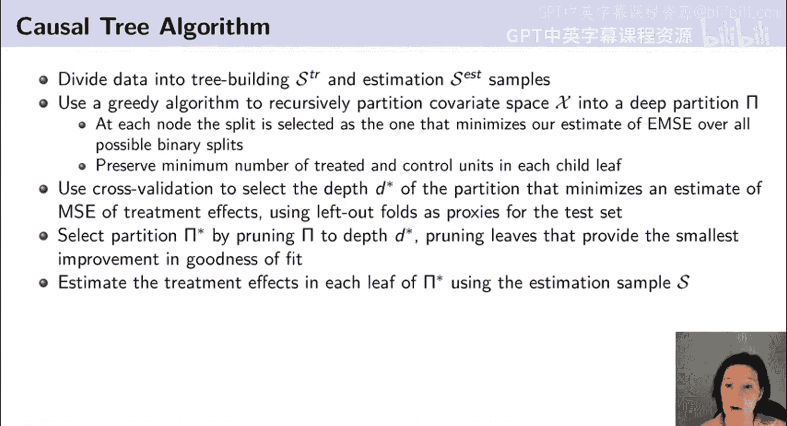

在本节课中，我们一起学习了如何利用机器学习方法，特别是回归树及其变体，来估计条件平均处理效应和处理效应异质性。我们讨论了结合机器学习与因果推断的动机、面临的挑战（如缺乏真实处理效应的观测、需要有效推断），以及通过样本分割、目标函数调整等策略来克服这些挑战。我们介绍了单树法、双树法、转换结果法以及因果树法等多种方法，并重点阐述了因果树法如何通过优化处理效应的均方误差、进行样本分割和交叉验证，在保持可解释性和透明度的同时，提供可靠且可推断的异质性处理效应估计。这为后续学习如何利用这些估计来制定最优处理分配策略奠定了基础。