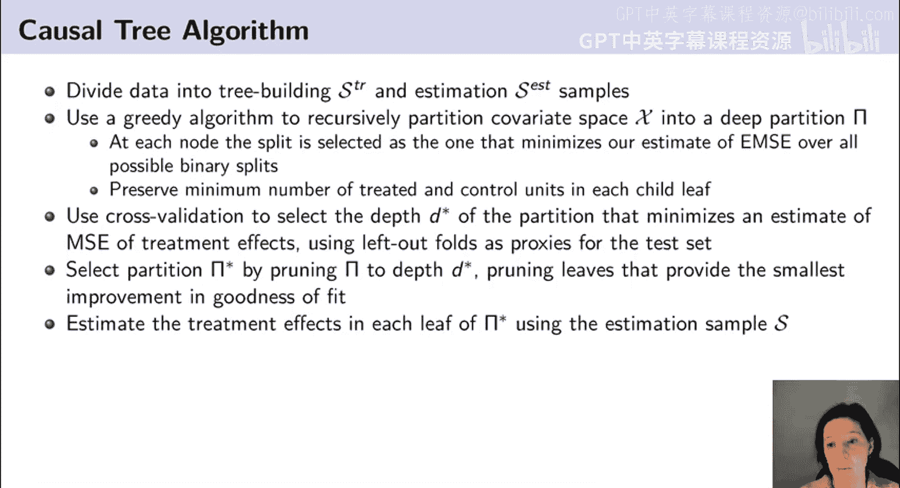
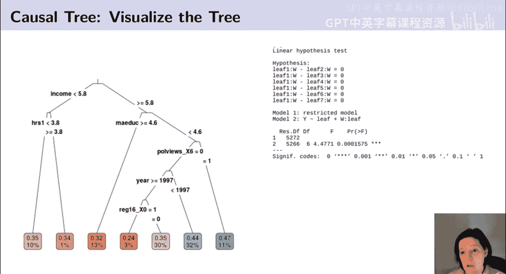
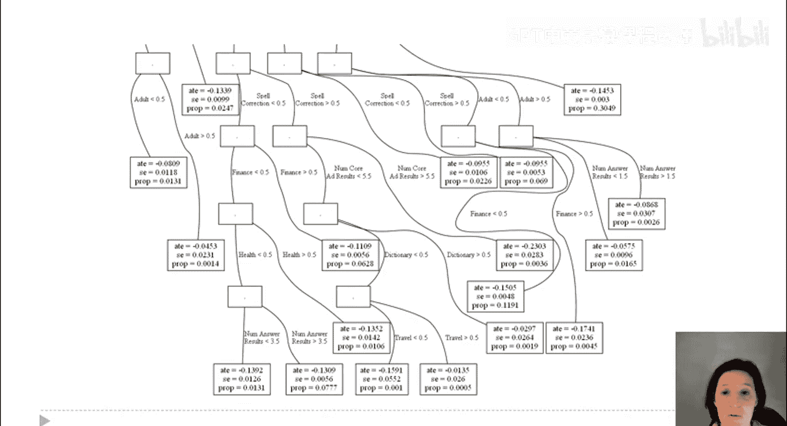
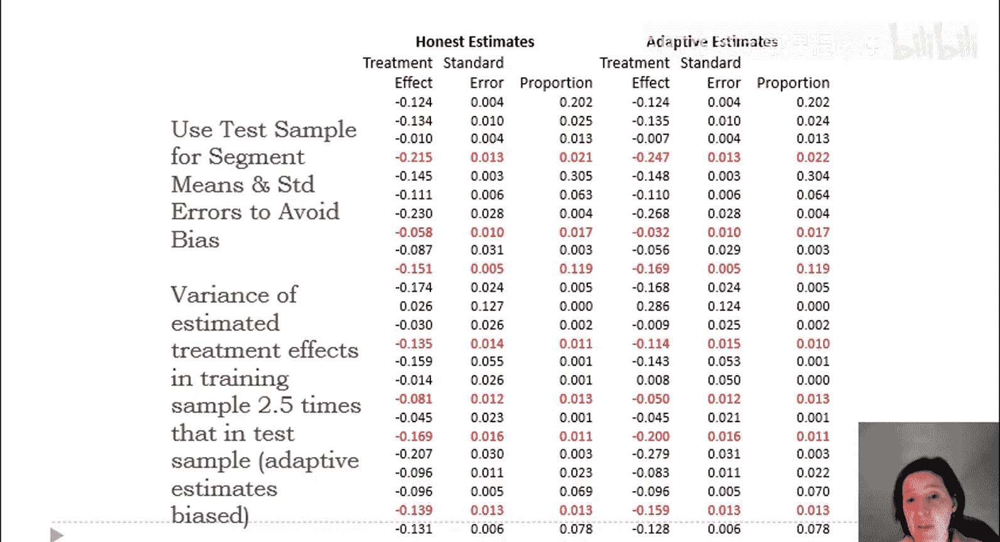
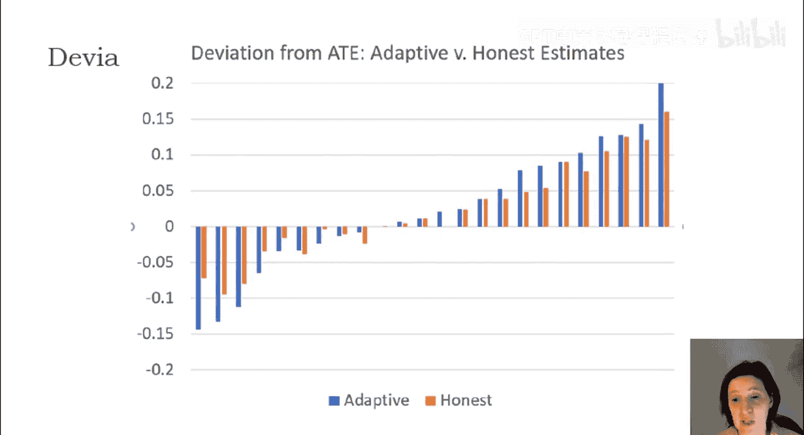
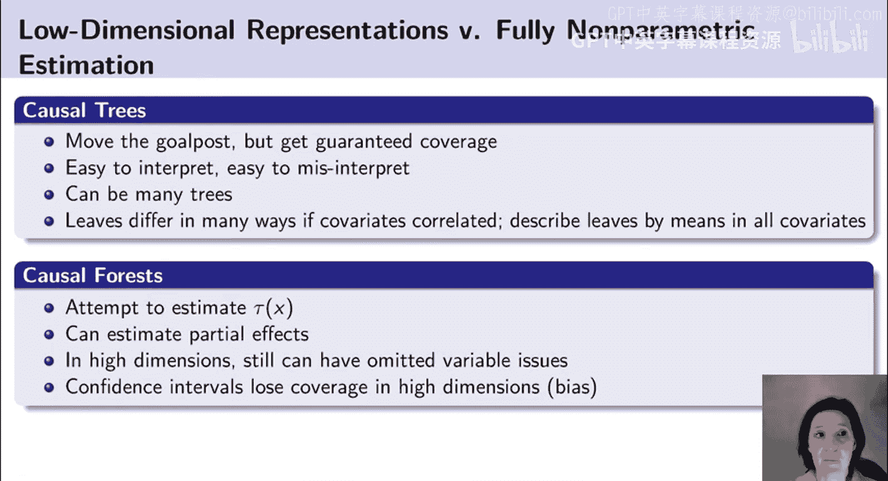

#  010：条件平均处理效应之树模型 🎯

在本节课中，我们将学习如何利用因果树模型来估计条件平均处理效应。我们将从构建优化目标开始，逐步介绍因果树算法的具体步骤，并通过两个实际案例来展示其应用和重要性。

---

## 构建优化目标与算法概述

上一节我们讨论了估计处理效应的挑战。本节中，我们来看看如何为因果树模型构建一个可优化的目标。

我们无法直接观测到个体处理效应 `τ_i`，但可以通过一些代数推导，构建一个对不可行的均方误差准则的估计。一旦有了这个均方误差准则，我们就可以使用因果树算法。该算法与原始回归树算法非常相似，只是我们优化的准则不同。

具体来说，我将使用一个贪心算法，递归地将协变量空间 `X` 划分为一个分区 `π`。在每个节点，我们将选择能够最小化我们对所有可能二元划分的期望均方误差估计的划分。

我还需要进行一些微小的修改，以确保每次划分时，每个叶子节点中实际上都有处理组和对照组单元，并且数量达到最小。我不希望得到一个只有处理组单元的叶子节点，因为那样我就无法估计样本平均处理效应。

我将使用交叉验证来选择分区的深度，该深度能最小化处理效应均方误差的估计，其中留出的折叠数据作为测试集的代理。

最后，我将通过将我的分区修剪到交叉验证选择的深度来选择这个最优分区 `π*`。我将修剪那些对拟合优度改善最小的叶子。

最终，我将使用估计样本 `SS` 来估计每个叶子中的处理效应。

这个算法与回归树算法完全相同，只是我现在要最小化的是处理效应的期望均方误差，而不是结果变量的均方误差。我还会加入一些额外的约束，以确保在进行划分时，我有足够的处理组和对照组单元。所以，它基本上就是一个为处理效应优化的回归树。

但我还将使用样本分割，这在机器学习文献中并不常用。样本分割将确保，我不是使用相同的数据来选择划分和估计处理效应，而是在获得分区后，使用一个新样本来估计处理效应。这将赋予我期望的良好统计特性。

---

## 应用案例一：社会调查实验

现在让我们看看如何在一个例子中应用因果树的想法。

第一个例子是使用在“综合社会调查”中进行的一项调查实验。综合社会调查是一项每年进行的大型调查，会询问许多关于人们观点的问题。偶尔，他们会进行实验，其中一些调查参与者得到一个问题的某种措辞，而其他参与者得到相同问题但不同的措辞。

这项在1986年至2010年间进行的实验中，一些人被问及“你对福利有什么看法？”，而另一些人被问及他们对“对穷人的援助”有什么看法。如果你不是来自美国，“福利”在美国就是对穷人的援助。但“福利”这个词已经被政治化了，尤其是在这个时期。根据你的观点，“福利”被视为一个负面词汇，保守派往往更批评福利政策，并且他们更频繁地使用“福利”这个词。

感兴趣的结果是，你是否表示支持政府在这个领域的支出。问题是，称其为“福利”还是“对穷人的援助”会改变你的回答吗？

为了分析这一点，我们查看了88个协变量，其中一些彼此高度相关。正如我们在机器学习预测方法中讨论过的，重要的是要认识到，如果某些协变量彼此相关，树可能会根据一个协变量进行划分，但它同样可以根据另一个协变量进行划分。原则上，如果两个协变量高度相关，选择哪一个进行划分完全无关紧要。因此，在解释树时我们必须记住，不能过度解释树选择哪个协变量进行划分，因为在某些情况下，你会得到完全相同的个体分组，只是用不同的方式切割他们。

以下是我们在该特定数据集中估计因果树的输出结果。

观察这棵树，我们看到它根据收入进行划分，也根据教育程度进行划分，还根据政治观点进行划分。这棵特定的树在将数据划分为子组方面做得最好，其中每个组内具有相似的处理效应异质性，而组间处理效应存在差异。

我们在树底部看到的估计是，对于每个叶子，询问该问题的处理效应是多少。我们看到，在所有组中，都存在较大的处理效应——人们对“对穷人的援助”的支持度高于对“福利”一词的支持度，所以我们到处都看到正的处理效应。但其中一些群体，尤其是更保守的群体，似乎有更强的处理效应。

在右侧，我们试图检验假设：首先，叶子1的处理效应是否与其他每个叶子的处理效应相同。我们可以看到，我们能够强烈拒绝这个假设，这证明我们确实发现了处理效应异质性。我们也可以进行其他类型的检验，例如测试不同叶子之间的差异，以评估这种处理效应异质性是否真实。

现在我们要强调的一点是，我们使用一半的数据构建了这棵树，并使用另一半数据得出了我们的处理效应估计。我们称之为“诚实”估计，这将确保我们在此报告的效果，将是这些特定子群处理效应的无偏估计。你可以验证，如果你不使用诚实估计，即使用相同的数据来确定树并构建估计，然后你在测试集中查看是否得到相似的答案，你是不会得到的。因此，进行这种类型的诚实估计非常重要。

---

## 应用案例二：搜索引擎实验

现在考虑因果树的另一个应用，这是我之前在微软必应搜索引擎工作时进行的一项实验。

进行这项实验是为了了解在搜索引擎中切换算法链接位置的影响。我们实际上并行运行了一组实验。让我们关注“13号切换”实验。在左侧的条形图中，我们看到的是搜索结果页面顶部链接的平均点击率，这是在一系列搜索查询中的平均值。这些基本上是所有搜索查询，除了我们剔除了一些——我们剔除了导航性查询，例如，如果你输入“美国银行”并试图进入美国银行应用程序，这类查询被剔除了。

在剩余的查询（非导航性查询）中，我们看到在这个特定样本中，顶部链接的点击率为25%。在处理组中，就在向用户显示搜索结果之前，我们切换了第一和第三链接的排名。剩余的点击率约为12%。虚线红框显示了当原本应处于第一位置的链接被移到第三位置时损失的点击量。

你可能会问，为什么我们需要进行实验？为什么不直接查看原始点击率？这是因为搜索引擎通常将更相关的结果放在顶部。第一位置的东西通常比第三位置的东西更符合用户的查询。因此，我们不能仅仅比较第一和第三位置来理解位置的作用。确实，深灰色阴影框显示了当链接没有被重新排名时，第三位置的链接通常获得的点击量——通常第三位置的东西获得7%的点击。但是当搜索结果被重新排名时，现在处于第三位置的东西获得了12%的点击。所以我们可以看到，第一位置的东西实际上平均比第三位置的东西更好，因为当我们随机将第一位置的东西放在第三位置时，它获得了12%的点击，这比通常出现在第三位置的结果获得的点击要多。

但随机实验让我们看到，如果你把一个好的东西放在第三位置，即使它很好，用户仍然不会在那里点击它，当它移动到第三位置时，该项目损失了大约一半的点击量。这是一项我在数百万用户中进行的实验，目的是了解搜索操纵的作用。

然后，我们可以将因果树估计方法应用于该实验的数据。同样，我们将数据分成训练样本和估计样本，并用它来划分数据，使得分区的每个元素（树的每个叶子）在叶子内具有相似的处理效应，但在叶子之间处理效应不同。

平均而言，我们看到在这个“第一到第三”实验中，降级导致的处理效应是损失0.125次点击。但在这棵树中，我们看到相当多的处理效应异质性。例如，被分类为适合显示图像的图像查询，以及被分类为高度匹配名人信息的查询，其处理效应相对较小。部分原因是这类查询的点击量本身就不多，这些是人们查看图片的查询，因此重新排名结果的处理效应不大。

另一方面，在页面下方出现的一些叶子中，我们看到像被分类为高度匹配维基百科的查询具有较大的处理效应，这表明更多信息性的查询，排名更重要，因此操纵也可能更重要。

现在你可以看到树的其余部分，这显示了各种不同的细分市场，具有相当多的处理效应异质性。这个应用有数十万个观测值。

交叉验证后的树，其结构是在训练样本上确定的，现在有大约20个叶子。所以我们最终要做的是，估计大约20个叶子的处理效应。也就是说，我们只是计算少量参数，但使用了数十万个观测值。因此，你可能会认为在这种情况下样本分割并不重要，这就像用数十万个观测值对23个虚拟变量进行回归。所以看起来，样本分割应该不太重要，因为样本量相对于模型的复杂性来说很大。

但我们将看到，实际上进行样本分割确实很重要。在左侧我们看到诚实估计，这些是在估计样本上获得的估计；而自适应估计是当我们使用相同的数据来构建树并估计叶子中的处理效应时获得的估计。

我们首先可以看到，训练样本中的估计处理效应（即这些自适应估计）更具可变性，它们更分散于平均处理效应周围。记住平均处理效应是-0.125。

---

## 诚实估计与自适应估计的对比

实际上，如果我用图表来可视化，做这个比较会更容易一些。

我们在Y轴上绘制的是叶子中处理效应相对于平均值的偏差。也就是说，我减去了平均处理效应（-0.125），现在我看的是与平均处理效应的偏差。我根据它们与平均处理效应的偏差对叶子进行了排序。

我们看到自适应估计用蓝色表示，诚实估计用橙色表示。橙色估计是在独立的估计样本上得到的。你看到的是，蓝色条更高，它们更负也更正。这表明，当我们使用相同的数据来选择叶子和估计效应时，我们得到了更极端的估计；而当我们把相同的树结构应用到新的数据集，并在新数据集的每个叶子中估计处理效应时，得到的估计则不那么极端。

因此，诚实估计的分散程度较小，这证明了过拟合的存在。事实是，即使我们有数十万个观测值，我们也有很多协变量，所以训练集中的那些叶子是围绕极端观测值构建的，因此它们往往会发现比实际情况更大的处理效应异质性。

---

## 因果树总结与展望

关于因果树的总结。这些因果树的优势在于，尽管我们移动了目标（即我们使用数据来寻找一组低维参数，我们试图在每个少量叶子中估计处理效应），但这种方法的优势是我们得到了有保证的覆盖率。也就是说，我们能够确保我们对处理效应的估计，是针对所定义的叶子的无偏估计。

这不会给你最好的拟合优度。更灵活的方法（我稍后会谈到）可能在表达处理效应异质性方面做得更好，但为了检验假设，我们可能依赖于更多的假设。因果树为我们提供了一种非常简单的检验假设的方法。

还有一些其他评论。树易于解释，但也容易被误解。所以我想强调，我们不应该过度解释树的划分方式，因为将一棵树划分为相同组的方式可能有很多种。如果两个变量高度相关，我们可以根据其中一个或另一个进行划分，这将识别出相同的个体。所以，仅仅因为一棵树没有根据某个变量进行划分，并不意味着该变量与处理效应异质性无关。

同样，可能存在许多有效的因果树。如果我们以不同的方式分割数据，我们会得到不同的树，这并不意味着一个是错的，另一个是对的。一般来说，可能存在许多表达处理效应异质性的数据分区。因果树算法在某种意义上会找到拟合最好的那个，但可能有许多因果树在处理效应估计方面具有相似的拟合优度。

因此，我们建议的事情之一是，由于如果协变量相关，叶子可能以多种方式不同，实际上可以通过叶子中所有协变量的均值来描述叶子。所以，即使你只根据三个叶子进行划分，我们也可以取一个叶子并说，好吧，我们可以这样定义叶子：这些是高收入和高教育程度的人。我们可以那样定义叶子，我们也可以查看这些叶子的其他特征并进行比较。当我们讨论如何处理因果森林的输出时，我会再回到这一点。

作为对比研究，在讲座的下一部分，我们将从因果树转向因果森林。因果森林实际上将尝试灵活地、平滑地估计 `τ(x)`，使得每个 `x` 都有一个不同的估计值 `τ(x)`。这与因果树形成对比，在因果树中，许多 `x` 将对应相同的处理效应估计值，因为树中同一叶子里的每个人都将具有相同的处理效应估计值。

所以，使用分区存在明显的问题。如果你的 `x` 正好在两个叶子的边界上，那么你将得到一个并不真正适合你的估计，它将更针对叶子中的普通人。但如果你在叶子的边缘，你的估计对你来说就不会那么好。如果你的 `X` 只改变了一点点，使你进入了一个不同的叶子，你会得到一个不连续的不同处理效应估计，这有一些缺点。

如果我们尝试灵活地估计一个平滑函数 `τ(x)`，该函数真正针对每个 `x`，我们将得到一个更灵活、总体上均方误差更小的估计。但我们可能仍然有其他问题，因为尽管原则上我们将展示如何获得统计保证，但实际性能可能并不好，并且我们可能难以获得有效的假设检验。

我还要强调，这些确实是不同的问题。因果树试图说，让我们找到一个分区，然后在分区中估计处理效应。它试图划分数据，然后在这些划分中估计处理效应。而为个体找到最佳估计是另一种不同的问题。所以，并不是一个比另一个更好或更差。你可以设想两种方法都适用的场景。如果我必须张贴一张海报，展示人们如何被分配到财政援助计划，那么我需要一些可以描述的东西。另一方面，如果医生必须记住给你某种药物的情况，如果规则简单并且有一个决策树供医生使用，那可能很好。另一方面，如果医生手边有电脑，他们可以将你的所有症状输入电脑，电脑会反馈你应该服用什么药物，那么我们可以使用非常灵活的方法，我没有理由需要使用简单的决策树。

因此，你使用哪种方法，某种程度上取决于你提出的问题类型以及你打算如何使用得出的估计。并不是一个正确，另一个错误。

本节课中我们一起学习了因果树模型。我希望在非常简单的算法背景下进行的讨论，突出了将机器学习与因果推断相结合所面临的一些挑战和机遇。在后续课程中，我们将继续研究替代方法，以及围绕结合机器学习和因果推断来估计处理效应异质性的其他问题。