#  011：条件平均处理效应与因果森林

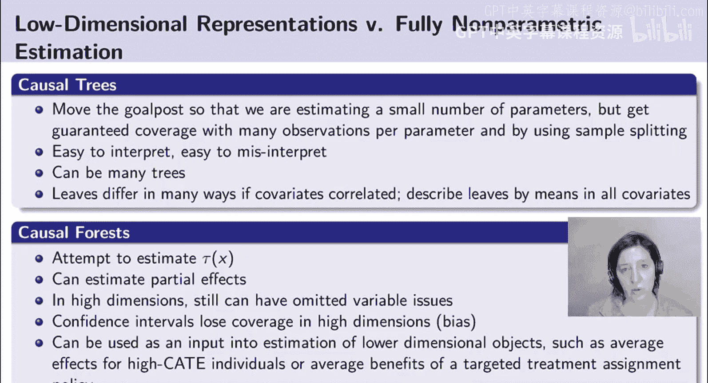

在本节课中，我们将学习如何从估计简单的处理效应异质性表示（如因果树），过渡到估计条件平均处理效应的灵活函数形式。我们将探讨几种方法，并重点介绍因果森林的原理、应用及其改进。

## 从简单估计到灵活函数形式

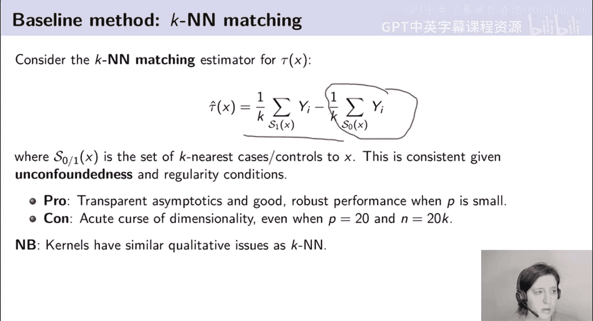

上一节我们介绍了因果树，它通过递归分区来定义用于匹配的“邻域”。本节中，我们来看看如何估计更灵活的条件平均处理效应函数形式。

我们之所以需要这种灵活的非参数估计，有多种动机。其一，我们可能希望理解**偏效应**，即固定某些协变量X，观察处理效应如何随其他协变量的变化而变化。其二，这些估计可以作为其他估计问题的输入，例如用于识别高处理效应个体以进行干预分配，或用于估计最优策略。

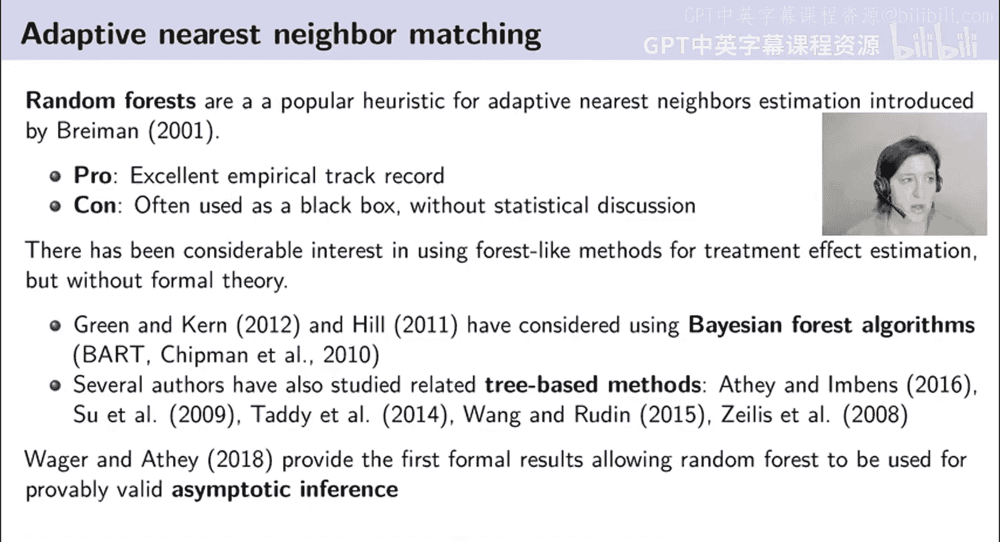

## 基线方法：匹配与核回归

以下是两种基础的、非适应性的条件平均处理效应估计方法。

*   **K最近邻匹配**：对于目标点x，找到K个最近的已处理观测值，计算其样本均值；再找到K个最近的对照观测值，计算其样本均值；最后将两者相减，得到τ̂(x)。这种方法直观，在协变量维度低时表现稳健，但存在严重的**维度灾难**问题。
*   **核回归**：可以看作是KNN的推广。它对目标点x附近的已处理观测值进行加权平均（距离越近权重越高），再减去对附近对照观测值的加权平均，从而得到估计。

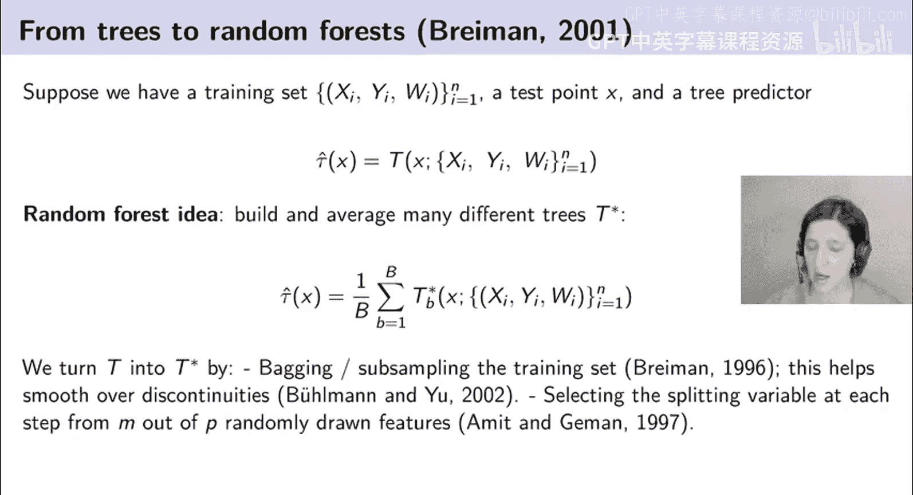

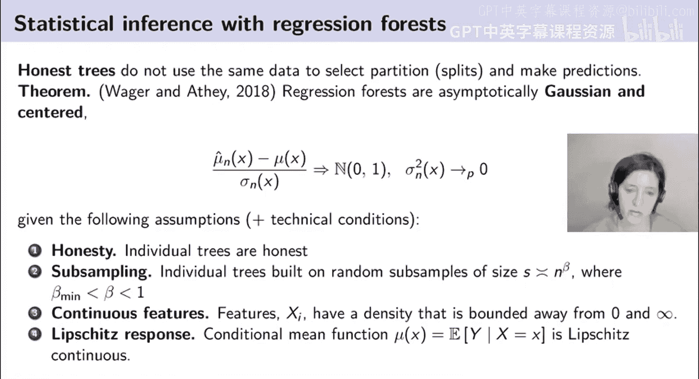

这两种方法的主要挑战在于，当协变量维度增加时，寻找“邻近”观测点的效率会急剧下降。

## 因果森林：自适应最近邻匹配

现在让我们谈谈随机森林，我们将以一种不同于标准的方式解读它——将其视为**自适应最近邻匹配**。

随机森林由Breiman于2001年提出，是一种流行的自适应最近邻估计启发式方法。它通常作为“黑箱”使用，即使不调参也往往表现良好，是能快速实现的高性能机器学习方法之一。

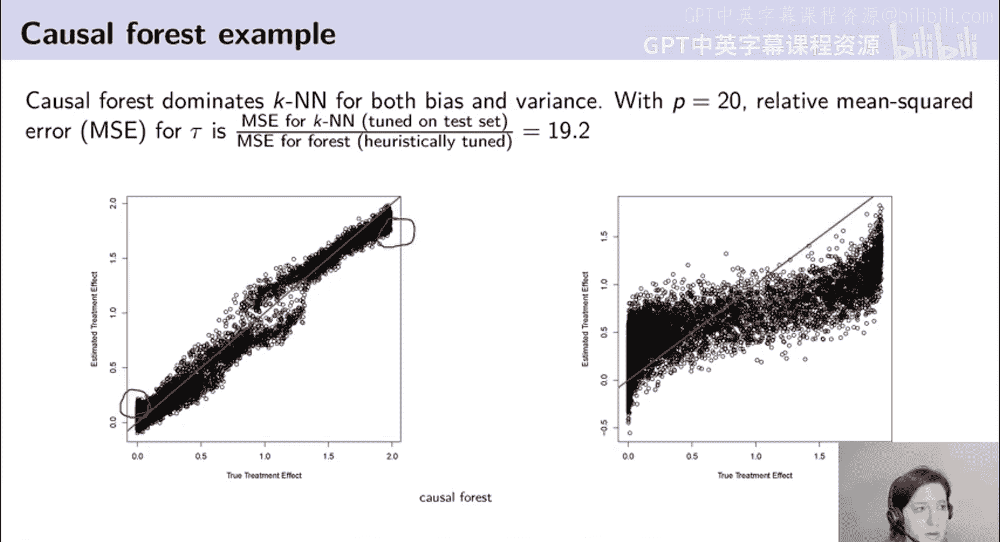

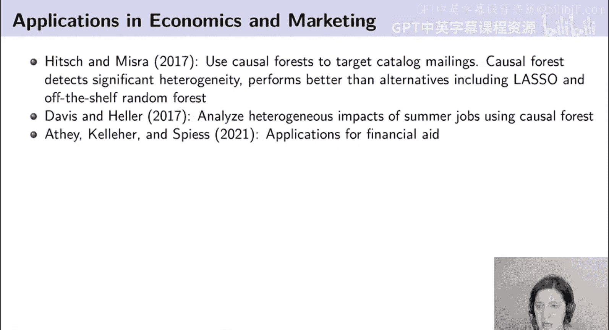

### 从因果树到因果森林

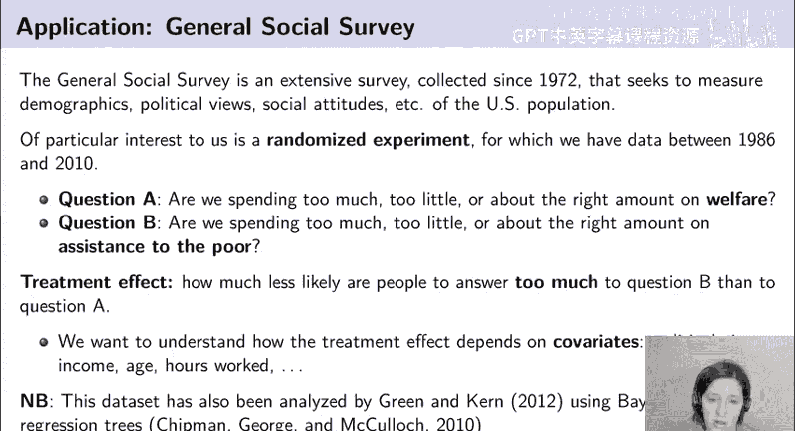

我们已经介绍了因果树，它通过递归分区（使用因果推断分裂规则）来定义匹配邻域，并倡导使用样本分割来确保每个叶节点内处理效应估计的置信区间无假设依赖。

**如何从单棵树扩展到森林？** 随机森林的核心思想是构建并平均许多不同的树。我们的估计τ̂(x)可以是许多树估计的处理效应的平均值。

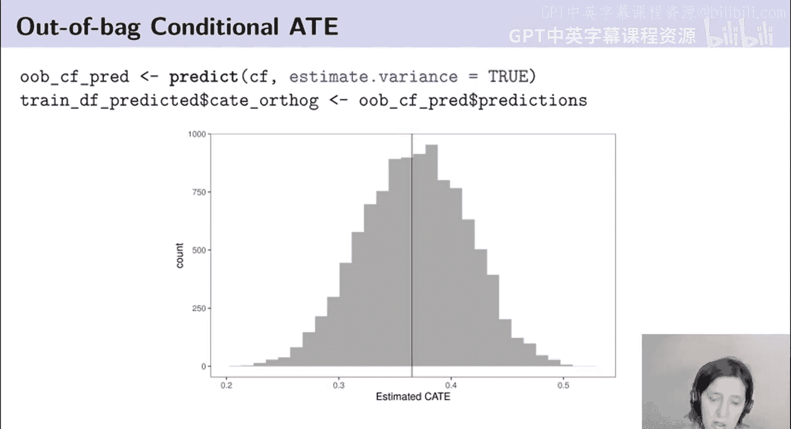

为了使每棵树彼此不同，通常采用两种技术：
1.  **Bagging或子采样**：对训练集进行重采样。这有助于平滑由单棵树边界引起的不连续性。
2.  **特征子集选择**：每棵树只关注全部协变量的一个子集。这能确保森林的多样性。

在理论分析中，我们更关注**子采样**，因为它能带来更好的统计性质。更重要的是，我们可以构建**诚实树**——即不使用相同数据来选择分区和进行预测的树。通过平均许多这样的诚实树，我们就能得到无偏估计。

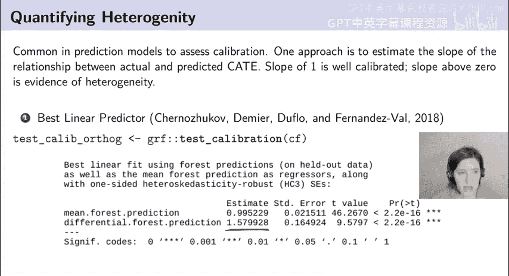

### 因果森林的理论保证与优势

Wager和Athey在2018年的主要结果表明，在满足一定技术条件下，通过平均大量基于子采样的诚实树构建的森林，其估计量是**渐近正态**的，并且以真实值为中心。这使我们能够构建有效的置信区间。

因果森林的关键优势在于其**自适应性**。与KNN需要在所有维度上寻找邻近点不同，因果森林的分裂规则能够自动识别对处理效应异质性重要的协变量，从而构建出更有效的邻域。

## 实例演示：模拟数据

假设我们有20,000个观测值，6个均匀分布的特征，其中只有2个真正影响处理效应。

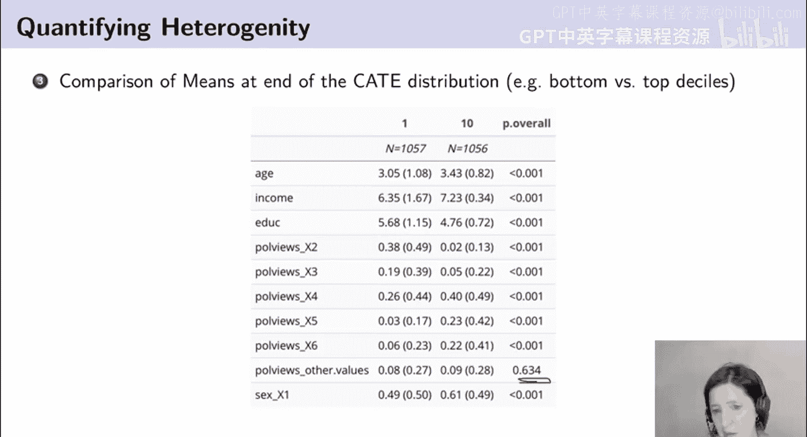

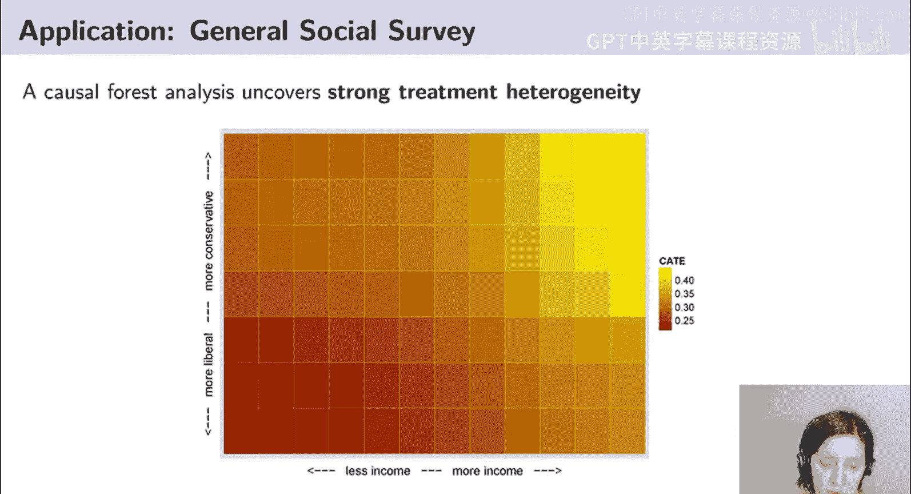

*   **因果森林**能够捕捉到真实的非线性形状，尽管由于是树的平均，边界处略显“方块化”。
*   **KNN估计**则显得非常模糊，因为它被迫在6个维度（包括4个噪声维度）中寻找最近邻，导致在重要维度上的邻近性不足。

当将协变量维度增加到20时，KNN的表现进一步恶化，而因果森林凭借其自适应性，依然能较好地识别处理效应异质性。校准图也显示，因果森林的估计更接近真实值。

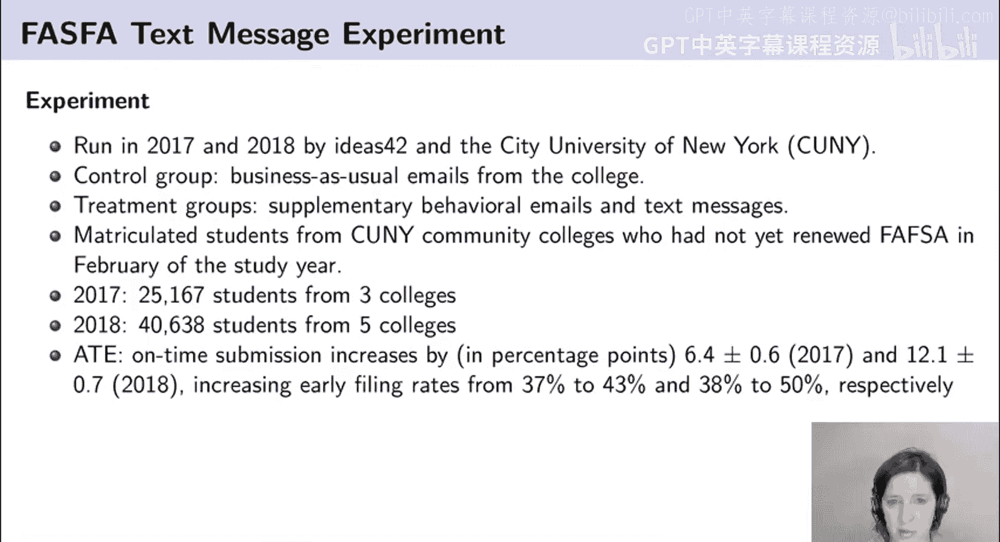

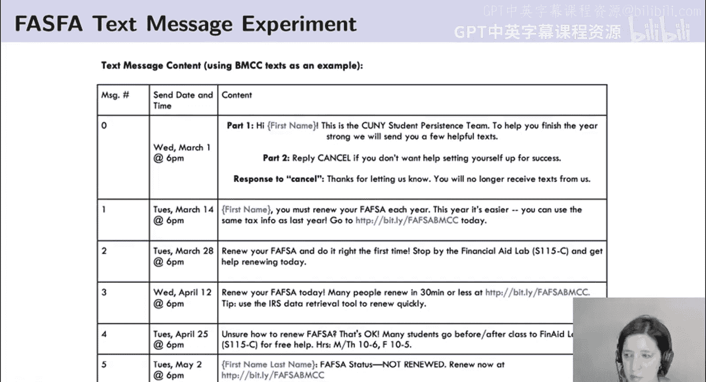

## 实际应用案例

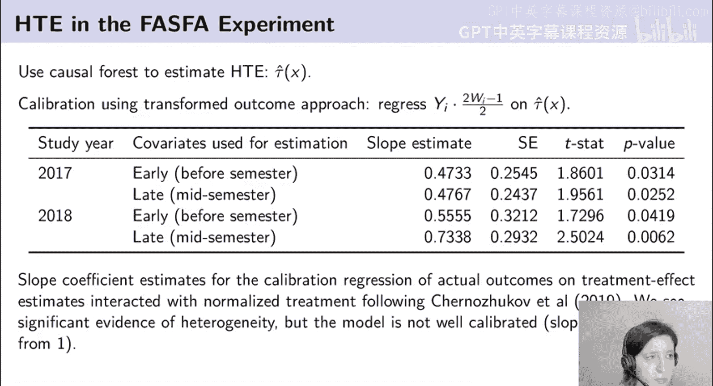

因果森林已被应用于多个领域：
1.  Hitsch和Mira：使用因果森林定向投放商品目录。
2.  Davis和Heller：分析暑期工作的异质性影响。
3.  Athey等人：研究经济援助申请的助推效果。

### 案例一：一般社会调查

我们分析一个关于问题措辞效应的随机实验：询问“福利支出是否过多”与“对穷人的援助是否过多”。

**分析步骤：**
1.  **检验随机化**：通过估计倾向得分并比较处理组和对照组的分布，确认实验确实是随机分配的。
2.  **估计异质性**：使用因果森林估计条件平均处理效应，直方图显示估计的CATE存在明显差异。
3.  **评估校准与真实性**：
    *   使用**转换结果回归**：将转换后的结果（代表个体处理效应）对估计的CATE进行回归。斜率显著不为0，说明存在真实的异质性；但斜率不等于1，说明模型未完美校准。
    *   使用**分位数分组分析**：基于估计的CATE将样本分为四组（使用交叉拟合避免数据窥探），然后分别估计每组的平均处理效应。结果显示能够区分部分组别，证实了异质性的存在。
4.  **解释异质性**：通过检查高/低处理效应分位数组的协变量均值，发现年龄、收入、政治观点和性别是预测处理效应大小的关键因素。可视化展示了政治观点与收入之间的非线性交互作用。

### 案例二：助推填写经济援助表单

这是一个通过邮件和短信“助推”学生按时提交经济援助表单的实验。

**分析发现：**
1.  **平均处理效应显著**：干预显著提高了按时提交率。
2.  **异质性信号较弱**：校准回归显示斜率显著非零，但远离1。分位数分组分析结果噪音较大，表明这是一个**低信号环境**——数据中的噪声超过了真实的异质性信号。
3.  **关键协变量**：“当前是否在籍”是预测处理效应异质性的最重要协变量。在籍学生对助推的反应更强。
4.  **对靶向政策的启示**：我们比较了不同靶向策略（基于估计的CATE、在籍状态、基线预测等）相对于随机分配的提升效果。结果发现，在此低信号环境中，使用复杂的机器学习模型进行靶向的收益有限，有时甚至不如基于简单规则（如在籍状态）或随机分配。

## 超越基础森林：局部线性森林

因果森林并非万能。对于许多经济学数据中存在的平滑、单调或U形关系，森林试图用阶梯函数去拟合，效率较低。

**局部线性森林**是对因果森林的改进。它的思路是：在目标点u附近，运行一个**加权线性回归**，权重由森林决定的邻近度给出。通过估计斜率系数，该方法能够调整数据生成过程在边界附近的趋势，从而在边界处获得更好的拟合效果。

在一般社会调查的例子中，因果森林在协变量分布的边界处估计值趋于平坦，而局部线性森林则能更好地捕捉真实的关系形态。

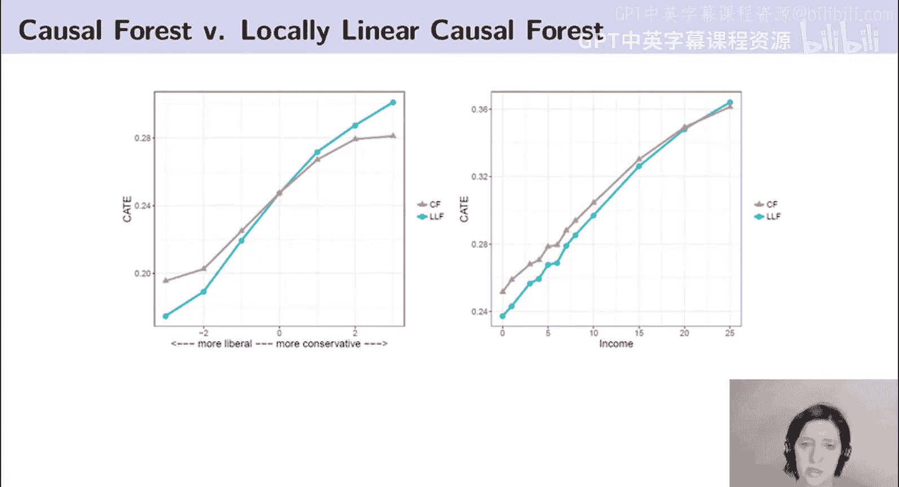

## 总结

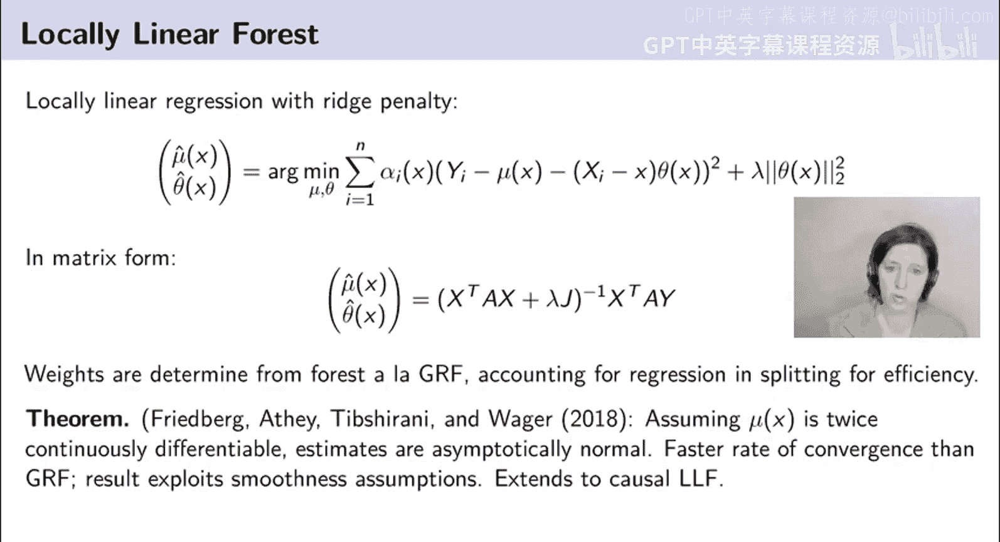

本节课中我们一起学习了条件平均处理效应的灵活估计方法。我们从基础的KNN和核回归出发，重点深入探讨了**因果森林**，将其理解为一种自适应最近邻匹配方法，并了解了其理论保证和自适应性优势。通过一般社会调查和经济援助助推两个案例，我们实践了估计、校准和解释异质性的完整流程，并认识到在**低信号环境**中解释结果需要格外谨慎。最后，我们介绍了**局部线性森林**作为对标准因果森林的一种改进，以更好地处理平滑关系。这些工具为理解和利用处理效应异质性提供了强大的框架。