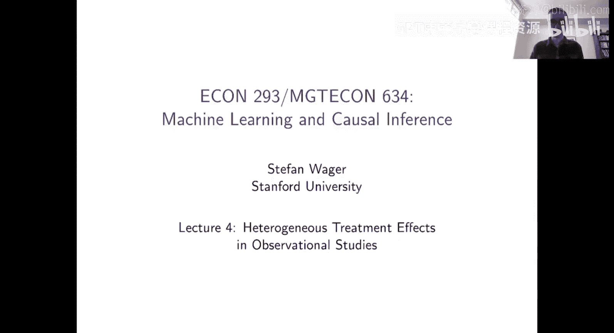
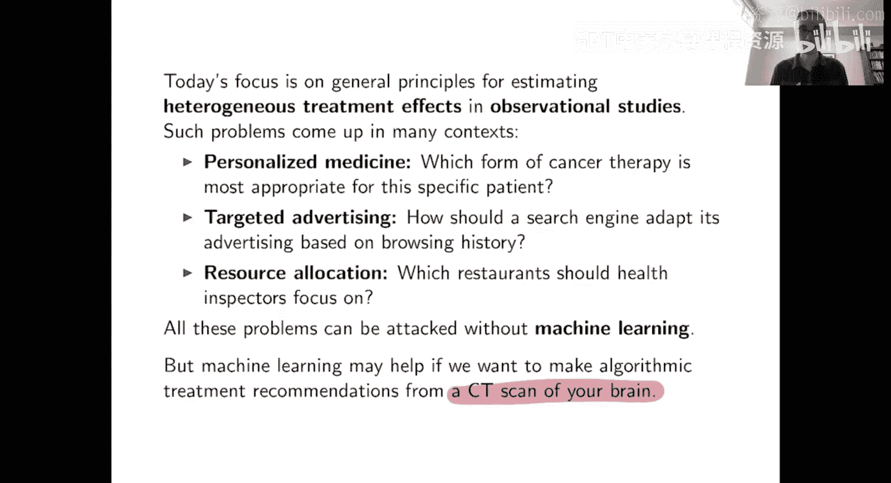
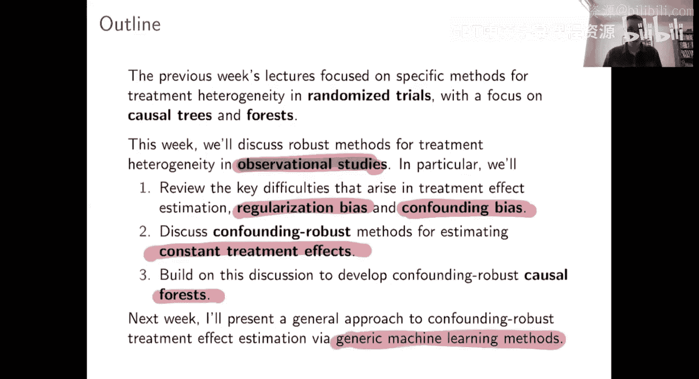
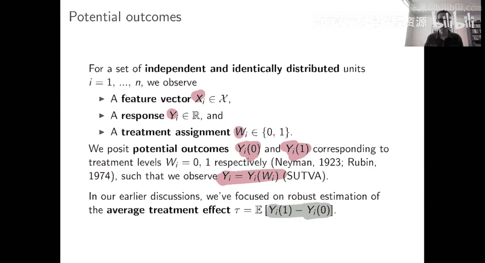
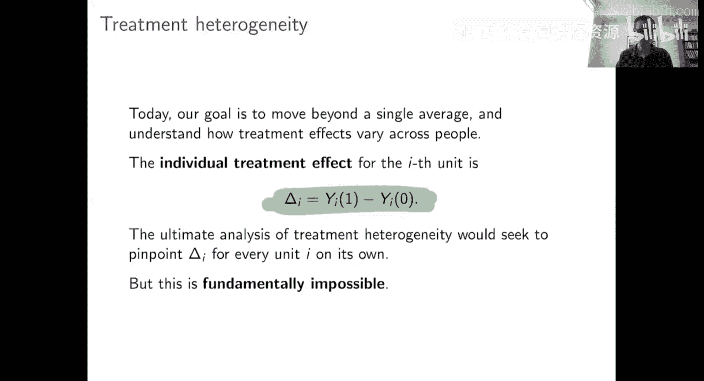
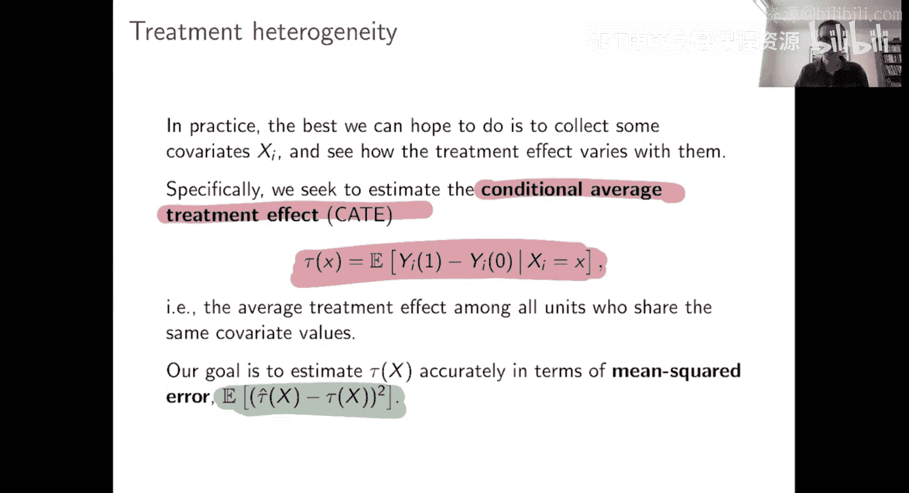
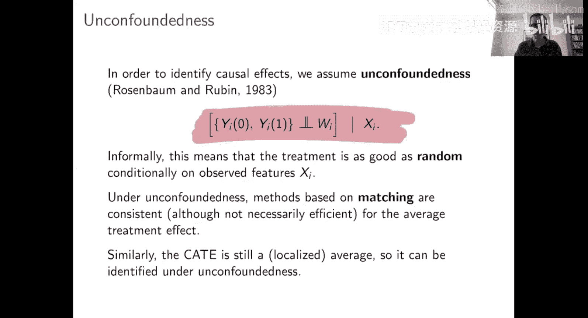
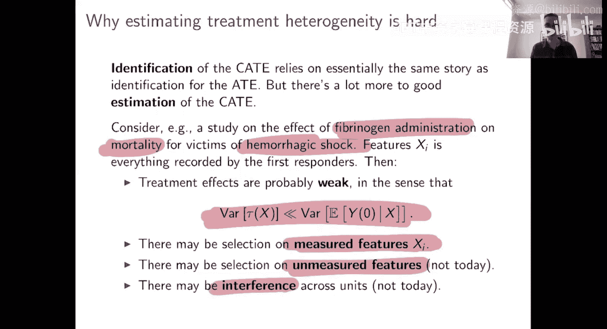

#  012：处理异质性的稳健估计

在本节课中，我们将学习如何在观察性研究（而非随机试验）中估计处理效应的异质性。我们将探讨其中的核心挑战，并介绍如何构建能够稳健应对混杂偏倚的因果树和因果森林方法。

上一节我们介绍了在随机试验中估计处理异质性的方法。本节中，我们将把目光转向观察性研究。在观察性研究中，处理分配并非随机，某些个体可能基于其特征更倾向于接受处理。这意味着我们不仅需要处理异质性效应函数本身的复杂性，还需要应对由混杂因素带来的偏倚。幸运的是，通过结合本课程迄今所学的思想，我们可以有效地解决这些问题。

## 应用背景与问题定义

处理异质性问题是许多应用领域的核心关注点。

以下是几个典型例子：
*   **个性化医疗**：假设有一种新疗法，你认为人们能从中获益，但某些人可能获益更多。你希望根据病史或其他信息，优先将治疗给予获益最大的人群。这就引出了理解干预异质性效应的问题。
*   **副作用规避**：反之，假设某种治疗有严重副作用。你会希望避免将干预措施给予副作用高风险人群。理解谁最容易受到新疗法的副作用影响，同样是一个处理异质性问题，只是此时的结局变量是你希望避免的副作用。
*   **定向广告**：在工业界，定向广告是另一个常见领域。从业者通常拥有大量数据集，能够利用机器学习从中提取非常细微的信号。

本课程的主题是机器学习方法，因此今天我们将聚焦于基于机器学习的处理异质性方法。但需要强调的是，这并不意味着你必须使用机器学习方法。你也可以使用经典方法，例如在线性回归中放入处理变量与协变量的交互项，这在某些应用中也能有效地捕捉处理异质性。使用机器学习方法并不会改变问题的本质，它只是让你能够处理更大、更复杂的数据集，并自动化部分分析。举一个极端的例子，假设你想进行个性化医疗，而算法的输入之一是大脑的CT扫描图像。你希望基于CT扫描判断谁将从某种治疗中获益。这是一个处理异质性问题，但若想用线性回归来处理，恐怕会非常困难，你可能需要基于图像识别的机器学习工具。

## 从随机试验到观察性研究

上周，Susan重点介绍了在随机试验中处理异质性的问题，并讨论了一些方法，包括因果树和因果森林。本周，我想继续这一讨论，但背景将不再是随机试验，而是观察性研究。在观察性研究中，我们还需要担心某些个体“选择进入”处理组，这意味着并非所有个体先验地拥有相同的接受处理的概率。这最终成为一个相当微妙的问题，它本质上结合了我们迄今在本课程中看到的大多数挑战。

我们讨论过估计平均处理效应（ATE）的挑战。平均处理效应本身是一个非常简单的参数，只是一个数字，但困难在于，如果你处于观察性研究环境中，你需要控制协变量、估计倾向得分等等，要做好这些工作需要付出相当的努力。另一方面，上周的重点是随机试验中的处理异质性估计。在随机试验中，没有混杂带来的困难，但困难在于异质性处理效应函数可能相当复杂，因此你需要更努力地工作，例如通过树或其他方式来表示它。

今天，我们将同时面对所有这些困难。我们的目标仍然是异质性处理效应函数，因此它将是复杂的。但同时，我们还必须担心混杂，需要使用倾向得分估计来使我们的估计变得稳健。所以，我们的问题也将包含这个维度。不过，幸运的是，如果你能以正确的方式结合迄今课程中的思想，一切都可以顺利进行。

## 本周内容概览

观察性研究中的处理异质性是我们本周的主题。

我将重点关注以下三个方面：
1.  **回顾关键难点**：回顾估计处理异质性时出现的关键难点，包括总会出现的正则化偏倚（这在随机试验中也出现过），以及我们今天主要关注的混杂偏倚问题。
2.  **稳健估计常数处理效应**：接下来，我将讨论如何在观察性研究中稳健地估计常数处理效应。这看起来可能有点像绕路，但非常重要。你可能会问，如果我们想理解处理效应如何变化并关注异质性，为什么还要关心估计常数处理效应？但回想一下因果树是如何工作的：因果树首先对你的空间进行划分，以找到处理效应基本恒定的区域。然后，在每个叶节点内，你希望处理效应大致恒定，从而可以估计该叶节点的处理效应参数。在观察性研究环境中，这意味着除非你知道如何在希望处理效应恒定的叶节点内估计常数处理效应，否则你无法运行因果树。所以我们将讨论这个问题。
3.  **构建稳健的树和森林**：在讲座的最后部分，我们将讨论如何基于这些思想，为处理异质性构建稳健的树和森林。

这就是我们本周的计划。下周我们将继续，讨论如何超越这些针对树和森林的、抗混杂的思想，构建真正能与任何通用机器学习方法相结合的方法。

## 统计设定与估计目标

在统计设定方面，和往常一样。我们假设处理一组独立同分布的单元。每个单元有一个特征向量 **X**、一个观测结果 **Y** 和一个处理指示变量 **W**。我们有对应的潜在结果，表示在接受处理或不接受处理时会观察到的结果。因此，实际观察到的结果是你实际接受的处理分配所对应的潜在结果。

那么，我们想估计什么？在第二讲中，我们处于这个设定下，想要估计平均处理效应，即潜在结果的平均差异。但今天，我们想关注处理异质性。因此，我们仍然关注因果效应，即差值 **Y_i(1) - Y_i(0)**。但我们不只是想要这个量的平均值，我们想要更细致地了解发生了什么。

## 从个体处理效应到条件平均处理效应

在讨论我们实际想估计的目标之前，先快速说明一点。如果你说想估计个性化处理效应，那么很自然地会认为你想估计的量是 **δ_i = Y_i(1) - Y_i(0)**。记住，**Y_i(1)** 是第 **i** 个人在接受处理时会经历的结果，**Y_i(0)** 是其在控制条件下会经历的结果。因此，这里定义的 **δ_i** 从潜在结果的角度看，就是处理对第 **i** 个人的效应，这被称为个体处理效应。当然，如果你能知道个体处理效应，你会想去估计它。但问题是，这些个体处理效应本质上是不可知的。对于任何特定的人，我要么给你处理，要么不给你处理。我永远不可能同时既给你处理又不给你处理。这意味着，对于任何特定的人，你要么观察到 **Y_i(1)**，要么观察到 **Y_i(0)**，你永远观察不到 **Y_i(1) - Y_i(0)**。所以你永远无法观察到单个人的 **δ_i**，这本质上是不可知的。因此，为了估计处理效应，我们总是需要在一些接受处理的人和其他可比较的未接受处理的人之间进行比较。例如，在随机试验中以平均处理效应为目标，就是一种非常直接且简单的比较方式。

## 条件平均处理效应

那么，我们不想估计 **δ_i**，我们想估计什么呢？我们想估计所谓的条件平均处理效应。这本质上是平均处理效应，即考察平均的处理后潜在结果减去控制后潜在结果的差异。只不过，我们不是估计总体的平均值，而是估计在给定协变量条件下的平均值。因此，我们不是询问这个特定个体的处理效应是什么，而是说，如果存在一些协变量，比如基于性别、年龄、病史等，你可以问：对于具有这类协变量的人，他们的平均处理影响是什么？当我说我们想测量处理异质性时，我的意思是我希望理解条件平均处理效应如何随你能够测量的 **X** 变化。

条件平均处理效应的定义如下：

**τ(x) = E[Y_i(1) - Y_i(0) | X_i = x]**

为了在脑海中有一个清晰的目标，今天当我说我们想估计条件平均处理效应函数时，具体指的是：如果我们想以均方误差准确捕捉它，即我们有一个人的分布，每个人有其协变量 **x**，对于你的 **x**，你有真实的 **τ(x)**（你的真实条件平均处理效应），然后我们将估计 **τ̂(x)**（你的条件平均处理效应估计值），我们希望对于典型个体，这两者是接近的。

## 观察性研究中的识别与挑战

如前所述，我们想在观察性研究中估计条件平均处理效应。这与我们在第二周看到的环境相同。我们不再假设处理是随机的，但我们将假设存在你可以测量的 **X**，使得在给定 **X** 的条件下，处理如同随机分配。这是我们见过的、用于识别平均处理效应的假设。它同样也能让你以非常相似的方式识别条件平均处理效应。再次强调，在此假设下工作的统计难点始终是：如何在不引入偏倚的情况下，有效地消除由 **X** 引起的混杂效应？

## 估计处理异质性的难度

在深入本讲的细节之前，我想最后说几句，谈谈估计处理异质性是否困难？需要注意什么？也许还有，在哪些情况下你认为估计处理效应异质性可能更容易或更困难，以便你知道需要注意什么。

现实情况是，准确估计异质性处理效应函数比仅仅准确估计平均处理效应要困难得多。你通常需要更多的数据。在许多问题场景中（如果你处理课程中提供的数据，你会看到这一点），你可能会去寻找异质性处理效应，但仅凭现有数据，你可能什么也找不到。这是正常的。估计处理异质性是一项艰巨的任务，它比估计平均处理效应要困难一个数量级，你将需要更多的数据。但这并不意味着寻找处理异质性不值得，因为当你确实发现一种医疗方法不仅平均上有帮助，而且对某些人的帮助大于其他人时，你就可以明智地进行优先级排序，决定谁应该或不应该接受治疗，这可能具有巨大的价值。所以，当你能够发现异质性时，这通常非常好，但你并不总是能够做到。

## 一个具体案例的挑战

通常，只需思考一个应用实例，就能明白为什么这会相当困难。想象我们正在研究出血性休克（严重大出血）的患者，并观察给予纤维蛋白原治疗的效果。人们认为这有助于止血，我们关注纤维蛋白原对出血性休克患者死亡率的影响。假设我们也想寻找其中的异质性，即是否有些人比其他人更能从纤维蛋白原中获益以预防死亡？这是一个重要的问题。但当你思考这个问题时，有些问题会立即凸显出来。

首先，我们关心的结果是死亡率，这是一个非常极端的结果。我们正在研究的病症——出血性休克，也非常严重。因此，相对于给予纤维蛋白原，这个问题中有很多事情在发生。也许纤维蛋白原有一点帮助，但它能帮助的程度有一个明确的上限。现实地看，这些数据是由急救人员收集的。你可以想象，有些人你赶到时，发现他们伤势如此严重，以至于你无能为力，他们很可能无论如何都会死亡。另一方面，你可能会遇到其他正在出血但基本上情况良好的人，他们无论如何都可能存活下来。可能有一群处于中间状态的人，早期给予纤维蛋白原可能会真正产生影响。但问题是，有些人的生存机会可能接近0%或低于10%。如果给予纤维蛋白原能使某些人的生存机会增加5%，这是非常有价值的，但处理效应的绝对幅度相对于问题的基线来说可能非常非常小。

其次，同样在这个问题中，你拥有来自急救人员的数据。他们可能更倾向于将纤维蛋白原给予那些基于观察特征他们认为更需要的人，因此可能存在基于未测量特征 **X_i** 的选择。你需要处理这个问题。再次，当与处理效应（尤其是处理异质性）可能很弱这一事实相结合时，你可能会真正担心混杂效应相对于你感兴趣的处理效应大小来说可能很大，因此你真的需要小心地控制混杂。

## 总结

本节课中，我们一起学习了在观察性研究中估计处理效应异质性的核心框架与挑战。我们明确了条件平均处理效应是可行的估计目标，并指出了相较于随机试验，观察性研究需要同时应对效应函数复杂性和混杂偏倚的双重困难。通过一个具体案例，我们理解了处理效应信号可能微弱，使得稳健的估计方法至关重要。在接下来的章节中，我们将深入探讨如何构建能够对抗混杂偏倚的稳健估计方法。