#  013：异质性处理效应估计中的偏差来源 🔍

在本节课中，我们将深入探讨异质性处理效应估计器的偏差来源。我们将首先了解两种主要的偏差：正则化偏差和混杂偏差。然后，我们将讨论如何设计方法来避免这些问题。通过一系列基线方法的示例，我们将分析它们何时有效、何时失效，从而理解这些偏差的本质。

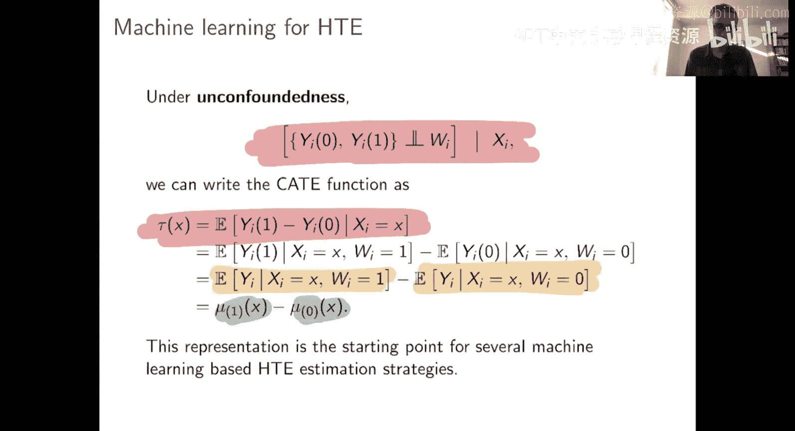

## 正则化偏差：一个直观的问题

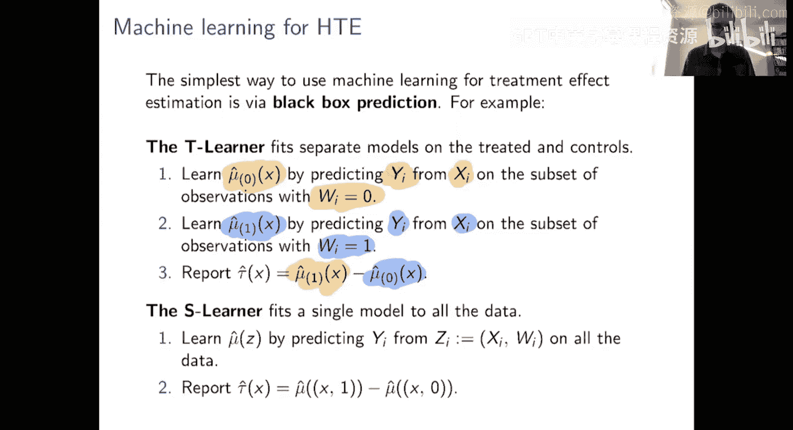

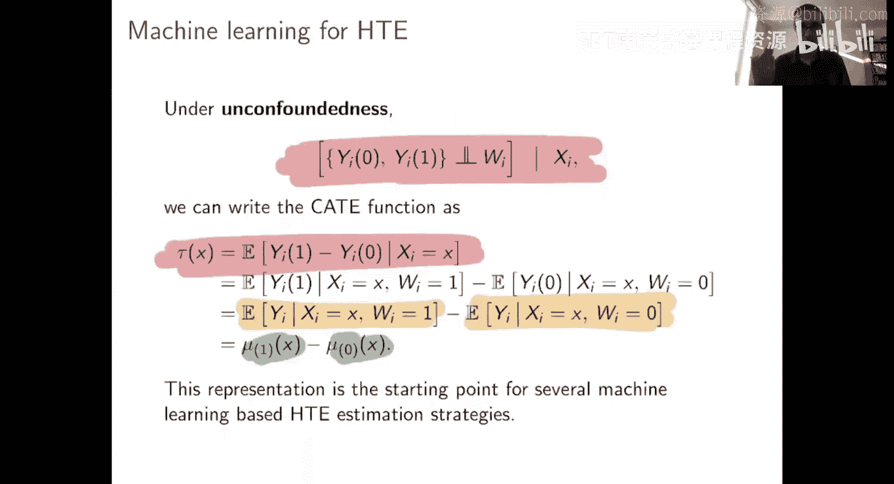

上一节我们介绍了异质性处理效应的概念，本节中我们来看看一个常见的问题：正则化偏差。在工程实践中，我们经常需要评估一个模型是否有效。最佳实践通常是：首先证明问题存在且难以解决，然后展示模型能解决该问题，从而获得模型有用的信心。在观察性研究中评估处理异质性方法时，我们也采用类似思路。我们先展示可能出错的地方，然后讨论如何设计避免这些问题的方法。

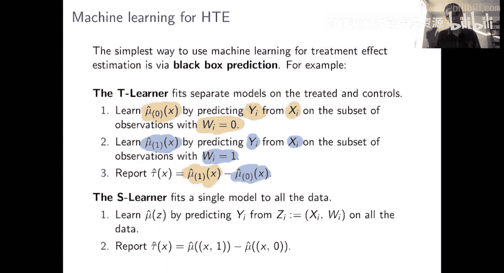

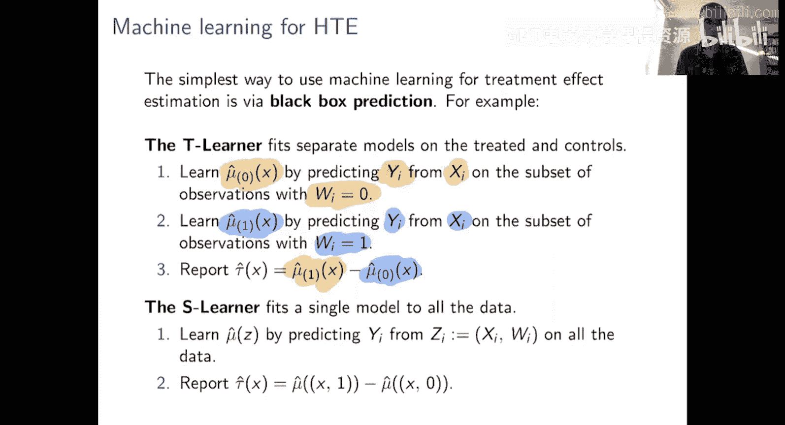

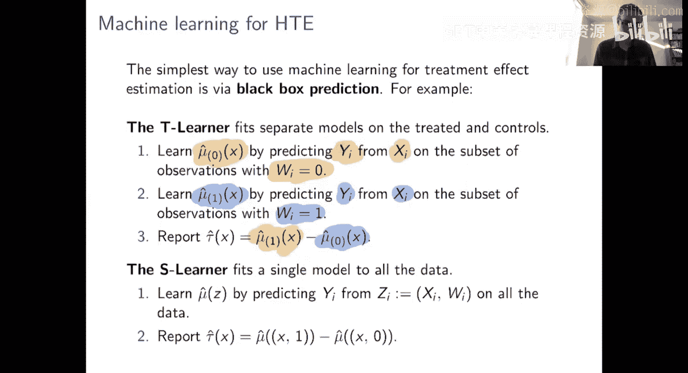

### 基线方法：T学习器与S学习器

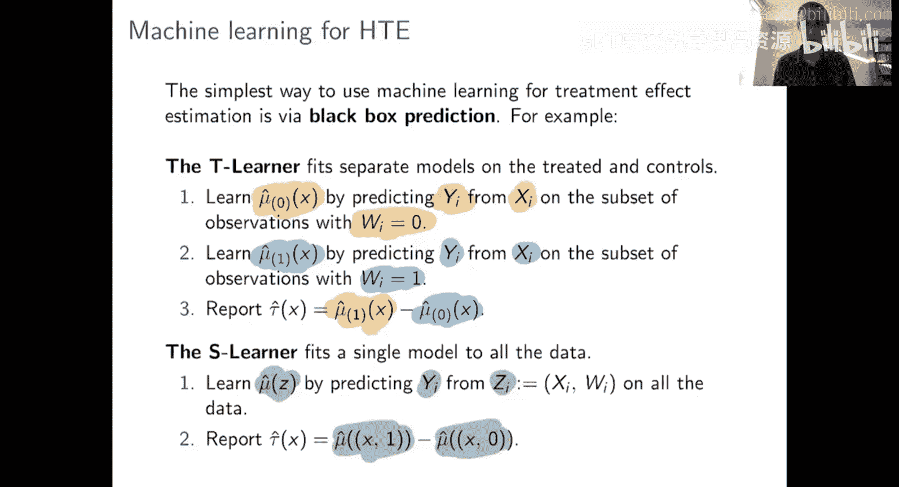

在无混杂假设下，处理在给定协变量X的条件下如同随机分配。此时，条件平均处理效应可以表示为两个回归函数的差：

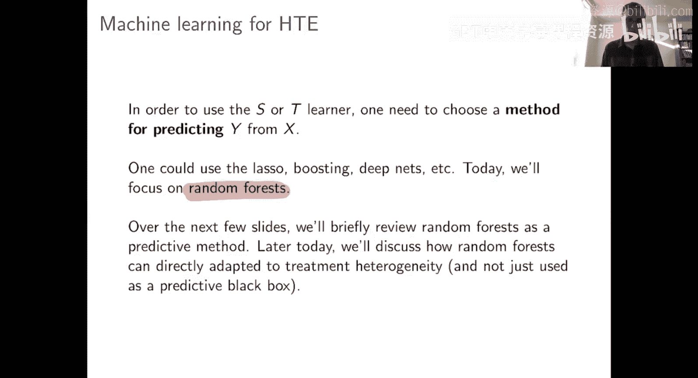

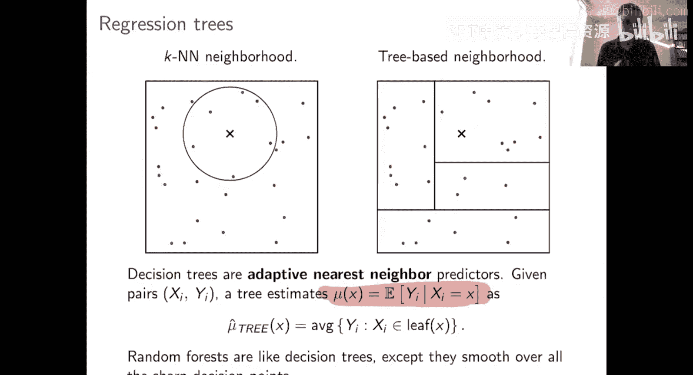

**公式：** `τ(x) = μ₁(x) - μ₀(x)`

其中，`μ₁(x) = E[Y | X=x, W=1]`，`μ₀(x) = E[Y | X=x, W=0]`。因此，估计τ(x)就转化为两个非参数回归问题。

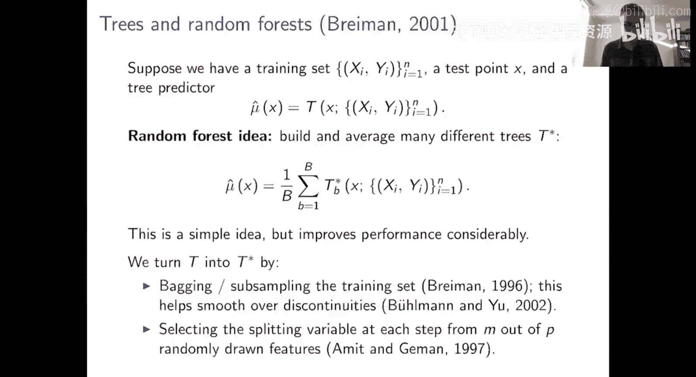

以下是两种直接的估计方法：

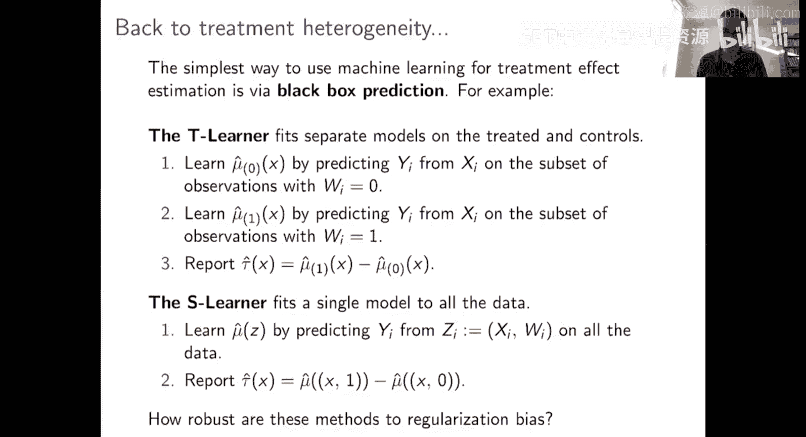

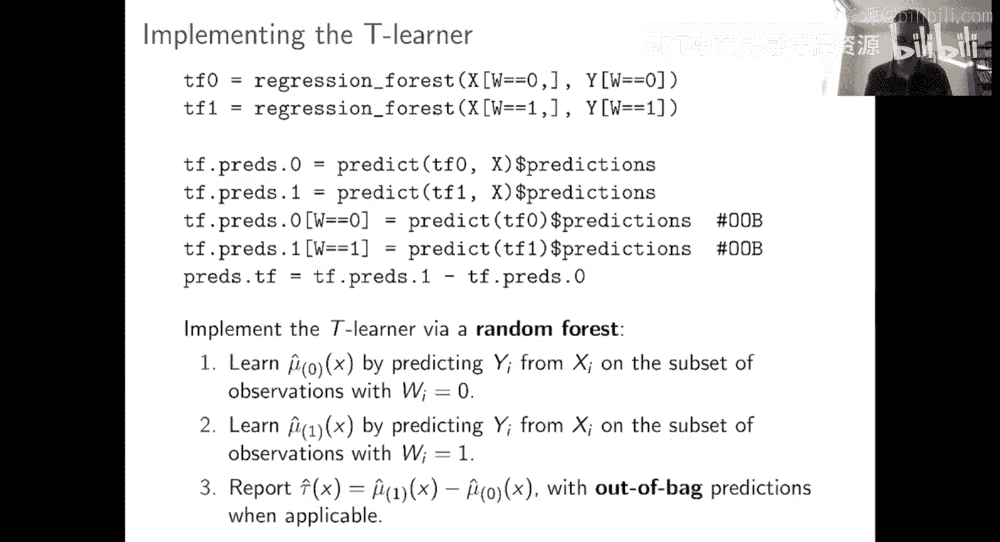

**T学习器**：分别对处理组和对照组拟合两个回归模型。
1.  在对照组数据上估计 `μ̂₀(x)`。
2.  在处理组数据上估计 `μ̂₁(x)`。
3.  将两者之差作为处理效应估计：`τ̂(x) = μ̂₁(x) - μ̂₀(x)`。

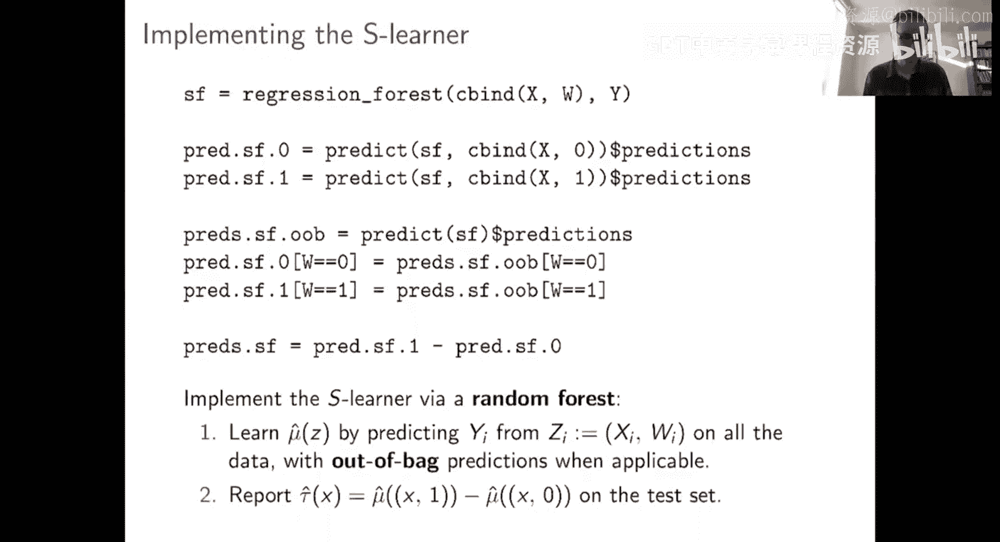

**S学习器**：将处理变量W作为特征，与协变量X一起拟合一个单一的回归模型。
1.  拟合一个模型 `μ̂(x, w)` 来预测Y。
2.  通过查询该模型得到处理效应估计：`τ̂(x) = μ̂(x, 1) - μ̂(x, 0)`。

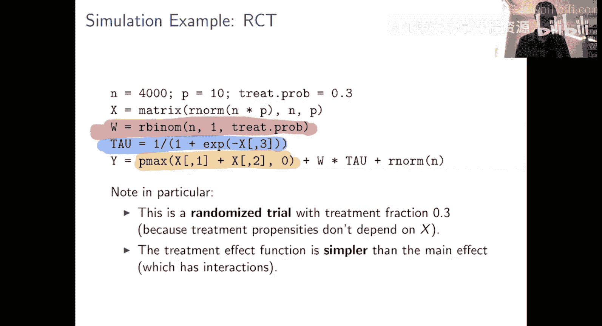

为了具体实现，我们可以使用随机森林等任何预测方法。以下是用随机森林实现的示例代码：

```python
# T学习器示例代码
from sklearn.ensemble import RandomForestRegressor
# 分别对对照组和处理组拟合模型
forest0 = RandomForestRegressor().fit(X[W==0], Y[W==0])
forest1 = RandomForestRegressor().fit(X[W==1], Y[W==1])
tau_hat_T = forest1.predict(X_test) - forest0.predict(X_test)

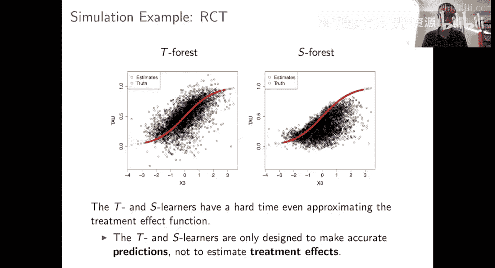

# S学习器示例代码
# 将处理变量W作为特征加入
XW = np.column_stack([X, W])
forestS = RandomForestRegressor().fit(XW, Y)
# 分别预测W=1和W=0时的结果
tau_hat_S = forestS.predict(np.column_stack([X_test, np.ones_like(X_test)])) - \
            forestS.predict(np.column_stack([X_test, np.zeros_like(X_test)]))
```

### 随机森林的工作原理回顾

为了理解后续问题，我们简要回顾随机森林的工作原理。单个决策树通过递归划分特征空间为矩形区域进行预测，在每个区域内用样本输出的平均值作为预测值。随机森林通过构建多棵不同的树并聚合它们的预测（例如取平均）来获得更稳定、更准确的预测。这种“装袋”策略通过增加树的多样性来提高性能。

### 方法表现与正则化偏差的出现

现在，我们在一个简单的随机试验模拟中测试T学习器和S学习器的表现。在这个模拟中，处理分配是随机的（无混杂），真实处理效应τ(x)是协变量x₃的逻辑函数形状，而基线响应函数则更为复杂。

令人惊讶的是，两种方法的表现都很差。T学习器的估计非常分散，而S学习器不仅分散，还存在系统性低估处理效应大小的偏差。这引发了疑问：既然τ(x) = μ₁(x) - μ₀(x)在理论上是正确的，并且我们用表现尚可的随机森林分别估计了μ₁(x)和μ₀(x)，为什么最终结果却如此糟糕？

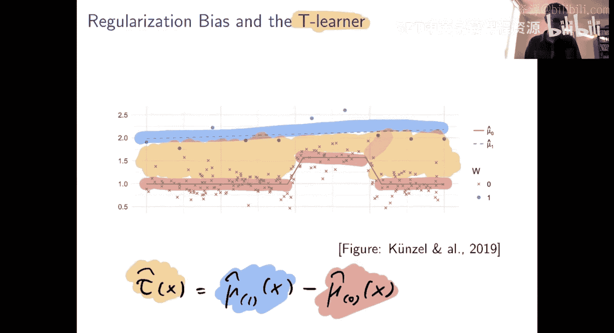

问题根源在于**正则化偏差**。我们可以通过一个更简单的例子来理解它。假设在一个一维协变量、随机分配但对照组样本远多于处理组的试验中，真实处理效应恒为1。T学习器首先用数据丰富的对照组拟合μ₀(x)，模型可以灵活地捕捉到数据中的变化。然后，它用数据较少的处理组拟合μ₁(x)，由于数据少，模型倾向于更简单（正则化更强），可能拟合出一个近乎常数的函数。当计算差值 `τ̂(x) = μ̂₁(x) - μ̂₀(x)` 时，在μ₀(x)变化剧烈而μ̂₁(x)平滑的区域，就会产生虚假的异质性处理效应信号，仿佛中间部分的处理效应变小了。这显然是不对的，因为真实处理效应是恒定的。

关键在于，虽然τ(x)在函数形式上等于μ₁(x)与μ₀(x)之差，但直接应用为通用预测任务设计的机器学习方法，而不仔细考虑估计过程，可能会导致对这两个分量进行不一致的正则化，从而在它们的差值中引入偏差。

## 应对正则化偏差：X学习器

那么，如何应对正则化偏差呢？除了上节课提到的因果树等专门算法，我们介绍另一种方法——**X学习器**。它同样遵循“通过解决一系列预测问题来估计处理效应”的配方，但设计更为精细。

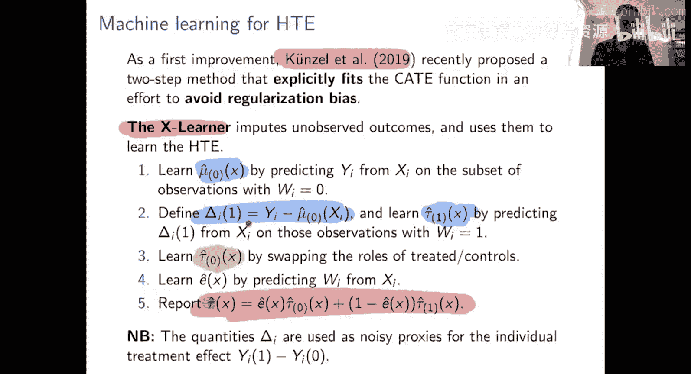

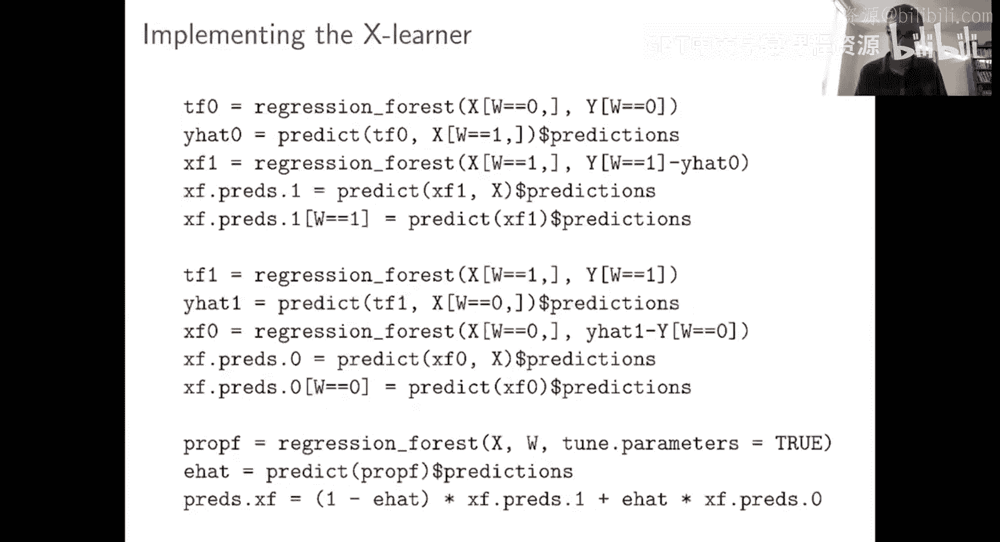

X学习器的步骤如下：
1.  与T学习器一样，首先分别估计 `μ̂₀(x)`（在对照组上）和 `μ̂₁(x)`（在处理组上）。
2.  **第一步估计**：对于每个处理组个体，计算其观测结果与“反事实”控制结果的差值：`D₁ᵢ = Yᵢ - μ̂₀(Xᵢ)`。这可以看作个体处理效应的一个噪声代理。然后，将 `D₁` 对 `X` 在处理组样本上进行非参数回归，得到第一个处理效应估计 `τ̂₁(x)`。
3.  **第二步估计**：角色互换。对于每个对照组个体，计算其“反事实”处理结果与观测结果的差值：`D₀ᵢ = μ̂₁(Xᵢ) - Yᵢ`。然后将 `D₀` 对 `X` 在对照组样本上进行非参数回归，得到第二个处理效应估计 `τ̂₀(x)`。
4.  **最终估计**：将两个估计通过倾向得分权重进行加权平均，得到最终的处理效应估计：`τ̂(x) = g(x)τ̂₀(x) + (1-g(x))τ̂₁(x)`，其中 `g(x)` 是倾向得分估计的函数（例如，`g(x)=ê(x)`）。

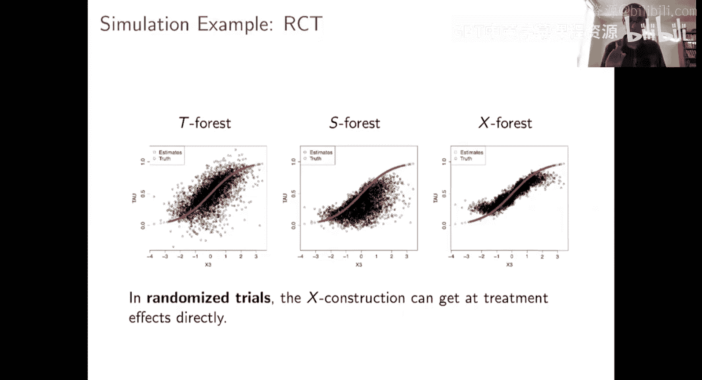

其核心思想是，我们利用数据较多的组（如对照组）来获得更准确的基线模型 `μ̂₀(x)`，然后用它来为数据较少的组（处理组）生成更可靠的效应代理值 `D₁`，进而估计τ(x)。这缓解了因两组数据量不同导致的正则化强度差异问题。在之前的简单例子中，X学习器能够成功恢复出恒定的处理效应，表现远优于T学习器和S学习器。

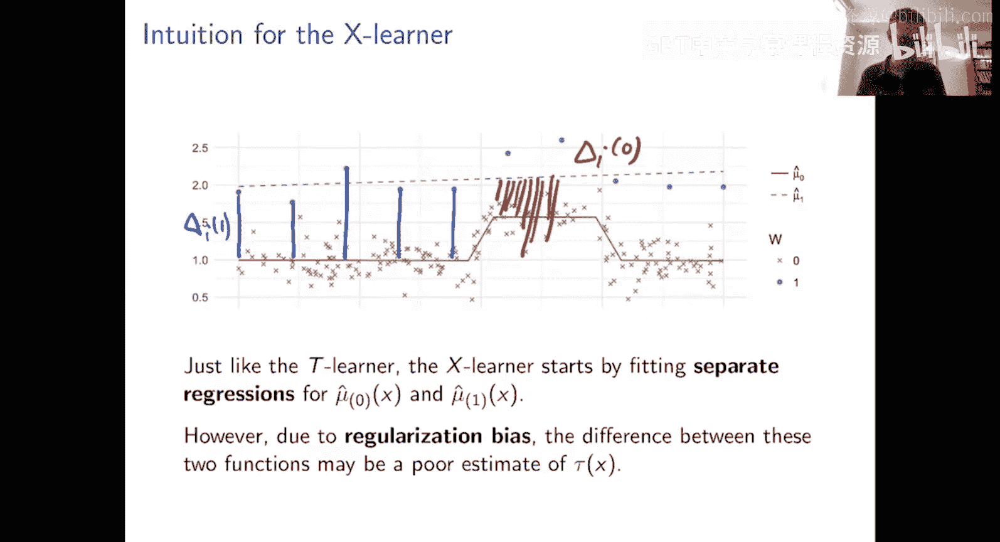

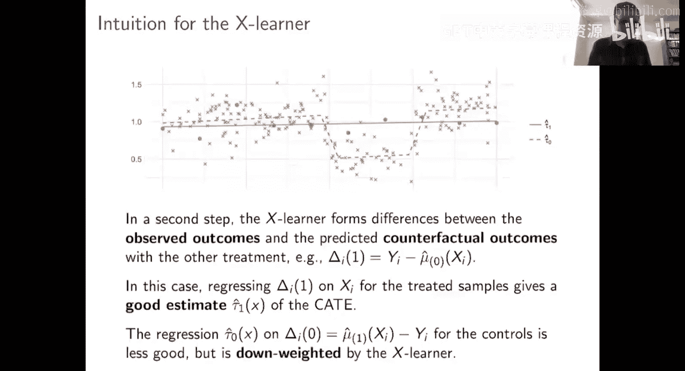

## 混杂偏差：观察性研究中的挑战

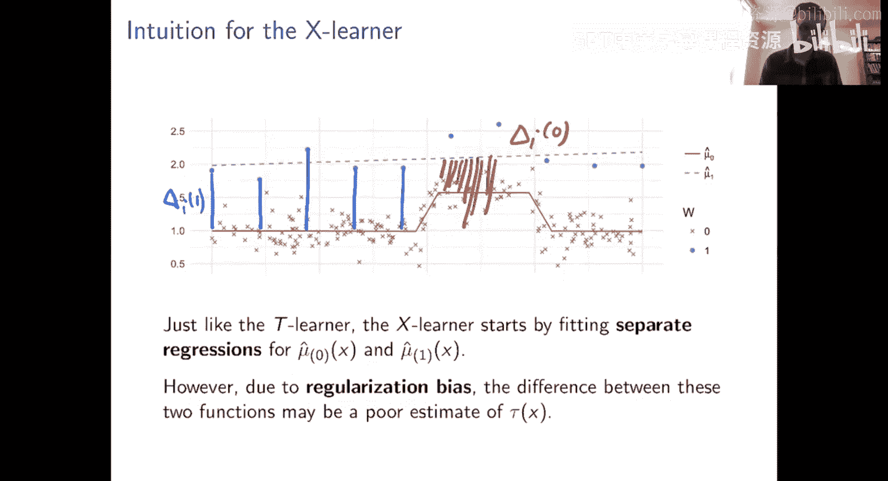

上一节我们讨论了即使在随机试验中也存在的正则化偏差，本节我们来看看观察性研究中特有的**混杂偏差**。当处理分配概率随协变量X变化时，就会产生混杂。如果这种关系与结果相关，且未被恰当调整，就会导致估计偏差。

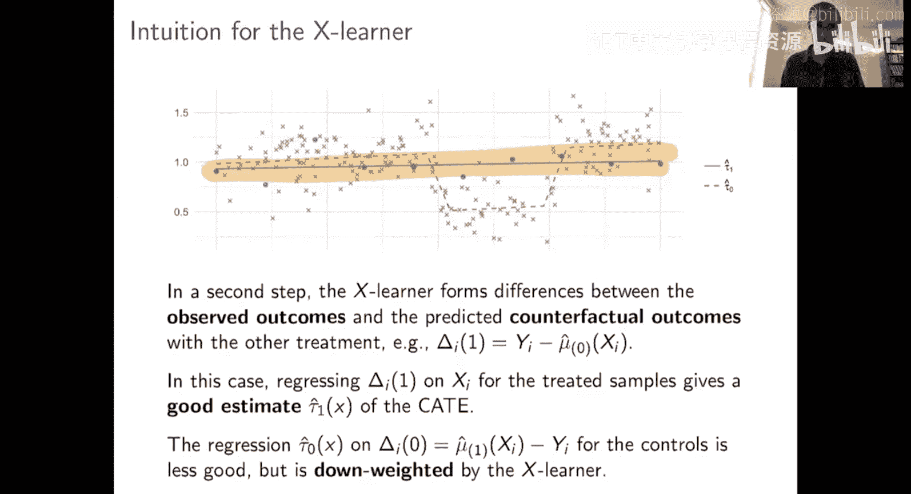

我们修改之前的模拟：现在处理分配概率是x₃的逻辑函数，且x₃越大，基线结果Y也倾向于越大，从而引入了混杂。真实处理效应仍然是恒定的。

测试发现，T学习器和X学习器此时的表现都很糟糕。它们都“幻觉”出了根本不存在的异质性处理效应。这是因为当倾向得分不是常数时，我们必须在估计处理效应时对其进行调整。就像在估计平均处理效应时使用AIPW等方法一样，在估计条件平均处理效应时，我们也需要巧妙地结合倾向得分来消除混杂的影响。

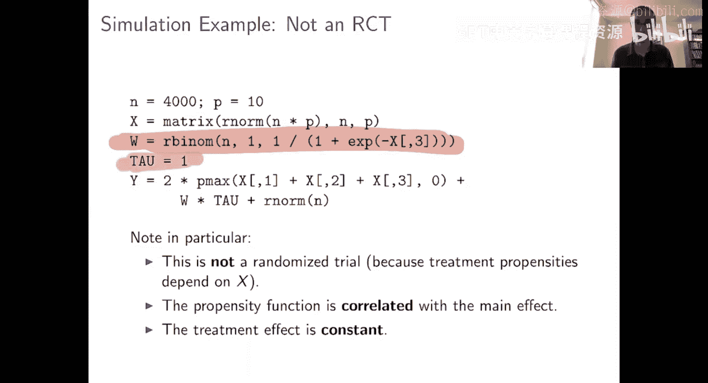

### 总结与展望

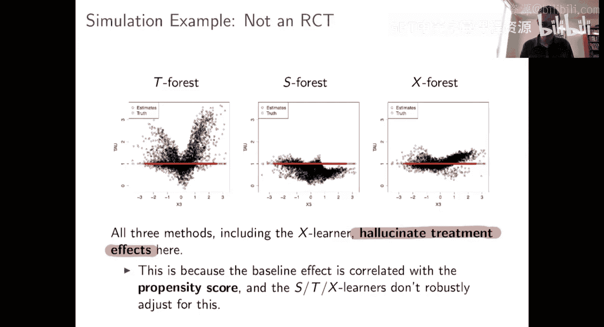

本节课中，我们一起学习了异质性处理效应估计中的两大偏差来源。
1.  **正则化偏差**：源于分别估计μ₁(x)和μ₀(x)时的不一致正则化，即使在随机试验中也会出现。可以通过专门设计的算法（如因果树、X学习器）来缓解。
2.  **混杂偏差**：在观察性研究中，当处理分配与协变量相关时出现。解决它需要将倾向得分重新纳入考量，并谨慎地将处理效应成分与混杂成分分离开来。

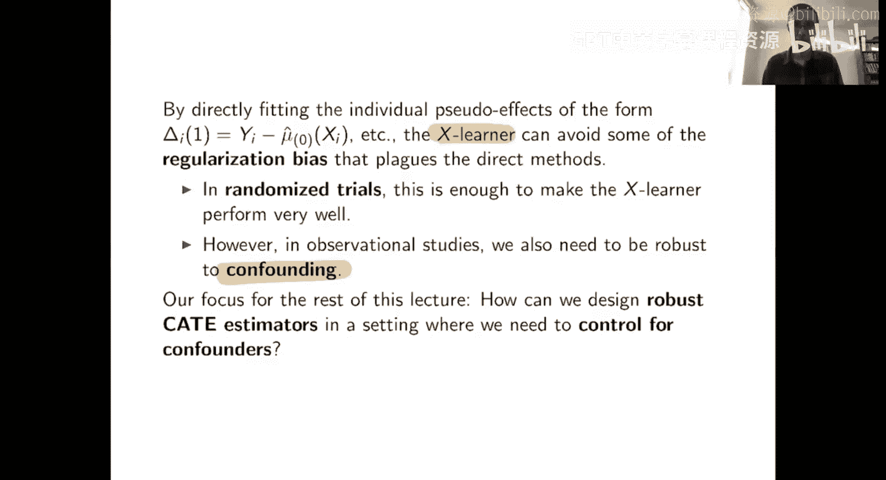

处理混杂偏差更具挑战性，我们需要在表达处理效应的同时，有效地消除混杂成分。这将是后续课程内容的重点。