#  014：混杂鲁棒的异质性处理效应估计

在本节课中，我们将要学习如何以对混杂因素鲁棒的方式估计异质性处理效应。我们将从一个更基础的问题开始：如何估计恒定的处理效应。这是构建更复杂方法（如基于树的异质性处理效应估计器）的关键基石。

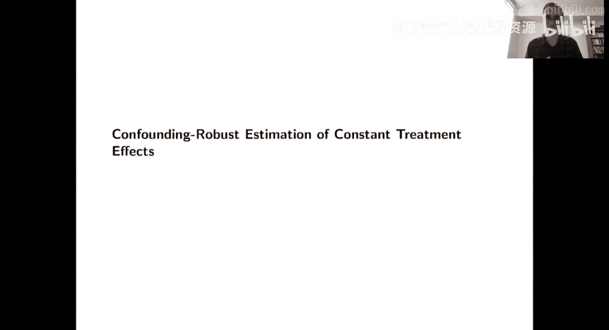

## 回顾：恒定处理效应的鲁棒估计

在开发用于估计异质性处理效应的混杂鲁棒方法的道路上，我们需要做的第一件事是回顾如何以混杂鲁棒的方式估计恒定处理效应。

为了理解其重要性，我们可以从一个具体的算法来思考。假设你想开发一种基于树的方法来估计处理效应，并且希望它对混杂因素鲁棒。那么请记住树是如何工作的：树首先会将你的特征空间（X空间）切割成叶子节点，然后在每个叶子节点中，你可以估计一个恒定的处理效应。这直接意味着，如果你想要一个对混杂因素鲁棒的异质性处理效应估计器，你必须先拥有一个能够鲁棒地估计恒定处理效应的方法，然后你将在每个叶子节点中部署这个方法。

因此，这将是本部分讲座的重点。

## 恒定处理效应模型

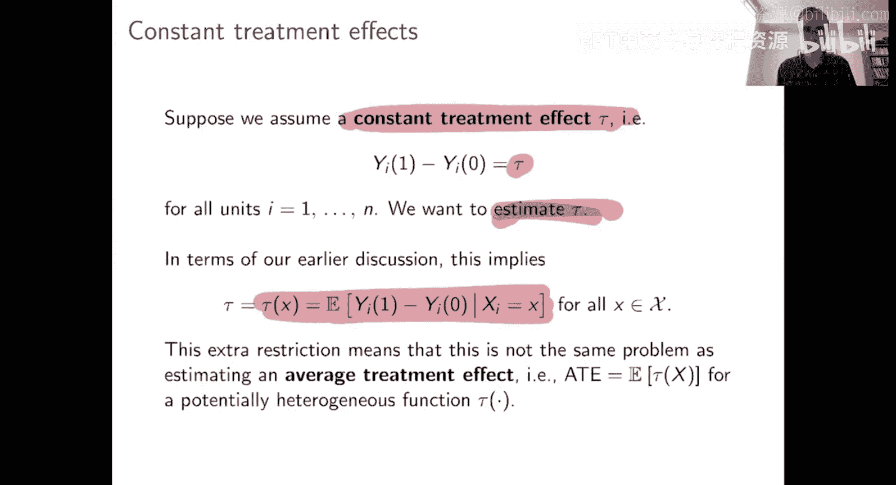

为了打下基础并能够思考正式结果，我将在这里做一个相当极端的假设：我将假设处理效应是恒定的。也就是说，对于每个个体，都存在一个接受处理和不接受处理的潜在结果，并且这两个潜在结果之间的差值对每个人都是相同的。对于每个人，接受处理的收益减去不接受处理的收益，这个差值就是 **τ**，它对每个个体都是恒定的。我们的目标就是估计这个 **τ**。

这是一个非常严格的设定，但我们将基于这个问题开发的方法，即使存在异质性时也适用。需要指出的是，到目前为止的讲座中，我们已经遇到了条件平均处理效应函数 **τ(x)**。当然，如果处理效应是恒定的，那么条件平均处理效应函数 **τ(x)** 对每个 **x** 值都只是常数 **τ**。出于估计的目的，我们将使用这个条件平均处理效应的概念来激发我们的方法，而不是上面那个更强的假设。我们稍后会详细说明这一点。

我们花了很多时间讨论平均处理效应估计。估计恒定处理效应是一个不同的问题，也是一个更容易的问题。本质上，当你估计平均处理效应时，你允许函数 **τ(x)** 任意变化，你只是想估计它的平均值。而在这里，我们额外获得了一个信息：处理效应实际上是恒定的。你可以直接瞄准这个常数进行估计，这是一个不同的估计问题。我将在几分钟后详细说明。

## 部分线性模型

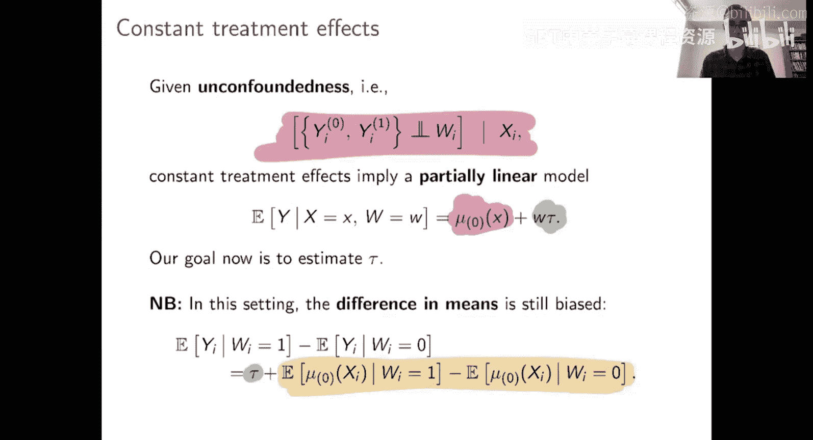

当我们有这个恒定处理效应模型时，我们也可以像往常一样假设无混杂性。无混杂性加上恒定处理效应模型意味着，给定 **X** 和 **W** 时 **Y** 的条件期望可以分解如下：

**E[Y | X, W] = μ₀(X) + τ * W**

其中：
*   **μ₀(X)** 是基线效应，即给定 **X** 时的期望控制潜在结果，它可能随 **X** 变化。
*   **τ** 是恒定的处理效应，是我们想要估计的目标。

这种部分线性模型的表述方式很好，因为它能让你清楚地看到发生了什么。你也可以用它来很好地提醒为什么估计 **τ** 并不容易。

你可能会想，是否可以通过简单地计算处理组结果的平均值减去控制组结果的平均值来估计 **τ**？因为所有处理组的个体的结果都增加了 **τ**。但如果你这样做，你确实会得到 **τ**，但你还会得到这里的第二个偏差项。这个偏差项本质上是：被选择进入处理组的人群的期望基线效应，与被选择进入控制组的人群的期望基线效应之间的差异。如果你不在随机试验中，这个偏差项通常不为零。因此，要鲁棒地应对这种情况，就是为什么估计 **τ** 是一个非平凡问题的原因。

## 罗宾逊变换

我们该怎么做呢？由恒定处理效应模型引发的这个问题通常被称为**部分线性模型**。为什么是“部分”线性？因为项 **W * τ** 看起来像线性回归中的项：在回归中，你有一个处理指示变量 **W**，它得到一个系数 **τ**。这部分是线性的。但你还有基线效应 **μ₀(X)**，它如何依赖于 **X** 是非线性的。如果我们用类似 **Xβ** 的东西替换 **μ₀(X)**，即假设基线效应在 **X** 上是线性的，那么我们就会得到一个完全的线性模型。部分线性模型的作用是，它让问题的这个部分（基线效应）保持非参数形式，但仍然保留了处理效应部分的线性结构。所以这是我们想要解决的问题，它通常也被称为**半参数问题**，因为处理效应部分（**τ**）是参数（单个参数），而基线效应部分（**μ₀(X)**）是非参数的，被称为**干扰项**。我们之所以称其为干扰项，是因为我们需要估计它，但我们不一定对它本身感兴趣。所以我们有一个非参数的干扰项和一个参数化的目标。

那么，我们如何估计 **τ** 呢？任何带有这种非参数成分的半参数问题本质上都需要一些技巧来处理估计。但这里，事实证明有一个非常巧妙的解决方案，它始于所谓的**罗宾逊变换**。

其思想是，首先定义这些辅助量：
1.  **e(X) = E[W | X]**：我们的老朋友，倾向得分。正如前面提到的，倾向得分在帮助你实现混杂鲁棒性方面起着关键作用，所以在这里倾向得分回归了。
2.  **m(X) = E[Y | X]**：这个量不那么常用，但很容易解释。这是在忽略处理状态的情况下，仅根据 **X** 对 **Y** 的最佳猜测。在部分线性模型中，**m(X) = μ₀(X) + τ * e(X)**。

利用这个符号，你可以简单地从原始表达式两边减去 **m(X)**。然后你会看到：

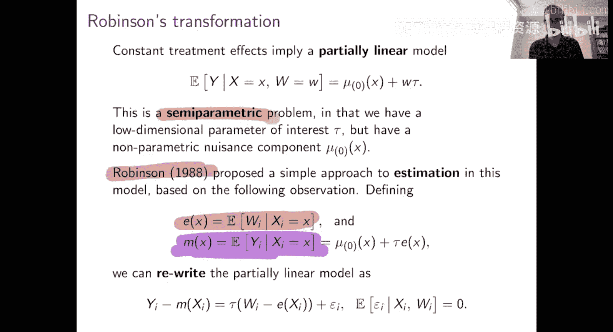

**Y - m(X) = τ * (W - e(X)) + ε**

其中 **ε** 本质上是 **Y** 与其给定 **X** 和 **W** 的条件期望之间的差。关键是，我们知道 **E[ε | X, W] = 0**。

通过这种方式重写问题，我们本质上什么也没做，但我们从中得到了一些非常有用的见解。假设你实际上知道 **m(X)** 和 **e(X)**，那么你如何估计 **τ**？这非常简单：只需运行一个单变量线性回归。你的响应变量是差值 **Y - m(X)**，你的单个回归变量是变量 **W - e(X)**，那么 **τ** 就是通过将 **Y - m(X)** 对 **W - e(X)** 进行回归得到的回归系数。

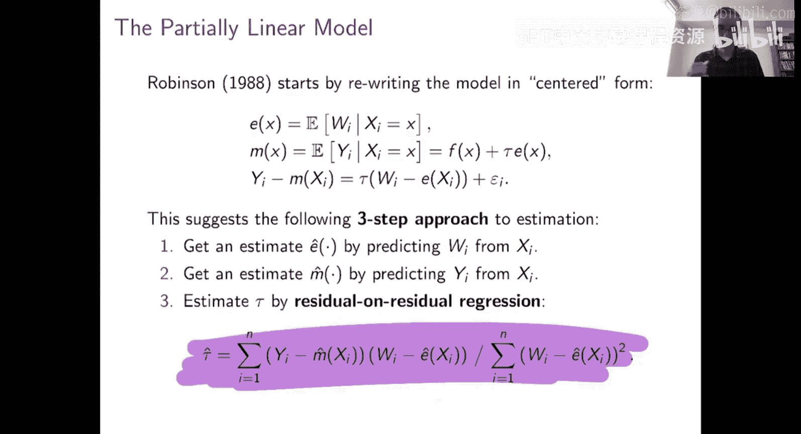

如果你知道 **m** 和 **e**，那么这种方法将为你提供一个一致且渐近正态的估计 **τ** 的方法，并具有标准的推断保证。当然，困难在于，除非你在随机试验中，否则你可能不知道倾向得分 **e**，也肯定不知道这个基线效应 **m**（或者说，忽略处理状态对 **Y** 的最佳猜测函数 **m**）。你无法直接应用这个策略。

## 实用算法：残差对残差回归

但这仍然暗示了一个实用的算法。如果我们知道在已知 **m** 和 **e** 的情况下该怎么做，只是我们不知道它们，那么你可以希望我们有一些机器学习黑箱来解决这里的预测问题（从 **X** 预测 **W** 和 **Y**）。这些都是基本的预测问题，所以我们可以通过扔一个预测黑箱来估计 **ê** 和 **m̂**。然后，如果我们用估计的 **m̂** 和 **ê** 项代入上面的公式，我们就可以通过残差对残差回归来估计 **τ**。如果我们在这里插入了真实的 **m** 和 **e** 项，根据罗宾逊变换，这将立即给你一个 **τ** 的良好估计。这里我们必须估计 **m** 和 **e**，但你可能会希望这仍然能至少相当好地工作。

它有多好？仅从这个写法来看并不清楚，但立即清楚的是，如果 **m̂** 和 **ê** 是一致的，那么 **τ̂** 对于恒定处理效应也应该是一致的。另外需要注意的是，我在这里写的表达式，只是这个单变量线性回归问题的闭式解。

这个紫色的东西意思就是：运行 **Y - m̂** 对 **W - ê** 的单变量回归。

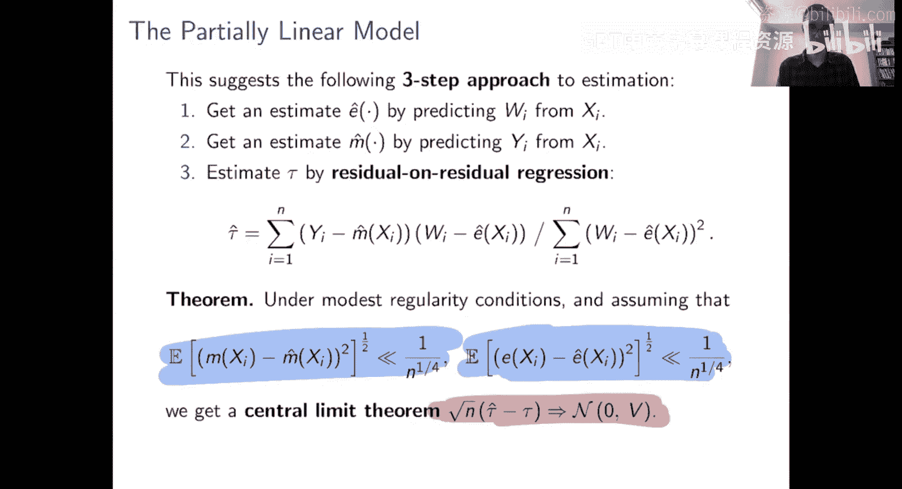

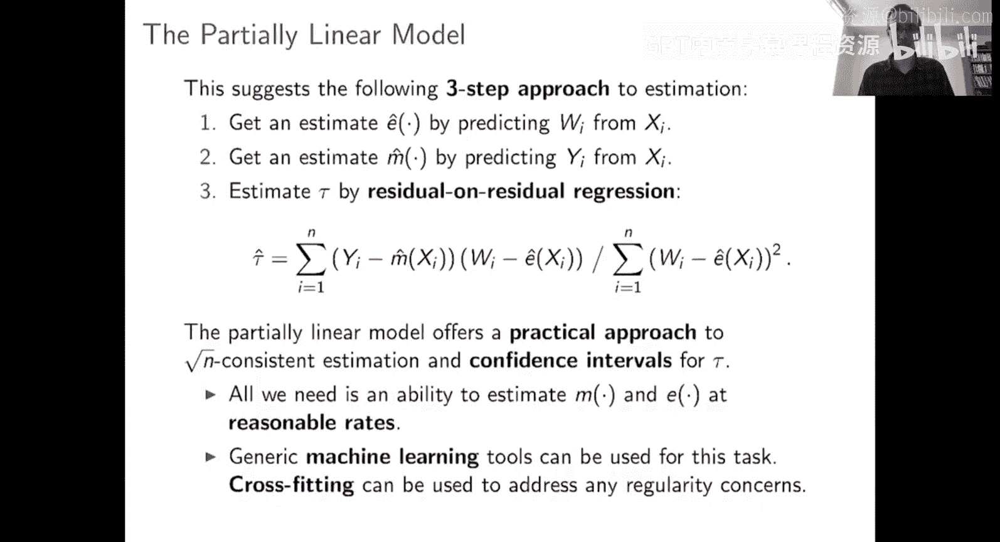

## 理论保证

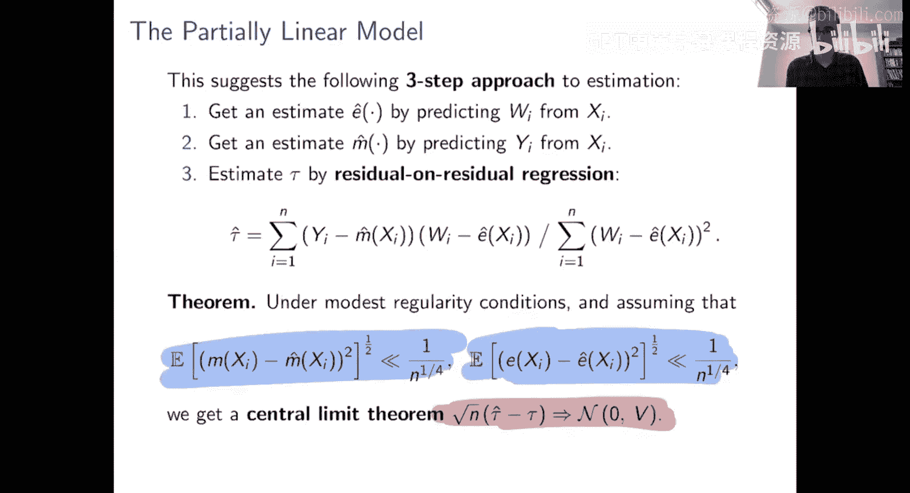

显然这是一致的，但它好吗？如果不好我就不会告诉你了。我们得到了一个关于 **τ̂** 渐近性质的非常好的结果。这应该让我们想起第二周看到的使用 AIPW 估计平均处理效应的结果。

其保证如下。最终结果是我们想要的：即恒定处理效应的中心极限定理，其误差以 **1/√n** 的速率衰减。这意味着当我们用 **√n** 放大误差时，我们会得到一个极限正态随机变量，这正是我们想要的。条件是什么？条件再次是这些 **m̂** 和 **ê** 估计量。它们不需要完美，但需要相当准确，不过它们不需要达到 **1/√n** 尺度的精度。

就像我在第二周强调的，每当你在因果推断中使用机器学习方法时，可以假设它们相当准确，但绝不应该假设它们是完美的。这里的这个保证正是我们喜欢的那种：在步骤 1 和 2 中，当我们向问题扔机器学习黑箱来估计 **m̂** 和 **ê** 时，我们需要它们在相当准确的意义上取得成功，但不一定是完美的。我再次强调这个结果的违反直觉性：你可能会认为存在“垃圾进，垃圾出”的原则，如果你必须估计 **m̂** 和 **ê** 项，并且这些 **m̂** 和 **ê** 有某种误差尺度，那么 **τ̂** 不可能比这些你代入表达式的估计量更准确。但这个定理告诉你，“垃圾进，垃圾出”的原则在这里不成立。你被允许拥有典型误差在 **n^{-1/4}** 量级的估计量（这是一个相当大的误差尺度），然而，就像 AIPW 估计量一样，误差会以恰到好处的方式抵消。所以实际上，即使这些估计量可能有 **n^{-1/4}** 尺度的误差，**τ̂** 在 **1/√n** 尺度上将是准确的，因此它将比干扰项估计量精确一个数量级。

在细节方面，条件本质上与 AIPW 所需的条件相同。这里我说需要一些适度的正则条件。

这些正则条件是什么？事实证明，只要你使用交叉拟合，你基本上可以忽略任何进入那里的正则条件。所以设置本质上是：我需要运行这个估计量。

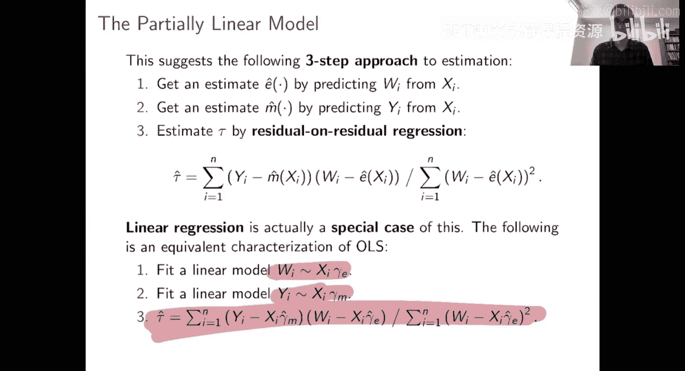

获取 **m̂** 和 **ê**，使用交叉拟合（就像第二周那样），然后只要 **m̂** 和 **ê** 相当准确，你就会得到你想要的 **τ̂** 的中心极限定理。我现在不打算讨论它，但你可以从这个残差对残差回归中得到置信区间，就像你通常从这类回归中得到置信区间一样。这个定理本质上告诉你，只要你使用交叉拟合，在构建置信区间时，你可以忽略 **m̂** 和 **ê** 的任何抽样误差（只要定理条件成立）。这为你提供了一种构建置信区间的非常简单的方法。

## 与线性回归的联系

接下来，这是一个题外话，但只是为了连接一些点。如果你觉得这种估计恒定处理效应的方式有点奇怪或不寻常，我想试着说服你它并不奇怪。我只想把它与一个希望是熟悉的估计量联系起来，那就是线性回归估计量，即标准的线性回归估计处理效应的方法。你通常的做法是运行线性回归：**Y ~ X + W**（用 R 的符号表示，即用 **X** 和 **W** 的线性函数预测 **Y**），然后取 **W** 的系数作为你的处理效应估计。

如果你上过基于线性代数的线性回归课程，你可能知道线性回归有以下等价特征：要估计在控制 **X** 的情况下 **W** 对 **Y** 的系数，你可以如下构建该系数：首先，拟合 **W** 对 **X** 的线性模型；然后，拟合 **Y** 对 **X** 的线性模型；那么，在完整的用 **X** 和 **W** 预测 **Y** 的回归中，**W** 的系数将涉及一个残差对残差的回归，即你将 **Y** 相对于从 **X** 对 **Y** 的最佳预测的残差，对 **W** 相对于从 **X** 对 **W** 的最佳预测的残差进行回归。

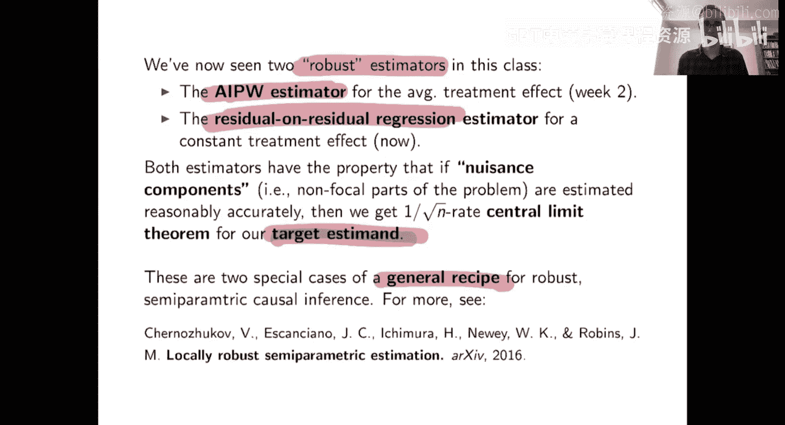

因此，这实际上表明，在算法上，线性回归只是这种基于罗宾逊变换的估计量的一个特例，其中我们没有使用机器学习方法来估计 **ê** 和 **m̂**，而只是使用线性回归来从 **X** 预测 **Y** 和从 **X** 预测 **W**。关于这个联系有很多可以说的，你可以从多个角度研究它。但至少，我希望这个联系表明，基于罗宾逊变换的这个估计量是一种非常自然的方式，可以超越线性回归，至少在你想要保留恒定处理效应假设的设定下。这样你仍然有一个像恒定处理效应参数的东西，你可以希望使用类似线性回归推广的方法来瞄准它。

## 总结与比较

所以，这就是如何在无混杂性假设下，以对混杂因素鲁棒的方式估计恒定处理效应。根据我的经验，这是一个非常好的估计量，我推荐使用。从更大的图景来看，我们现在已经看到了两种不同的混杂鲁棒估计量：第二周看到的 AIPW 估计量，以及基于罗宾逊变换的用于恒定处理效应的残差对残差回归估计量。这两种估计量都具有非常相似的性质：我们都在无混杂性或无未测量混杂假设下工作，然后我们最终进入这种半参数类型的设定，其中我们有一个低维的兴趣对象（要么是平均处理效应，要么是恒定处理效应参数），我们也有非参数的干扰成分（基线效应和倾向得分）。这些估计量的共同属性是，它们都从基于机器学习的干扰成分估计开始，并且只要这些估计相当准确，那么你对你真正关心的东西就会得到一个 **1/√n** 速率的中心极限定理。这就是我要说的全部，除了推荐使用这两种估计量。对于那些想深入了解的人，我应该强调，这两者都是一个更通用方法的特例。如果你想了解更多，Chernozhukov 等人的论文对这类估计量为何以及如何具有这些性质有更多论述。

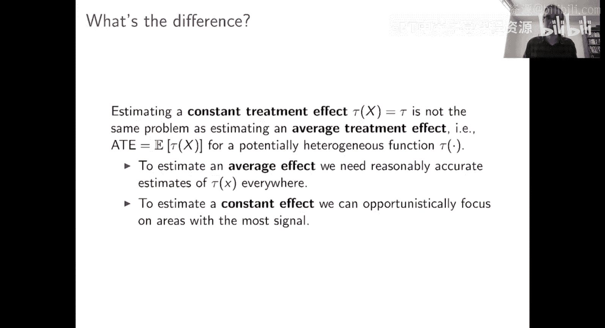

## 恒定处理效应与平均处理效应估计的对比

关于估计恒定处理效应，我想说的最后一件事，这更像是一个题外话。但我想澄清一下：你们中的一些人可能会感到困惑。我们谈论估计平均处理效应，也谈论估计恒定处理效应，这是怎么回事？它们看起来是非常相似的估计问题，为什么会有区别？

为了理解其中的区别，考虑一个问题：你有一个相当大的 **X** 空间，然后你在 **X** 空间中有一些区域很容易估计处理效应（比如处理组和对照组有很好的平衡，两种类型的个体都很多），而 **X** 空间的另一个区域则很难估计处理效应（可能几乎每个人都被分配到对照组，所以我们几乎没有重叠）。在这种设定下，估计恒定处理效应与估计平均处理效应最终会成为非常不同的问题。

如果你想估计平均处理效应，你本质上需要做什么？你需要在这里（容易估计的区域）估计处理效应，也需要在这里（难以估计的区域）估计处理效应，然后取这两个处理效应的平均值。如果在难以估计的区域你的处理效应估计非常不准确，你对此无能为力，你的处理效应估计在所有地方都会不准确。

另一方面，如果我先验地告诉你处理效应在所有地方都是恒定的，那么你基本上可以忽略特征空间中问题太难的部分，只在你实际上有良好信号的、容易估计的区域估计你的恒定处理效应，然后直接外推它。这使得问题变得好处理得多。

为了在一个例子中看到这一点，这里有一个简单的模拟。关键部分是：首先，处理效应是恒定的，处处都是 0.3。所以，如果你知道处理效应是恒定的，你可以直接运行恒定处理效应的方法。但如果你不知道处理效应在所有地方都是恒定的，并且你想估计平均处理效应，那么你会做别的事情。为什么当你不知道处理效应是恒定的、并且必须处处估计处理效应然后聚合它们时，这个问题更难？你可以通过根据倾向得分将问题分成三个区域来看到这一点。

这里倾向得分依赖于 **X₃**。有些个体，倾向得分非常小，这些人大多数接受控制；特征空间有些区域大多数人接受处理，倾向得分接近 1；中间区域倾向得分远离 0 和 1，这是一个有良好重叠的区域，是我们喜欢估计的类型。所以，如果你想用平均处理效应的方法来估计，你本质上必须分别在这三个区域估计处理效应。在难以估计的区域（几乎都是对照组，几乎没有处理组个体），你几乎没有关于处理效应实际是什么的信息。中间区域你有良好的重叠，所以估计处理效应很容易。同样，在另一个难以估计的区域（大多数人接受处理，很少有对照组），估计处理效应也很困难。平均处理效应方法必须做的是，然后聚合这些区域的处理效应估计，其中大部分来自这两个难以估计处理效应的区域。因此，这些处理效应估计可能非常不准确，而来自这个容易区域的更准确的估计，但你在困难区域积累的任何不准确性都会累加起来。

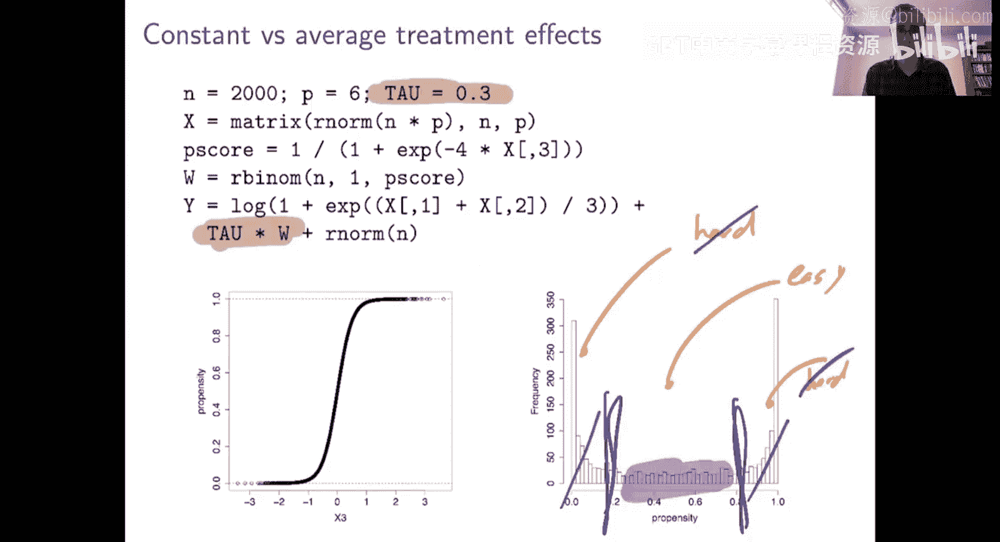

另一方面，如果你估计恒定处理效应，你基本上不关心这两个困难区域，你实际上把这些数据扔掉，你只关注数据中你有良好重叠并且可以准确估计处理效应的部分，你在那里学习处理效应是什么，你就不担心问题的其余部分。当然，这只是对方法做什么的一个定性描述，但在实践中，这种直觉也贯穿于实际发生的情况。

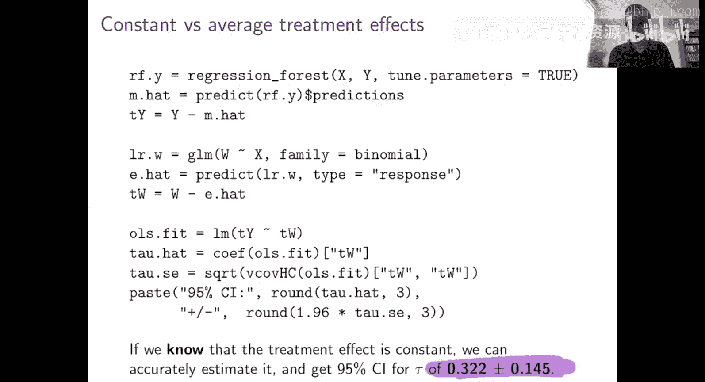

## 数值结果

那么数字看起来怎么样？像往常一样，我给你们一点代码，你可以复制粘贴。这段代码实现了通过残差对残差回归估计恒定处理效应，并带有异方差稳健的标准误。如果你这样做，你会得到：记住，真实的恒定处理效应是 0.3。如果你的 95% 置信区间是 0.3 ± 0.05，这就非常好。

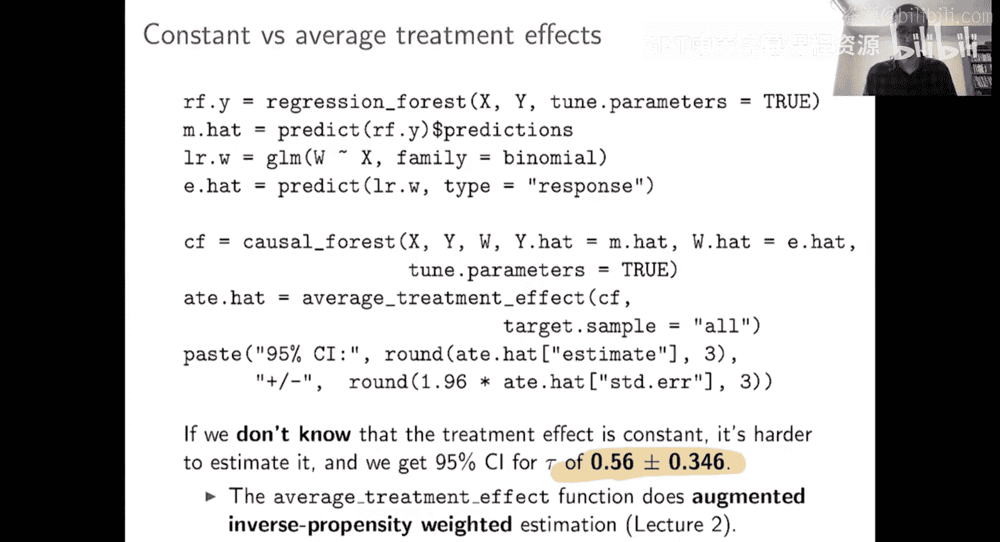

如果你不知道你的处理效应是先验恒定的，所以你不得不使用一个平均处理效应估计方法，该方法聚合来自所有地方（包括困难区域）的数据，然后尝试综合，那么你从这个方法中得到的处理效应估计将非常不准确。这里我们得到 0.56 ± 0.35。点估计不那么准确，置信区间也更宽。这突显了平均处理效应估计问题比恒定处理效应估计问题更难的程度。

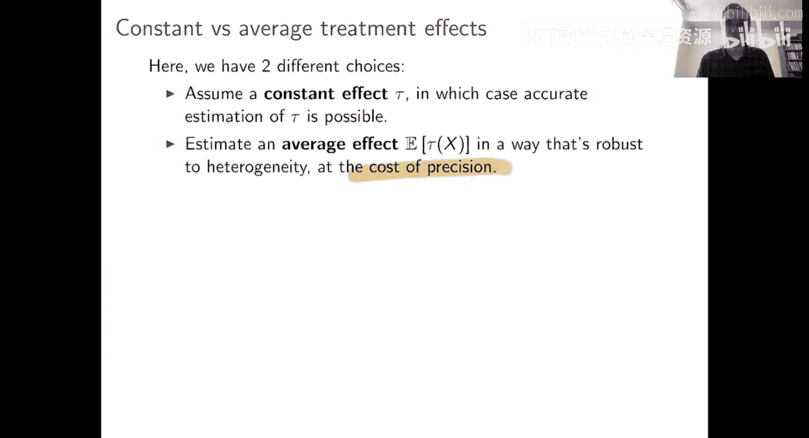

## 权衡与应用思考

对于那些从应用角度思考问题的人来说，你可能对这里的权衡很敏感。在这个问题中，处理效应实际上是恒定的，但作为分析师，你有两种策略：你可以假设处理效应是恒定的（从理论中主张知识，但不用数据验证），如果你愿意主张恒定处理效应，那么你可以非常准确地估计恒定处理效应；或者你可以采取一种更不可知论的方法，你不从假设处理效应恒定开始，你允许异质性，然后你想估计这个 **τ(x)** 函数的平均值。后一种方式更稳健，你可能喜欢这样做，因为它不需要先验地断言处理效应是恒定的。但在这里你看到，这样做在精度上付出了巨大的代价。

这是一个棘手的权衡。如果你对这个权衡感兴趣，那么一个非常重要的问题是：如果你认为处理效应是恒定的，所以你运行我们的残差对残差估计量来估计恒定处理效应，但实际上存在处理效应异质性（即不存在一个应该被称为处理效应参数的东西），会发生什么？如果你只是运行这个在恒定处理效应设定下被证明合理、但在 **τ(x)** 不是常数的设定下的估计量，你会得到什么？你最终得到的东西实际上非常好：如果你假设了一个恒定处理效应，但实际上存在异质性，那么恒定处理效应估计量将收敛到我在这里称为 **τ_E** 的东西。这是平均处理效应的一个加权版本，其中特征空间的不同部分根据 **e(X) * (1 - e(X))** 进行加权。也就是说，倾向得分更接近 0 和 1 之间中间值的特征空间区域被赋予更多权重，而倾向得分非常接近 0 或 1 的区域被赋予更少的权重。实际上，你可以验证，在所有加权的平均处理效应中，这个 **τ_E** 是你在具有这种倾向得分的同方差模型下可以以最佳精度估计的加权平均处理效应。

无论如何，如果你对这东西感兴趣，这是一个可以深入探索的兔子洞。但关键是，在文献中，你可以用两种方式来证明罗宾逊方法的合理性：它可以是一种非常字面地接受“处理效应是恒定的”假设，然后试图以有效的方式估计那个 **τ** 的方法；或者你可以放宽假设，你可以说你本质上认为处理效应几乎是恒定的，给定这些假设，你将运行这个方法，你认识到处理效应存在一些异质性，而你得到的东西实际上是处理效应的一个加权平均。但如果处理效应足够接近恒定，那么这个加权处理效应可能足够接近你关心的东西，你就可以放宽心使用那个估计量。

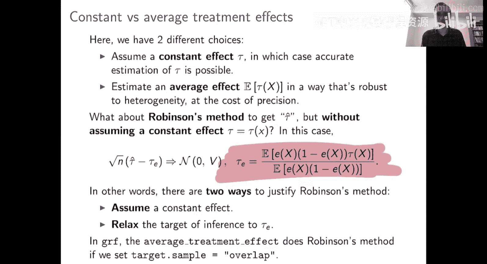

## 本节课总结

在本节课中，我们一起学习了如何为估计异质性处理效应构建混杂鲁棒的方法。我们从回顾如何鲁棒地估计恒定处理效应开始，这是构建更复杂模型（如决策树）的基础。我们深入探讨了部分线性模型和强大的罗宾逊变换，它允许我们通过残差对残差回归来估计处理效应，即使我们使用机器学习方法估计了干扰函数（倾向得分和基线响应）。我们看到了这种方法具有优秀的理论性质，只要干扰函数估计足够准确，我们就能得到处理效应参数的一致且渐近正态的估计。最后，我们比较了恒定处理效应估计与平均处理效应估计的差异，理解了前者在存在先验恒定假设时可以带来更高的估计精度，并讨论了当假设不成立时估计量的实际含义。