#  015：混杂效应稳健的森林方法

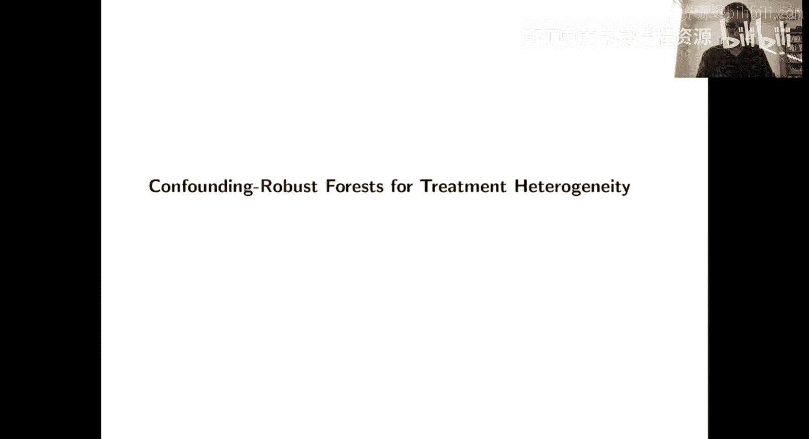

在本节课中，我们将学习如何利用罗宾逊变换来开发一种森林算法，用于在观察性研究中估计异质性处理效应。

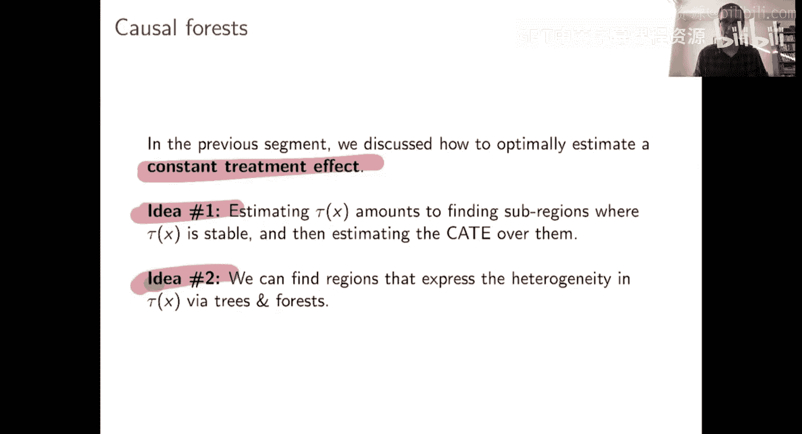

上一节我们介绍了罗宾逊变换，本节中我们来看看如何将其与随机森林的思想结合，构建一个能够同时应对混杂偏倚和正则化偏倚的稳健估计器。

## 从简单估计器开始：问题与挑战

首先，我们从一个非常简单的异质性处理效应估计器开始，看看它会遇到什么问题，以及我们已学的概念如何解决这些问题。

假设我们只想估计在特定点 `x` 处的处理效应 `τ(x)`。一个简单的方法是：以 `x` 为中心画一个半径为 `δ` 的圆，这个圆包含了我们认为与估计 `x` 处处理效应相关的一组代表性个体。然后，在这个圆内应用均值差估计器。

具体公式如下：
`τ̂(x) = (1/N_t) * Σ_{i in circle, W_i=1} Y_i - (1/N_c) * Σ_{i in circle, W_i=0} Y_i`

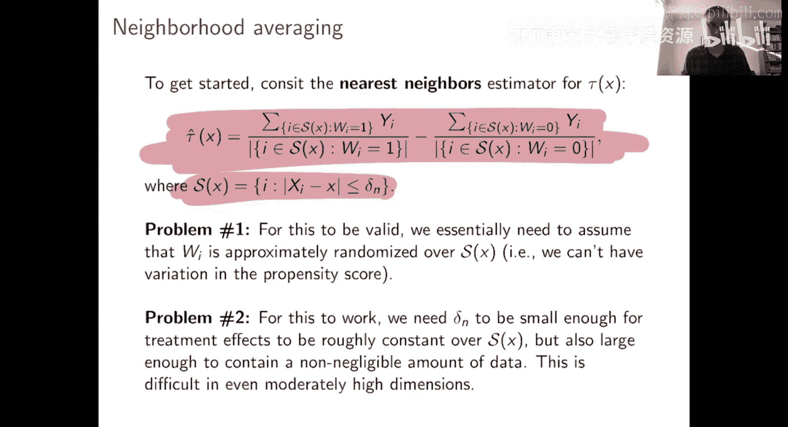

这个估计器虽然一致，但存在两个主要问题：

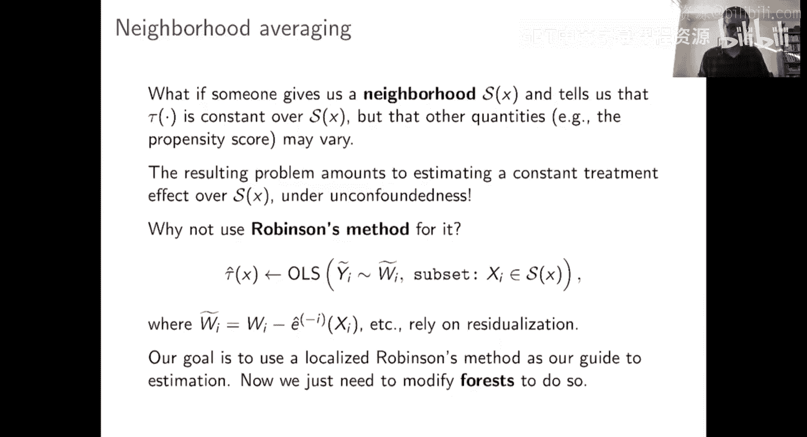

1.  **混杂偏倚问题**：这是一个均值差估计。在随机试验中它表现良好，但在观察性研究中，当倾向得分 `e(x)` 变化时，如果倾向得分的变化与基线结果 `m(x)` 的变化相关，就会导致偏倚。要使此方法有效，需要这个邻域足够小，以至于其中的数据看起来像是来自随机试验。
2.  **维度灾难与代表性难题**：为了使邻域 `S(x)` 包含与估计 `x` 处处理效应相关的个体，半径 `δ` 需要足够小，以排除不相关的个体。但同时，`δ` 又需要足够大，以确保邻域内有足够多的样本使估计稳定。在中等或高维空间中，这成为一个不可能解决的问题。

简而言之，第一个问题可以通过罗宾逊变换解决，第二个问题则可以通过森林的几何结构和构建方式来解决。

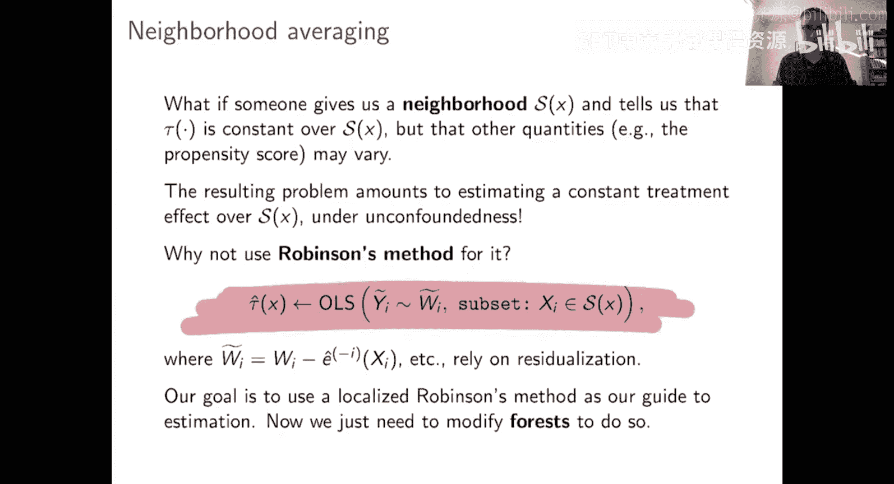

## 解决混杂偏倚：应用罗宾逊变换

让我们暂时忽略第二个代表性问题，专注于均值差估计器如何处理混杂偏倚。

假设有人告诉你，邻域 `S(x)` 实际上很好，其中的每个个体都具有相同的处理效应 `τ`，并且有足够多的数据。你唯一担心的是混杂偏倚，即该邻域内某些个体比其他人更可能接受处理。

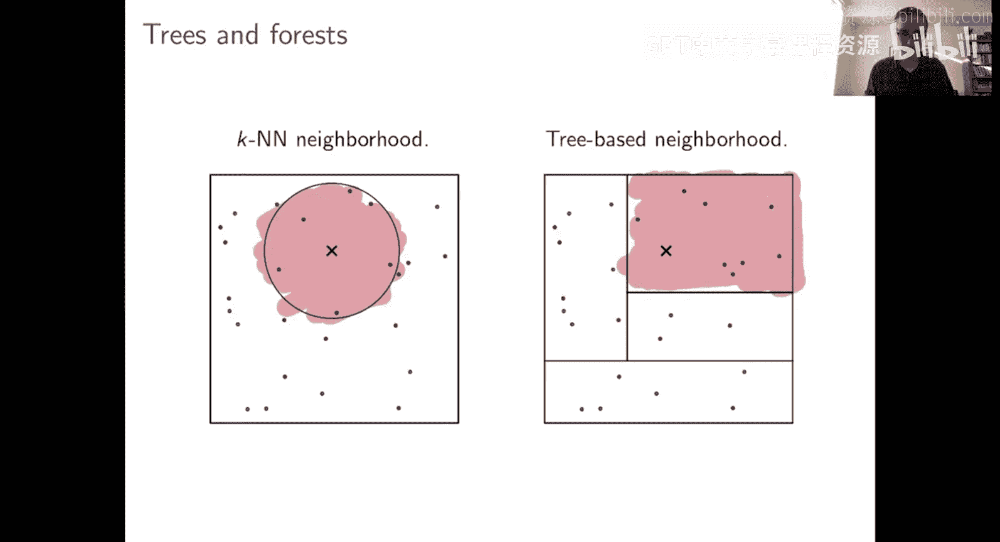

现在我们知道该怎么做：对于一个具有恒定处理效应但倾向得分可变的数据集，在无混淆条件下，我们可以使用罗宾逊方法来估计这个恒定处理效应。

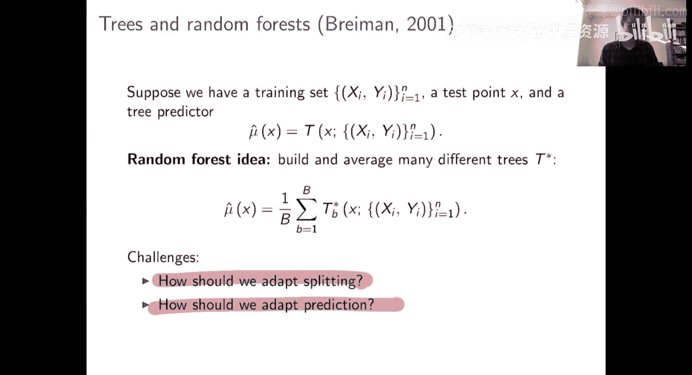

因此，我们将首先筛选出仅位于邻域 `S(x)` 内的数据，然后使用罗宾逊方法（残差对残差回归）来估计该邻域内的恒定处理效应。

核心步骤如下：
1.  在邻域 `S(x)` 内，使用机器学习模型估计 `m̂(x)` 和 `ê(x)`。
2.  计算结果残差 `Ỹ_i = Y_i - m̂(X_i)` 和处理残差 `W̃_i = W_i - ê(X_i)`。
3.  在邻域内，通过 `W̃_i` 对 `Ỹ_i` 进行回归（通常无截距）来估计 `τ`。公式为：
    `τ̂ = (Σ_{i in S(x)} W̃_i * Ỹ_i) / (Σ_{i in S(x)} W̃_i^2)`

这解决了混杂偏倚问题。接下来的问题是：我们如何设计这个用于估计恒定处理效应的邻域？能否比简单地画一个圆做得更好？

## 解决维度灾难：使用树与森林

这里的核心思想是使用树。简单的最近邻估计器（画圆）在二维空间中可能合理，但在中等或高维空间中，为了包含任何邻域，圆的半径必须非常大，而大半径内的个体与你就不再相似了。

树将以数据自适应的方式，使用轴对齐分割将特征空间切分成块。为了预测点 `x`，你将考虑 `x` 所在矩形（叶节点）内的数据作为其邻域。

在二维空间中，这可能看起来很像 K 近邻。但树的优势在于：如果你有一些非常重要的特征和其他不太重要的特征，那么树形成的邻域（矩形）可以在重要的方向上非常窄（从而对那里的变化非常敏感），而忽略不重要的维度。这使得它们能在不耗尽数据的情况下，获得更具代表性的邻域来估计 `τ(x)`。

随机森林则取许多这样的树所做的预测，并对其进行平均。

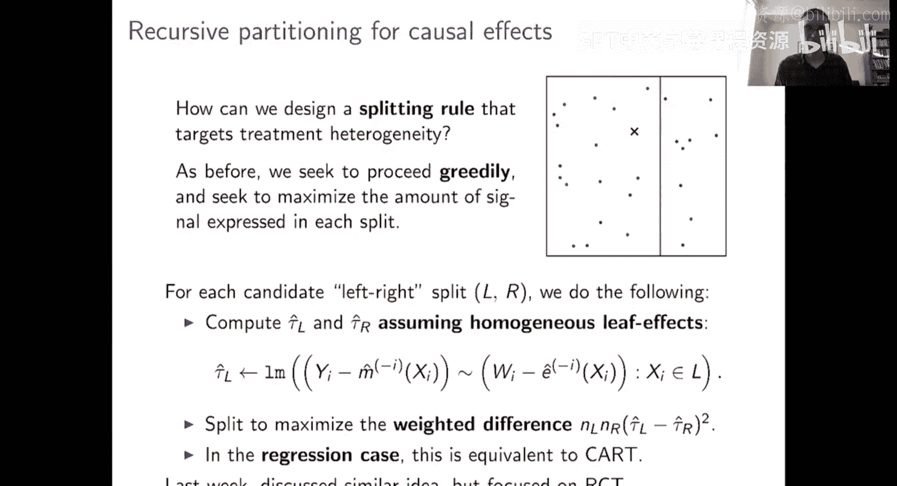

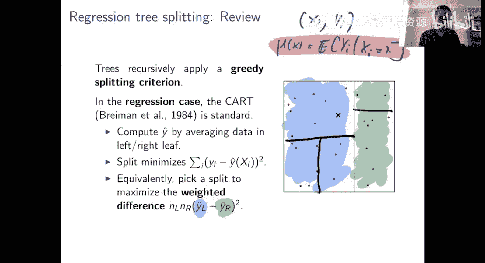

## 构建因果森林：调整分裂与预测

我们的挑战在于，标准的随机森林算法用于从 `X` 预测 `Y` 有两个关键部分：分裂和通过平均树进行预测。我们需要对其进行调整。

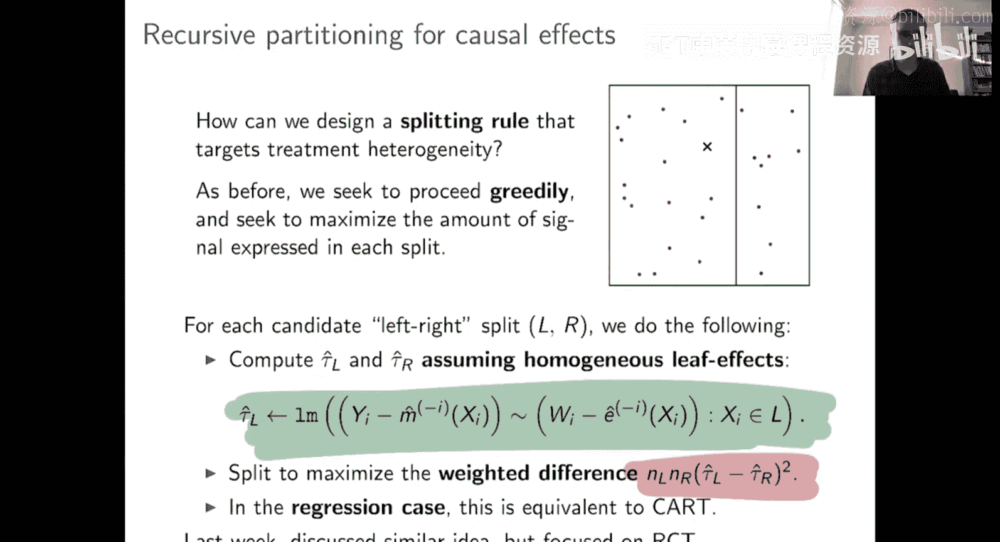

第一个问题：如何调整分裂规则，以设计出能够优化表达处理效应异质性的树？
第二个问题：如何调整预测步骤，使得一旦我们有了许多树的森林几何结构，就能得到合理的 `τ(x)` 估计？

### 调整分裂规则

首先，回顾回归树如何进行分裂。假设我们想估计 `μ(x) = E[Y | X=x]`。回归树通过扫描所有轴，想象将整个特征空间分成左右两半，并分别对左右数据拟合模型。在叶节点中，模型就是该节点内结果的平均值 `Ŷ`。

回归树选择能优化平方误差损失准则的分割。可以证明，这等价于最大化以下数量：
`(Ŷ_left - Ŷ_right)^2 * (N_left * N_right)`
即，它希望找到一个能均匀分割特征空间，且左右两侧平均值差异很大的分割点。

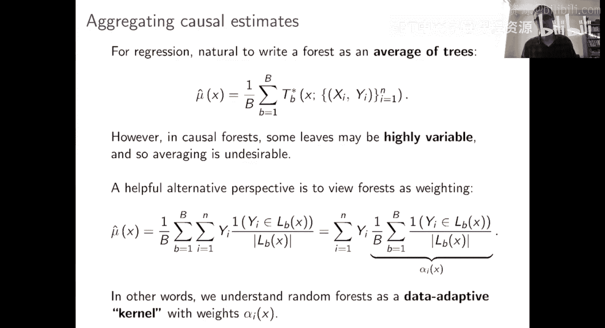

对于处理效应估计树，我们可以几乎逐字沿用回归树的结构：进行轴对齐分割、递归分割。唯一需要改变的是**分割准则**。

我们将采用完全相同的目标形式，但相关的估计量不再是 `Y` 的期望估计，而是处理效应估计。具体做法是：
1.  对于候选分割，分别在其左右子节点上，使用罗宾逊方法（残差对残差回归）估计处理效应 `τ̂_left` 和 `τ̂_right`。
2.  计算分割准则：
    `(τ̂_left - τ̂_right)^2 * (N_left * N_right)`
选择最大化此准则的分割。

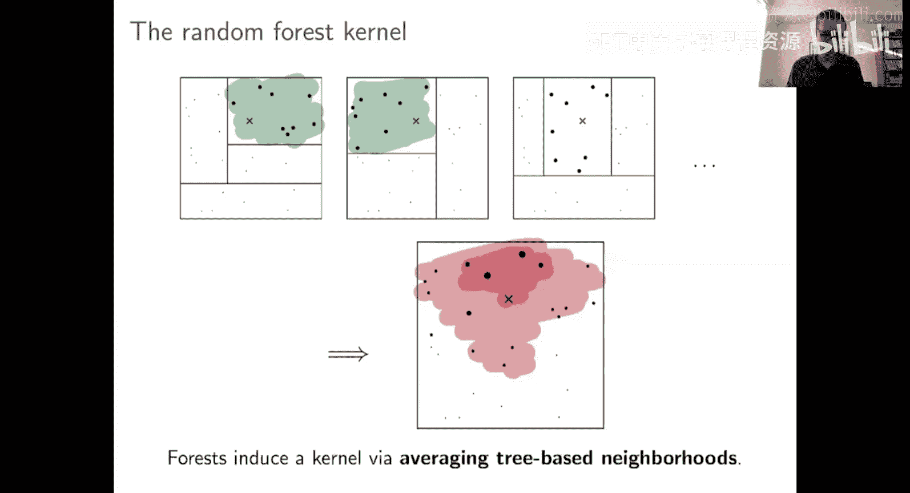

### 调整预测方式：从平均预测到加权估计

预测部分稍微复杂一些。通常，我们认为回归森林是许多树预测的平均值。每棵树对 `x` 的预测是它所在叶节点内结果 `Y_i` 的平均值。

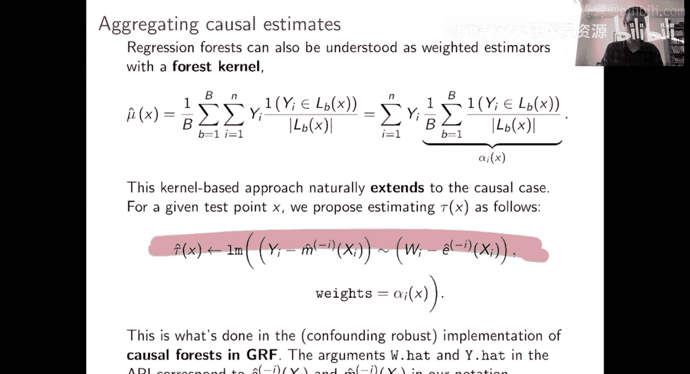

我们可以换一种视角：将森林的预测视为所有样本 `Y_i` 的加权平均，权重为 `α_i(x)`。`α_i(x)` 衡量了第 `i` 个训练样本在预测 `x` 时获得的平均权重，可以将其视为一个数据自适应的核权重，捕获了每个训练样本与 `x` 的相关性。

从图片上看，每棵树为预测 `x` 提供一个常数权重函数（叶节点内样本权重相同，叶节点外为0）。森林通过平均所有这些树的权重函数，得到一个更平滑的权重函数 `α_i(x)`，它刻画了每个训练样本对于预测测试点 `x` 的相关性。这就是“森林邻域”。

采用这种视角后，如何使回归森林适应处理效应估计设置就非常清晰了。

我们如何估计处理效应？答案依然是：残差对残差回归。如果森林给出一组权重 `α_i(x)`，它捕获了每个训练样本 `i` 对于估计 `x` 处处理效应的相关性，那么估计 `x` 处处理效应的自然方法就是运行**加权残差对残差回归**。

具体步骤如下：
1.  使用任何机器学习方法，基于全样本数据获得 `m̂(x)` 和 `ê(x)` 的估计。
2.  计算残差：`Ỹ_i = Y_i - m̂(X_i)`，`W̃_i = W_i - ê(X_i)`。
3.  使用森林权重 `α_i(x)`，通过加权回归估计 `τ(x)`：
    `τ̂(x) = (Σ_i α_i(x) * W̃_i * Ỹ_i) / (Σ_i α_i(x) * W̃_i^2)`

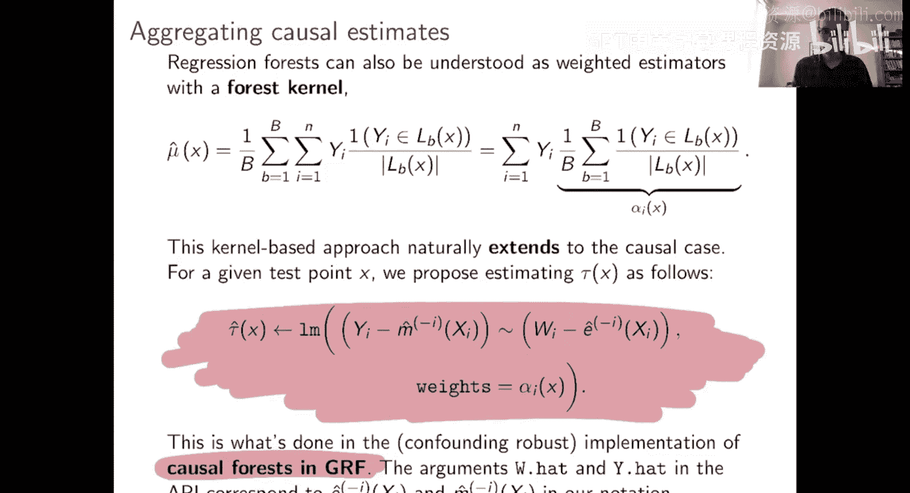

这就解决了我们最初担心的两个问题：
*   我们通过生长森林并从中提取权重 `α_i(x)`，获得了“谁是与估计处理效应相关的邻居”的概念，而不是简单地画一个圆。
*   我们没有使用容易受混杂影响的均值差估计器，而是使用了具有这些权重的残差对残差回归估计器。

## 因果森林实践与性能

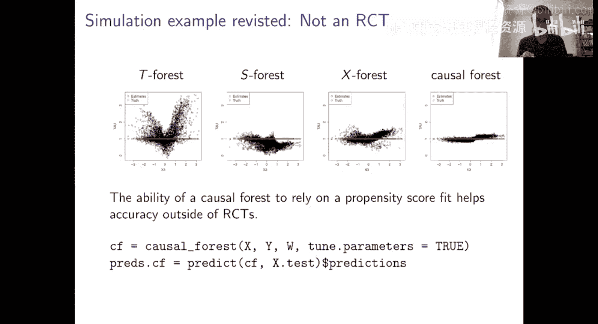

在 `grf` 包的 `causal_forest` 函数中，大致实现了上述过程。需要强调的是，在训练因果森林时，需要预先提供 `m̂(x)` 和 `ê(x)` 的估计（例如通过回归森林得到），并将其作为参数（`Y.hat` 和 `W.hat`）传递给因果森林。因果森林在此基础上进行后续的异质性处理效应估计。

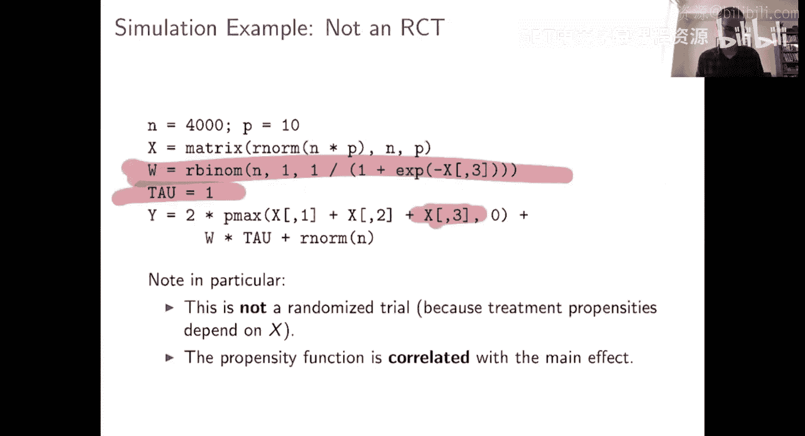

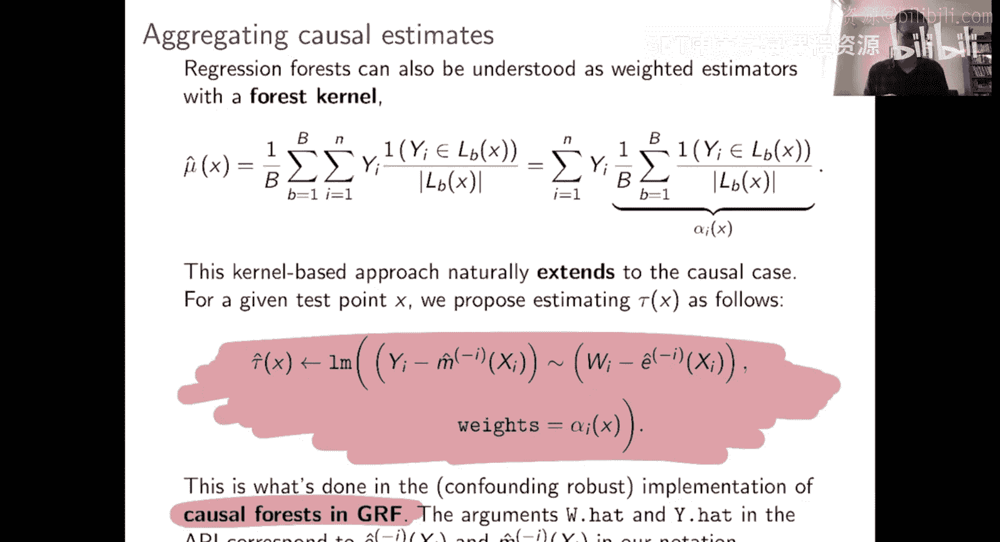

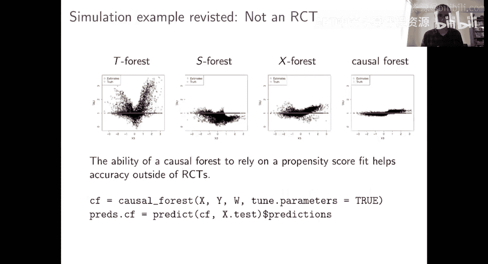

以下是一个性能演示：

在一个处理效应恒定但倾向得分随 `X` 变化的模拟中，之前讨论的某些方法会错误地“幻觉”出处理异质性。而运行因果森林后，估计结果非常接近平坦线，几乎没有幻觉出异质性。虽然并非完美（因为依赖的 `m̂` 和 `ê` 估计并非完美），但表现远优于其他方法。

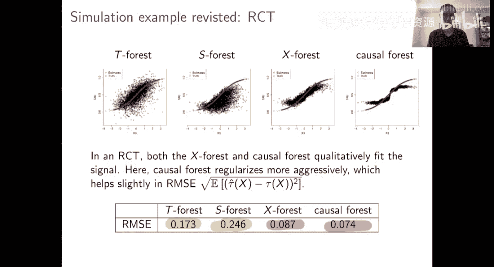

在随机试验的模拟中，因果森林和“X-学习器”森林都表现得很好，能有效避免正则化偏倚。而那些没有考虑正则化偏倚的森林方法则准确性差很多。

## 总结与下节预告

本节课中我们一起学习了如何在观察性研究中估计处理效应异质性。我们讨论了两个需要担心的问题：正则化偏倚和混杂偏倚。

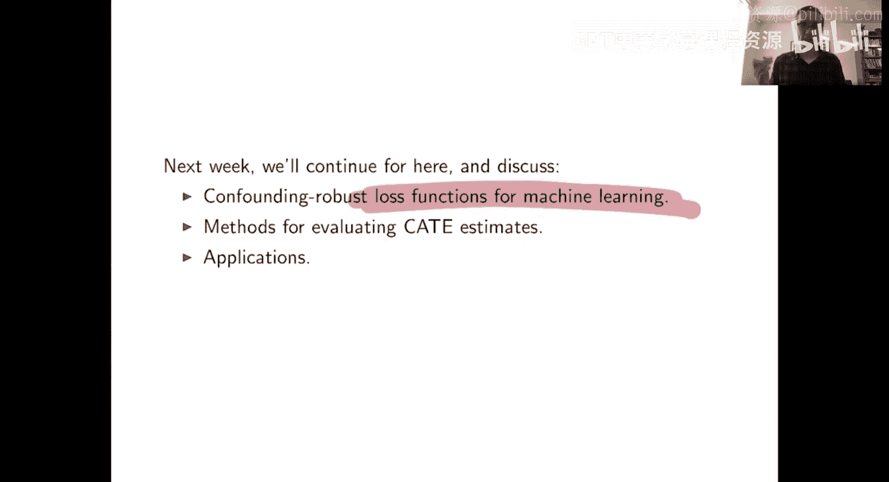

我们讨论了避免正则化偏倚的算法解决方案（如 X-学习器），以及避免混杂偏倚的方法（罗宾逊方法）。最后，我们介绍了一种基于罗宾逊估计器的因果森林算法，用于估计异质性处理效应，它能够同时应对这两种偏倚。

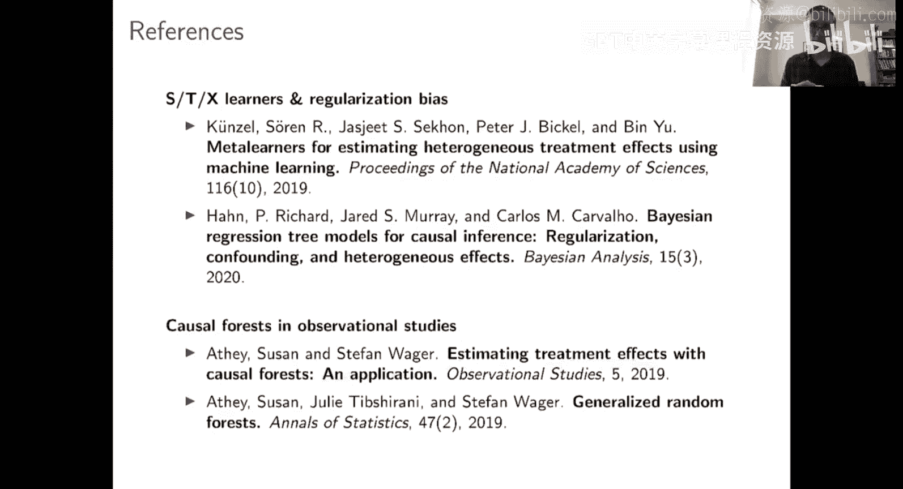

下周，我们将继续这一讨论，看看如何将因果森林算法中使用的混杂稳健原理，应用到更一般的基于损失的机器学习框架中。我们还将讨论如何评估处理效应估计方法的性能，并探讨更多的应用场景。