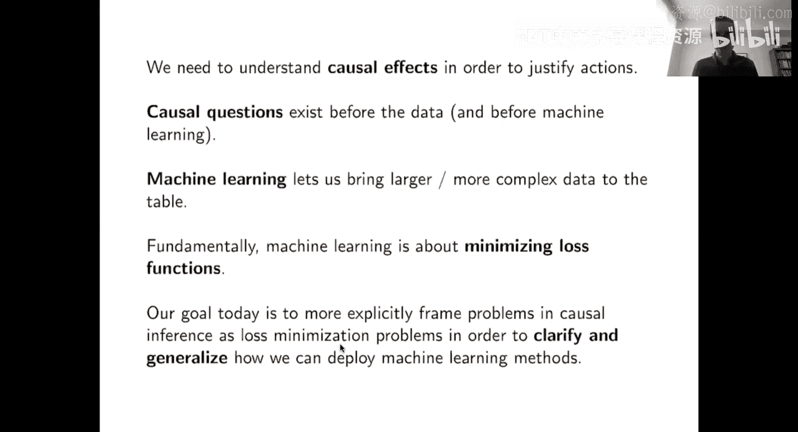
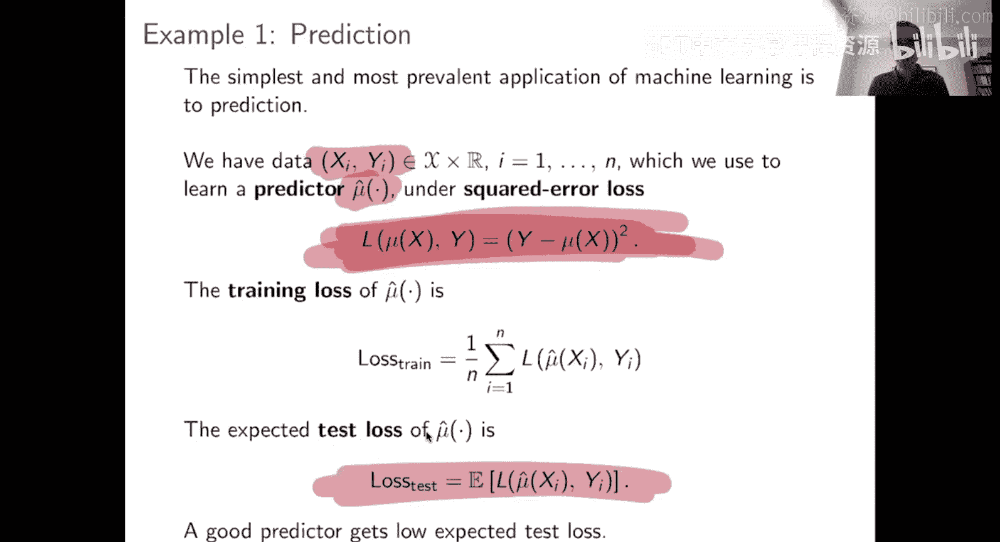
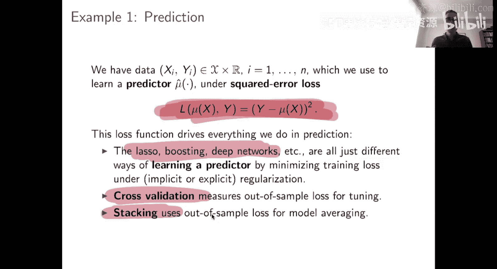
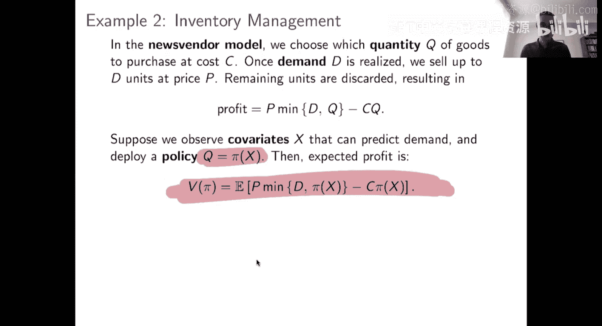
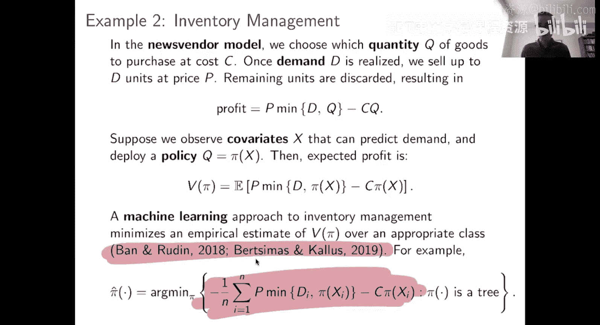
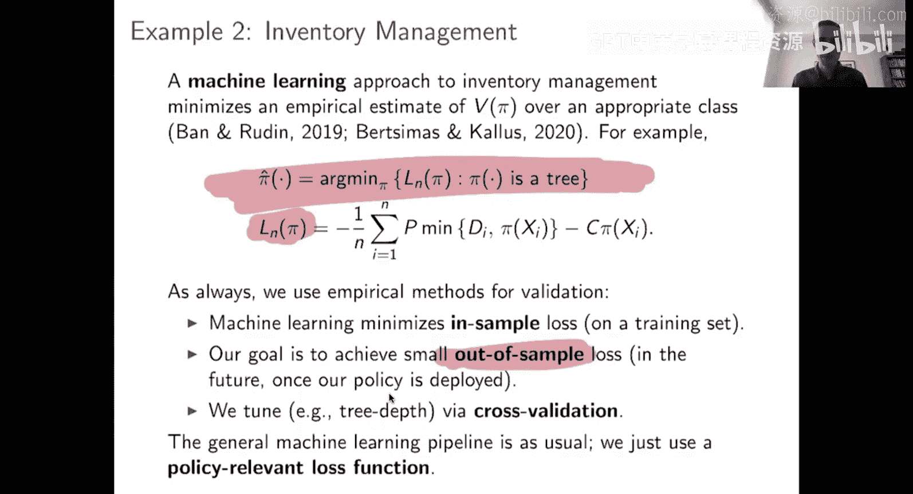
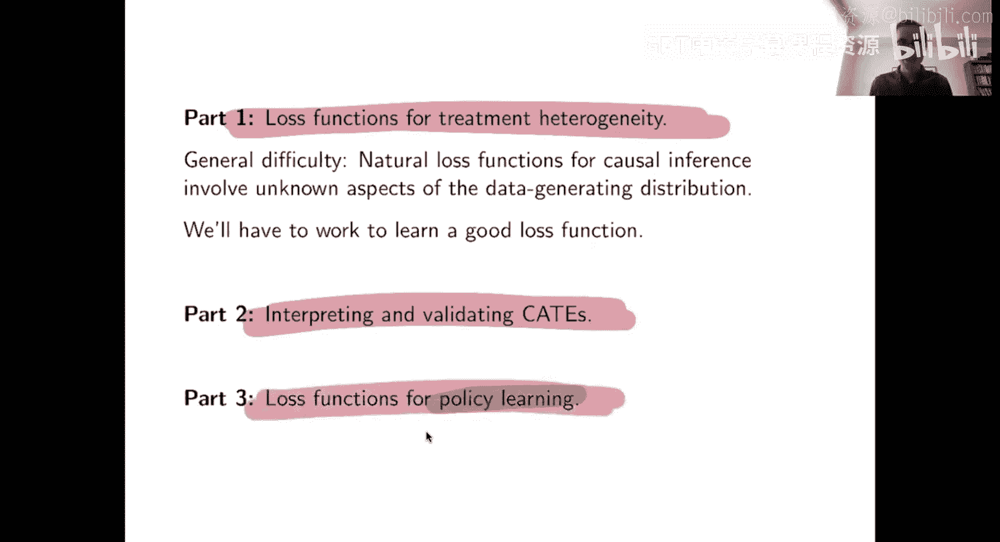

#  016：因果推断的损失函数 🎯

## 概述

在本节课中，我们将学习如何为因果推断问题设计损失函数。我们将从回顾机器学习中基于损失函数的通用视角开始，然后探讨如何将这一视角应用于处理效应估计和政策学习等因果任务。核心在于，一旦我们为特定因果任务定义了合适的损失函数，就可以利用标准的机器学习算法来优化它，从而获得我们想要的因果估计。

---

## 从预测到更广泛的任务：机器学习的损失函数视角

上一讲我们深入探讨了因果推断本身。本节中，我们来看看机器学习的视角。许多人将机器学习等同于预测问题，例如从图像中区分猫和狗。然而，这只是机器学习广阔领域中的一个子集。

一个更通用的机器学习定义包含三个要素：
1.  **任务**：你试图完成的目标。
2.  **损失函数**：衡量任务完成好坏的标准。
3.  **数据**：用于学习如何根据损失函数良好执行任务的算法。

**公式表示**：给定一个模型或策略 `f`，其性能由损失函数 `L(f, data)` 量化。机器学习的目标是找到最小化预期损失的 `f`。

例如，在预测任务中，任务是预测 `Y`，损失函数通常是平方误差 `(Y - \hat{Y})^2`。而在一个完全不同的任务中，比如控制直升机飞行，任务是保持飞行，损失函数可以是坠毁时为1，安全时为0。两者都符合上述框架。

一旦定义了损失函数，后续的步骤（如训练、正则化、交叉验证）就都围绕它展开。这为我们提供了一个强大的模板：将领域知识编码到损失函数中，然后应用机器学习工具。

---

## 热身案例：报童模型 📰

为了理解如何为非预测任务设计损失函数，让我们看一个经典的库存管理问题——报童模型。

假设你经营一个报亭，每天需要决定进货多少份报纸 `Q`。每份报纸成本为 `c`，售价为 `p`。当天的需求是 `D`。你的利润为：
`利润 = p * min(D, Q) - c * Q`
如果进货太少 (`Q < D`)，你会损失潜在销售额；如果进货太多 (`Q > D`)，卖不掉的报纸将浪费成本。

现在，假设你可以观察到一些协变量 `X`（例如天气、是否有重大体育赛事），它们可能影响需求。你的目标是学习一个**策略** `π(X)`，它根据 `X` 决定进货量 `Q`，以最大化期望利润。

**如何将其转化为机器学习问题？**
*   **任务**：根据特征 `X` 决定进货量 `Q`。
*   **损失函数**：负利润 `L = -[p * min(D, Q) - c * Q]`。最小化损失等价于最大化利润。
*   **数据**：历史数据，包含每天的 `X`、实际进货量 `Q`（或可模拟决策）、以及实现的需求 `D`。

遵循这个思路，以下是关键步骤：

1.  **定义策略和价值**：策略 `π(x)` 输出进货量。其价值 `V(π)` 是期望利润。
2.  **构建损失函数**：损失是负利润 `L(π) = -V(π)`。
3.  **应用机器学习算法**：你可以使用任何能最小化经验损失（即历史数据上的平均负利润）的算法来学习 `π(x)`。例如，可以训练回归树，但其分裂标准不再是均方误差，而是直接基于负利润的改进。

通过这种方式，我们将一个商业决策问题完全纳入了机器学习的框架。关键在于设计出能准确反映业务目标的损失函数。

---

## 第一部分：处理效应估计的损失函数 ⚖️

现在，我们将上述思路应用到核心的因果推断问题——估计条件平均处理效应。

回顾一下，CATE 定义为：`τ(x) = E[Y(1) - Y(0) | X = x]`。我们之前讨论的因果森林是一种专门估计 CATE 的算法。本节目标是**提取因果森林有效的核心思想，并将其提炼成一个通用的损失函数**，使得任何机器学习模型都可以通过最小化该损失来估计 CATE。

与预测或报童模型不同，CATE 的损失函数并不显而易见，因为我们永远无法同时观测到同一个体的 `Y(1)` 和 `Y(0)`。我们需要进行设计。

一个有效的起点是考虑基于**伪结果**的平方误差损失。伪结果是一种构造的变量，其条件期望恰好等于 CATE `τ(x)`。例如，一个常用的伪结果基于逆概率加权：
`\tilde{Y} = \frac{W - e(X)}{e(X)(1 - e(X))} * Y`
其中 `W` 是处理指示变量，`e(X)` 是倾向得分。可以证明，`E[\tilde{Y} | X] = τ(X)`。

**因此，我们可以定义以下损失函数**：
如果我们有一个 CATE 估计量 `\hat{τ}(x)`，我们可以计算伪结果 `\tilde{Y}`，然后使用平方误差损失：
`L(\hat{τ}) = E[(\tilde{Y} - \hat{τ}(X))^2]`
通过机器学习算法最小化训练数据上的经验版本的这个损失，我们就可以得到 CATE 估计 `\hat{τ}(x)`。

这种方法的美妙之处在于，它将异质处理效应估计这个因果问题，转化为了一个标准的监督学习问题（用 `X` 预测 `\tilde{Y}`），从而可以调用丰富的机器学习工具箱。

---

## 第二部分：CATE估计的解释与验证 🔍

到目前为止，我们主要关注如何获得CATE估计。本节中，我们来看看如何评估和解释这些估计结果。

仅仅得到一个模型 `\hat{τ}(x)` 是不够的，我们还需要知道它是否可靠、以及从中能学到什么。以下是几种重要的方法：

1.  **分组验证（分组LIFT曲线）**：
    *   将测试集样本根据其估计的CATE `\hat{τ}(x)` 从高到低排序。
    *   分成若干组（例如十分位数组）。
    *   计算每组内实际的实验组与对照组平均结果之差。这个差异是该组“实际观察到的平均处理效应”。
    *   绘制图表：x轴是组别（按预估CATE排序），y轴是该组的实际观测效应。一个良好的估计器，其图表应呈现单调递增趋势。

2.  **最优政策价值评估**：
    *   考虑一个简单的决策规则：仅对估计CATE为正的个体进行治疗。
    *   在测试集上，评估若遵循该规则所能获得的平均结果（需要利用随机试验数据或通过因果推断方法估计反事实）。
    *   将这一价值与随机分配政策、或全部治疗/全部不治疗等基准政策进行比较。这能直接衡量CATE估计用于决策的实用性。

3.  **校准检查**：
    *   检查估计的CATE是否与通过其他可靠方法（例如在数据充足子集上的简单差异比较）得到的效应估计相一致。理想情况下，它们应该沿着对角线分布。

这些验证步骤不依赖于特定的模型类别，是评估任何CATE估计器性能的重要工具。

---

## 第三部分：政策学习 📜

最后，我们讨论一个与CATE估计紧密相关但目标略有不同的任务：**政策学习**。

*   **CATE估计**：目标是输出一个连续数值 `\hat{τ}(x)`，表示处理效应的大小。其损失函数通常基于效应尺度上的误差（如伪结果的平方误差）。
*   **政策学习**：目标是学习一个分配规则 `π(x) ∈ {0, 1}`，直接决定对具有特征 `x` 的个体是否治疗。这是一个分类决策。

政策 `π` 的价值函数是其带来的期望结果：
`V(π) = E[Y(π(X))]`
我们的目标是找到最大化 `V(π)` 的政策。

**如何设计损失函数？**
我们可以将政策价值表示为一个期望，并构造一个替代损失。一种常见方法是使用以下基于逆概率加权的损失：
`L(π) = -E \left[ \left( \frac{W}{e(X)}Y * \pi(X) + \frac{1-W}{1-e(X)}Y * (1-\pi(X)) \right) \right]`
可以证明，最小化这个损失等价于最大化政策价值 `V(π)`。

**与CATE估计的关系**：
最优政策通常形式为：`π*(x) = 1(τ(x) > 0)`，即当且仅当估计的处理效应为正时才治疗。然而，直接学习政策 `π(x)` 与先估计 `τ(x)` 再设定阈值有所不同。政策学习直接优化最终决策目标，有时在样本有限时可能更稳健，因为它避免了精确估计效应量大小的中间步骤。

通过为政策学习定义合适的损失函数，我们可以再次利用分类算法（如决策树、逻辑回归）来学习最优的分配规则，从而将因果决策与机器学习无缝结合。

---

## 总结

本节课中，我们一起学习了如何为因果推断任务构建损失函数。

1.  我们首先回顾了机器学习的损失函数视角，它包含任务、损失和数据三个要素，并以报童模型为例展示了如何将业务问题转化为损失函数。
2.  接着，我们深入探讨了**处理效应估计**的损失函数设计，引入了伪结果的概念，将CATE估计转化为标准的监督学习问题。
3.  然后，我们讨论了如何**解释和验证**CATE估计，包括分组验证、政策价值评估等方法，这对于评估模型实用性至关重要。
4.  最后，我们探讨了**政策学习**，这是一个与CATE估计相关但以直接优化决策规则为目标的任务，并展示了如何为其设计损失函数。

核心在于，通过精心设计损失函数，我们可以将复杂的因果推断问题嵌入到强大的机器学习框架中，从而利用各种现成的算法和工具来推动数据驱动的决策。